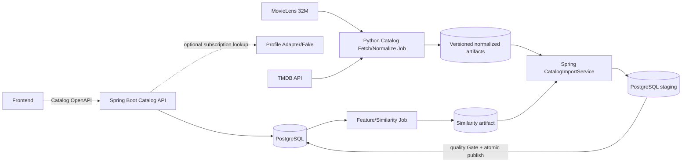
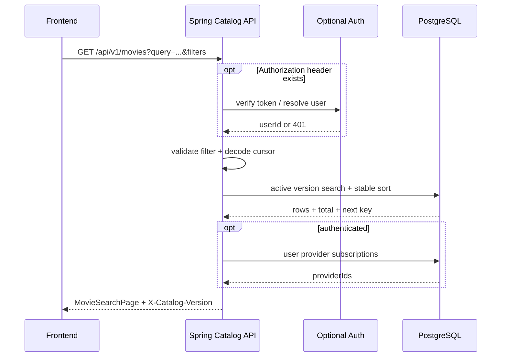

# FEELM Catalog 시스템 설계

> 상태: `APPROVED` — C0 Catalog  
> 전체 추천·평가·파티 시스템은 후속 vertical에서 확장한다.

## 1. 구성

## 2. 경계

| Component | 책임 | 하지 않는 일 |
| --- | --- | --- |
| Frontend | 화면 상태, local recent query, cursor 사용, 외부 이동 | 평점 척도 추측, availability 상태 추론 |
| Spring Catalog API | 인증 optional 처리, 검색·상세 projection, 오류·version 계약 | 사용자 요청 중 TMDB 호출 |
| CatalogImportService | artifact Schema 검증, staging, 품질 Gate, atomic publish | 외부 API token 보유 |
| Python fetch job | TMDB 호출·재시도, ID 복구, 정규화 artifact·품질 보고 | 운영 DB 직접 수정 |
| PostgreSQL | source of truth, search read model, active version | 원본 대용량 MovieLens 학습 |
| Similarity job | versioned 콘텐츠 유사도·reason 산출 | 개인화 추천·예상 별점 |
| Profile adapter | 로그인 사용자의 provider subscription set 반환 | 비회원 응답에 사용자 정보 포함 |

FastAPI, Spark, Redis는 C0 요청 경로에 필요하지 않다. Spark는 이후 전체 feature·ALS·candidate
계산에서 사용하고 FastAPI는 fold-in·추천 서빙 계약에서 추가한다.

## 3. 검색 요청 흐름

cursor에는 최소한 catalogVersion, normalized filter hash, sort, 마지막 정렬키를 서명 또는 안전한
encoding으로 포함한다. 클라이언트 입력을 SQL 조각으로 복원하지 않는다.

## 4. 상세·OTT 흐름

- 상세는 active version의 `CATALOG_VISIBLE` projection만 조회한다.
- availability는 `movieId, KR`의 7일 이내 마지막 성공 snapshot을 선택한다.
- 마지막 성공이 없으면 failed snapshot 내용을 사용자에게 노출하지 않고 `UNKNOWN`이다.
- 로그인 사용자 provider set은 응답 정렬·`isSubscribed`에만 사용한다.
- Catalog DB 또는 API 장애만 503이며 TMDB 현재 장애는 사용자 요청에 영향을 주지 않는다.

## 5. 검색 구현 기준

C0는 PostgreSQL을 사용한다.

- localization title과 original title은 정규화한 검색 document에 포함한다.
- director·cast name을 별도 terms로 포함한다.
- `pg_trgm` GIN index와 PostgreSQL text search 중 실제 한국어 부분 일치가 더 단순한 조합을 사용한다.
- C0는 초성·형태소 분석 정확도를 약속하지 않는다.
- query가 있는 관련도 정렬과 query 없는 popularity 정렬은 서로 다른 index·query plan을 가진다.
- 87,585편 fixture에서 `EXPLAIN ANALYZE`와 API p95를 기록한다.

Elasticsearch/OpenSearch는 다음 중 하나가 실측될 때만 ADR로 도입한다.

- PostgreSQL 검색 p95 300ms 목표를 index·query 튜닝 후에도 충족하지 못함
- 초성·오타 교정이 승인된 제품 요구가 됨
- 다국어 analyzer와 운영 복잡성의 이득이 측정됨

## 6. 장애·정합성

| 실패 | 동작 |
| --- | --- |
| TMDB fetch 실패 | artifact/run 실패 또는 부분 availability 실패, active Catalog 유지 |
| artifact Schema 오류 | staging import 거절, active version 유지 |
| quality Gate 실패 | version `REJECTED`, diff report 저장 |
| similarity import 실패 | 이전 similarityVersion 유지, 상세 본문 정상 |
| optional token invalid | 401, 익명 downgrade 금지 |
| Profile adapter 장애 | 로그인 요청의 `isSubscribed`를 거짓 false로 만들지 않고 503 또는 명시적 partial policy; C0 blind test는 503 |
| PostgreSQL 장애 | Catalog API 503 |

## 7. 보안

- query와 cursor는 validation 후 parameterized query에만 사용한다.
- cursor payload를 신뢰하지 않고 filter hash와 version을 검증한다.
- 공개 Catalog 응답에 external raw ID와 user ID를 노출하지 않는다.
- token은 Spring auth layer까지만 전달하고 Python fetch job과 공유하지 않는다.
- TMDB token은 환경 secret으로 주입하고 artifact·log에 기록하지 않는다.
- 외부 URL은 `https`와 허용 source/domain 정책을 검증한다.

## 8. 관측성

API metric:

- operation별 request count, p50/p95/p99, 4xx/5xx
- 검색 결과 0건 비율과 validation 실패
- availability LISTED/NONE_LISTED/UNKNOWN/STALE 비율
- catalogVersion별 요청 수

Job metric:

- discovered/verified/recovered/TV/not-found/review 수
- Catalog-visible/UI-ready 수와 이전 version 차이
- TMDB status code·retry·rate-limit 수
- availability 성공·빈 목록·실패·stale 수
- import·index·publish 시간

movie title, token, external response body를 오류 log에 무제한 기록하지 않는다.

