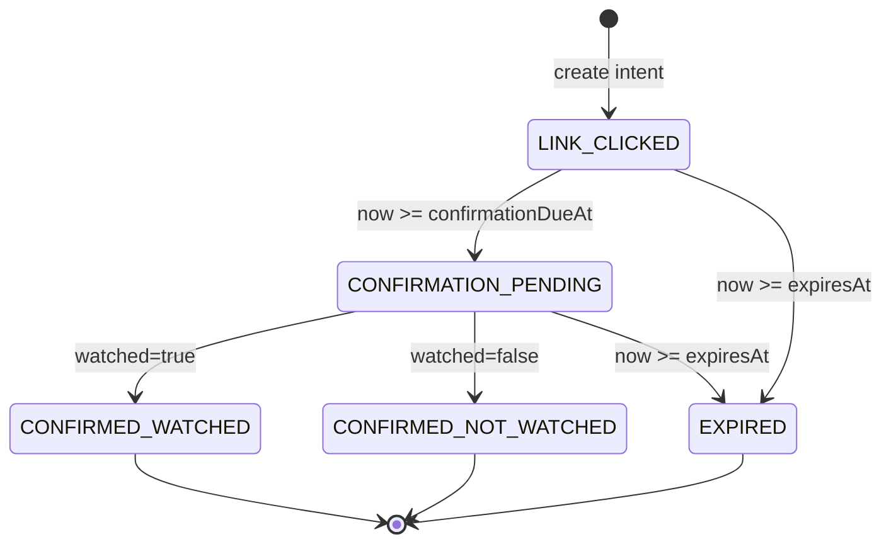
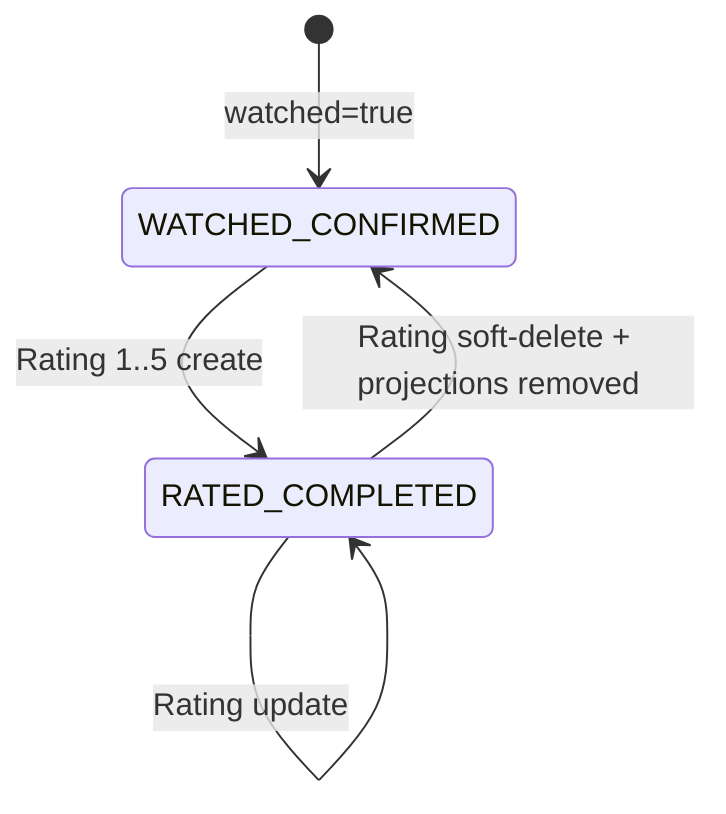

# C1 Rating·Film 상태 모델

> 상태: `APPROVED`

## 1. WatchIntent

새 intent의 `confirmationDueAt`은 최초 active `clickedAt+48h`, `expiresAt`은 `clickedAt+7d`다.



| 상태 | pending 목록 | 확인 응답 | 선호 신호 |
| --- | --- | --- | --- |
| `LINK_CLICKED` | due 전 숨김 | 금지 | 없음 |
| `CONFIRMATION_PENDING` | 표시 | 1회 허용 | 없음 |
| `CONFIRMED_WATCHED` | 숨김 | idempotent replay 외 금지 | ViewingRecord가 Rating을 가질 때만 평가 신호 |
| `CONFIRMED_NOT_WATCHED` | 숨김 | 금지 | `DN-C1-005` 전 없음 |
| `EXPIRED` | 숨김 | 금지 | 없음 |

같은 user/movie의 `LINK_CLICKED` 또는 `CONFIRMATION_PENDING`에 다른 key로 실제 재클릭하면 기존 intent를
재사용하고 시각·status·revision을 바꾸지 않으며 클릭 event만 한 건 기록한다. `CONFIRMED_NOT_WATCHED`나
`EXPIRED`이고 ViewingRecord가 없을 때만 별도 새 intent를 만든다. ViewingRecord가 이미 있으면 intent 없이
`ALREADY_WATCHED` 결과와 클릭 event를 기록한다. 같은 key replay는 어떤 결과에서도 event를 추가하지 않는다.

확인 transition transaction은 intent 상태, ViewingRecord 생성/재사용, behavior event, outbox,
idempotency 결과를 함께 commit한다.

## 2. ViewingRecord와 Rating



- `WATCHED_CONFIRMED`: 실제 감상 사실은 있으나 Rating 없음. Frame·Popcorn 없음.
- `RATED_COMPLETED`: 활성 Rating·Frame·Popcorn이 각각 정확히 하나.
- Rating delete: ViewingRecord는 유지하고 Rating은 `DELETED` 감사 상태로 남긴다. 공개 Frame·Popcorn과
  contribution을 제거하고 Flavor/Taste aggregate를 역산한 뒤 `WATCHED_CONFIRMED`로 돌아간다.

## 3. Rating transaction 상태

```text
RECEIVED
  → IDEMPOTENCY_CHECKED
  → OWNER_AND_REVISION_VALIDATED
  → MUTATING
       ├─ Rating create/update/delete
       ├─ Frame projection
       ├─ Popcorn projection
       ├─ Flavor/Taste aggregate delta
       ├─ UserBehaviorEvent append
       ├─ Outbox append
       └─ Idempotency result
  → COMMITTED

MUTATING 중 하나라도 실패 → ROLLED_BACK (외부에서 이전 상태 그대로)
```

`COMMITTED` 뒤 추천 consumer가 실패해도 Rating transaction은 성공이다. outbox는
`PENDING → PROCESSING → PROCESSED` 또는 retry 가능한 `FAILED`로 별도 진행한다.

## 4. UI 상태

```text
IDLE → LOADING → READY
             ├→ EMPTY
             ├→ VALIDATION_ERROR → EDITING
             ├→ REVISION_CONFLICT → REFRESH_REQUIRED
             ├→ RECOVERABLE_ERROR → LOADING (retry)
             └→ TERMINAL_NOT_FOUND
```

| 화면 | EMPTY | 충돌·오류 |
| --- | --- | --- |
| pending confirmation | 확인할 영화 없음 | 기존 목록 보존 + retry |
| unrated list | 평가를 기다리는 영화 없음 | 기존 목록 보존 + retry |
| ratings | 아직 남긴 평가 없음 | 기존 목록 보존 + retry |
| Film | 아직 필름에 추가된 영화 없음 | retry |
| Popcorn Bucket | `count=0`, average 없음 | retry |
| Rating editor | 사용하지 않음 | invalid integer, stale revision, transaction failure를 구분 |

mutation 버튼은 pending 중 중복 제출을 막지만, 최종 중복 방지는 server Idempotency-Key가 담당한다.
