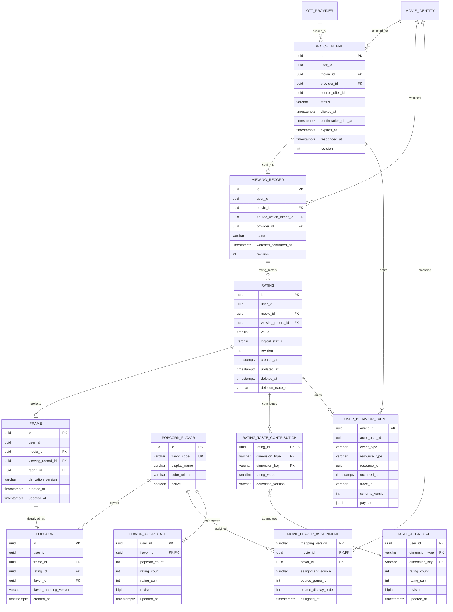

# C1 Rating·Film 논리 ERD 조각

> 상태: `APPROVED`  
> C0 Catalog의 `MOVIE_IDENTITY`, `OTT_PROVIDER`, `MOVIE_OTT_OFFER`를 재정의하지 않는다.

## 1. 관계



공통 mutation 지원 테이블:

```text
IDEMPOTENCY_RECORD(
  actor_user_id, operation_code, idempotency_key,
  request_hash, response_status, response_body, resource_id,
  created_at, expires_at,
  PK(actor_user_id, operation_code, idempotency_key)
)

DOMAIN_OUTBOX(
  event_id PK, aggregate_type, aggregate_id, event_type,
  schema_version, payload, occurred_at,
  status, attempt_count, next_attempt_at, processed_at
)
```

## 2. Source of truth와 projection

| 데이터 | 성격 | 쓰기 소유자 |
| --- | --- | --- |
| WatchIntent | 외부 이동·확인 workflow source of truth | Spring Viewing transaction |
| ViewingRecord | 감상 확인 사실 source of truth | Spring Viewing transaction |
| Rating | 사용자의 현재 1~5 평가 source of truth | Spring Rating transaction |
| Frame, Popcorn | Rating 기반 동기 projection | 같은 Rating transaction |
| RatingTasteContribution | 정확한 역산·재구축용 contribution ledger | 같은 Rating transaction |
| Flavor/TasteAggregate | 사용자 조회용 동기 projection | 같은 Rating transaction |
| UserBehaviorEvent | append-only action record | 각 mutation transaction |
| DomainOutbox | 추천·분석 후속 전달 | 각 mutation transaction |

UserBehaviorEvent나 outbox replay로 현재 Rating을 즉석 재구성하지 않는다. C1 online read의 source of truth는
RDBMS domain row와 동기 projection이다.

## 3. 키·제약

- `VIEWING_RECORD(user_id, movie_id)` unique: 재감상을 별도 기록하지 않는다.
- 활성 `RATING(viewing_record_id)`와 `RATING(user_id,movie_id)`는 partial unique(`logical_status='ACTIVE'`)다. soft-delete 후 재평가가 생기면 새 active Rating row를 만든다.
- 활성 Rating 값은 `1 <= value <= 5`, integer다.
- `FRAME(rating_id)`, `FRAME(user_id,movie_id)`, `FRAME(viewing_record_id)` 각각 unique.
- `POPCORN(frame_id)`, `POPCORN(rating_id)` 각각 unique.
- 같은 Rating transaction의 Frame과 Popcorn은 같은 user·movie ownership을 가진다.
- `MOVIE_FLAVOR_ASSIGNMENT(mapping_version,movie_id)` unique이고 `source_display_order=0`이다. active v1 rating-eligible 영화는 assignment가 정확히 하나여야 한다.
- `FLAVOR_AGGREGATE`: count/sum은 0 이상, `rating_count=popcorn_count`, `rating_sum <= 5*rating_count`.
- `TASTE_AGGREGATE`: count/sum은 0 이상, `rating_sum <= 5*rating_count`.
- `WATCH_INTENT.confirmation_due_at = clicked_at + 48h`, `expires_at = clicked_at + 7d`를 check/test로 고정한다.
- user/movie당 `LINK_CLICKED|CONFIRMATION_PENDING` WatchIntent는 partial unique 하나이며 create transaction이 row/advisory lock으로 재클릭 race를 직렬화한다.
- terminal WatchIntent는 `responded_at`을 갖고 다시 transition하지 않는다.
- idempotency PK는 actor와 operation까지 포함한다. key 문자열만 global unique로 만들지 않는다.

## 4. Rating transaction 불변식

create:

```text
confirmed ViewingRecord
+ Rating(value)
+ Frame(ratingId)
+ Popcorn(frameId, flavorId)
+ flavor/taste contribution and aggregate
+ behavior event
+ outbox
+ idempotency result
→ one commit
```

update는 contribution의 이전 `rating_value`를 각 aggregate에서 빼고 새 값을 더한다. Frame·Popcorn ID는
유지한다. delete는 Rating을 `DELETED`로 soft-delete하고 `deleted_at`, `deletion_trace_id`, revision을 남긴다.
ViewingRecord는 `WATCHED_CONFIRMED`로 유지하고 Frame·Popcorn·contribution row를 제거한 뒤 Flavor/Taste
aggregate의 count/sum을 역산한다. delete event·outbox·idempotency 결과까지 같은 transaction에 commit한다.
중간 실패는 삭제 전 active 상태로 전부 rollback한다.

## 5. Catalog·분류 version

- `movie_id`는 C0의 안정적인 `MOVIE_IDENTITY.id`다.
- Rating 생성 시 active Catalog에서 장르·국가·감독 contribution을 읽고 contribution row에
  `derivation_version`을 남긴다.
- Popcorn은 승인된 `flavor_mapping_version`의 assignment를 사용한다. v1은 primary TMDB genre
  (`displayOrder=0`)를 `ADRENALINE={28,12}`, `WONDER={16,14,878}`, `JOY={35,10751}`,
  `HEART={18,10749}`, `SHADOW={80,27,9648,53}`, `REAL={99}`, `LEGACY={36,10752,37}`,
  `RHYTHM={10402,10770}`에 매핑한다.
- Catalog 또는 flavor mapping이 바뀌었다고 기존 사용자 aggregate를 요청 중 몰래 바꾸지 않는다.
  재분류는 versioned rebuild task와 검증·원자 publish가 필요하다.
- active projection의 `visibilityStatus=UI_READY` 영화는 active v1 assignment가 정확히 하나일 때만
  rating-eligible이다. `UI_READY`가 C0 catalog-visible 최소 요건을 상위 충족하므로 별도 동시 상태를
  검사하지 않는다.
  unknown·genre 0개·assignment 0개/복수면 Catalog publish quality Gate가 실패한다. v1 개선은 새 mapping
  version의 backfill·검증·원자 publish로만 수행한다.

## 6. 삭제·보존

- API delete 뒤 Rating은 `DELETED` 감사 row로만 남고 active 조회·추천·aggregate에 남지 않아야 한다.
- soft-delete는 C1 승인 정책이다. value 등 감사 row의 장기 익명화·물리 삭제와 behavior event retention은 `DN-C1-006` 개인정보·감사 정책으로 결정한다.
- behavior payload에는 rating value를 기본 저장하지 않고 변경 종류와 resource ID만 기록한다.
- idempotency response 보존 기간은 API retry window보다 길어야 하지만 구체 TTL은 운영 ADR에서 정한다.
