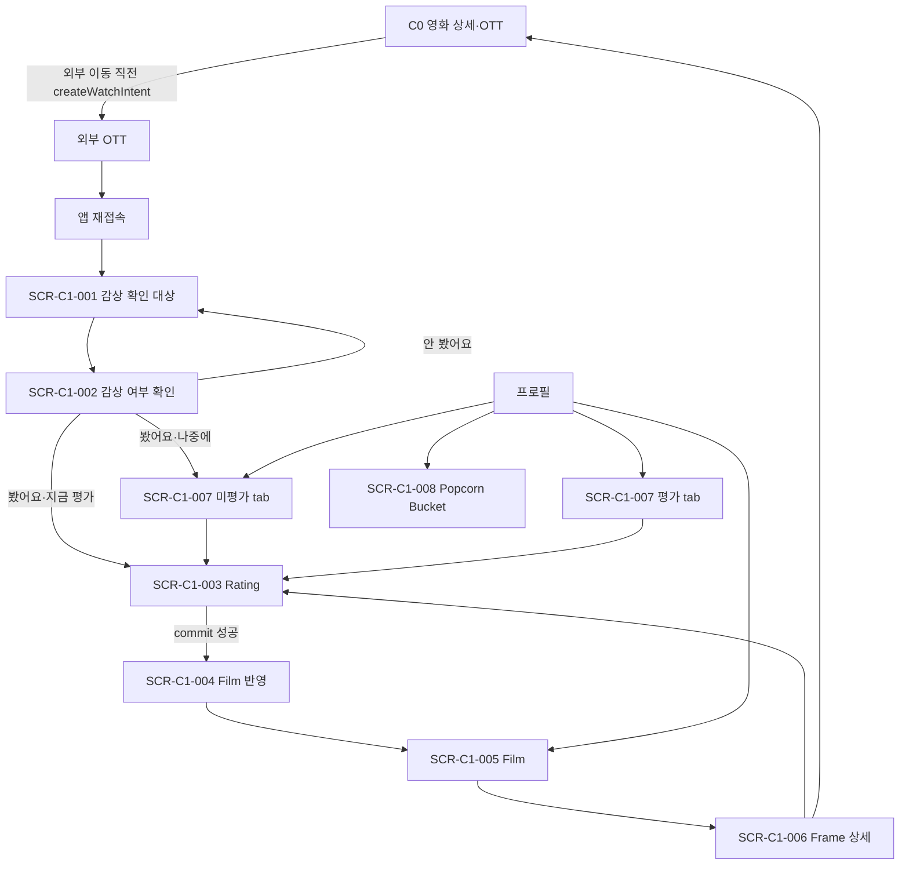

# C1 Rating·Film 내비게이션

> 상태: `APPROVED`

## Route 후보

| Route | Screen | Guard/state |
| --- | --- | --- |
| `/me/watch-confirmations` | `SCR-C1-001` | required auth |
| `/me/watch-confirmations/:watchIntentId` | `SCR-C1-002` | owner + confirmable status |
| `/me/movies/:movieId/rating` | `SCR-C1-003` | confirmed ViewingRecord |
| `/me/rating-complete/:movieId` | `SCR-C1-004` | navigation state; direct URL은 Film로 redirect |
| `/me/film` | `SCR-C1-005` | required auth |
| `/me/film/frames/:frameId` | `SCR-C1-006` | owner |
| `/me/ratings?tab=rated|unrated` | `SCR-C1-007` | required auth, tab URL 유지 |
| `/me/popcorn-bucket` | `SCR-C1-008` | required auth |

## 규칙

- 인증 전 원래 route는 안전한 return URL로 보관할 수 있으나 token을 URL에 넣지 않는다.
- Rating editor에서 뒤로 가면 저장하지 않은 선택값이 있음을 확인하고 이전 상태를 보존한다.
- completed mutation 뒤 browser back으로 재제출하지 않는다. 성공 route는 committed response를 보여주는
  presentation이며 새 API mutation을 실행하지 않는다.
- Film/ratings 목록에서 상세로 갔다 돌아오면 tab·cursor page·scroll을 복원한다.
- 다른 기기 변경으로 resource가 사라지면 사용자에게 존재 여부를 추측하게 하지 않고 목록을 새로고침한다.
