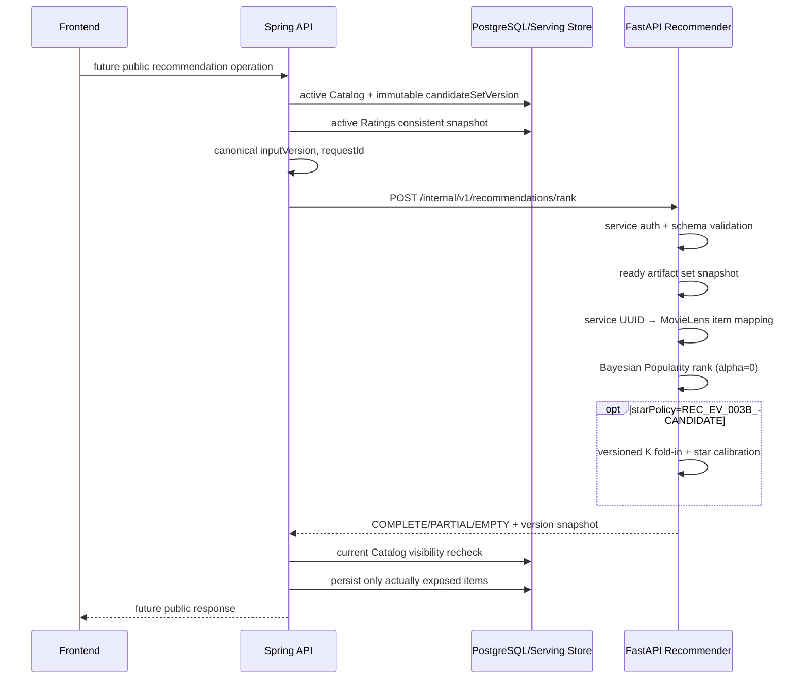
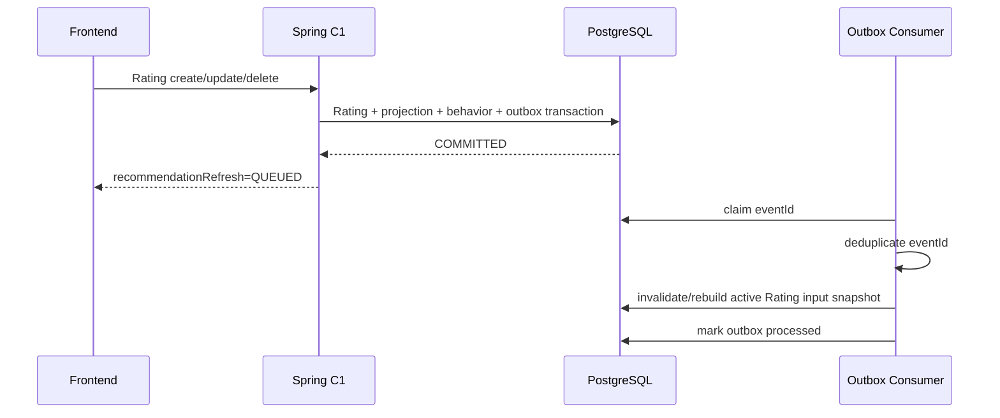

# C2 Recommendation Serving sequence와 data 계약

> 상태: `APPROVED_C2A_INTERNAL_POPULARITY_ONLY`

## 1. 동기 ranking 흐름



FastAPI는 subject identity를 필요로 하지 않는다. Spring이 현재 사용자 소유권과 Rating 조회를
처리하고, FastAPI에는 계산에 필요한 immutable value snapshot만 보낸다.

## 2. C1 outbox와 입력 갱신



- C1 transaction 안에서 FastAPI를 호출하지 않는다.
- `RATING_CREATED`, `RATING_UPDATED`, `RATING_DELETED`는 current active Rating snapshot 갱신 신호다.
- behavior event는 source of truth가 아니며, `DN-C1-006` 전 일반 행동을 학습 feature로 확대하지 않는다.
- consumer 실패는 retry 대상이고 C1 commit은 유지한다.

## 3. Request data ownership

| 필드 | 생산자 | 검증자 | 의미 |
| --- | --- | --- | --- |
| `requestId` | Spring | 양쪽 | 호출 correlation UUID; 동일 요청 추적용 |
| `candidateSetVersion` | batch candidate producer | Spring/FastAPI | immutable candidate 집합 버전 |
| `movieIds` | Spring serving adapter | FastAPI mapping | FEELM service UUID 후보; external ID 아님 |
| `inputVersion` | Spring | FastAPI nonblank/schema | active Rating consistent snapshot 식별자 |
| `ratings[].movieId` | C1 active Rating join | FastAPI mapping | service UUID |
| `ratings[].value` | C1 Rating | FastAPI | integer 1~5 |
| `ratings[].revision` | C1 Rating | FastAPI | input snapshot 재현·중복 판별 |
| `starPolicy` | Spring deployment config | FastAPI | `DISABLED` 또는 명시적 candidate opt-in |

`inputVersion`의 canonicalization algorithm은 Spring implementation contract test에서 고정한다. 최소
입력은 input-policy version과 `(movieId canonical UUID, value, revision)`을 movieId로 정렬한 sequence다.
사용자 ID나 clock time을 hash 재료로 요구하지 않는다.

## 4. Response와 부분 실패

`outcome`은 HTTP transport와 별개다.

| outcome | 조건 | 항목 |
| --- | --- | --- |
| `COMPLETE` | 모든 요청 candidate가 accepted되고 요청한 head가 계산됨 | 1개 이상 |
| `PARTIAL` | candidate 일부 제외 또는 star head만 실패 | accepted ranking만 |
| `EMPTY` | 구조는 유효하지만 accepted candidate가 없음 | 빈 배열 |

다음은 request 전체 실패다.

| HTTP | 조건 | 재시도 |
| ---: | --- | --- |
| 401/403 | internal credential 문제 | credential 수정 전 금지 |
| 422 | schema, UUID, Rating 범위 오류 | 동일 body 재시도 금지 |
| 503 | ready artifact set 없음, compatibility/checksum 실패, deadline | backoff 후 가능 |

항목 issue는 raw payload를 담지 않고 `scope`, allowlist `code`, optional service `movieId`, `retriable`만
포함한다. mapping의 MovieLens ID와 filesystem path는 응답하지 않는다.

## 5. Serving snapshot

FastAPI 응답 snapshot은 계산 재현에 필요한 다음 값을 가진다.

- `recommendationVersion`: canonical request hash와 artifactSetVersion을 결합한 결정적 식별자
- `artifactSetVersion`, `compatibilityId`
- Bias/factor/calibration/mapping `modelVersions`와 payload SHA-256
- `policyVersion`, `rankingPolicy`, `rankingAlpha`
- `mappingVersion`, `catalogVersion`
- `candidateSetVersion`, `inputVersion`

Spring 노출 snapshot은 여기에 `recommendationItemId`, position, recommendationType, exposedAt,
expectedStar의 value/displayEligible/confidence 상태를 붙인다. FastAPI 응답에 clock 기반 generatedAt을
넣어 recommendationVersion 결정성을 깨지 않는다.

### 5.1 실제 노출 persistence와 중복 의미

Spring caller가 최종 render 대상으로 선택한 항목만 `exposureBatchId`와 함께 별도 transaction으로
저장한다. FastAPI items 전체, batch candidate 전체, raw JSON 응답은 저장하지 않는다.

- `requestId`는 FastAPI 호출 correlation이다. 같은 requestId라는 이유로 노출을 deduplicate하지 않는다.
- `exposureBatchId`는 caller가 한 번의 실제 render commit에 부여하는 UUID다. 같은 batch ID와 같은
  canonical typed payload의 재시도만 idempotent replay이고 item을 다시 만들지 않는다.
- 같은 batch ID를 다른 actor·선택·시각·version에 재사용하면 `EXPOSURE_BATCH_REUSED`로 거부한다.
- 다른 batch ID는 같은 request, recommendationVersion, movie라도 별도 노출이다. 반복 노출을 합치지 않는다.
- `recommendationItemId`는 새 batch를 저장할 때 항목별로 생성하고 exact replay에는 기존 값을 돌려준다.
- position은 caller가 실제 표시한 1부터 시작하는 연속 순서이며 FastAPI source rank와 별도로 저장한다.

한 batch는 allowlisted scalar column만 저장한다. 공통 snapshot에는 actor·source request·추천/artifact/
compatibility/policy/ranking/mapping/catalog/candidate/input version, 네 model version+checksum,
attribution policy와 exposedAt이 있다. 항목에는 movie, position, source rank,
`recommendationType=POPULARITY_BASELINE`과 expected-star 상태가 있다. 현재 expected-star는 DB에서도
`NOT_COMPUTED/null/false/NOT_EVALUATED/null`만 허용한다.

노출 저장만으로 click·Rating·negative·satisfaction/outcome row를 만들지 않는다. 후속 상세·OTT·감상·
Rating attribution은 별도 task가 `recommendationItemId`를 명시적으로 받은 경우에만 연결한다.

## 6. Batch candidate와 fold-in 연결

```text
Batch producer
  → candidateSetVersion + service movie UUID list
  → Spring active Catalog filter
  → FastAPI mapping validation
  → Bayesian Popularity ranking

C1 active Ratings
  → inputVersion + service movie UUID/value/revision
  → optional REC-EV-003B star fold-in
  → calibrated expected-star candidate
```

두 흐름을 합치되 의미를 섞지 않는다.

- batch candidate quality/coverage는 별도 producer 계약이며 이 문서가 production coverage를 주장하지 않는다.
- Fold-in ranking alpha는 0이다.
- expected-star failure가 candidate order를 바꾸지 않는다.
- 현재 `0.5..5.0` artifact output을 C1 `1..5` expected-star로 clamp하지 않는다. `DN-C2-008` 해제 전 starPolicy는 운영에서 `DISABLED`다.
- exploration과 party는 각각 `DN-C2-006`, `DN-C2-007`이 해제된 새 policy version에서만 추가한다.

## 7. Artifact load/reload

```text
DISCOVER sidecars
→ validate known schema/kind
→ verify every payload SHA-256
→ require same family/ID space/rating scale
→ validate calibration v2 head separation and dependency checksums
→ load mapping v1 and exclude conflicts
→ dry-run Popularity on fixture candidates
→ atomic READY swap
```

중간 실패 시 부분 set을 publish하지 않는다. 이전 set이 있으면 계속 사용하면서 reload failure를
관측하고, 없으면 readiness 503이다. liveness는 process deadlock/crash만 나타낸다.

## 8. 관측과 개인정보

- trace는 `X-Request-Id`와 선택적 W3C `traceparent`로 연결한다.
- request body, Rating value, user bearer, userId를 일반 log에 쓰지 않는다.
- movieId와 inputVersion은 metric label이 아니라 필요 시 접근 제한 structured trace에 둔다.
- artifact kind/version/checksum mismatch code, latency, candidate accepted/excluded count, outcome을 기록한다.
- 추천 노출과 C1 후속 사건의 결합은 Spring 저장소에서 수행하며 FastAPI가 사용자 행동 원장을 보유하지 않는다.
