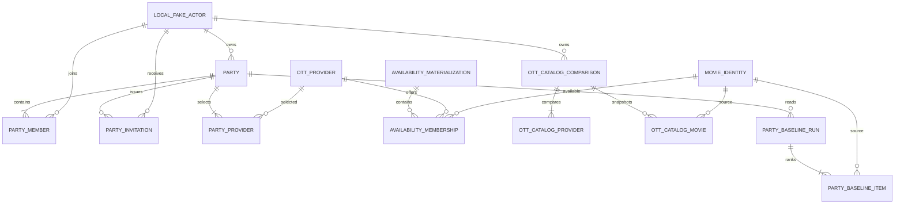

# C3 Local MVP Logical ERD

> 상태: `APPROVED` — `LOCAL_MVP_ONLY`

## Transaction boundaries

- Party create: PARTY + OWNER PARTY_MEMBER + PARTY_PROVIDER + IDEMPOTENCY_RESULT.
- Invite create: PARTY lock + PARTY_INVITATION + Party revision + IDEMPOTENCY_RESULT.
- Invite accept: PARTY → PARTY_INVITATION → PARTY_MEMBER → IDEMPOTENCY_RESULT. capacity/revision 실패는 전부 rollback.
- OTT comparison create: one COMPLETE materialization을 읽어 header/provider/movie snapshot을 한 transaction에 저장.
- Party baseline은 immutable materialization에서 읽는 projection이다. cache/run을 저장하면 party revision,
  materialization ID, policy version을 복합 소유 key로 사용한다.

## Constraints

- `PARTY_MEMBER UNIQUE(party_id, actor_id)`, accepted active count 1..4.
- `PARTY_INVITATION UNIQUE(party_id, recipient_actor_id) WHERE status='PENDING'`.
- `PARTY_PROVIDER UNIQUE(party_id, provider_id)`, count 2..4.
- `AVAILABILITY_MEMBERSHIP UNIQUE(materialization_id, provider_id, movie_id)`.
- `OTT_CATALOG_MOVIE UNIQUE(comparison_id, provider_id, movie_id)`.
- `PARTY_BASELINE_ITEM UNIQUE(run_id, movie_id)` and deterministic position unique per run.

Rating, behavior event, recommendation utility/vector entity는 local MVP ERD에 없다.

