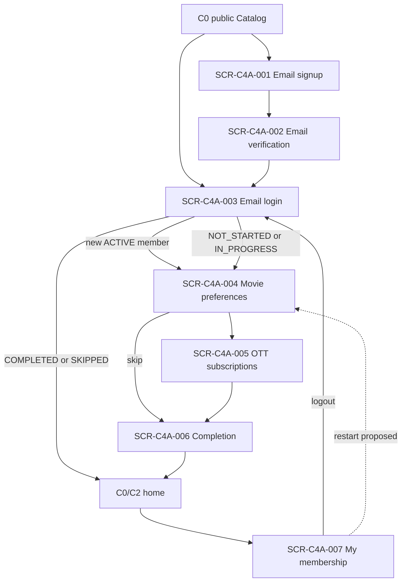

# C4A Navigation Map

> 상태: `APPROVED_LOCAL_PROFILE_WITH_BLOCKED_PRODUCTION_EXTENSIONS`

## Guard

- 가입 직후 `SCR-C4A-002`는 memory/navigation state의 stable EMAIL_SIGNUP_PUBLIC_FLOW signupId로 진입한다.
  challenge ID/version은 internal이고 resend 뒤에도 signupId를 바꾸지 않는다. email link 재진입은
  signupId/raw secret을 HTTPS fragment에서 첫 network 전에 읽고 `history.replaceState`로 제거하며,
  URL query/path·Referer·log·storage에는 넣지 않는다.
- protected route는 DN-C4A-001에서 승인된 actor boundary를 사용한다. 401이면 auth state를 지우고
  login으로 이동하되 사용자가 입력 중인 password/token을 storage에 보존하지 않는다.
- ACTIVE 이후 onboarding이 NOT_STARTED/IN_PROGRESS인 사용자를 강제 redirect할지는 DN-C4A-004
  결정이다. skip은 항상 명시적 행동으로 제공한다.
- social provider route는 DN-C4A-005 전 navigation map에 없다.
