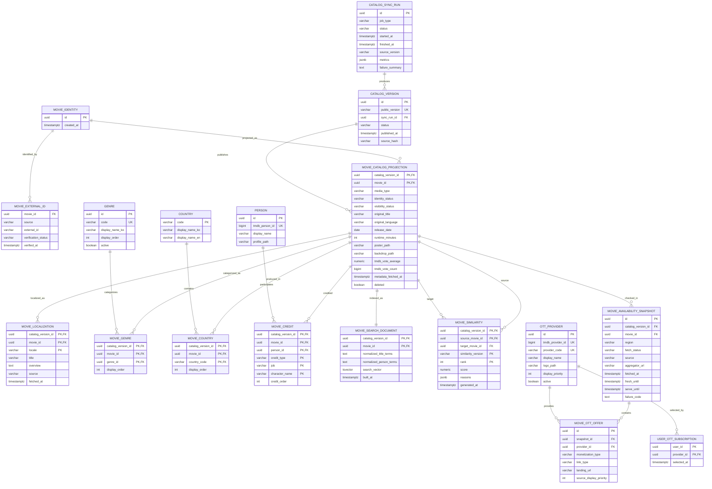

# FEELM Catalog 논리 ERD

> 상태: `APPROVED` — C0 Catalog  
> 승인 확장: `docs/c1-draft/data/logical-erd.md` — C1 Rating·Film  
> Canonical registry: `docs/spec/approved-slices.json`  
> 물리 migration은 이 문서의 제약을 보존해야 한다.

## 1. Identity와 versioned projection

공개 `movieId`는 `MOVIE_IDENTITY.id`이며 Catalog를 다시 수집해도 바뀌지 않는다. 제목, 현지화,
검색 문서, 장르·국가·출연진, 유사도와 OTT 제공 정보는 `catalog_version_id + movie_id`로 식별되는
versioned projection이다. 따라서 새 version을 staging하는 동안 이전 active version과 같은
`movieId`가 공존할 수 있고, active pointer 교체와 rollback이 공개 URL을 바꾸지 않는다.

Mermaid가 복합 FK를 완전히 표현하지 못하므로 모든 영화 하위 projection의
`(catalog_version_id, movie_id)`는 `MOVIE_CATALOG_PROJECTION`의 같은 복합키를 참조한다.
`MOVIE_SIMILARITY`의 source와 target도 같은 `catalog_version_id`의 projection이어야 한다.

## 2. 소유권

| Aggregate/table | 쓰기 소유자 | 읽기 소비자 |
| --- | --- | --- |
| Catalog sync/version | Spring `CatalogImportService` | 운영 상태·Catalog API |
| Movie identity·external ID | Spring identity import | 모든 versioned projection |
| Catalog projection·localization·genre·credit | Spring import transaction | 검색·상세·추천 feature loader |
| Availability snapshot·offer | Spring import transaction | 상세·검색 badge·OTT 비교 |
| Search document | Catalog indexing job | `searchMovies` |
| Similarity | Recommendation/data job 결과를 Spring이 import | `getSimilarMovies` |
| User OTT subscription | Profile domain | Catalog의 optional 구독 정렬 |

Python 수집 job은 운영 DB를 직접 갱신하지 않는다. versioned normalized artifact를 만들고 Spring
import가 identity를 resolve한 뒤 projection을 staging·검증·publish한다.

## 3. 키와 고유 제약

- 공개 `movieId`는 `MOVIE_IDENTITY.id` UUID이며 외부 ID에서 결정적으로 만들지 않는다.
- `MOVIE_EXTERNAL_ID`: `(source, external_id)` unique. 한 external ID가 여러 identity에 연결되면 publish 실패다.
- `MOVIE_CATALOG_PROJECTION`: `(catalog_version_id, movie_id)` unique.
- `MOVIE_LOCALIZATION`: `(catalog_version_id, movie_id, locale)` unique.
- `MOVIE_GENRE`: `(catalog_version_id, movie_id, genre_id)` unique, `display_order >= 0`.
- `MOVIE_COUNTRY`: `(catalog_version_id, movie_id, country_code)` unique.
- `MOVIE_CREDIT`: `(catalog_version_id, movie_id, person_id, credit_type, job, character_name)` unique.
- `MOVIE_SEARCH_DOCUMENT`: `(catalog_version_id, movie_id)` unique.
- `MOVIE_SIMILARITY`: `(catalog_version_id, source_movie_id, similarity_version, rank)`와
  `(catalog_version_id, source_movie_id, target_movie_id, similarity_version)` unique.
- `MOVIE_SIMILARITY.source_movie_id <> target_movie_id`.
- `MOVIE_AVAILABILITY_SNAPSHOT`: 같은 version·movie·region에 여러 시점 snapshot을 허용한다.
- `MOVIE_OTT_OFFER`: `(snapshot_id, provider_id, monetization_type)` unique.
- `USER_OTT_SUBSCRIPTION`: `(user_id, provider_id)` unique.
- `CATALOG_VERSION.status='ACTIVE'`는 전체에서 정확히 하나만 허용한다.

## 4. Check 제약

- projection의 `media_type = 'MOVIE'`인 항목만 publish 대상이다.
- `runtime_minutes IS NULL OR runtime_minutes > 0`.
- `tmdb_vote_average IS NULL OR 0 <= value <= 10`.
- `tmdb_vote_count >= 0`.
- `identity_status`와 `visibility_status`는 data dictionary enum만 허용한다.
- availability `region='KR'`은 C0 물리 Schema에서 check로 고정한다.
- `fresh_until = fetched_at + 24 hours`, `serve_until = fetched_at + 7 days`를 초기 정책으로 검증한다.
- `SUCCESS_EMPTY` snapshot에는 offer가 0개여야 한다.
- `SUCCESS_LISTED` snapshot에는 offer가 1개 이상이어야 한다.
- `FAILED` snapshot의 offer는 0개이며 공개 응답 선택 대상이 아니다.

## 5. 표시·검색 파생 규칙

- `CATALOG_VISIBLE`: identity verified, media type movie, deleted false, 표시 제목·줄거리·장르 존재.
- `UI_READY`: `CATALOG_VISIBLE` + poster + runtime + director 존재.
- 표시 제목·줄거리는 DB column 하나로 원본을 덮어쓰지 않는다. locale별 원천을 보존하고 조회 projection에서 선택한다.
- `MOVIE_SEARCH_DOCUMENT`는 같은 version의 모든 title localization과 director/cast name을 정규화해 만든다.
- query 정렬의 최종 tie-breaker는 안정적인 `movie_id`다.
- 인기 정렬은 첫 구현에서 MovieLens rating count의 Bayesian-smoothed popularity를 사용하고 version을 artifact에 남긴다.

## 6. 삭제·version publish

- source에서 사라진 영화도 `MOVIE_IDENTITY`는 삭제하지 않는다. 새 projection에 `deleted=true`,
  `identity_status=SOURCE_REMOVED`를 기록하고 공개하지 않는다.
- API는 요청 시작 시 하나의 active `CATALOG_VERSION`을 resolve하고 모든 projection 조회에 같은 ID를 사용한다.
- import는 새 version projection을 staging하고 검증한 뒤 하나의 transaction으로 active pointer를 교체한다.
- publish 실패 시 기존 active version과 안정적인 공개 `movieId`는 그대로 유지된다.
- cursor는 catalog version을 포함하므로 version 교체 후 기존 cursor는 `INVALID_CURSOR`로 처리한다.
