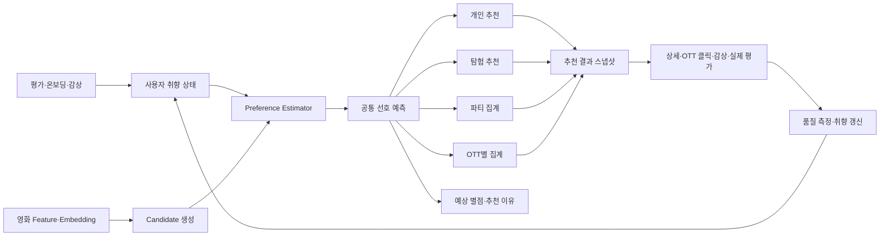
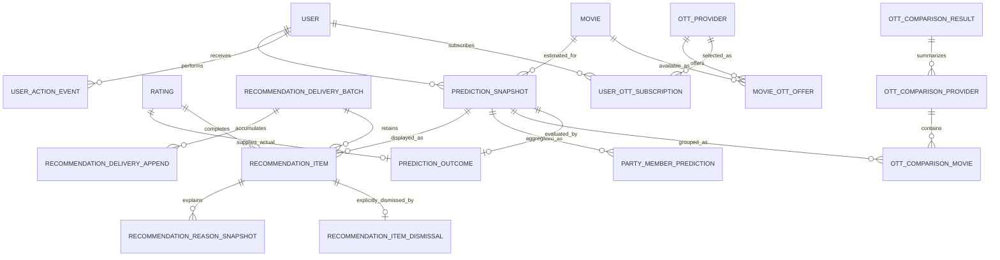

# FEELM 독립 프로젝트 실행 계획

- 문서 상태: 개인 GitHub 프로젝트 기준 실행안
- 작성일: 2026-08-29
- 작업 브랜치: `project/standalone-feelm`
- 프론트 기준: `FEELM UI Mockups Final FOR REAL.html`의 39개 화면
- 요구사항 기준: 기존 1~4차 요구사항과 2026-08-29 추가 요구사항을 모두 제품 범위로 채택

> 실행 기준 보정(2026-08-30): 제품 범위에 포함된 기능도 추천 증거가 아직 Gate를 통과하지
> 못했으면 공개 동작으로 활성화하지 않는다. 특히 예상 별점은 REC-EV-003C의 C1 paired-scale
> 근거가 생길 때까지 제품 응답에서는 `NOT_COMPUTED`다. 다만 C6 DEV/local 실험은
> `displayEligible=false`로 값을 계산해 이후 채택 판단 근거를 만든다. 탐색 가중치는 full-catalog 검증과 제품 손실 예산 승인
> 전까지 비활성, 파티 집계 정책은 REC-EV-005가 개선을 입증하지 못했으므로 champion 없이
> 유지한다. 이 보정이 아래의 초기 기능 후보 표현보다 우선한다.

## 1. 프로젝트 운영 기준

이 프로젝트는 팀 GitLab 저장소와 별개로 진행한다. 팀 Jira, 팀 승인, 기존 팀원의 개발 범위는
이 프로젝트의 선행 조건이 아니다. 개인 GitHub의 FEELM 문서, OpenAPI, ERD와 코드가 하나의
기준선이 된다.

다만 기능마다 독립 추천 로직을 만들지는 않는다. 개인 추천, 탐험 추천, 파티 추천, OTT 비교,
예상 별점과 추천 설명이 하나의 공통 `사용자×영화 선호 예측`을 재사용하도록 설계한다.

진행 순서는 다음과 같다.

1. 목업·요구사항을 화면 계약으로 정리한다.
2. 추가 요구사항까지 포함한 OpenAPI와 논리 ERD를 먼저 완성한다.
3. OpenAPI Mock으로 프론트를 연결한다.
4. DB migration과 백엔드 기본 기능을 구현한다.
5. 공통 추천 코어를 구현한다.
6. 개인·탐험·파티·OTT 기능을 공통 코어 위에 연결한다.
7. 사용자 행동과 모델 품질을 측정해 개선한다.

## 2. 공통 추천 코어



핵심 출력은 임시로 `PreferenceEstimate`라고 부른다.

| 필드 | 의미 | 사용하는 기능 |
| --- | --- | --- |
| `movieId` | 동일한 영화 식별자 | 전체 |
| `rawPreference` | 모델 원래 점수 | 모델 비교·재현 |
| `predictedRating` | 근거가 승인된 경우에만 표시하는 선택적 1~5 예상 별점. 제품 척도에서는 `NOT_COMPUTED`, C6 local lab에서는 `displayEligible=false` | 개인·탐험·파티·OTT·상세·C6 실험 |
| `relativeUtility` | 개인의 rating 습관 안에서 정규화한 0~1 상대 선호 | 순위·탐험·파티 집계 |
| `predictionState` | `READY`, `INSUFFICIENT_DATA`, `FALLBACK` | 데이터 부족 화면·fallback |
| `confidenceLevel` | 과도한 정밀도 표시를 막는 신뢰 단계 | 추천 카드·파티·OTT |
| `modelVersion` | 예측 모델 버전 | 재현·오차 측정 |
| `inputVersion` | 사용자 평가와 Feature 입력 버전 | 캐시 무효화·재현 |
| `calculatedAt` | 계산 시각 | 이력·신선도 확인 |
| `reasons[]` | 실제 점수에 사용한 구조화 근거 | XAI·탐험·파티 설명 |

`predictedRating`이 활성화되는 경우에도 해당 사용자가 자신의 척도로 줄 법한 점수이며 사용자
사이에서 직접 비교하지 않는다. MovieLens 0.5 간격 평가와 C1 정수 평가를 직접 변환하지 않으며,
paired-scale 검증 전에는 숫자를 만들지 않는다. 파티 추천은 각 파티원의 `PreferenceEstimate`에서 개인별 rating 습관으로 정규화한
`relativeUtility`를 구한 뒤 평균·최저 효용·편차를 정책으로 집계한다. OTT 비교도 같은 예측을 OTT
제공 영화별로 묶는다. 추천 이유는 점수 계산에서 나온 근거를 사용자 문장으로 변환하며 별도의
사실을 만들어내지 않는다.

## 3. 프론트 목업 상태와 보완 범위

현재 목업은 앱 홈, 가입·로그인, 온보딩, OTT 설정, 개인·탐험 추천, 영화 상세, 알림, 평가,
필름, 반기 리포트, 파티, 팝콘, 검색, 프로필·설정까지 39개 화면을 포함한다.

### 3.1 추가 요구사항 때문에 보완할 화면

| 화면 | 현재 상태 | 추가할 내용 |
| --- | --- | --- |
| 오늘의 추천 | 추천 유형과 이유는 있음 | 예상 별점 표시/숨김 비교안, typed 데이터 부족 상태, 전역 평균 별점과 구분. 공개 숫자는 별도 승인 후에만 사용 |
| 영화 상세 | 별점과 추천 이유는 있음 | 전역 평균과 조건부 개인 예상 별점 분리, 구조화 이유 개수는 faithfulness·화면 비교 후 결정 |
| 추천 추가 노출 | `DN-C2B-002` 승인 | 최초 3편 뒤 요청마다 최대 3편을 server-side collection에 누적한다. 추가 추천이 기존 카드를 교체하지 않으며 평가 완료 또는 명시적 `관심 없음`이면 목록·향후 후보에서 제외 |
| 파티 추천 결과 | 파티 흐름은 있으나 점수 근거가 없음 | 정규화 파티 적합도, 평균·최저 상대 효용, 취향 차이, 예측 가능 인원 |
| OTT 관리 | 구독 설정만 있음 | 별도 OTT 취향 비교 화면, OTT별 요약과 실제 영화 전체 목록 |
| 데이터 부족 | 별도 상태 없음 | 온보딩 건너뛰기·평가 부족·모델 장애별 fallback 상태 |
| 평가 완료 | 필름 추가만 표시 | 팝콘·취향 갱신과 다음 추천 반영 상태 |
| 관심없음 | `DN-C2B-002` 승인 | 명시적 `NOT_INTERESTED`만 별도 event로 저장. 평가 완료 `COMPLETED_RATED`와 구분해 둘 다 목록·향후 후보 제외, `NOT_NOW`/감상 완료와 혼동 금지 |

### 3.2 목업과 요구사항의 충돌 처리

- 상세 화면의 `시놉시스 · AI 영화 요약`은 현재 확정 범위에서 AI 요약을 제외했으므로 MVP에서는
  `시놉시스`로 표시한다. 별도 요약 모델은 P2로 둔다.
- 리포트 발급 화면의 `이번 달` 표현은 반기 리포트와 맞지 않으므로 상·하반기 기준으로 바꾼다.
- 검색 결과의 `★ 7.3` 같은 값은 1~5 Rating과 혼동된다. 외부 평균을 표시한다면 출처와
  10점 척도를 표시하고, 서비스 평균과 개인 예상 별점은 모두 1~5 척도로 분리한다.
- OTT 요금 정보는 구독 관리 정보로만 둘 수 있지만 `가격 대비 가치` 점수는 구현하지 않는다.
- `그룹 모드` 용어는 API·DB·화면 모두 `파티`로 통일한다.

## 4. 계약 산출물과 작성 순서

코드를 시작하기 전에 다음 다섯 파일을 개인 저장소의 기준선으로 만든다.

| 순서 | 산출물 | 목적 | 완료 조건 |
| --- | --- | --- | --- |
| 1 | `docs/product/requirements.md` | 기존·추가 요구사항의 개인 프로젝트 기준 통합 | 기능마다 우선순위와 인수 기준이 있음 |
| 2 | `docs/ui/screen-api-matrix.md` | 39개 화면과 API·상태 매핑 | 버튼·조회·빈 상태·오류 상태까지 연결 |
| 3 | `docs/api/openapi.yaml` | 프론트와 백엔드의 실행 가능한 계약 | OpenAPI lint 통과, 예시 응답 제공 |
| 4 | `docs/data/logical-erd.md` | 서비스 원천·스냅샷·파생 데이터 경계 | 모든 API 쓰기·조회 원천이 설명됨 |
| 5 | `docs/data/data-policy.md` | 버전·보존·삭제·중복 방지 정책 | 평가 삭제, 탈퇴, 이벤트, 추천 이력 정책이 있음 |

작성 순서는 화면에서 필요한 데이터 → API 응답 → 저장 원천 → 추천 내부 출력 순서로 맞춘다.
ERD를 먼저 그려 놓고 화면에 필요 없는 테이블을 늘리지 않는다.

## 5. OpenAPI 작업 계획

기존 OpenAPI의 인증, 회원, 온보딩, 영화, 감상, 평가, 필름, 팝콘, 파티, 리포트 API를 기준으로
가져오고 다음 계약을 추가·보강한다.

### 5.1 공통 응답 타입

| Schema | 주요 내용 |
| --- | --- |
| `PreferenceEstimate` | 원시 선호도, 개인 척도 예상 별점, 상대 효용, 상태, 신뢰 단계, 모델·입력 버전, 계산 시각 |
| `RecommendationReason` | `reasonType`, 표시 문장, 근거 영화·특성, 기여 방향, 우선순위 |
| `RecommendationItem` | `recommendationItemId`, 영화, 추천 유형, 선호 예측, 이유 목록 |
| `PredictionDataStatus` | 충분·부족·fallback 상태와 사용자 안내 문구 |
| `PartyFitBreakdown` | 파티 적합도, 평균·최저 상대 효용, 편차, 개인별 예상 별점, 예측 가능 인원, 정책 버전 |
| `OttTasteSummary` | OTT, 적합 미감상 영화 수, 한 사용자 내부의 평균 예상 별점, 추가 영화 수, 결과 버전 |
| `ActionEventRequest` | 이벤트 ID, 유형, 발생 시각, 화면 출처와 필요한 연결 ID |

### 5.2 사용자 API 변경 후보

| Method | Path | 작업 |
| --- | --- | --- |
| GET | `/me/recommendations` | 예상 별점·상태·구조화 이유·모델 버전으로 응답 확장 |
| GET | `/me/recommendations/personalized` | 공통 `PreferenceEstimate` 사용 |
| GET | `/me/recommendations/discovery` | 연결 취향과 새 탐험 영역을 이유로 분리 |
| POST | `/me/recommendation-deliveries/{deliveryId}/append` | signed cursor+expected revision으로 기존 collection 뒤에 최대 3편 누적 |
| POST | `/me/recommendation-delivery-items/{deliveryItemId}/dismissals` | reason `NOT_INTERESTED` 고정의 owner-scoped 멱등 종료 event |
| GET | `/parties/{partyId}/recommendations` | `PartyFitBreakdown`과 구성원 예측 신뢰 상태 추가 |
| POST | `/me/ott-comparisons` | 현재 입력으로 버전이 있는 OTT 비교 결과 생성·조회 |
| GET | `/me/ott-comparisons/{comparisonResultVersion}` | OTT별 비교 요약 조회 |
| GET | `/me/ott-comparisons/{comparisonResultVersion}/providers/{ottId}/movies` | 집계에 포함된 실제 영화 전체 페이지 조회 |
| POST | `/action-events/batch` | 화면 행동을 핵심 요청과 분리해 멱등 수집 |
| PUT | `/me/ratings/{movieId}` | 평가 저장 후 필름·팝콘·추천 입력 갱신 상태 반환 |

`POST /me/ott-comparisons`는 계산 결과가 이미 있으면 같은 입력·정책 버전의 기존 결과를 반환할
수 있게 멱등하게 설계한다. 실제 구현에서 생성 요청과 조회를 분리할 필요가 없으면 `GET` 기반
최신 결과 API로 단순화할 수 있으나 결과 버전은 유지한다.

### 5.3 내부 API와 사용자 API의 경계

Spark 학습, Candidate Batch, Embedding 생성, 모델 배포와 성능 측정 API는 공개 OpenAPI에서
분리한다. 사용자 API는 추천 결과와 상태만 제공하며 학습 작업을 요청마다 실행하지 않는다.

## 6. ERD 확장 계획

기존 `USER`, `MOVIE`, `RATING`, `VIEWING_HISTORY`, `RECOMMENDATION_SET`,
`RECOMMENDATION_ITEM`, `PARTY`, `TASTE_REPORT`를 유지하고 다음 엔티티를 보강한다.



### 6.1 추가·변경 엔티티

| 엔티티 | 역할 | 핵심 제약 |
| --- | --- | --- |
| `PREDICTION_SNAPSHOT` | 실제 화면·파티·OTT 집계에 사용한 개인 예측 보존 | 사용자·영화·모델·입력 버전 식별 가능 |
| `RECOMMENDATION_REASON_SNAPSHOT` | 노출 당시 구조화 이유 보존 | 실제 계산 근거만 저장, 항목별 순서 고정 |
| `PARTY_MEMBER_PREDICTION` | 파티 영화별 구성원 예측과 fallback 상태 | 파티 결과·영화·구성원 조합 고유 |
| `OTT_PROVIDER` | 지원 OTT 기준 정보 | provider code 고유 |
| `MOVIE_OTT_OFFER` | 영화의 OTT 제공 정보 | 영화·OTT·제공 유형·지역 조합 관리 |
| `USER_OTT_SUBSCRIPTION` | 사용자 구독 설정 | 사용자·OTT 조합 고유 |
| `OTT_COMPARISON_RESULT` | 입력·정책 버전별 비교 결과 | `comparison_result_version` 고유 |
| `OTT_COMPARISON_PROVIDER` | 비교 결과의 OTT별 요약 | 결과·OTT 조합 고유 |
| `OTT_COMPARISON_MOVIE` | OTT 집계에 포함된 실제 영화와 순서 | 결과·OTT·영화 조합 고유, 페이지 순서 고정 |
| `USER_ACTION_EVENT` | 상세 진입·추가 추천·OTT 비교 행동 | `event_id` 고유, 자유 텍스트 개인정보 금지 |
| `RECOMMENDATION_ITEM_DISMISSAL` | 명시적 관심없음만 저장 | 동일 항목·이벤트 멱등, Rating/감상/만족도와 분리 |
| `PREDICTION_OUTCOME` | 예상 별점과 이후 실제 Rating 연결 | 예측 스냅샷과 평가 연결 중복 방지 |

전체 Candidate Top-N을 모두 서비스 RDB에 저장하지 않는다. Spark가 만든 Candidate와 아직
노출되지 않은 대량 예측은 Redis 또는 serving store에 두고, 실제 추천·파티·OTT 결과에 사용한
예측만 `PREDICTION_SNAPSHOT`으로 보존한다.

## 7. 저장소와 애플리케이션 구조

```text
FEELM/
├─ frontend/                 # 목업을 실제 화면과 API client로 구현
├─ backend/                  # Spring Boot: 서비스 API와 도메인 로직
├─ recommender/              # FastAPI: Fold-in, Re-ranking, 예측·이유 생성
├─ data-pipeline/            # PySpark: 전처리, ALS, Embedding, Candidate Batch
├─ database/                 # PostgreSQL migration, seed, pgvector 설정
├─ infra/                    # Docker Compose, CI, 모니터링·부하 측정
└─ docs/
   ├─ product/
   ├─ ui/
   ├─ api/
   ├─ data/
   └─ planning/
```

프론트는 React·TypeScript·Vite를 사용한다. React Router, TanStack Query, 생성된 OpenAPI type과
`openapi-fetch`를 기준으로 하며 세부 결정은 `ADR-0004`를 따른다. 프레임워크와 별개로
`screen-api-matrix`와 생성된 API client를 먼저 고정한다.

## 8. 구현 마일스톤

기간보다 선행 관계를 우선하며, 한 마일스톤의 완료 조건을 충족한 뒤 다음 핵심 경로로 넘어간다.

| 단계 | 목표 | 주요 작업 | 완료 조건 |
| --- | --- | --- | --- |
| M0. 계약 기준선 | 추가 요구사항까지 API·ERD 확정 | 요구사항 통합, 화면 매트릭스, OpenAPI, ERD, 데이터 정책 | lint 가능한 OpenAPI와 모든 쓰기 원천이 연결된 ERD |
| M1. 실행 골격 | 전체 구성요소를 로컬에서 기동 | 프로젝트 디렉터리, Compose, PostgreSQL·Redis, Spring·FastAPI·프론트 health check | 한 명령으로 기동하고 CI가 기본 검사 통과 |
| M2. 카탈로그·회원 | 추천 전 기본 제품 흐름 | 이메일 인증 우선, 온보딩, 영화 적재·검색·상세, OTT 설정 | 목업의 가입→온보딩→영화 상세가 실제 API로 동작 |
| M3. 평가·취향 루프 | 추천 입력과 피드백 원천 구축 | 감상 확인, Rating, 필름, 팝콘, 취향 집계, 삭제 재계산 | 평가→필름·팝콘→취향 입력 버전 변경을 추적 가능 |
| M4. 공통 추천 코어 | 한 번 계산한 예측을 재사용 | Spark ALS·Hybrid Candidate, FastAPI Fold-in, `PreferenceEstimate`, Redis | 사용자·영화 예측과 구조화 이유가 재현 가능 |
| M5. 개인·탐험 추천 | 근거가 있는 발견 경험 구현 | 승인 전 Popularity 기준선, 탐색 정책 후보 비교, 예상 별점 `NOT_COMPUTED`, 구조화 이유·fallback, 추가 노출과 행동 이벤트 | 추천 노출→상세→OTT→평가 퍼널이 연결되고 활성 정책이 evidence manifest를 참조 |
| M6. 파티·OTT 비교 | 공통 예측의 확장 가치 구현 | Average·공정성 정책 후보를 typed 결과로 비교하되 champion은 별도 승인, 구성원 상태, OTT 요약·실제 영화 전체 목록 | 같은 입력·정책 버전으로 파티·OTT 결과를 재현하고 미승인 정책을 공개하지 않음 |
| M7. 리포트·프로필 | 기존 39개 화면의 후순위 기능 연결 | 반기 리포트, 공유, 알림, 공개 범위, 설정 | 주요 목업 화면이 실제 데이터 또는 명시적 빈 상태를 표시 |
| M8. 추천 해석·성능·실증 | 기술 선택 이유와 추천 효과 증명 | C6 예상 별점·개인 ECDF·취향 관측 local lab, 단일·다중 Worker, 부하, 오프라인 지표, 사용자 테스트 | 성능·품질 기준선과 개선 결과를 같은 조건으로 비교하고 제품 노출 여부를 별도 결정 |

## 9. 병렬 진행 축

개인 프로젝트이므로 사람별 분업이 아니라 서로 막지 않는 작업 큐로 운영한다.

| 축 | M0에서 할 일 | 코드 시작 후 |
| --- | --- | --- |
| 계약 | 화면·OpenAPI·ERD 동기화 | API 변경 시 계약 테스트 우선 |
| 프론트 | 목업을 화면·컴포넌트·상태로 분해 | Mock API → 실제 API 순서로 교체 |
| 백엔드 | 도메인 경계와 오류 모델 결정 | 인증·영화·평가부터 수직 구현 |
| 추천·데이터 | 공통 예측 Schema와 실험 데이터 정의 | 인기 기준선 → ALS → Hybrid → Fold-in |
| 인프라·검증 | Compose·CI·측정 기준 설계 | 기능마다 통합·부하·재현 테스트 추가 |

M0 동안 프론트는 OpenAPI 예시 응답을 Mock으로 사용하고, 데이터 축은 MovieLens·TMDb ID
매핑과 작은 재현 샘플을 준비할 수 있다. API와 ERD가 확정되기 전에 실제 DB DTO를 각자
추측해서 만들지는 않는다.

MovieLens 32M 전체와 TMDB 균형 표본의 실제 상태는
[MovieLens 32M · TMDB 실제 데이터 감사](../research/movielens-tmdb-data-audit.md)를 기준으로 한다.
M0의 데이터 계약에는 TMDB 식별 상태, 한국어→영어→원제 fallback, 상호작용 구간,
`UI_READY`, OTT monetization type과 스냅샷 시각을 포함한다. 로컬 32M에 없는 Tag Genome을
확정 입력으로 가정하지 않는다.

## 10. 기능 우선순위

### P0 — 첫 완성 제품

- 이메일 회원가입·로그인과 온보딩
- 영화 검색·상세·OTT 제공 정보
- 감상 확인, 1~5 Rating, 필름·팝콘·취향 갱신
- 검증된 기준선 추천과 탐색 후보의 비활성 비교 경로; `개인 2편 + 탐험 1편`은 full-catalog·제품 승인 후 활성
- 예상 별점 `NOT_COMPUTED`를 포함한 데이터 상태와 faithfulness를 통과한 구조화 추천 이유; 숫자 별점은 paired-scale 승인 후 활성
- 추가 3편 요청과 사용자 행동 측정
- 파티 추천 점수와 근거
- OTT 취향 비교와 실제 영화 전체 목록

### P1 — 핵심 루프 고도화

- Google·Kakao·Naver 계정 연결
- 평가 완료·명시적 관심없음 종료와 감상-only 유지의 분리
- 예상 별점과 실제 Rating 오차 분석
- 반기 취향 리포트와 PNG 저장·공유
- 알림, 공개 프로필·필름·팝콘

### P2 — P0 검증 뒤 결정

- AI 영화 요약
- 커뮤니티·댓글
- Kafka·Spark Streaming
- 별도 ML Re-ranking·SHAP/LIME
- HDFS의 최종 운영 적용

Spark와 분산 처리는 M4부터 사용하되, HDFS는 M8에서 로컬·공유 저장 방식과 같은 데이터로
비교한 뒤 최종 적용한다. Kafka는 행동 이벤트를 RDB에 비동기로 적재하는 단순 구조로 목표
처리량을 충족하지 못할 때만 도입한다.

## 11. 테스트 전략

추천 성능의 데이터 분할, 정답·후보 정의, 기준선, 탐험·파티 지표와 모델 채택 Gate는
[MovieLens 기반 추천 성능 평가·개선 설계](../research/movielens-recommendation-evaluation-design.md)를
실험 기준으로 사용한다. 실제 필드 누락과 ID 복구·라이선스 기준은
[데이터 감사](../research/movielens-tmdb-data-audit.md)를 함께 적용한다.

모든 추천·예상 별점 변경은 [추천 기록 체계](../recommendation/README.md)를 따른다. 실험 결과
JSON만 남기지 않고 가설, 기준선 대비 변화, 사용자 구간별 회귀, 해석, 채택·폐기 이유를 함께
보존한다.

| 층 | 필수 검증 |
| --- | --- |
| OpenAPI | lint, 예시 응답 검증, 생성 client 컴파일 |
| DB | migration up/down, unique·check·FK, 중복 이벤트 멱등성 |
| Backend | 도메인 단위 테스트, Testcontainers 통합 테스트, 추천 장애 fallback |
| Recommender | 시간 분리 데이터, MAE·RMSE·NDCG, 같은 입력·버전 결정성 |
| 파티 | raw 별점 평균 금지, 평균 효용 동일·편차 상이 사례, 최저 상대 효용, 동점 정렬 |
| OTT 비교 | 요약 건수와 전체 목록 건수 일치, 페이지 안정성 |
| Frontend | 정상·빈 상태·데이터 부족·오류 상태, 계약 기반 component test |
| E2E | 가입→온보딩→추천→상세→OTT→감상→평가→필름·추천 갱신 |
| 성능 | 10→100→1000 요청, Spark 1→다중 Worker, p95·처리량·실패율 |

## 12. 첫 작업 순서

### 1단계 — 기준 문서 가져오기

- [ ] 기존 1~4차 요구사항과 추가 요구사항을 개인 프로젝트 문서로 통합한다.
- [ ] 기존 OpenAPI와 논리 ERD를 개인 저장소의 초안으로 가져온다.
- [ ] 팀 Jira 링크·승인 상태를 제거하고 개인 프로젝트의 확정·미정 상태로 바꾼다.

### 2단계 — 화면 계약

- [ ] 39개 목업 화면에 화면 ID를 부여한다.
- [ ] 각 화면의 조회·변경 API, 로딩·빈 상태·오류 상태를 매핑한다.
- [ ] 예상 별점·신뢰도·파티 점수·OTT 비교 화면을 목업에 보강한다.
- [ ] 월간 리포트, AI 요약, 별점 척도 충돌을 정리한다.

### 3단계 — API와 ERD

- [ ] 공통 `PreferenceEstimate`와 `RecommendationReason` Schema를 먼저 작성한다.
- [ ] 개인·탐험·파티·OTT API가 같은 Schema를 참조하도록 작성한다.
- [ ] 추천 스냅샷·OTT 비교·행동 이벤트·예측 결과 엔티티를 ERD에 추가한다.
- [ ] OpenAPI 예시와 ERD 저장 원천을 대조한다.
- [ ] OpenAPI lint와 Mermaid 렌더링을 검증한다.

### 4단계 — 개발 시작

- [ ] OpenAPI Mock Server로 추천·상세·평가·파티·OTT 비교 화면부터 연결한다.
- [ ] migration과 서비스 골격을 만든다.
- [ ] M2부터 수직 기능 단위로 실제 API를 Mock과 교체한다.

## 13. 다음 산출물과 자율개발 Gate

이 계획 다음 작업은 전체 구현이 아니라 첫 수직 기능의 계약 세트를 만드는 것이다.

1. 확정 제품 범위·결정·용어
2. 화면별 데이터·행동·상태·내비게이션 계약
3. OpenAPI와 논리 ERD·데이터 사전
4. 추천 서빙·외부 데이터·장애 fallback 계약
5. Given/When/Then acceptance test와 요구사항 추적표
6. 로컬 실행 Runbook과 의존성 있는 소형 backlog
7. OpenAPI Mock으로 연결한 프론트
8. 대화 이력 없는 독립 LLM blind handoff

필요 문서, 점수, 필수 Gate와 독립 시험은
[LLM 자율개발 준비도와 계약 문서 계획](./llm-autonomous-development-readiness.md)을 따른다.
첫 시험 대상은 영화 검색·상세·한국어 fallback·한국 OTT를 포함한 Catalog 수직 기능이다.

이 계약과 시험이 준비되면 추천 모델을 바꾸더라도 프론트·백엔드·파티·OTT 비교가 같은 결과
계약을 사용한다. 세 독립 수직 시험을 통과하기 전에는 “LLM 혼자 전체 개발 가능”으로 판정하지
않는다.
