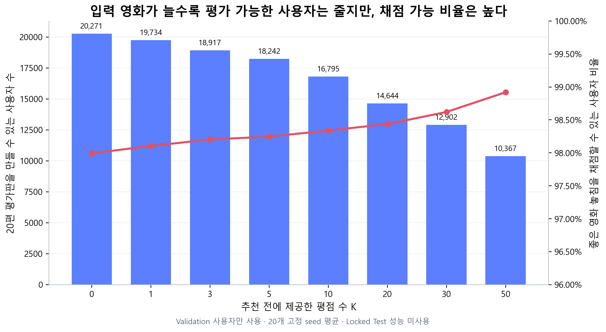
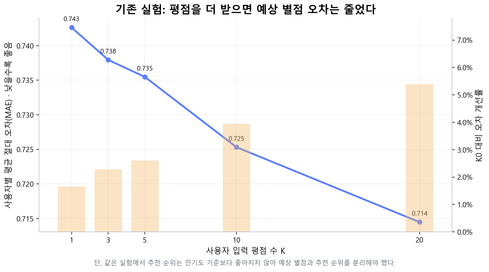
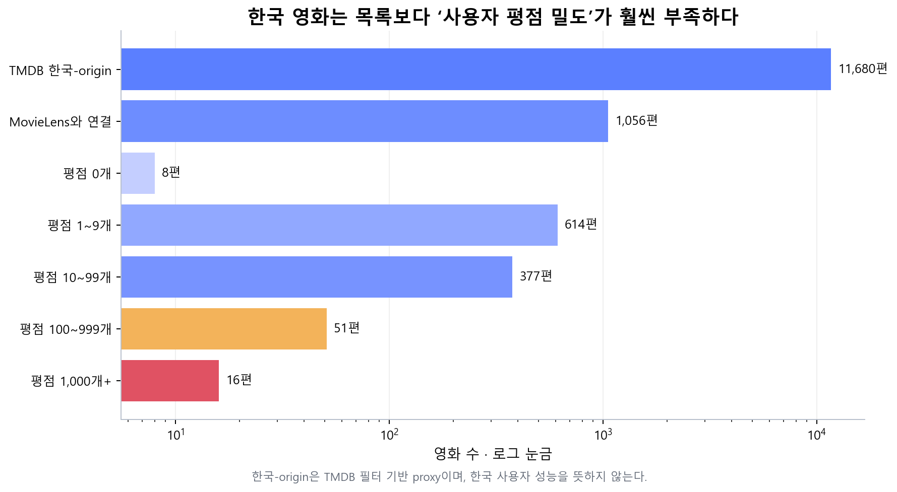
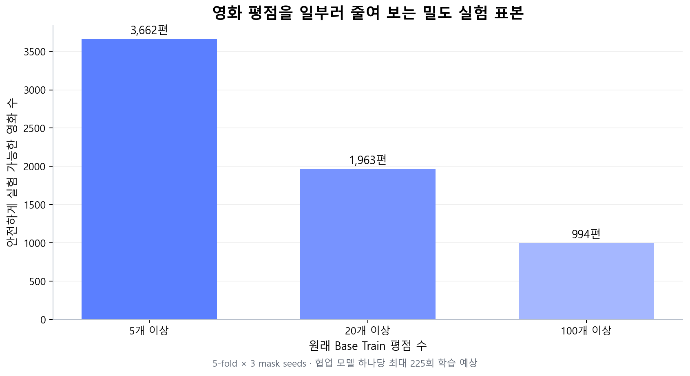
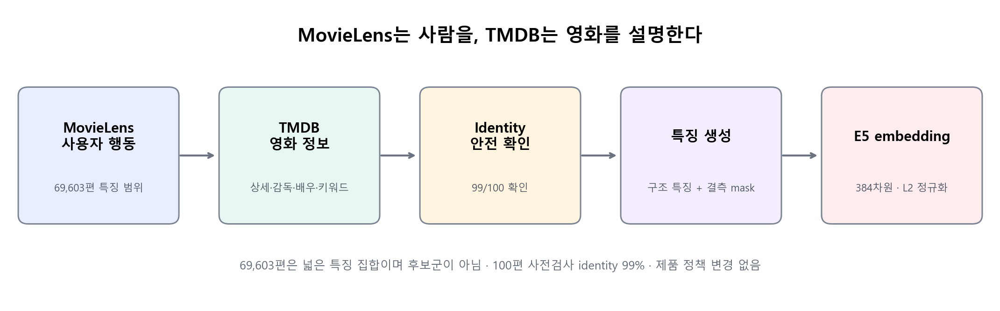
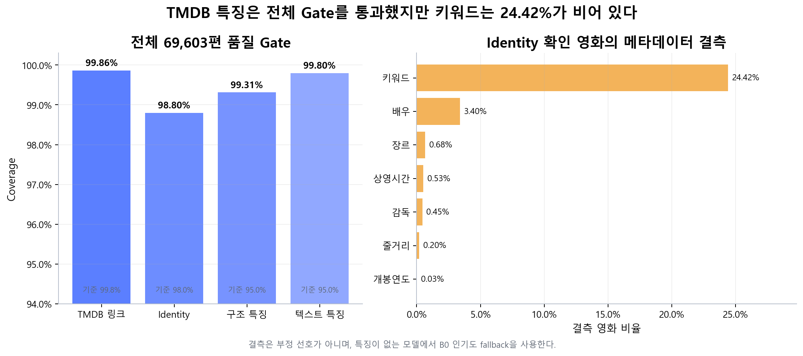
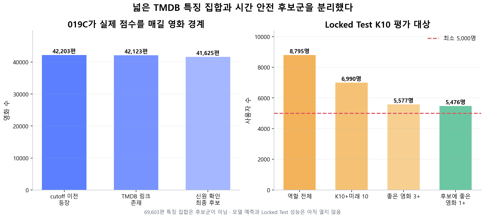
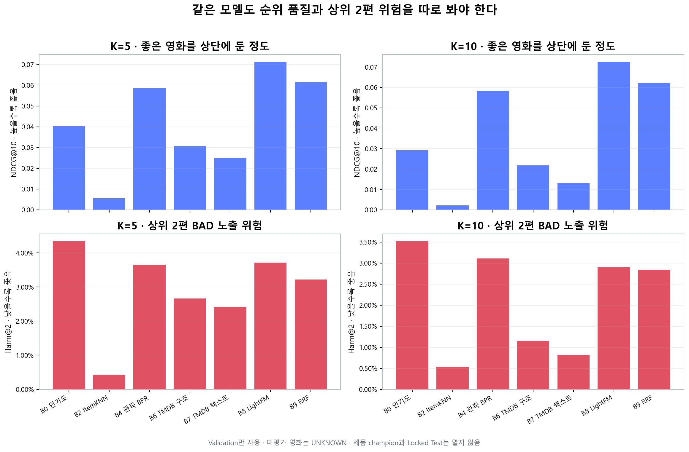
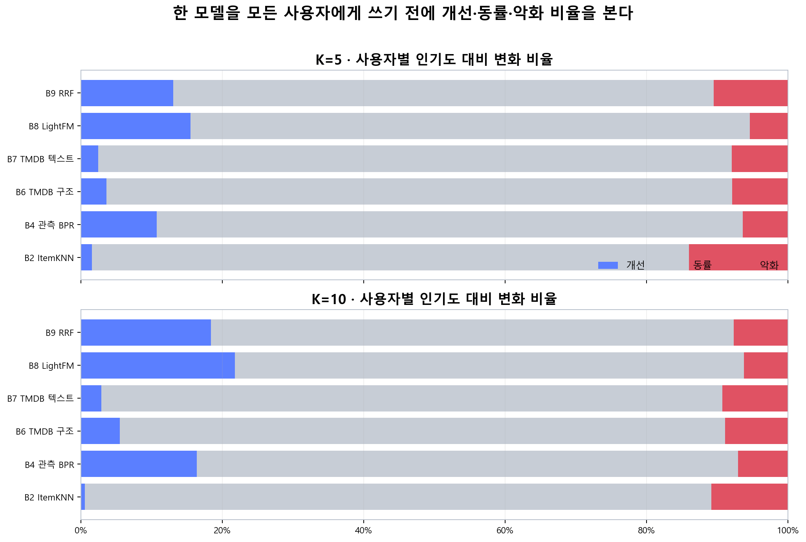
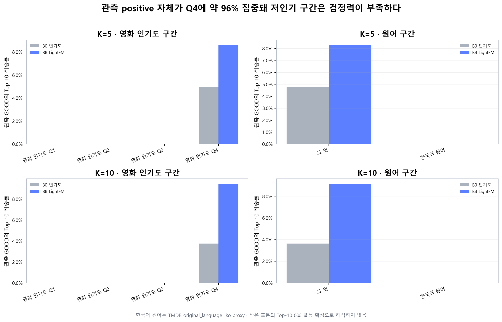

# FEELM 추천 설계·데이터 분석 최종 보고서

> 문서 상태: `FINAL_RESEARCH_REPORT`
> 작성 기준: 2026-09-05
> 제품 추천 정책: `APPROVED_C2A_INTERNAL_POPULARITY_ONLY` 유지
> 핵심 결론: K별 256명 tuning panel을 제외해도 LightFM T003은 K5·K10 각각의 조건 안에서 B0
> 인기도보다 높았다. K5와 K10은 사용자와 미래 구간이 달라 품질을 직접 비교하지 않는다. 양방향 신호는
> 구현상 적용 전제이며 효과 검증이 아니다. 한국어 원어·저인기·2020년 이후·true cold item은 작은 표본
> 또는 정답 부재로 미확정이다. `locked_test_used=false`, `champion=null`,
> `product_policy_updated=false`를 유지한다.

## 0. 이 작업의 목적

이 작업은 추천 모델 자체를 만들기 위해 시작한 것이 아니다. 서비스 개발 중 다음 두 문제에 답하기 위해
시작했다.

1. **MovieLens의 영화·평점이 외국 영화, 특히 유명 외국 영화에 지나치게 치우쳐 있고, 데이터 수록
   시점 이후 영화에는 상호작용이 없어 한국 영화와 최신 영화를 추천하기 어렵다.** 협업 신호가 부족하거나
   존재하지 않는 영화를 ID로만 학습하면 비교 가능한 영화 표현을 만들기 어렵다.
2. **출시 전에는 실제 사용자에게 영화를 추천하고, 시청·평가를 다시 받아 추천 품질을 검증하는 순환을
   만들기 사실상 불가능하다.** 따라서 실제 사용자 만족을 직접 정답으로 사용할 수 없다.

두 문제에 대해 이번 실험은 다음과 같이 범위를 제한해 답한다.

| 문제 | 이번 실험의 답 | 이 답으로 주장할 수 없는 것 |
| --- | --- | --- |
| MovieLens의 외국 영화 편향과 수록 이후 영화 공백 | TMDB 장르·언어·연도·인물·키워드 구조 특징과 384차원 E5 텍스트 임베딩으로 영화를 표현하고, 평점 기반 모델과 콘텐츠 벡터 기반 모델을 같은 조건에서 비교한다. 목표 도메인·최신성·한국 영화 범위·제품 사용 가능한 라이선스·사용자 행동을 동시에 만족하는 즉시 사용 가능한 대안은 확인되지 않았다. | 콘텐츠 벡터가 한국 사용자의 취향 정답이나 새로운 사용자 행동을 만들어 준다는 주장 |
| 실사용 추천·피드백 수집 불가 | MovieLens를 대리 실험 환경으로 사용해 모델을 학습·평가·검증한다. 이 환경에서 초기 선호 입력 수, 모델 종류, 상황별 점수와 fallback, MovieLens를 특정 시점 기준으로 제한할지 전체 관측 범위로 사용할지를 비교·결정한다. | 오프라인 결과가 실제 FEELM 사용자의 시청·만족을 증명한다는 주장 |

`REC-EV-019C`의 인기도·ItemKNN·BPR·TMDB 구조·TMDB 텍스트·LightFM·RRF 비교는 이 두 답이
실제로 어느 범위에서 유효한지 확인하는 하위 실험이다. 모델 순위표 자체가 작업 목적은 아니다.

### 0.1 REC-EV-019C가 결정할 것

완료한 `REC-EV-019C`는 위 목적을 위한 모델 비교 단계다. K=5·10의 초기 선호 입력에서 인기도,
ItemKNN, 관측 BPR, TMDB 구조·텍스트 콘텐츠, LightFM과 RRF를 같은 MovieLens Validation 환경에 놓고
비교한다. 전체 평균뿐 아니라 사용자 이력량, 입력 영화 인기도, 영화 인기도, 한국어 원어 여부에 따라
어느 모델과 점수 기준이 유효한지도 분석한다.

이번 실행의 시간 cutoff는 MovieLens를 사용하는 하나의 실험 정책이다. 전체 관측 범위를 사용하는 보조
실험은 아직 수행하지 않았으므로 시점 정책은 미결정으로 남긴다. MovieLens timestamp 자체를 실제 관람
순서라고 주장하지 않는다.

## 1. 가장 먼저 볼 결론

실제 FEELM 사용자의 추천–시청–평가 순환을 만들 수 없으므로 완벽한 “추천 정답” 데이터는 없다.
그래도 MovieLens 사용자가 이미 남긴 평점 집합 안에서는 다음 대리 질문을 비교할 수 있다.

> 이 사용자가 이미 평가한 영화 20편을 잠시 숨겼을 때, 모델이 그중 상위 2편에 사용자가 싫어한 영화를
> 올렸는가? 좋아한 영화가 있었는데도 하나도 고르지 못했는가?

실제 `REC-EV-019C` Validation은 후보 41,625편에서 K=5 사용자 1,614명, K=10 사용자 1,479명을
평가했다. K=5·10 모두 LightFM T003이 단일 최고 NDCG@10을 기록했다. 다만 이 결과는 MovieLens
관측 선호 복원에 대한 Validation 결과이며, 한국 영화·신작 추천이나 실제 FEELM 만족을 증명하지 않는다.

| 질문 | 판정 | 쉬운 설명 |
| --- | --- | --- |
| MovieLens 대리 환경에서 인기도보다 나은 모델이 있는가? | **YES** | LightFM NDCG@10: K5 0.0713, K10 0.0725 |
| 같은 사용자에서 개선 방향이 반복되는가? | **YES, 다수는 동률** | K5 개선 15.5%·악화 5.4%, K10 개선 21.8%·악화 6.2% |
| seed에 따라 tuning panel 결과가 크게 흔들리는가? | **NO, panel 한정** | 256명/K panel의 LightFM 5-seed 표준편차: K5 0.00223, K10 0.00168 |
| 콘텐츠 단독 모델이 인기도를 이기는가? | **NO** | 구조·텍스트 모두 K5·10에서 인기도보다 낮음 |
| 낮은 인기도 영화에서도 개선되는가? | **판단 보류** | Q1~Q3 positive가 K5 259건, K10 214건뿐이고 Top-10 적중 0 |
| 한국어 원어 영화 문제를 해결했는가? | **판단 불가/근거 없음** | positive 21·23건, Top-10 0, Top-500은 B0 10건 대 LightFM 6건 |
| K=5와 K=10 중 어느 쪽이 우수한가? | **직접 비교 불가** | 사용자와 미래 구간이 다르며 공통 1,253명 LightFM 절대 NDCG도 사실상 동일 |
| 같은-window K10 전환이 안전한가? | **NO** | 019D NDCG는 증가했지만 Harm upper 0.01235로 안전 Gate 실패 |
| 적용 가능한 사용자만 K10으로 전환하면 되는가? | **POST-HOC PASS, 재확인 필요** | 019E ΔNDCG +0.013997, Harm upper 0.003799; 같은 1,053명 재사용 |
| 전체 관측 범위까지 사용할 것인가? | **미결정** | 이번에는 cutoff 정책만 실행 |
| 제품 정책이나 Locked Test를 열 수 있는가? | **NO** | champion `null`, Locked Test 미개봉, 제품 정책 유지 |

## 2. 왜 이전 평가가 부족했나

이전 방식은 흔히 쓰는 “숨긴 영화가 추천 500개 안에 있는가”에 가까웠다. 이 값은 후보를 넓게 잡으면
올라갈 수 있고, FEELM이 실제로 한 번에 보여 주는 상위 2편의 품질을 직접 설명하지 못한다.

또 다음 세 가지를 섞고 있었다.

1. **예상 별점**: 사용자가 특정 영화에 몇 점을 줄지
2. **추천 순위**: 어떤 영화를 먼저 보여 줄지
3. **새로운 영화 발견**: 평소와 조금 다른 영화를 안전하게 보여 줄지

이 셋은 같은 숫자가 아니다. 실제 기존 실험에서도 예상 별점은 좋아졌지만 추천 순위는 좋아지지 않았다.
따라서 이제는 각각 따로 통과해야 한다.

## 3. 새 평가 방식

### 3.1 데이터 역할을 분리했다

| 데이터 | 맡는 역할 | 맡기지 않는 역할 |
| --- | --- | --- |
| MovieLens 평점 | 사용자가 어떤 영화를 상대적으로 좋아했는지, 모델 학습·오프라인 채점 | 최신 영화 설명, 한국 영화 전체 목록 |
| TMDB | 영화 ID, 장르, 감독, 배우, 키워드, 줄거리, 국가·언어·연도 | 사용자가 좋아한다는 정답 |
| FEELM 실제 이벤트 | 나중에 실제 만족·클릭·관심 없음·평가를 확인 | 현재는 사용자가 거의 없어 주 증거로 쓰지 않음 |

MovieLens 사용자는 FEELM 사용자가 아니다. 미평가 영화도 싫어한 영화가 아니다. 이 두 문장을 모든
결과 해석의 경계로 뒀다.

### 3.2 사용자별 기준으로 좋아함·싫어함을 만들었다

평점을 후하게 주는 사람과 짜게 주는 사람을 같은 4점 기준으로만 비교하지 않는다. 각 사용자의 전체
평점 분포에서 상대적으로 위쪽이면 GOOD, 아래쪽이면 BAD로 둔다. 4.0/4.5와 2.0/1.5 원점수 기준은
민감도 확인용으로만 별도 계산한다.

### 3.3 20편을 먼저 고정하고 모델은 그 안에서 상위 2편을 고른다

```text
한 사용자의 전체 MovieLens 평점
  ├─ 고정 hash로 20편 → 정답을 아는 평가판
  └─ 나머지 중 K편 → 모델에 주는 입력

인기도 기준선과 개인화 후보
  → 같은 20편을 각각 정렬
  → 상위 2편만 FEELM 노출처럼 채점
```

정답이 좋은 영화만 골라 평가판을 만들지 않는다. 사용자·영화·seed로 만든 고정 hash만 사용한다.
20개 seed를 반복해 우연히 쉬운 20편을 뽑은 영향을 줄인다.

### 3.4 가장 중요한 지표

사용자가 정한 우선순위를 그대로 반영했다.

1. **Harm@2**: 상위 2편 중 BAD가 하나라도 있는 비율 — 가장 중요한 안전 지표
2. **Miss@2**: 평가판에 GOOD가 있었는데 상위 2편에서 하나도 못 고른 비율
3. **BothGood@2**: GOOD가 두 편 이상 있을 때 둘 다 고른 비율
4. **SafeHit@2**: BAD 없이 GOOD를 최소 한 편 고른 비율
5. **NDCG@2**: 더 좋은 영화를 더 위에 놓았는지 보는 보조 지표

개인화 후보는 Harm가 기준선보다 0.5%p 이상 나빠지지 않고, Miss를 최소 1%p 개선해야 한다. 전체 평균뿐
아니라 이력량·입력 평점 분산·입력 영화 인기도·TMDB 특징 완성도 구간에서도 안전해야 한다.

## 4. 실제 결과 1 — 평가 표본은 충분했다



| K | 평가 가능 사용자 | Miss 채점 가능 사용자 | 채점 가능 비율 |
| ---: | ---: | ---: | ---: |
| 0 | 20,271 | 19,864 | 97.99% |
| 5 | 18,242 | 17,922 | 98.25% |
| 10 | 16,795 | 16,516 | 98.34% |
| 20 | 14,644 | 14,415 | 98.44% |
| 30 | 12,902 | 12,724 | 98.62% |
| 50 | 10,367 | 10,255 | 98.92% |

따라서 “MovieLens의 몇 %를 모아야 하나”보다 중요한 답은 이것이다. 사용자 전체 비율을 흉내 낼 필요는
없고, 우리가 정의한 비교에서 사용자 단위 불확실성을 줄일 만큼의 독립 사용자가 있으면 된다. Validation의
K=10 표본 16,795명은 사전검사를 진행하기에 충분하다. 실제 승격에 필요한 정확한 Test 사용자 수는 기준선과
후보의 차이 변동을 계산한 뒤 정한다.

## 5. 실제 결과 2 — 예상 별점과 추천 순위는 다르게 움직였다

아래는 새 v4 실험이 아니라, 이전 REC-EV-003B에서 이미 얻은 근거다. 새 방식으로 다시 확인해야 하지만
제품 방향을 정하는 데 중요한 실패 기록이므로 숨기지 않는다.



| K | 예상 별점 사용자별 MAE | K0 대비 개선 | 추천 순위의 인기도 대비 차이 |
| ---: | ---: | ---: | ---: |
| 1 | 0.743 | 1.66% | 0 |
| 3 | 0.738 | 2.28% | 0 |
| 5 | 0.735 | 2.61% | 0 |
| 10 | 0.725 | 3.95% | 0 |
| 20 | 0.714 | 5.39% | 0 |

해석은 간단하다.

- 평점을 더 받으면 **몇 점을 줄지**는 조금 더 잘 맞혔다.
- 그러나 그 ALS 결과로 **무엇을 먼저 추천할지**는 인기도 기준보다 낫지 않았다.
- 그래서 예상 별점 기능은 로컬 실험 후보로 남길 수 있지만, 개인화 추천 순위를 승인할 근거는 아니다.

현 시점의 실용적인 입력 정책은 `K5 빠른 시작 → K10에서 예상 별점 실험 가능 → K20에서 신뢰도 상승`이다.
다만 추천 순위가 개인화됐다고 표시하려면 새 Top-2 Gate를 통과해야 한다.

## 6. 실제 결과 3 — 한국 영화 문제는 “목록”보다 “평점 밀도”다



TMDB 한국-origin proxy는 11,680편이지만 MovieLens와 연결되는 영화는 1,056편(1.21%)이다. 그중 614편은
평점이 1~9개뿐이고, 1,000개 이상 평점이 있는 영화는 16편뿐이다. 한국-origin 평점은 MovieLens 전체
32,000,204개 중 90,885개(0.28%)다.

| 사용자 기준 | 사용자 수 |
| --- | ---: |
| 한국-origin 영화 1편 이상 평가 | 32,848명 |
| 5편 이상 평가 | 4,053명 |
| 10편 이상 평가 | 1,379명 |
| 25편 이상 평가 | 260명 |

이 숫자로 “한국 사용자 추천 성능”을 말할 수는 없다. MovieLens에 국가·연령 정보가 없기 때문이다.
말할 수 있는 것은 한국-origin 영화의 협업 신호가 매우 희소하므로 TMDB 콘텐츠 특징과 별도 실제 사용자
검증이 필요하다는 점이다.

## 7. 실제 결과 4 — 신작·희소 영화 실험은 누출을 먼저 막았다



최초 설계에서는 strict cold 분리와 density 분리가 독립적으로 모든 영화에 역할을 줘 6,964편이 충돌했다.
사전검사로 이를 발견했고, density 역할은 strict Train 영화 안에서만 나누도록 바꿨다. 재검사 충돌은 0편이다.

안전하게 실험할 수 있는 영화는 q≥5가 3,662편, q≥20이 1,963편, q≥100이 994편이다. 당시에는 TMDB
전체 특징 파일이 없어 콘텐츠 모델 성능 계산을 멈췄다. 이제 019B 전체 특징이 만들어져 cold-item
사전검사를 다시 실행했고 `READY_FOR_VALIDATION_PILOT`가 됐다. 아직 모델 성능을 계산한 것은 아니다.

### 7.1 TMDB 특징 100편 사전검사



MovieLens Base-Train 영화 중 TMDB 링크가 있는 100편을 고정 hash로 뽑아 실제 API부터 embedding까지
연결했다. identity는 99편, 구조 특징과 텍스트 특징은 확인된 99편 모두 사용할 수 있었다. 1편은 IMDb ID가
달라 자동 결합하지 않고 검토 대상으로 격리했다.

| 항목 | 결과 | 사전 기준 |
| --- | ---: | ---: |
| identity 확인 | 99/100 (99.0%) | 98% 이상 |
| 구조 특징 사용 가능 | 99/99 (100%) | 95% 이상 |
| 텍스트 특징 사용 가능 | 99/99 (100%) | 95% 이상 |
| E5 embedding | 384차원, L2 오차 이내 | 고정 revision·SHA-256 |

첫 실행은 인증 형식을 잘못 가정해 100편 모두 401이었고, 당시 verifier도 0% 결과를 통과시키는 문제가
있었다. JWT/v3 key를 구분하고 사전검사 coverage 하한을 추가한 뒤 다시 실행해 위 결과를 얻었다. 즉 이
수치는 처음부터 잘 나온 숫자가 아니라 실패를 계약과 코드에 환원해 다시 검증한 결과다.

100편은 실행 안전성만 확인하는 단계였다. 이 검사를 통과한 뒤 전체 실행을 진행했다.

### 7.2 TMDB 특징 69,603편 전체 결과



| 항목 | 전체 결과 | Gate | 판정 |
| --- | ---: | ---: | --- |
| TMDB 링크 존재 | 69,508/69,603 (99.8635%) | 99.8% 이상 | PASS |
| identity 확인·복구 | 68,674/69,508 (98.8001%) | 98% 이상 | PASS |
| 구조 특징 사용 가능 | 68,201/68,674 (99.3112%) | 95% 이상 | PASS |
| 텍스트 특징 사용 가능 | 68,534/68,674 (99.7961%) | 95% 이상 | PASS |
| E5 embedding | 384차원, L2 오차 이내 | 고정 revision·SHA-256 | PASS |

확인되지 않은 영화는 TV로 판정된 411편, 찾지 못한 357편, ID가 모호한 161편으로 분리해 자동 결합하지
않았다. 확인된 영화 중 가장 큰 결측은 키워드 16,772편(24.42%)이고, 배우는 2,336편(3.40%)이었다.
결측은 부정 선호가 아니므로 해당 영화를 공통 후보에서 제거하지 않고 모델별 B0 fallback 사유로 남긴다.

여기서 69,603편은 Base 역할 사용자들이 전체 기간에 한 번이라도 평가한 **넓은 콘텐츠 특성 집합**이다.
미래 시점에만 나타난 영화도 포함하므로 시간 안전 후보군으로 쓰지 않는다. 이 경계를 잘못 부르면 feature
coverage가 곧 추천 후보 coverage인 것처럼 보이므로 계약·검증기·장표에서 명시적으로 분리했다.

전체 API 수집에는 약 2시간 6분이 걸렸고 112,580개 응답을 cache했다. embedding 실행이 93.2%에서
중단되며 재계산 위험을 발견해 batch 단위 checkpoint를 추가했다. 최종 재실행은 network request 0회로
112,614개 cache hit를 사용했고, 독립 검증기가 manifest·schema·coverage·모델 SHA·비밀값 비저장을 모두
확인했다.

따라서 “TMDB 특징을 만들 수 있는가”는 PASS다. 이어진 Validation에서 TMDB 구조·텍스트 단독 모델은
인기도 기준선보다 낮았다. 영화 표현을 만들 수 있다는 사실만으로 관측 선호 복원력이 생기지는 않았다.

### 7.3 REC-EV-019A 고정 cohort와 실제 후보 경계



시간 cutoff 이전 Base Train에는 68,161명의 평점 10,254,572개와 영화 42,203편이 있었다. 이 중 TMDB
링크가 있는 1차 후보는 42,123편, 019B의 신원 확인을 통과한 최종 후보는 41,625편이다.

| 역할 | K0 적격 | K5 적격 | K10 적격 |
| --- | ---: | ---: | ---: |
| Router Train | 1,721명 | 1,651명 | 1,530명 |
| Validation | 1,674명 | 1,614명 | 1,479명 |
| Locked Test | 6,201명 | 5,923명 | 5,476명 |

K10 5,476명은 입력 10개와 이후 실제 평점 10개가 있고, 이후 평점 중 사용자 기준 좋은 영화가 3개 이상이며,
그중 적어도 하나가 최종 후보에 있는 사용자다. 5,000명 Gate는 통과했지만 모델 예측이나 성능은 열지 않았다.

### 7.4 실제 실행 전에 발견한 LightFM 계약 충돌

처음 B8은 LightFM의 BPR/WARP를 비교하려 했지만, 이 구현은 미관측 항목을 negative로 샘플링한다. 이는
“미평가는 UNKNOWN”이라는 프로젝트 원칙과 충돌한다. 따라서 결과를 보기 전에 B8을 관측 LIKE/DISLIKE
`+1/-1` logistic으로 바꾸고, 신규 사용자는 item 표현을 고정한 채 사용자 vector만 fold-in하도록 고쳤다.
고정 Linux Docker에서 hash-locked `lightfm-next==1.19.0`을 설치해 합성 signed 학습과 frozen-item
fold-in을 통과시켰다. 이는 실행 가능성 검사이지 추천 성능 결과는 아니다.

### 7.5 실제 실행 전에 발견한 과도한 반복 계산

실제 데이터 값은 읽지 않고 7개 Parquet footer의 행 수와 모델 trial 계약만 결합했다. 현 설계를 그대로
실행하면 약 75.5억 번의 사용자×영화 점수 계산과, 최악의 경우 약 61.5억 번의 LightFM 학습 update가
필요했다. RRF는 기존 Top-500 순위만 합치므로 이 수치에서 제외했다.

원인은 모든 B4·B8 설정을 seed 5개로 반복하고, 매번 전체 41,625편을 scan하는 구조였다. B4는 epoch마다
관측 LIKE/DISLIKE pair를 몇 개 만들지도 정해져 있지 않았다. 이는 추천 성능의 문제가 아니라 실행 계약의
문제다. grid는 고정 256명/K·seed 17에서 비교하고, 선택된 설정만 5개 seed로 패널 안정성을 확인한 뒤
seed 17로 전체 Validation을 계산하게 바꿨다. B4는 사용자당 epoch 최대 16쌍으로 고정했다. 재점검 결과는
약 15.8억 score, B8 최대 12.3억 update, B4 최대 3.93억 pair update로 모든 예산을 통과했다. 상세 근거는
[REC-EV-019C 계산량 사전점검](./evidence/REC-EV-019C-resource-dry-run.md)에 있다.

## 8. REC-EV-019C Validation 결과

### 8.1 평균 성능과 tuning panel 제외 결과



| 모델 | K5 NDCG@10 | K10 NDCG@10 | K5 Harm@2 | K10 Harm@2 |
| --- | ---: | ---: | ---: | ---: |
| B0 인기도 | 0.0402 | 0.0291 | 4.34% | 3.52% |
| B2 ItemKNN | 0.0055 | 0.0022 | 0.43% | 0.54% |
| B4 관측 BPR | 0.0587 | 0.0583 | 3.66% | 3.11% |
| B6 TMDB 구조 | 0.0307 | 0.0218 | 2.66% | 1.15% |
| B7 TMDB 텍스트 | 0.0250 | 0.0131 | 2.42% | 0.81% |
| **B8 LightFM** | **0.0713** | **0.0725** | 3.72% | 2.91% |
| B9 RRF | 0.0615 | 0.0622 | 3.22% | 2.84% |

전체 Validation의 LightFM − B0 차이 K5 `+0.0311`, K10 `+0.0434`에는 모델 선택에 사용한
256명/K tuning panel이 포함된다. 공식 제한·보조 결과는 panel 제외 paired 비교다.

| 조건 | 사용자 | LightFM − B0 평균 | paired bootstrap 95% CI |
| --- | ---: | ---: | ---: |
| K5 | 1,358 | +0.03331 | [0.02582, 0.04114] |
| K10 | 1,223 | +0.04532 | [0.03681, 0.05462] |

사용자 단위 percentile bootstrap을 2,000회 수행했고 seed는 `20260905+K`로 고정했다. 두 조건
각각에서 LightFM T003의 B0 대비 우위는 유지된다. Harm@2 차이는 신뢰구간이 0을 포함하므로 안전성
개선으로 단정하지 않는다.

### 8.2 K5와 K10은 품질을 직접 비교할 수 없다



| 조건 | 개선 | 동률 | 악화 | LightFM fallback |
| --- | ---: | ---: | ---: | ---: |
| K=5 | 15.49% | 79.12% | 5.39% | 38.79% |
| K=10 | 21.77% | 72.01% | 6.22% | 11.49% |

개선·동률·악화율은 각 K 내부의 기술 통계다. K5와 K10은 적격 사용자와 미래 구간이 다르므로 서로의
품질 차이를 뜻하지 않는다. 공통 1,253명에서도 미래 구간은 다르지만, LightFM 절대 NDCG@10은 K5
`0.075359`, K10 `0.075348`로 사실상 같았다. B0는 K5 `0.038780`, K10 `0.030512`였다.
K10의 더 큰 B0 대비 차이는 LightFM 상승보다 B0 하락의 영향이다. 다음 검증은 같은 사용자·같은 미래
구간을 고정한 prefix ablation이다.

현재 LightFM 구현은 최종 후보에 positive와 negative anchor가 각각 하나 이상 없으면 B0로 fallback한다.
REC-EV-019C **full Validation 전체**에서 원시 prefix에 양쪽 신호가 있어도 후보 anchor가 부족해
fallback한 사용자는 K5 97명, K10 46명이었다.
따라서 `양방향 신호 효과`를 주장하지 않는다. 한쪽 신호 동률은 모델 효과가 아니라 적용하지 않은 설계 결과다.

### 8.3 Q4 집중과 한국어 원어 방향



| 영화 구간 | K5 B0 | K5 LightFM | K10 B0 | K10 LightFM | 관측 GOOD 수 K5/K10 |
| --- | ---: | ---: | ---: | ---: | ---: |
| 인기도 Q1 | 0.00% | 0.00% | 0.00% | 0.00% | 38 / 36 |
| 인기도 Q2 | 0.00% | 0.00% | 0.00% | 0.00% | 44 / 33 |
| 인기도 Q3 | 0.00% | 0.00% | 0.00% | 0.00% | 177 / 145 |
| 인기도 Q4 | 4.93% | 8.61% | 3.75% | 9.46% | 6,086 / 5,729 |
| 비한국어 원어 | 4.74% | 8.29% | 3.63% | 9.16% | 6,324 / 5,920 |
| 한국어 원어 | 0.00% | 0.00% | 0.00% | 0.00% | 21 / 23 |

관측 positive 자체가 Q4에 K5 `6,086/6,345=95.9%`, K10 `5,729/5,943=96.4%`로
몰렸다. Q1~Q3 Top-10 적중 0은 실패 확정이 아니라 검정력 부족을 포함한 미확정 결과다.

한국어 원어 positive는 K5 21건, K10 23건이고 두 모델 Top-10은 0이다. Top-500에서는 B0 대
LightFM이 K5 `10/21` 대 `6/21`, K10 `10/23` 대 `6/23`으로 LightFM에 불리한 방향이다.
표본이 작아 열등을 확정하지 않는다.

### 8.4 최신 영화와 cold item 미측정

최종 후보 41,625편 중 `release_year >= 2020`은 9편이고 해당 Validation positive는 K5·K10 모두
0이다. base-train rating count가 0인 true cold item은 최종 후보에 0편이다. 따라서 최신·포스트-
MovieLens와 true cold-item 추천 품질은 성공·실패 어느 쪽도 측정하지 못했다. 분석 summary와 검증기는
release-year/cold-item 0건 slice를 누락하지 않는다.

### 8.5 tuning-panel stability와 실행 자원

| 모델·조건 | 5-seed NDCG 평균 | 표준편차 |
| --- | ---: | ---: |
| B4 BPR K5 | 0.06533 | 0.00520 |
| B4 BPR K10 | 0.06191 | 0.00256 |
| B8 LightFM K5 | 0.06689 | 0.00223 |
| B8 LightFM K10 | 0.07543 | 0.00168 |

5-seed 수치는 전체 Validation이 아니라 K별 256명 tuning panel에 한정된다. 중단된 LightFM T003
seed 42는 기존 cache를 보존한 `--resume`으로 이어서 실행했다. 전체 재개 실행은
6,088.5초, peak RSS 약 652 MiB, 결과 artifact 약 32.7 MiB였다. 예측 11,662,500행과 Validation
metric 23,325행을 독립 검증했고, selection lock을 생성했다.

### 8.6 019D 안전 실패와 019E post-hoc 완화

019D는 동일 K10 Validation 1,479명과 동일 미래 10행에서 first5/first10 profile을 비교했다. tuning-panel
합집합 426명을 제외한 confirmatory 1,053명의 ΔNDCG는 `+0.02656 [0.01784, 0.03520]`였지만 Harm
one-sided upper `0.01235`가 `0.005`를 넘어 `FAIL_SAFETY_MARGIN_EXCEEDED`다. 이 confirmatory 집단의
candidate-anchor loss는 K5 61명, K10 34명이다. 앞의 97/46은 019C full Validation 값이므로 모집단과
의미를 섞지 않는다.

019D 결과와 Harm 분해를 본 뒤 고른 019E는 이미 K5에 적용 가능한 661명은 K5를 유지하고, K10에서 새로
적용 가능한 277명만 K10으로 전환하며, 나머지 115명은 B0를 유지한다. 같은 1,053명에서 ΔNDCG는
`+0.013997 [0.008433, 0.019758]`, Harm upper는 `0.003799`로 Gate를 통과했다. 반면 candidate
recall@500은 `-0.020893` 감소했고 benefit/neutral/harm은 `70/957/26`이었다.

따라서 상태는 `PASS_POST_HOC_VALIDATION_REQUIRES_FRESH_CONFIRMATION`이다. 같은 집단을 재사용한 결과라
새 confirmatory evidence가 아니며, fresh target-independent preregistered Validation 전에는 champion과
제품 정책을 바꾸지 않는다. 019D source ranking 5,916개는 hashed item representation에서 full-catalog로
재점수해 exact Top-10/Top-500, positive rank percentile, aggregate를 확인했다.

## 9. 두 문제에 대한 최종 판정

| 처음의 문제 | 이번에 얻은 답 | 남은 한계 |
| --- | --- | --- |
| MovieLens의 외국·인기 영화 편향과 수록 이후 영화 공백 | TMDB 구조·E5로 41,625편을 같은 공간에서 표현하고 콘텐츠·결합 모델을 비교할 수 있었다. | Q4 표본 교란이 크고 한국어 원어·2020년 이후·true cold item 정답이 부족하거나 없다. 문제는 미해결이다. |
| 실사용 추천·시청·평가 순환 부재 | tuning panel을 제외해도 K5·K10 각각에서 LightFM T003의 B0 대비 우위를 확인했고, 019E 적용성 routing은 post-hoc Gate를 통과했다. | 019D 전체 K10 전환은 안전 실패했고 019E는 같은 집단 재사용이다. fresh target-independent confirmation이 필요하다. |

따라서 이번 실험의 성과는 “한국 영화 추천을 해결했다”가 아니다. 사용할 수 없는 실제 피드백을
MovieLens 대리 평가로 바꾸고, 가능한 콘텐츠 보완책을 같은 조건에서 시험해 **어디까지 유효하고 어디서
실패하는지 수치로 경계를 정한 것**이다.

## 10. 최종 결정

### 다음 검증 후보

- 019E routing을 결과와 독립적인 새 Validation 집단에서 사전등록 confirmation한다.
- LightFM T003은 각 K 안 B0 대비 challenger로 유지하되 019E post-hoc PASS를 제품 우위로 주장하지 않는다.
- 양쪽 valid candidate anchor는 현재 구현의 적용 전제로만 둔다.
- cutoff 정책의 결론은 전체 관측 범위 보조 실험 전까지 확정하지 않는다.

### 유지와 보류

- 현재 서비스 정책 `APPROVED_C2A_INTERNAL_POPULARITY_ONLY`를 유지한다.
- `champion=null`을 유지한다.
- `locked_test_used=false`를 유지한다.
- `product_policy_updated=false`를 유지한다.
- 한국 영화·신작 성능, 실제 사용자 만족, 온라인 성과를 주장하지 않는다.
- 문제 1의 다음 유효한 검증은 목표 도메인 행동 데이터 수집 또는 독립적인 한국 영화 평가 표본 확보다.

목표 도메인·최신성·한국 영화 범위·제품 사용 가능한 라이선스·사용자 행동을 동시에 만족하는 즉시 사용
가능한 대안은 확인되지 않았다. [ML-32M Extension](https://uwaterlooir.github.io/datasets/ml-32m-extension.html),
[MovieLens Beliefs 2024](https://grouplens.org/datasets/movielens/ml_belief_2024/),
[KMRD](https://github.com/lovit/kmrd),
[Amazon Reviews 2023](https://amazon-reviews-2023.github.io/main.html)은 각각 연구 접근 제한, MovieLens
문맥, synthetic·라이선스·최신성 Gate, 상품 리뷰 도메인 한계가 있어 보조 검증 후보로만 둔다.

## 11. 결과 상태표

| 작업 | 상태 | 산출물 |
| --- | --- | --- |
| REC-EV-019A 사용자 분리 cohort | PASS | 최종 후보 41,625편, K10 Test 5,476명 |
| REC-EV-019B TMDB 전체 특징 | PASS | 구조 특징·384차원 E5 전체 coverage Gate 통과 |
| REC-EV-019C 계약·합성·의존성·자원 검사 | PASS | 역할 firewall, resume, seed, 계산 상한 검증 |
| REC-EV-019C 실제 Validation | `PASS_VALIDATION_SELECTION_LOCKED` | K5 1,614명, K10 1,479명, selection lock 생성 |
| REC-EV-019C 사용자·영화 구간 분석 | `PASS_VALIDATION_ANALYSIS_ONLY` | tuning-panel 제외 paired, 공통 사용자, anchor fallback, release-year/cold-item slice |
| REC-EV-019D same-window ablation | `FAIL_SAFETY_MARGIN_EXCEEDED` | NDCG 효능 기준 통과, Harm upper 0.01235로 전체 K10 전환 금지 |
| REC-EV-019D full-rescore 감사 | PASS | 1,479명·5,916 ranking exact Top-10/Top-500·aggregate, boundary tie 0 |
| REC-EV-019E no-retune routing | `PASS_POST_HOC_VALIDATION_REQUIRES_FRESH_CONFIRMATION` | ΔNDCG +0.013997, Harm upper 0.003799, 동일 1,053명 재사용 |
| 새 개인화 champion | NOT SELECTED | `null`; 현재 제품 정책 유지 |
| Locked Test | NOT USED | `locked_test_used=false` |

## 12. 재현과 근거

- 결과 보고서: `docs/recommendation/evidence/REC-EV-019C-validation-analysis.md`
- 결과 장표: `docs/presentation/FEELM-REC-EV-019C-results.pptx`
- Validation manifest: `docs/recommendation/evidence/manifests/rec-ev-019c-validation.json`
- 분석 manifest: `docs/recommendation/evidence/manifests/rec-ev-019c-analysis.json`
- 019D 결과: `docs/recommendation/evidence/REC-EV-019D-prefix-ablation.md`
- 019E 결과: `docs/recommendation/evidence/REC-EV-019E-no-retune-incremental-applicability.md`
- 019E manifest: `docs/recommendation/evidence/manifests/rec-ev-019e-validation.json`
- 실행: `py -3 scripts/run_rec_ev_019c_validation.py --mode validation --role validation --resume`
- Validation 검증: `py -3 scripts/verify_rec_ev_019c_validation.py --manifest docs/recommendation/evidence/manifests/rec-ev-019c-validation.json`
- 분석: `py -3 scripts/analyze_rec_ev_019c_validation.py`
- 분석 검증: `py -3 scripts/verify_rec_ev_019c_analysis.py --manifest docs/recommendation/evidence/manifests/rec-ev-019c-analysis.json`
- 원본 MovieLens SHA-256: `e4a68655d7386b8f95f2f2424b2ff975dfdd15ffd59e0d864a14dca43e99d6ee`

대용량 원본과 생성 Parquet은 Git에 올리지 않는다. manifest의 경로·크기·SHA-256으로 로컬 파일의 동일성을
확인한다. 현재 raw Parquet은 `outputs/` ignore에만 있고 외부 artifact URI가 없으므로, commit만으로는
제3자가 이 분석을 재현할 수 없다.
