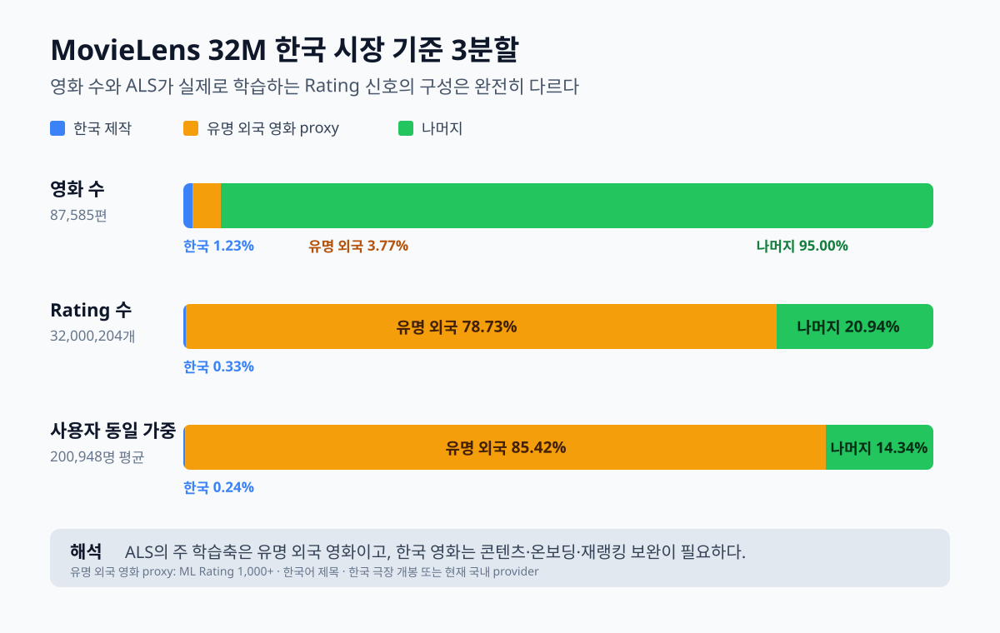

# MovieLens 한국 시장 기준 3분할

> 상태: `COMPLETED_DESCRIPTIVE_PARTITION`
> 기준: MovieLens 32M 전체 87,585편, 200,948명, 32,000,204 Rating
> 목적: MovieLens 학습 신호의 시장 편향을 기술적으로 계측한다. 한국 사용자 성능 증명이 아니다.
> 의사결정 상태: 이 보고서의 초기 활용 가설은 `REC-DATA-009`로 대체되었다.

## 결론

MovieLens의 영화 목록만 보면 `나머지`가 95.00%지만,
실제 Rating은 `유명 외국 영화 proxy`에 78.73%
집중돼 있다. 반대로 한국 제작 영화는 영화 수 1.23%,
Rating 0.33%뿐이다.

이 기술통계만으로 ALS를 FEELM 추천의 기본축으로 확정할 수 없다. 오히려 source-domain ALS가
유명 외국 영화 상호작용을 주로 재현할 가능성이 크다는 위험 근거다. 제품 적용 결정과 무사용자 단계의
대안은 `REC-DATA-009-zero-data-recommendation-strategy.md`를 따른다.

## 서로 겹치지 않는 3분할

| 구분 | 영화 | 영화 비율 | Rating | Rating 비율 | 사용자별 평균 | 사용자별 중앙값 | 1편 이상 사용자 |
| --- | --- | --- | --- | --- | --- | --- | --- |
| 한국 제작 | 1,078 | 1.23% | 106,455 | 0.33% | 0.24% | 0.00% | 18.43% |
| 유명 외국 영화 proxy | 3,298 | 3.77% | 25,192,283 | 78.73% | 85.42% | 87.70% | 100.00% |
| 나머지 | 83,209 | 95.00% | 6,701,466 | 20.94% | 14.34% | 12.00% | 91.96% |

`사용자별 평균/중앙값`은 각 사용자의 전체 Rating 중 해당 분류가 차지하는 비율을 먼저 계산한 뒤
사용자 200,948명을 동일 가중치로 요약한 값이다. 사용자의 국적·연령을 뜻하지 않는다.

### 분류 정의

1. `한국 제작`: TMDB `origin_country=KR` 또는 `production_countries`에 KR이 확인된 MovieLens 영화.
2. `유명 외국 영화 proxy`: 외국 제작, MovieLens Rating 1,000개 이상, 한국어 제목이 있고,
   한국 극장 개봉 또는 현재 국내 provider가 확인된 영화. KOBIS 2004+ 100만 관객 매칭작의
   영화 recall 86.94%, 관객가중 recall
   90.45%인 보수적 proxy다.
3. `나머지`: 위 두 집합 밖의 저상호작용 외국 영화, 국가 불명, 국내시장 신호 부족 영화 전체.

실제 한국 인지도 확정값이 없으므로 두 번째 이름에 `proxy`를 유지한다. 기준을 MODERATE로 완화하면
유명/인지가능 외국 영화 Rating 비율은 83.89%, STRICT는
78.73%로, 핵심 결론은 약 79~84% 범위에서 유지된다.

## 사용자별로도 봐야 하는가

**봐야 하지만 이 표 하나면 충분하다.** 전체 Rating 비율은 Rating을 많이 남긴 사용자의 영향이 커서,
사용자 한 명을 한 표로 동일 가중한 결과와 함께 확인해야 한다.

### 이력에서 가장 큰 분류

| 우세 분류 | 사용자 | 사용자 비율 |
| --- | --- | --- |
| 한국 제작 | 7 | 0.003% |
| 유명 외국 영화 proxy | 198,819 | 98.94% |
| 나머지 | 1,954 | 0.97% |
| 동률 | 168 | 0.084% |

### 사용자 Rating 수별 평균 구성

| Rating 수 | 사용자 | 사용자 비율 | 한국 제작 | 유명 외국 proxy | 나머지 |
| --- | --- | --- | --- | --- | --- |
| 20–49 | 72,604 | 36.13% | 0.18% | 87.38% | 12.44% |
| 50–99 | 47,669 | 23.72% | 0.24% | 87.06% | 12.71% |
| 100–499 | 68,072 | 33.88% | 0.28% | 84.43% | 15.29% |
| 500+ | 12,603 | 6.27% | 0.39% | 73.29% | 26.32% |

## 초기 활용 가설 — `REC-DATA-009`로 대체됨

| 계층 | 역할 | 현재 결정 |
| --- | --- | --- |
| 유명 외국 영화 proxy | ALS가 가장 잘 학습할 수 있는 source-domain 신호 | 연구 비교군으로만 유지, 제품 기본 추천에는 사용하지 않음 |
| 한국 제작 | 목표 시장상 중요하지만 협업 신호가 극소 | 명시적 선호·콘텐츠 후보 생성의 대상. 성능이 증명됐다는 뜻은 아님 |
| 나머지 | 카탈로그 대부분이나 상호작용은 희소 | 후보에서 삭제 금지, 콘텐츠 cold-item·discovery 트랙으로 분리 |

MovieLens 내부 연구 평가를 수행한다면 세 slice의 Recall/NDCG/coverage를 따로 보고한다. 그러나 이는
한국 실사용자 성능 점수가 아니다. 사용자별 추천 목록에 3분할 비율을 quota로 강제하는 것 역시 실제
한국 사용자 로그나 설문 전에는 근거가 없다.

## 경계

- MovieLens 사용자는 한국 사용자가 아니며 인구통계도 없다.
- `유명 외국 영화 proxy`에는 한국에서 덜 알려진 글로벌 인기작이 일부 섞일 수 있다.
- pre-2004 고전은 KOBIS 관객 수로 규모 비교가 불가능하므로 국내 검색/설문 검증을 계속 별도로 둔다.
- 이 자료는 데이터와 평가 방향을 정하지만 production 추천 비율이나 모델 champion을 승인하지 않는다.
