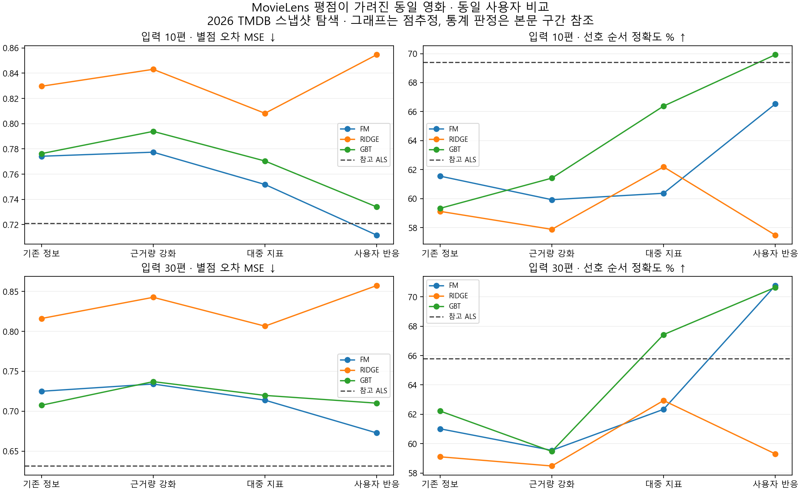

# 평점 이력을 가린 영화: 콘텐츠 모델과 ALS 비교

상태: DRAFT — 2026-09-10 로컬 실험·독립 결과 검토 완료. 서비스 정책은 미확정이다.

## 먼저 볼 결론

**사용자 반응 정보를 더할 이유는 발견했다. 다만 ALS 대체 성능까지 입증한 것은 아니다.**
FM에서 영화의 대중 지표에 사용자 입력의 분포·별점 반응을 추가하자, 입력 10편의 선호 순서
정확도가 **60.4% → 66.5%**로 올랐다. 같은 사용자끼리 비교한 차이는 **+6.16%p**이며,
미리 정한 다중 비교 보정 구간은 **+0.14~+14.26%p**였다. 이 조건에서만 개선 판정을 통과했다.
순서 비교가 가능한 71명의 한 조건에서 얻은 제한적 근거이며, 구간 하한도 0에 가깝다.
관측 영화의 서로 다른 별점 쌍을 비교한 결과이며, 전체 카탈로그 추천의 적중률은 아니다.

| 확인한 질문 | 관측 결과와 판단 |
| --- | --- |
| 근거 평가 편수를 반영하면 좋아지는가? | 이번 근거량·수축 보정의 개선은 확인하지 못했다. 입력 30편의 리지는 MSE가 0.8162 → 0.8427로 악화됐고 보정 기준도 통과했다. 현재 보정 방식을 필수로 채택할 근거는 없다. |
| 영화의 대중 평점·평가 수·인기도를 넣으면 좋은가? | FM·리지·GBT 모두 주 비교에서 평균 오차와 순서 점수가 좋은 방향으로 움직였다. 그러나 이 단계의 추가 이득은 보정 기준을 통과하지 못해 미확정이다. |
| 사용자가 대중성을 따라 평가하는지도 넣을 만한가? | FM의 입력 10편에서 순서 개선을 확인했다. 입력 30편도 62.3% → 70.8%였지만 보정 구간이 0을 포함했다. FM의 별점 오차 개선과 GBT의 추가 개선은 아직 미확정이다. |
| ALS를 따라잡거나 넘어섰는가? | ALS와 비교한 48개 검정 모두 차이를 확정하지 못했다. 이는 동급이라는 뜻도 아니다. |

**후속 비교 후보로는 사용자 반응을 포함한 FM과 GBT를 유지한다. 최종 모델 채택은 보류한다.**
FM은 해당 조건에서 콘텐츠 후보 중 별점 오차 점추정이 가장 낮았고, 입력 10편의 순서
점추정은 GBT가 더 높았다. FM과 GBT 사이의 우열은 이번 사전 짝 비교의 검정 대상이 아니었다.
근거량 보정을 뺀 채 사용자 반응만 추가하는 조합도 아직 비교하지 않았다.

BASE에도 이미 사용자 별점과 장르·인물 등의 반응 요약이 들어 있다. 이번 개선은 그 위에
대중성 입력 분포와 반응을 함께 추가한 효과다. 모든 개인화의 효과를 새로 검증했거나,
장르·배우·감독 각각의 영향과 인과관계를 입증한 결과는 아니다.

## 무엇을 비교했나

같은 영화의 다른 학습 사용자 과거 평점은 ALS에 남기고, 콘텐츠 모델의 모든 평점 학습 경로에서는 제거했다. 같은 평가 사용자·입력·미래 관측에서 비교했다.

사용자 입력은 ALS가 학습한 W 영화에서 골랐고, 목표 영화의 평점 이력만 콘텐츠 학습에서
가렸다. 따라서 ALS가 모르는 영화만 입력한 사용자의 품질까지 검증한 것은 아니다.

콘텐츠 학습은 39,859명·4,997,069개 평점이다. 새 학습은 4조건 × FM·리지·GBT = 12개이며 참고 ALS는 기존 전체 학습 요인으로 입력 벡터를 다시 계산했다. 기본값을 ALS 점수로 쓰지 않았다.
대다

아래 숫자는 사용자 평균이다. K는 제공한 입력 영화 편수다. MSE는 낮을수록, 선호 순서
정확도(PA)는 높을수록 좋다. 실제 MSE는 예측을 0.5–5 범위로 제한하고 PA·ALS 재현도는
반올림하지 않은 원래 예측을 쓴다. 실제 별점은 원래 0.5 단위를 유지한다. ALS는 비교 참고선이며
실제 별점이 정답이다. 그래프의 순위만으로 우열을 확정하지 않는다.
같은 K 안에서는 같은 사용자를 비교한다. K10과 K30의 사용자 집합은 달라 K 간 차이를
입력 증가의 효과만으로 해석할 수 없다. 공통 K30 사용자 비교는 전체 지표의 common_k30에 별도로 있다.

## 입력 10편

별점 오차: 117명·461관측·312영화. 순서 비교: 71명·1,664쌍.

| 모델 | 기존 정보 MSE | 근거량 강화 | 대중 지표 추가 | 사용자 반응 추가 |
| --- | ---: | ---: | ---: | ---: |
| FM | 0.7742 | 0.7774 | 0.7518 | 0.7117 |
| RIDGE | 0.8296 | 0.8430 | 0.8082 | 0.8546 |
| GBT | 0.7762 | 0.7939 | 0.7704 | 0.7340 |
| 참고 ALS | 0.7211 | — | — | — |

| 모델 | 기존 정보 PA | 근거량 강화 | 대중 지표 추가 | 사용자 반응 추가 |
| --- | ---: | ---: | ---: | ---: |
| FM | 61.6% | 59.9% | 60.4% | 66.5% |
| RIDGE | 59.1% | 57.9% | 62.2% | 57.5% |
| GBT | 59.3% | 61.4% | 66.4% | 69.9% |
| 참고 ALS | 69.4% | — | — | — |

## 입력 30편

별점 오차: 113명·450관측·309영화. 순서 비교: 68명·1,651쌍.

| 모델 | 기존 정보 MSE | 근거량 강화 | 대중 지표 추가 | 사용자 반응 추가 |
| --- | ---: | ---: | ---: | ---: |
| FM | 0.7250 | 0.7341 | 0.7138 | 0.6728 |
| RIDGE | 0.8162 | 0.8427 | 0.8066 | 0.8575 |
| GBT | 0.7075 | 0.7371 | 0.7198 | 0.7101 |
| 참고 ALS | 0.6313 | — | — | — |

| 모델 | 기존 정보 PA | 근거량 강화 | 대중 지표 추가 | 사용자 반응 추가 |
| --- | ---: | ---: | ---: | ---: |
| FM | 61.0% | 59.6% | 62.3% | 70.8% |
| RIDGE | 59.1% | 58.5% | 62.9% | 59.3% |
| GBT | 62.2% | 59.5% | 67.4% | 70.6% |
| 참고 ALS | 65.8% | — | — | — |

## 사전 고정한 짝 비교

인접 비교36개를 한 family, ALS 참고 비교48개를 별도 family로 보정했다. 아래는 보정 구간이0을 포함하지 않는 비교만 표시한다.

| 비교 | 입력 | 모델/조건 | 지표 | 평균 차이 | 보정 구간 | 방향 |
| --- | ---: | --- | --- | ---: | --- | --- |
| increment | 10 | CROWD_RESPONSE__FM − CROWD_ITEM__FM | pa | 0.061623 | [0.0013863, 0.14257] | 개선 |
| increment | 30 | SUPPORT__RIDGE − BASE__RIDGE | mse | 0.026562 | [0.006037, 0.053237] | 악화 |

차이를 확인하지 못한 비교를 동급으로 해석하지 않는다. 작은 표본과 넓은 구간 때문에 방향이 불확실할 수 있다.

## ALS 예측 재현도

| 입력 | 모델 | 조건 | ALS 점수 대비 MAE ↓ | MAE 인원 | ALS 순서 일치율 ↑ | 순서 인원/쌍 |
| ---: | --- | --- | ---: | ---: | ---: | --- |
| 10 | FM | 기존 정보 | 0.3998 | 117 | 64.4% | 77명/2,151쌍 |
| 10 | FM | 근거량 강화 | 0.4046 | 117 | 61.7% | 77명/2,151쌍 |
| 10 | FM | 대중 지표 | 0.3876 | 117 | 67.2% | 77명/2,151쌍 |
| 10 | FM | 사용자 반응 | 0.3503 | 117 | 76.2% | 77명/2,151쌍 |
| 10 | RIDGE | 기존 정보 | 0.4510 | 117 | 65.7% | 77명/2,151쌍 |
| 10 | RIDGE | 근거량 강화 | 0.4618 | 117 | 64.4% | 77명/2,151쌍 |
| 10 | RIDGE | 대중 지표 | 0.4251 | 117 | 73.9% | 77명/2,151쌍 |
| 10 | RIDGE | 사용자 반응 | 0.4574 | 117 | 69.2% | 77명/2,151쌍 |
| 10 | GBT | 기존 정보 | 0.4084 | 117 | 68.8% | 77명/2,151쌍 |
| 10 | GBT | 근거량 강화 | 0.4061 | 117 | 62.2% | 77명/2,151쌍 |
| 10 | GBT | 대중 지표 | 0.3742 | 117 | 71.6% | 77명/2,151쌍 |
| 10 | GBT | 사용자 반응 | 0.3616 | 117 | 76.6% | 77명/2,151쌍 |
| 30 | FM | 기존 정보 | 0.3452 | 113 | 65.0% | 74명/2,137쌍 |
| 30 | FM | 근거량 강화 | 0.3472 | 113 | 67.1% | 74명/2,137쌍 |
| 30 | FM | 대중 지표 | 0.3300 | 113 | 70.4% | 74명/2,137쌍 |
| 30 | FM | 사용자 반응 | 0.2924 | 113 | 76.6% | 74명/2,137쌍 |
| 30 | RIDGE | 기존 정보 | 0.4084 | 113 | 68.8% | 74명/2,137쌍 |
| 30 | RIDGE | 근거량 강화 | 0.4211 | 113 | 68.7% | 74명/2,137쌍 |
| 30 | RIDGE | 대중 지표 | 0.3884 | 113 | 74.5% | 74명/2,137쌍 |
| 30 | RIDGE | 사용자 반응 | 0.4352 | 113 | 68.6% | 74명/2,137쌍 |
| 30 | GBT | 기존 정보 | 0.3545 | 113 | 71.6% | 74명/2,137쌍 |
| 30 | GBT | 근거량 강화 | 0.3549 | 113 | 65.5% | 74명/2,137쌍 |
| 30 | GBT | 대중 지표 | 0.3252 | 113 | 72.3% | 74명/2,137쌍 |
| 30 | GBT | 사용자 반응 | 0.3328 | 113 | 79.8% | 74명/2,137쌍 |

ALS와 비슷한 예측을 내는 능력과 실제 별점을 맞히는 능력은 다르다. 전체 카탈로그에서 정답 추천 순서를 평가한 결과가 아니다.

## 학습과 입력의 한계

학습 목표의 82.43%는 입력 K0이며, 입력이 있는 목표는 878,107건이다. 전체 평점 수를 모두 개인화 입력이 있는 학습 사례로 부르지 않는다.
입력30편에서도 감독 직접 연결이 없는 관측은92.44%, 배우는76.67%다. 연결이 없는 것을 해당 속성을 싫어하거나 쓸모없다는 뜻으로 해석하지 않는다.
콘텐츠12개 실제 학습 함수 시간 합은 95.4분이며 최대 컨테이너 메모리는 10.59GiB다. 데이터 준비·감사·저장까지 포함한 총 작업 시간이나 서비스 추론 지연이 아니다.
고정 반복 횟수와 학습 설정을 사용했다. 최적 수렴을 입증한 모델 순위표로 해석하지 않는다.

입력 10편의 117명 중 과거 평가가 30편 미만인 사용자는 2명뿐이며, 72명은 과거 평가가
300편 이상이다. 따라서 적게 평가하는 사용자에게도 같은 효과가 있다고 일반화하지 않는다.
같은 조건의 목표 관측은 기존 학습 지원량 1–9건 영화 61건, 10–49건 영화 52건,
50건 이상 영화 348건이다. 지원량 층은 사전 기준 시점의 값이며 콘텐츠 모델에서는 모두 이력을 가렸다.
활동량과 영화 지원량을 함께 나누면 더 작아지는 셀도 별도 CSV에 그대로 공개한다.

## 해석 범위

- SUPPORT 차이는 근거량과 수축 표현 묶음의 효과다. CROWD_ITEM은 영화 대중 지표, CROWD_RESPONSE는 사용자 입력 분포와 반응 프로필 묶음의 추가 효과다.
- 대중 지표는 2026년 TMDB 정보다. 과거에 이미 알던 값으로 취급하지 않으며, 외부 집계 평가가 없는 순수 콘텐츠 조건으로 부르지 않는다.
- 기존에 확인한 MovieLens 개발 정답을 재사용했다. 단일 영화 보류 분할이며 사용자 bootstrap은 이 영화 집합에 조건부다. 2026년 한국 서비스 품질·개인별 인과효과·최적 학습 성능을 보증하지 않는다.
- 학습 K0 비중, 최적화 종료 및 자원 기록, 세부 활동량·영화 지원층은 부록 파일과 최종 독립 검토에서 확인한다.

[실행 명세](EXECUTION.md) · [전체 지표](metrics.csv) · [짝 비교](contrasts.csv) · [집단별 지표](strata.csv) · [학습 자원](training-resources.csv)

[모델·최종 예측 검산](model-review.json) · [정답·집계·결론 독립 검토](result-review.json)
