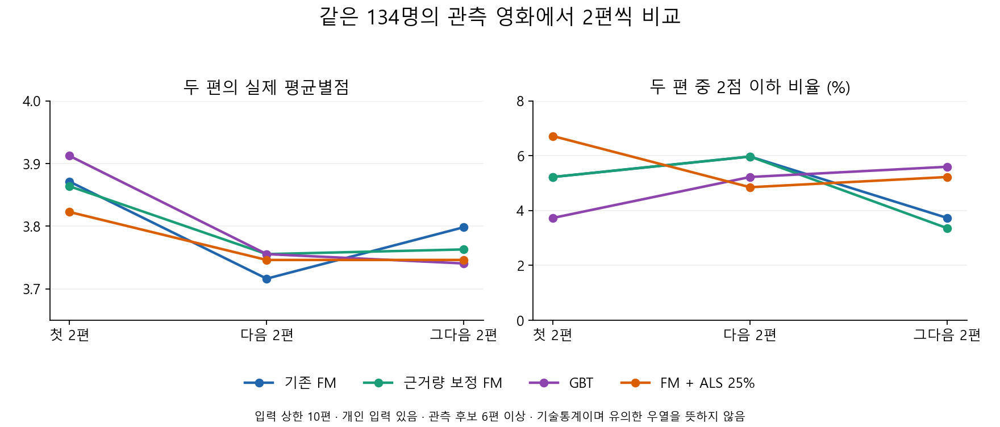

# 두 편씩 추천하는 흐름의 세 가지 진단 결과

상태: DRAFT — 2026-09-11 로컬 진단. 기존 개발 자료의 기술통계이며 모델 채택·새 최종 test는 아니다.

**현재 원점수 FM과 고정 25% ALS 혼합을 그대로 채택하는 것은 권하지 않는다.**
근거량 보정 FM은 극단적인 투표 점수 쏠림을 줄였고, GBT도 앞쪽 관측 품질과 노출 집중도에서 비교할 이유가 있다.
따라서 앞선 “FM 우선” 제안만으로 GBT를 제외하지 않는다. 이번 진단이 새 승자를 통계적으로 확정한 것은 아니다.

분류·K-means·발견 교체는 적용하지 않았다. 같은 입력에서 첫2편 → 다음2편 → 그다음2편을 잘랐다.
추가 학습0회·추론0회, 저장된 관측 예측과 전체 후보22,963,869행을 사용했다.
실행 요약에 기록된 진단 시간은57.5초였다. 독립 검토·보고 작업 시간은 포함하지 않는다.

## 1. 뒤의 두 편이 계속 나빠지는가

**첫2편이 대체로 좋지만, 뒤로 갈수록 일관되게 하락하는 것은 아니다.**
같은134명(개인 입력 있음·입력 상한10편·관측 후보6편 이상)을 놓고 비교했다.
각 셀은 **실제 평균별점 / 2점 이하 영화 비율**이다.

| 모델 | 첫2편 | 다음2편 | 그다음2편 |
|---|---:|---:|---:|
| 기존 FM S | 3.871 / 5.22% | 3.716 / 5.97% | 3.799 / 3.73% |
| 근거량 보정 FM R | 3.864 / 5.22% | 3.756 / 5.97% | 3.763 / 3.36% |
| 보정+학습이력 수정 FM RH | 3.871 / 5.60% | 3.789 / 5.22% | 3.731 / 3.36% |
| GBT | 3.912 / 3.73% | 3.756 / 5.22% | 3.741 / 5.60% |
| FM+ALS 25% | 3.823 / 6.72% | 3.746 / 4.85% | 3.746 / 5.22% |

처음 두 편이 **모두2점 이하**인 경우는 S/R/RH/혼합 각각2명, GBT1명이었다(모두134명 중).
매우 적은 사건 수이므로 한 명 차이를 안정적인 우위로 해석하지 않는다.

관측 후보가 충분한 사람을 각 페이지마다 따로 포함하면 분모는176/153/134명이다.
위 표는 그 차이를 제거한 공통134명 결과이므로 앞서 본 전체 유효176명의 Top2 수치와 다르다.
입력0 84명은 별도로 집계했고, 입력 상한0/1/5/10/30과 C/ALS지원/자연미지원 영화의 보조표도 보존했다.
미반환은 품질0점으로 바꾸지 않았다. 더보기 행동 확률이나 새 반응에 따른 재추천 효과는 평가하지 않았다.

근거: [전체 페이지·누적 지표](../../../../outputs/recommendation-evidence/diagnostic342/page-summary.csv).

## 2. 전체 후보에서는 무엇이 나오는가

**기존 FM의 투표1개·10점 쏠림은 두 번째·세 번째 페이지까지 이어졌다.**
개인 입력186명, 페이지당372슬롯이다. 아래 투표 수는 MovieLens가 아닌 사용한 TMDB 스냅샷의 값이다.

| 모델 | 첫2편: 투표1개·10점 | 다음2편 | 그다음2편 | 첫2편 고유 영화 | 첫2편 UNKNOWN |
|---|---:|---:|---:|---:|---:|
| 기존 FM S | 342/372 | 303/372 | 277/372 | 13편 | 372/372 |
| 근거량 보정 FM R | 0/372 | 0/372 | 0/372 | 19편 | 370/372 |
| 보정+학습이력 수정 FM RH | 0/372 | 0/372 | 0/372 | 46편 | 370/372 |
| GBT | 23/372 | 29/372 | 33/372 | 135편 | 369/372 |
| FM+ALS 25% | 342/372 | 301/372 | 297/372 | 12편 | 372/372 |
| 실제 ALS | 0/372 | 0/372 | 0/372 | 90편 | 372/372 |

**전체 자격 후보 행에서 투표1개·10점 영화는0.262%인데, 기존 FM 첫2편 노출에서는91.94%였다.**
반면 관측 채점 후보 행에서는0.018%뿐이었다. 그래서 관측 후보 지표만 보면 이 쏠림이 거의 드러나지 않는다.
이 비율은 개인 입력186명의 사용자-영화 행을 합친 분모이며 고유 영화 비율과 다르다.

근거량 보정이 이 극단값 쏠림을 줄인 것은 확인했다. 그러나 R도 첫2편에서 가장 자주 나오는 한 영화가
전체 슬롯의32.80%를 차지했고, RH18.82%, GBT8.06%였다. 쏠림을 줄인 것과 만족도가 좋아진 것은 다른 결론이다.
R의 전체 노출 집중도(HHI)는0.2593으로 S의0.2488보다 높았다. 극단값 노출을 없앤 것만으로 집중 문제 전반을 해결한 것도 아니다.
전체 후보의 정답은 거의 없어 어느 모델의 실제 만족도가 가장 높은지는 여전히 판단하지 못한다.

이번 자료에서 모든 내용 모델은186명에게 각 페이지2편을 반환했고 중복은 없었다.
실제 ALS는 개인 입력186명에게 반환했지만, 입력0 84명에게는 세 페이지 모두 반환하지 못했다.
ALS의 미반환을 숨기기 위해 사용자를 제외하거나 가짜 점수를 채우지 않았다.
연구 카탈로그는 MovieLens에 연결된85,517편이며 2026년 한국 서비스 영화 전체가 아니다.

근거: [전체 노출](../../../../outputs/recommendation-evidence/diagnostic342/catalog-exposure.csv),
[관측 후보와 전체 후보의 분포](../../../../outputs/recommendation-evidence/diagnostic342/candidate-distribution.csv).

## 3. ALS를 섞으면 왜 결과가 달라지는가

**ALS를 섞으면 지원 영화의 점수는 전반적으로 낮아지고, 미지원 영화의 FM 점수는 그대로 남는 패턴이 확인됐다.**
모든 지원 영화의 점수가 내려간다는 뜻은 아니다. 아래는 같은 관측 ALS지원 영화가 있는184명의 사용자 평균이다.

| 모델 | 예측−실제 별점 평균 | 별점 MSE |
|---|---:|---:|
| FM S | -0.082850 | 0.707617 |
| 실제 ALS | -0.256283 | 0.809649 |
| FM+ALS 25% | -0.126209 | 0.680099 |

MSE는 [.5,5] 범위로 자른 예측의 오차, 왼쪽은 원점수의 부호 있는 오차다.
ALS 혼합의 MSE는 낮아졌지만 평균적으로 실제보다 낮게 예측하는 정도는 커졌다.
별점이 없는 영화에 이 오차값을 그대로 적용할 수는 없다.

관측 전체 Top2 유효176명에서 혼합25%는64명의 목록, 총69슬롯을 교체했다.
지원 영화는63슬롯이 빠지고40슬롯이 들어왔으며, 평점을 가린 C 영화는5슬롯이 빠지고25슬롯이 들어왔다.
선택된 두 편의 실제 평균별점은3.867898→3.830966으로 낮아졌다.

| 같은 후보 안의 Top2 NDCG | FM S | FM+ALS 25% |
|---|---:|---:|
| ALS지원 영화끼리, 165명 | 0.848208 | 0.849034 |
| 관측 전체 영화끼리, 176명 | 0.847138 | 0.840536 |

따라서 지원 구간 안의 순위와 지원·미지원 영화를 합친 순위는 따로 확인해야 한다.
두 행의 서로 다른 사용자 수를 같은 모집단의 우열로 비교하지 않는다.
전체 후보에서 혼합25%가 바꾼 첫2편은186명 중2명의 각1편, 총2슬롯뿐이었다.
투표1개·10점342슬롯은 그대로였고, 새로 들어온2편도 자연미지원 영화였다.

C–지원 영화 전체 쌍의 순위는 혼합25%에서 사용자 평균9.76% 바뀌었다.
이 중 지원 영화가 내려간 쌍이 올라간 쌍보다 많았다. 그러나 이 대부분에는 실제 별점 정답이 없으므로
그9.76%를 추천 오류율로 해석하지 않는다. 관측 쌍의 맞음/틀림 변화와 모든 기존 혼합 비율은 별도 표에 있다.

이 패턴은 **점수 보정과 지원 경계를 점검할 이유**다. 점수 보정이 원인 전부라거나
보정하면 반드시 좋아진다는 인과적 결론은 아니다. 혼합 비율이나 보정식을 새로 맞추지 않았다.
혼합1.0도 미지원에서는 FM을 사용하므로 순수 ALS와 다르다.

근거: [관측 오차](../../../../outputs/recommendation-evidence/diagnostic342/error-summary.csv),
[고정 구간별 예측과 실제 별점](../../../../outputs/recommendation-evidence/diagnostic342/calibration-bins.csv),
[Top2 교체](../../../../outputs/recommendation-evidence/diagnostic342/top2-change-summary.csv),
[경계 순위 변화](../../../../outputs/recommendation-evidence/diagnostic342/boundary-summary.csv).

## 이번에 좁힐 수 있는 선택

- **현재 원점수 FM S:** 관측 품질의 비교 기준으로 보존. 전체 후보의 강한 쏠림 때문에 그대로 서비스 채택하는 것은 보류.
- **현재 고정 ALS25% 혼합:** MSE만으로 채택하지 않음. 관측 첫2편 품질이 낮고 전체 후보 쏠림도 유지됨.
- **근거량 보정 FM과 GBT:** 다음 선택에서 함께 남길 후보. R/RH는 극단값 보정, GBT는 관측 앞쪽 품질과 낮은 노출 집중도 측면에서 검토 가치가 있음. 둘 중 승자는 아직 확정하지 않음.
- **새 알고리즘·추가 텍스트:** 이번 결과만으로 새 학습을 늘릴 필요는 없음. 먼저 위 후보의 서비스 카탈로그 동작과 제한된 최종 비교 조건을 정하는 것이 더 직접적임.

GBT도 모든 구간에서 앞선 것은 아니다. 자연미지원 영화만의 관측 Top2가 가능한35명에서는
평균별점3.3071(S3.3500), 낮은별점14.29%(S12.86%)였다. 전체 첫2편의 좋은 수치를
ALS가 원래 학습하지 못한 영화 전반의 개선으로 확대하지 않는다.

세 진단은 완료했다. 새로운 모델·가중치·분류 정책은 선정하거나 실행하지 않았다.
설계와 재현은 [DESIGN.md](DESIGN.md), 실행 승인과 결과 감사는
[실행 전 검토](execution-review.json)·[결과 검토](result-review.json)를 따른다.
첫 실행은 집계 전 누적 리스트 초기화 오타로 중단됐고, 원본·입력manifest를 보존한 뒤 한 줄을 수정해
재검토 후 실행했다. 실패 이전에 진단 결과는 생성되지 않았다. 기존 실험 봉인은 변경하지 않았다.
