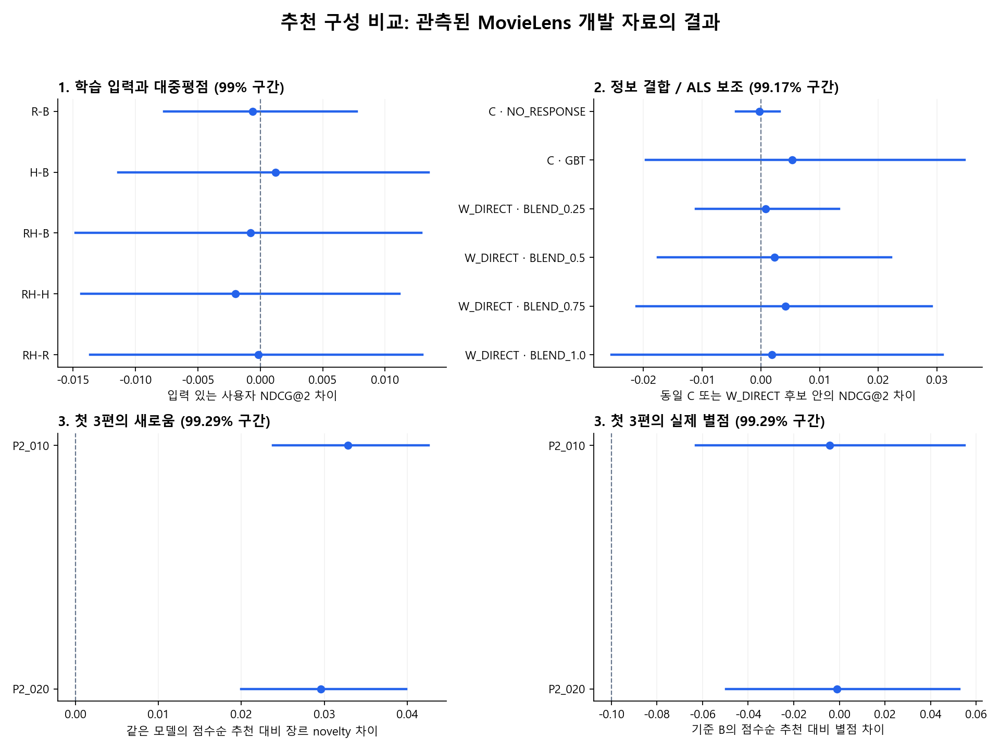

# 추천 시스템 비교 — 3단계 최종 정리

상태: DRAFT — 독립 검산한 로컬 연구 결론이며 서비스 구현 계약은 아니다.

이번 개발 비교의 후속 추천안은 **1단계에서 고정한 FM**, 정책은 **연결 장르·새로움 .10·예측손실 제한의 발견 교체**다.
앞 단계의 입력 구성은 **기존 대중평점·기존 학습이력**다. 후보 자격이 없으면 기존 구성을 유지하는 사전 규칙을 적용했다.
여기서 유지는 개발 비교 기준의 유지다. 전체 카탈로그의 실제 만족도를 검증하지 못했으므로 서비스 채택 판단은 보류한다.

기초 모델은 TMDB의 장르·키워드·국가/언어·감독·배우·시대/상영시간·대중 지표 등과,
사용자가 입력한 별점에서 만든 반응 및 근거량을 230개 특징으로 사용했다.
줄거리·Wikipedia 텍스트는 앞선 [텍스트 비교](../text339/README.md)와 [정제 비교](../text339-clean/README.md)에서
이번 기준 모델의 개선안으로 선정되지 않아 추가하지 않았다. 텍스트의 가능성 전체를 기각한 결론은 아니다.

| 판단 | 결과 |
|---|---|
| 1. 기준 모델 정리 | B: 기존 대중평점·기존 학습이력 |
| 2. 정보 결합·ALS 보조 | 1단계에서 고정한 FM |
| 3. 맞춤·발견 정책 | 연결 장르·새로움 .10·예측손실 제한의 발견 교체 |
| 공통 관측후보 Top2 | B 0.8471 → 최종 0.8471 (NDCG, 입력 있는 176명) |
| 전체270명: 전체 후보 첫3편의 채점 가능성 | 810슬롯 중 관측별점 104, UNKNOWN 706 |

이 중 **개인 입력이 있는186명의 첫3편558슬롯은 모두 UNKNOWN**이다. 위 전체270명 수치의
관측별점104개는 입력이 없는84명에서만 나왔으므로 개인화 추천의 품질 근거로 사용할 수 없다.

**숫자가 높은 순서와 개선을 확인한 것은 다르다.** 아래 구간과 사전 자격 기준으로 판단했고,
전체 후보 UNKNOWN은 낮은별점으로 간주하지 않았다. ALS가 직접 점수를 못 내는 행의 혼합은 콘텐츠와 정확히 같다.

1단계는 같은39,859명·4,997,069개 목표 별점을 사용했다. 학습 이력만 바꾸면 입력0 목표가82.34%에서21.04%로 줄었다.
대중평점 보정과 이력 변경을 분리하려고 기준 모델도 다시 학습하고, 네 조건의 실제 Spark 행 배정과 순서를 맞췄다.

| 조건 | 관측후보 Top2 NDCG | 추천2편 평균별점 | 낮은별점 비율 | 전체후보 Top2: 투표1개·10점 노출 | 전체후보 Top2: UNKNOWN |
|---|---:|---:|---:|---:|---:|
| B: 기존 대중평점·기존 학습이력 | 0.8471 (176명) | 3.868 (176명) | 5.40% (176명) | 342/372 | 372/372 |
| R: 대중평점 근거량 보정 | 0.8465 (176명) | 3.862 (176명) | 5.40% (176명) | 0/372 | 370/372 |
| H: 목표시각 이전 학습이력 | 0.8484 (176명) | 3.874 (176명) | 5.68% (176명) | 322/372 | 372/372 |
| RH: 두 변경 결합 | 0.8464 (176명) | 3.862 (176명) | 5.97% (176명) | 0/372 | 370/372 |

마지막 두 열은 입력이 있는186명의 전체 카탈로그 추천372슬롯이다.
평가 1개로 평균10점인 영화의 노출 감소만으로 추천 품질이 좋아졌다고 판정하지 않는다.

2단계에서 **C는 학습평점을 일부러 가린 영화**, **W_DIRECT는 실제 ALS로 점수를 만들 수 있는 영화**다.
각 행은 그 집단의 동일 후보에서 S와 비교한 값이며, C와 W의 숫자로 두 집단의 우열을 판단하지 않는다.

| 대조 | 후보 집단 | 유효 인원 | NDCG2 차이 | 명목99.17% 구간 | 후속 후보 자격 |
|---|---|---:|---:|---|---|
| NO_RESPONSE−S | C | 110명 | -0.000225005 | [-0.00421299, 0.00319622] | 미통과 |
| GBT−S | C | 110명 | 0.00538035 | [-0.0195572, 0.0346487] | 미통과 |
| BLEND_0.25−S | W_DIRECT | 165명 | 0.000825948 | [-0.0110816, 0.0133426] | 미통과 |
| BLEND_0.5−S | W_DIRECT | 165명 | 0.0023735 | [-0.0174921, 0.0222247] | 미통과 |
| BLEND_0.75−S | W_DIRECT | 165명 | 0.0041993 | [-0.0211259, 0.0290855] | 미통과 |
| BLEND_1.0−S | W_DIRECT | 165명 | 0.00186168 | [-0.025435, 0.0309571] | 미통과 |

3단계는 맞춤2편을 유지하고 발견1편을 교체했다. 적합한 발견이 없으면 맞춤3편을 반환하며,
이 fallback도 첫3편 평가에 포함했다. 새로움은 같은 모델의 P0, 별점 손실은 최초 기준 B의 P0와 비교했다.

최종 모델−B의 Top2 NDCG 차이는 **0 [0, 0]**다(176명, 명목99.29% 구간).
이 1개와 아래 정책별 3개씩을 묶어 7대조를 보정했다. 각 셀은 차이 [하한, 상한]이다.
새로움 하한>0, 별점 하한≥−0.1점, 낮은별점 증가 상한≤3%p와 입력0 사용자의 점추정 기준을 함께 적용했다.

| 정책 | 첫3편 novelty 차이 | 실제 별점 차이 | 낮은별점 비율 차이 | 입력0 84명: 별점 / 낮음 차이 | 발견 후보 자격 |
|---|---:|---:|---:|---|---|
| P2_010 | 0.0328494 [0.0238063, 0.0425797] | -0.00421941 [-0.0628428, 0.0548523] | -0.21097 [-1.89873, 1.47679]%p | 0.000점 / 0.00%p (통과) | 통과 |
| P2_020 | 0.0295613 [0.0199703, 0.0398755] | -0.00105485 [-0.0495781, 0.0527426] | -0.21097 [-1.47679, 1.05485]%p | 0.000점 / 0.00%p (통과) | 통과 |

정책 주평가는 입력이 있는158명이며 모델 Top2의176명과 다르다. 실제 발견을 받은 경우만의 품질은 별도 기술통계다.
`first_slot_discovery_*`는 첫 묶음의3번째 슬롯, `discovery_*1/2/3`은 세 묶음에서 실제 반환된 발견의 앞N편이다.
**[Top2·4·6·10, 전체3·6·9편, 맞춤·발견별 비교 표](DETAILS.md)**에서 편수별 값과 각 분모를 볼 수 있다.

새 학습은 총7회(FM5·GBT1·ALS1)다. 시간이 기록된6회의 학습 함수 시간 합계는135.3분이다.
B는 학습·예측 저장 뒤 메모리 계측 오류가 나서 보존된 모델을 재학습 없이 복구했다.
B의 학습시간·학습 RMSE·최고 메모리는 미확보다([복구 기록](../foundation340/RUNTIME-RECOVERY.md)).
엄격12GiB 메모리 예외 모델: H, RH.
최고 메모리·엄격 준수 여부를 확인하지 못한 모델: B.
정책 timing.csv는 캐시 로드·프로필 계산을 뺀 순위 처리 시간이다. 모델 비용과 합쳐 종단 지연이라고 주장하지 않는다.

이 결과는 이미 사용한 MovieLens 개발 표본·조건당 한 번의 학습·현재 TMDB에 대한 판단이다.
보정구간도 앞 단계의 모델 선택 불확실성이나 학습 무작위성까지 보정하지 않는다.
2026년 한국 사용자, 최신작의 실제 만족도, 장르 novelty가 원하는 발견인지까지 검증한 것은 아니다.
새 최종 test나 서비스 채택으로 표현하지 않는다. Jira·GitLab·운영 설정은 변경하지 않았다.

실행과 상세 수치는 [1단계](../foundation340/EXECUTION.md), [2단계](../combination340/EXECUTION.md),
[3단계](../policy341/EXECUTION.md), [학습 비용](runtime.csv)을 따른다. 원본·모델·예측·검토 봉인은 로컬에 보존했다.
