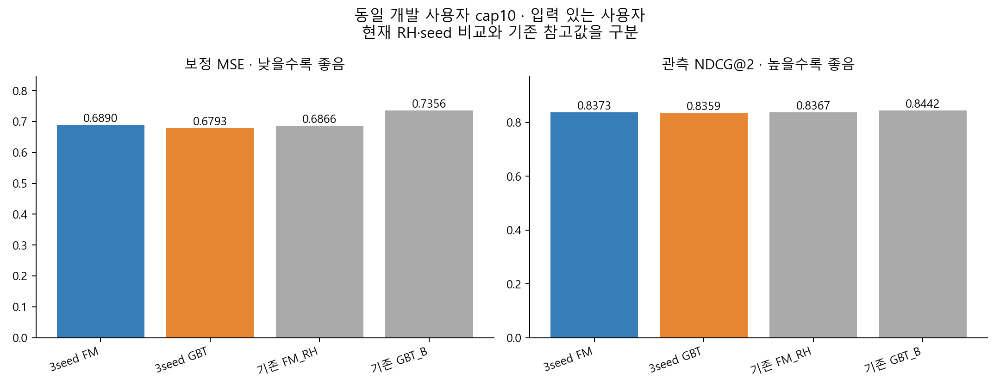

# 최종 FM·GBT 비교 결과

**모든 기준에서 앞서는 단일 모델은 확인되지 않았다.**

이번 실험은 같은 RH 입력 4,997,069행·39,859명·230개 특징을 사용했다. 보정90명과 설정 선택·개발 비교180명을 분리했다.
설정 선택은 seed339에서 했다. 선택된 설정의339/344/345 결과를 비교했다. 각 사용자 지표를 seed별 계산한 뒤 평균하며 점수를 섞은 앙상블은 아니다.
완료 여부: **True**, 선택된6개 학습의 엄격한 자원 한도 전부 PASS: **False**.

## 설정 선택

| 설정 | 상태 | 보정 MSE | NDCG@2 | 선택 |
| --- | --- | --- | --- | --- |
| FM150_s339 | SUCCESS | 0.6866 | 0.8367 | 선택 |
| FM300_s339 | SUCCESS | 0.7266 | 0.8437 |  |
| GBT60_s339 | SUCCESS | 0.7045 | 0.8289 |  |
| GBT120_s339 | SUCCESS | 0.6786 | 0.8320 | 선택 |

큰 설정이 보정 MSE를 높이지 않고 NDCG@2를 낮추지 않으며 하나라도 엄격히 개선할 때만 선택했다.
충돌·동률이면 작은 설정을 유지한다. 이는 자원 사용을 줄이려는 사전 규칙이며 두 모델의 동등함을 입증한 것은 아니다.

## 같은 개발 사용자에서의 비교

cap10, 실제 입력이 있는 사용자 기준이다. MSE/MAE는 작을수록, NDCG와 선택 별점은 클수록 좋다.
raw는 범위를 제한하지 않은 예측, native는 raw를[0.5,5]로 clip한 예측이다. 보정은 별도90명의 사용자 균등 affine(a+b*x,b≥0)를 적용한 뒤 clip한다.
순위는 항상 raw 점수와 movie_id 오름차순 동점을 사용한다. 실제 입력·정답 별점은0.5단위 그대로이다.
NDCG는 사용자가 평가한 영화들 안에서의 정렬 품질이다. 정확도나 서비스 만족 확률로 읽지 않는다.
MSE·NDCG@2·선택별점은 유효 사용자 수를 각각 표시한다. IDCG=0이면 NDCG는 없지만 선택별점은 관측할 수 있다.
low2는 관측 별점이2점 이하인 비율이며 선택별점과 같은 분모이다.

| 모델 | raw MSE | native MSE | 보정 MSE | 보정 MAE | NDCG@2 | 선택 별점 | low2 | 유효 MSE/NDCG/별점 |
| --- | --- | --- | --- | --- | --- | --- | --- | --- |
| SEED_MEAN_FM | 0.6865 | 0.6865 | 0.6890 | 0.6118 | 0.8373 | 3.8141 | 0.0741 | 124/117/117 |
| SEED_MEAN_GBT | 0.6834 | 0.6834 | 0.6793 | 0.6183 | 0.8359 | 3.8255 | 0.0499 | 124/117/117 |
| REFERENCE_FM_RH | 0.6921 | 0.6921 | 0.6866 | 0.6109 | 0.8367 | 3.8120 | 0.0726 | 124/117/117 |
| REFERENCE_GBT_B | 0.7395 | 0.7395 | 0.7356 | 0.6398 | 0.8442 | 3.8590 | 0.0513 | 124/117/117 |

REFERENCE 모델은 기존 단일 학습 참고값이다. 새 공통 RH·3seed 비교와 같은 재학습 조건이 아니다.
같은seed339의 새 FM150은 기존 FM_RH의93,230개 예측 중93,230개를 정확히 재현했다.
최대 예측 차이는0이다. 이는 재현성 확인이며 새 품질 개선이라는 뜻은 아니다.

## 학습 지원과 미지원 영화

| 영화 집합 | 모델 | 보정 MSE | MSE 사용자 | NDCG@2 | Top2 사용자 |
| --- | --- | --- | --- | --- | --- |
| W_DIRECT | SEED_MEAN_FM | 0.7198 | 122 | 0.8363 | 109 |
| W_DIRECT | SEED_MEAN_GBT | 0.7143 | 122 | 0.8428 | 109 |
| W_DIRECT | REFERENCE_ALS | 0.6938 | 122 | 0.8333 | 109 |
| C | SEED_MEAN_FM | 0.7486 | 97 | 0.8911 | 72 |
| C | SEED_MEAN_GBT | 0.7287 | 97 | 0.8885 | 72 |
| NATURAL_ZERO | SEED_MEAN_FM | 0.7112 | 40 | 0.8424 | 23 |
| NATURAL_ZERO | SEED_MEAN_GBT | 0.7249 | 40 | 0.8490 | 23 |

W_DIRECT는 실제 ALS 점수를 계산할 수 있는 같은 영화 집합이다. C는 전역 학습 평점·이력에서 제외한 영화,
NATURAL_ZERO는 원래 학습 평점이 없는 영화이다. ALS가 계산하지 못하는 영화에 임의 점수를 채우지 않았다.
전체 카탈로그의 새 영화 점수 계산 가능성과 실제 추천 품질 검증을 구분한다.

## 사전 네 비교와 불확실성

차이는 GBT−FM이다. MSE는 음수, NDCG@2는 양수 방향이 GBT에 유리하다.
완료·표본 조건을 만족하면98.75% 사용자 paired bootstrap CI를 각각 사용한다(20,000회, seed344, 최소30명).

| 집합 | 지표 | 사용자 | 차이 | 98.75% CI | seed 방향 일치 |
| --- | --- | --- | --- | --- | --- |
| ALL | calibrated_mse | 124 | -0.00968131 | [-0.0438653, 0.0175267] | True |
| ALL | ndcg2 | 117 | -0.00140001 | [-0.0277317, 0.025242] | False |
| C | calibrated_mse | 97 | -0.0199155 | [-0.0640033, 0.0163231] | True |
| C | ndcg2 | 72 | -0.0026269 | [-0.0222212, 0.0159609] | False |

고정된 학습·보정기와 재사용한 개발 사용자를 조건으로 한 구간이다. 학습 seed 전체 불확실성이나 새 평가 사용자에 대한 구간이 아니다.
유의하지 않음을 동등함으로 해석하지 않는다. 네 CI가 모두0을 제외하고 ALL과 C의 두 지표가 같은 모델에 유리할 때만 일관된 개선을 주장한다.

## 2편씩 이어지는 관측 추천

세 페이지 모두 관측 영화가 있는 J≥6 동일 사용자 집합이다. 전체 카탈로그 만족도와는 구분한다.

| 모델 | 페이지 | 사용자 | 선택 별점 | 4점 이상 | 2점 이하 | 두 편 모두2점 이하 |
| --- | --- | --- | --- | --- | --- | --- |
| SEED_MEAN_FM | 1–2 | 91 | 3.7985 | 0.5971 | 0.0788 | 0.0220 |
| SEED_MEAN_FM | 3–4 | 91 | 3.7280 | 0.5293 | 0.0549 | 0.0183 |
| SEED_MEAN_FM | 5–6 | 91 | 3.6749 | 0.4963 | 0.0421 | 0.0000 |
| SEED_MEAN_GBT | 1–2 | 91 | 3.8187 | 0.5788 | 0.0458 | 0.0147 |
| SEED_MEAN_GBT | 3–4 | 91 | 3.7106 | 0.5403 | 0.0586 | 0.0147 |
| SEED_MEAN_GBT | 5–6 | 91 | 3.7015 | 0.5256 | 0.0604 | 0.0110 |

## 전체 후보 노출

같은85,517편에서 고정 snapshot의 개봉 가능 영화와 기존 감상 제외를 적용했다. 임의100/500개 후보를 만들지 않았다.
cap10의 입력 있는 사용자에게 첫2편을 표시한 결과이며 seed별로 제시한다. UNKNOWN은 기록된 평가가 없다는 뜻이며 싫어한다는 뜻이 아니다.

| 모델·seed | 표시 | UNKNOWN | 투표1개·10점 | 서로 다른 영화 | HHI | 학습지원0 |
| --- | --- | --- | --- | --- | --- | --- |
| FM150_s339 | 248 | 248 | 0 | 34 | 0.1108 | 65 |
| FM150_s344 | 248 | 248 | 0 | 31 | 0.1279 | 73 |
| FM150_s345 | 248 | 248 | 0 | 33 | 0.1166 | 53 |
| GBT120_s339 | 248 | 245 | 0 | 133 | 0.0184 | 37 |
| GBT120_s344 | 248 | 239 | 0 | 120 | 0.0184 | 65 |
| GBT120_s345 | 248 | 242 | 0 | 182 | 0.0082 | 67 |

전체 점수는 사용자별 catalog-cache에 보존했다. 누적Top4/6과 다음2편의 노출은 catalog-summary.csv에 있다.

## 실행 비용

| 학습 | 수치 결과 | 자원 | fit 분 | peak GiB | 한도 초과 byte | 관측 완료 반복/트리 |
| --- | --- | --- | --- | --- | --- | --- |
| FM150_s339 | SUCCESS | EXCEPTION | 45.5 | 12.0000 | 4,096 | 관측 불가 |
| FM150_s344 | SUCCESS | PASS | 42.1 | 12.0000 | 0 | 관측 불가 |
| FM150_s345 | SUCCESS | EXCEPTION | 42.8 | 12.0000 | 8,192 | 관측 불가 |
| FM300_s339 | SUCCESS | EXCEPTION | 85.9 | 12.0000 | 4,096 | 관측 불가 |
| GBT120_s339 | SUCCESS | EXCEPTION | 30.4 | 12.0000 | 4,096 | 120 |
| GBT120_s344 | SUCCESS | EXCEPTION | 31.1 | 12.0000 | 4,096 | 120 |
| GBT120_s345 | SUCCESS | EXCEPTION | 30.3 | 12.0000 | 4,096 | 120 |
| GBT60_s339 | SUCCESS | PASS | 14.9 | 12.0000 | 0 | 60 |

FM maxIter는 상한이며 실제 완료 반복 수가 기록되지 않으면 관측 불가로 둔다. GBT는 native 트리 수이다.
자원 EXCEPTION/UNKNOWN을 수치 열등으로 취급하지 않는다. 실패·시간 초과는 보존하며 재시도하지 않았다.

| 모델 | 시간 항목 | p50초 | p95초 | native MiB |
| --- | --- | --- | --- | --- |
| FM150_s339 | prediction_seconds | 0.082 | 0.090 | 0.03 |
| FM150_s339 | component_total_seconds | 0.633 | 0.658 | 0.03 |
| FM150_s344 | prediction_seconds | 0.082 | 0.090 | 0.03 |
| FM150_s344 | component_total_seconds | 0.633 | 0.657 | 0.03 |
| FM150_s345 | prediction_seconds | 0.082 | 0.089 | 0.03 |
| FM150_s345 | component_total_seconds | 0.634 | 0.657 | 0.03 |
| GBT120_s339 | prediction_seconds | 0.394 | 0.424 | 0.38 |
| GBT120_s339 | component_total_seconds | 0.951 | 0.989 | 0.38 |
| GBT120_s344 | prediction_seconds | 0.380 | 0.415 | 0.38 |
| GBT120_s344 | component_total_seconds | 0.934 | 0.977 | 0.38 |
| GBT120_s345 | prediction_seconds | 0.390 | 0.416 | 0.38 |
| GBT120_s345 | component_total_seconds | 0.944 | 0.984 | 0.38 |

component_total은 공유 특징 생성+개별 예측+정렬 시간의 합이다. 모든 선택 모델을 함께 적재한 로컬 runner에서 측정했고,
초기화·파일 I/O·API 요청 비용은 제외한다. 실제 단독 운영 지연시간이나 다중 노드 확장성 수치는 아니다.

## 해석 범위와 남는 판단

사용자·영화 균등 오차, cap0/1/5/10/30, 실제 입력 수·활동량·메타데이터 누락·개봉 시기·평가 수별 결과,
보정 구간과 오차 꼬리, 실제 입력 대 빈 입력의 비교도 별도 CSV/Parquet에 남겼다.
학습은 행 가중치1이다. 상위1%인399명이 학습행의12.84%를 차지한다. 평가 때 사용자를 같은 비중으로 보는 것만으로 학습 기여 편향이 없어지지는 않는다.

**이번180명은 이미 사용한 개발 사용자다.** 미사용 신규 표본을 입증하지 못해 DEVELOPMENT_ONLY로 완료했다.
MovieLens의 과거 해외 평가와 최신 TMDB·2026년 한국 서비스의 차이는 남는다. 이 결과만으로 서비스 만족도나 전환K를 확정하지 않는다.
K-means·분류 기반 맞춤/발견 정책, ALS 혼합, 새 특징 추가는 이번 비교에 포함하지 않았다.

## 재현 자료

- [승인 설계](../../plans/final-fm-gbt/README.md), [실행 명세](IMPLEMENTATION.md)
- 입력·fit·선택·보정·평가·전체 후보 봉인: `outputs/recommendation-evidence/final344/`
- 세부 평점/순위: `summary.csv`, `seed-mean-summary.csv`, `movie-metrics.csv`, `page-summary.csv`
- 그룹·보정·개인화: `support-metadata-metrics.csv`, `calibration-bins.csv`, `personalization-summary.csv`
- 독립 검토와 가용성 감사는 각 final344 감사 폴더에 보존한다. 이 문서의 수치·그림은 완료 후 독립 검토 대상이다.
