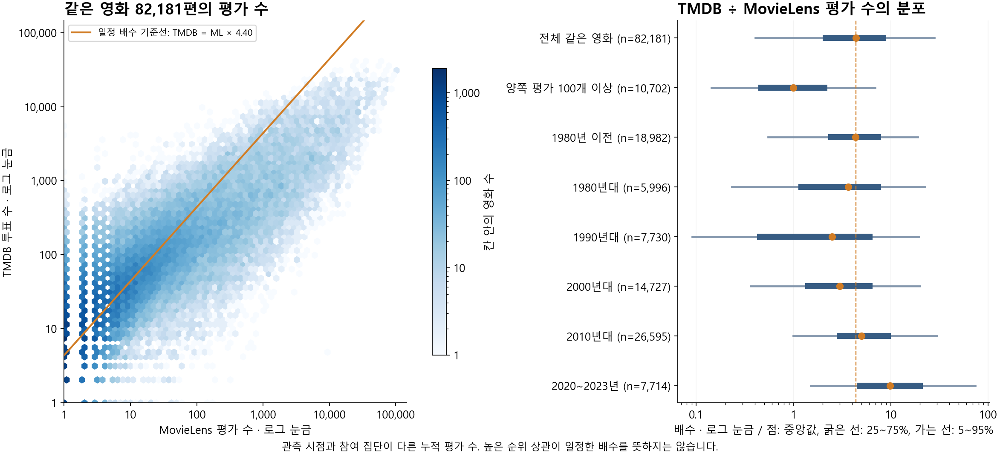
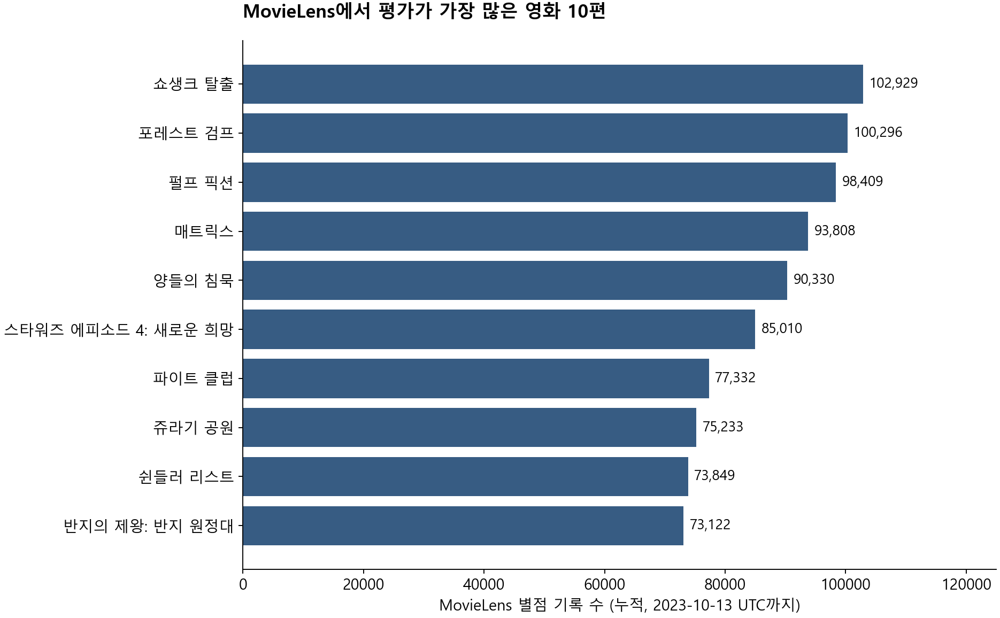
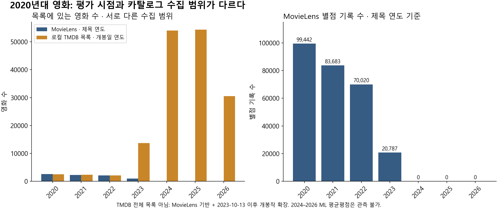

# 추천 모델 선정 — 발표용 정리

상태: **DRAFT · 검증된 개발 실험에 근거한 구현 선정안**  
범위: final344·hybrid345 모델 비교와 MovieLens·보유 TMDB 카탈로그의 데이터 분포.
팀의 공식 채택·구현·배포 완료 기록은 아니다. 데이터 배경 추가: 2026-09-13.

> **현재 대중성 처리 설계는 [대중성 v2](../../service-popularity-v2-20260913/README.md)를 먼저 읽는다.**
> TMDB·KOBIS 후보 결합뿐 아니라 GBT 입력·결측 학습·ALS 결합 비교까지 새로 설계했다.
> 새 학습·성능 검증은 아직 수행하지 않았다. K별 전환·갱신·8맛×128그룹·2편씩 제공 등은
> [맞춤·발견 A–Z v1](../../service-final-20260913/README.md)을 이어받으며, v1의 대중성 처리는 v2가 대체한다.
> 아래 모델 선정 문장은 hybrid345 당시의 ALS 가능/불가능 Router 결론이다.
> 후속 설계의 검증 결과로 바꿔 읽지 않는다. 과거 비교 수치와 봉인은 유지했다.
> [KOBIS·TMDB·MovieLens 비교와 그림](../../service-final-20260913/KOBIS-DATA.md)도 추가했다.

## 발표의 핵심 문장

> ALS, FM, GBT, 콘텐츠 유사도와 결합 방식을 같은 평가 조건에서 비교했습니다.
> ALS가 점수를 계산할 수 있는 영화에서는 ALS의 별점 제곱오차가 가장 낮았습니다.
> ALS가 계산하지 못하는 영화에서는 FM·GBT가 유력했고, 콘텐츠 및 ALS 벡터 전이 방식은
> 사전에 정한 교체 기준을 통과하지 못했습니다.
> 따라서 별점 오차와 추천 가능한 영화 범위를 함께 고려해, ALS가 계산 가능한 경우에는
> ALS를 유지하고 미지원 경우에는 GBT로 보완하는 구현안을 선정했습니다.
> 이 선택은 여러 지표의 절충에 따른 설계 판단이며, 모든 지표에서 가장 좋은 모델이라는 뜻은 아닙니다.

현재는 **“구현안을 선정했다”**가 정확하다. 팀이 이 구성을 확정하면
**“추천 구조로 채택했다”**로 표현할 수 있다. 서비스 적용 완료는 실제 구현·연동 확인 후에 쓴다.

## 핵심 데이터 비교 — 평가 수가 단지 일정 배수로 다른가

**그렇지 않았다. 평가가 많은 영화의 순서는 함께 움직이는 경향이 있지만,
영화별 평가 수의 차이를 하나의 배수로 설명하기는 어렵다.**

연결이 명확하고 양쪽 모두 평가가 있는 **동일 영화 82,181편**에서, 각 영화의
**`TMDB 투표 수 ÷ MovieLens 평가 수`**를 계산했다. 1배보다 작으면 MovieLens 쪽 평가가
많고, 1배보다 크면 TMDB 쪽 투표가 많다. 어느 쪽에도 없는 평가를 0으로 채우지 않았다.

| 비교 집합 | 같은 영화 수 | 영화별 배수 중앙값 | 배수의 5~95백분위 범위 |
| --- | ---: | ---: | ---: |
| 전체 공통 평가 영화 | 82,181 | **4.40배** | **0.41~28.00배** |
| 양쪽 평가가 모두 100개 이상 | 10,702 | **1.00배** | **0.14~6.93배** |
| 한국 제작 영화 | 1,164 | 6.43배 | 1.47~34.97배 |
| 2020~2023년작 | 7,714 | 9.83배 | 1.50~73.87배 |

각 행은 별도의 부분집합이며 서로 겹치므로 영화 수를 더하지 않는다. 연도는 MovieLens
제목 연도, 한국 제작은 TMDB 제작국 `KR` 포함 기준이다. 범위는 영화별 비율의 분포이며
평균의 신뢰구간이 아니다.

평가 수 순위의 **Spearman 상관은 0.781**이었다. 이는 한쪽에서 많이 평가된 영화가
다른 쪽에서도 많이 평가되는 경향을 뜻한다. **각 영화의 평가 수가 일정 배수라는 뜻은 아니다.**
전체 중앙값 4.4배를 중심으로 넓게 잡은 **2.2~8.8배 범위에도 47.25%**만 들어갔다.
이 허용폭은 분포를 읽기 위한 기준이며 통계적 동등성 판정 기준은 아니다.

양쪽 모두 100개 이상 평가된 영화로 한정해도 그 집합의 중앙값 약 1배 주변
0.5~2배 범위에 들어가는 영화는 약 43.12%였다. **평가가 몇 개뿐인 영화의 분모 문제만으로
전체 차이를 설명하기도 어렵다.** 정확한 계산 범위는 해당 중앙값의 0.5~2배다.

### 실제 영화로 보면 차이가 더 분명하다

| 영화 | MovieLens 평가 수 | TMDB 투표 수 | TMDB ÷ MovieLens |
| --- | ---: | ---: | ---: |
| 쇼생크 탈출 | 102,929 | 31,244 | 0.30배 |
| 올드보이 | 17,331 | 10,161 | 0.59배 |
| 기생충 | 11,670 | 21,242 | 1.82배 |
| 헤어질 결심 | 335 | 1,609 | 4.80배 |
| 범죄도시 2 | 26 | 458 | 17.62배 |
| 범죄도시 3 | 6 | 565 | 94.17배 |

이 표는 차이를 설명하는 사례이며 전체를 대표하는 표본이 아니다. 전체 82,181편의
분포와 양쪽 100개 이상 조건을 함께 확인했다. 범죄도시 3처럼 분모가 작은 사례는 특히
변동이 크므로 그 한 편만으로 결론 내리지 않는다.

2020·2021·2022·2023년작의 **영화별 배수 중앙값은 각각 7.75·9.00·11.26·19.00배**였다.
MovieLens 평가가 1~9개인 집합의 중앙값은 6.00배, 1,000개 이상인 집합은 0.45배였다.
다만 평가량으로 집단을 나누는 것은 비율의 분모로 조건을 거는 것이므로 독립적인 원인
분석이 아니다. 연도 차이도 자료 종료 시점·관측 기간·참여 집단의 영향을 분리한 결과가 아니다.

공통 영화의 **전체 평가 수를 합산한 비율은 0.787배**로, 영화별 중앙값 4.40배와 다르다.
합산하면 MovieLens 평가가 매우 많은 영화에 가중치가 크게 실리기 때문이다.
따라서 전체 서비스 규모의 비율 하나만으로 영화별 관측량을 비교하면 중요한 차이를 놓친다.

발표 문장: **“MovieLens와 TMDB의 평가 수는 양의 상관이 있지만, 같은 영화라도 그 비율이
크게 달랐습니다. 단순한 이용자 규모 차이만으로 환산하기 어려우므로, MovieLens 평가량을
현재 영화의 보편적인 인기나 근거량과 같은 것으로 해석하지 않았습니다.”**

여기서 비교한 것은 서로 다른 시점의 누적 평가 수다. 이 차이를 한국과 해외의 취향 차이로
확정하거나, 측정한 배수를 미래 영화에 적용할 보정계수로 채택한 것은 아니다.
[전체 집단별 배수·상관·포함률](data-context/count-ratio/count-ratio-summary.csv)과
[독립 검토·계산 정의](data-context/README.md#평가-수-배수-추가-비교)를 함께 보존했다.

## 데이터 배경 1 — MovieLens에서 인기 있는 영화는 무엇인가

여기서 **인기 = MovieLens 별점 기록 수**다. 평균별점 순위, 한국 흥행 순위, TMDB의
`popularity` 점수와는 다른 기준이다. 평가 수 내림차순 상위 5편은 다음과 같다.

| 영화 | 개봉연도¹ | MovieLens 평가 수 | MovieLens 평균 / 5 | TMDB 투표 수 | TMDB 제공 평점 / 10 |
| --- | ---: | ---: | ---: | ---: | ---: |
| 쇼생크 탈출 | 1994 | 102,929 | 4.405 | 31,244 | 8.730 |
| 포레스트 검프 | 1994 | 100,296 | 4.053 | 30,386 | 8.463 |
| 펄프 픽션 | 1994 | 98,409 | 4.197 | 30,803 | 8.481 |
| 매트릭스 | 1999 | 93,808 | 4.156 | 28,653 | 8.257 |
| 양들의 침묵 | 1991 | 90,330 | 4.148 | 18,441 | 8.345 |

¹ MovieLens 제목의 연도. 개인의 입력 별점은 0.5 단위지만 **여러 사람의 평균은 소수 셋째
자리로 표시**했다. TMDB 값은 보유 스냅샷의 누적값이며 현재 실시간 조회값이 아니다.

**상위 10편 중 9편이 2000년 이전 작품**이다. 전체 87,585편 중 평가 수 상위 1%인
876편에 전체 평가의 **55.76%**가 몰려 있다. 1990·2000년대 작품은 영화 수의 27.06%지만
평가의 61.47%를 차지한다. 전체 평균 모델 성적에는 이런 작품들의 영향이 크게 들어간다.

발표 문장: **“3,200만 개의 평점이 모든 영화에 고르게 쌓인 것은 아닙니다.
평가가 많은 과거 영화와 최신·희소 영화의 성능을 구분해 보았습니다.”**

## 데이터 배경 2 — 한국 영화의 평점 근거는 얼마나 있는가

한국 영화는 **TMDB 제작국에 `KR`이 포함된 작품**으로 정의했다. 공동제작을 포함하고,
한국어 영화나 한국에서 인기 있는 영화 전체를 뜻하지 않는다. 아래는 그중 MovieLens 평가가
많은 상위 6편이다. 애니매트릭스처럼 공동제작으로 포함되는 작품도 제외하지 않았다.

| 영화 | 개봉연도 | MovieLens 평가 수 | MovieLens 평균 / 5 | TMDB 투표 수 | TMDB 제공 평점 / 10 |
| --- | ---: | ---: | ---: | ---: | ---: |
| 올드보이 | 2003 | 17,331 | 4.089 | 10,161 | 8.234 |
| 기생충 | 2019 | 11,670 | 4.312 | 21,242 | 8.490 |
| 설국열차 | 2013 | 8,582 | 3.541 | 10,645 | 6.910 |
| 애니매트릭스 | 2003 | 5,265 | 3.655 | 1,835 | 7.200 |
| 부산행 | 2016 | 3,201 | 3.836 | 8,682 | 7.750 |
| 살인의 추억 | 2003 | 2,860 | 4.048 | 4,786 | 8.062 |

보유 서비스 카탈로그의 해당 한국 제작 영화는 **3,621편**이고, MovieLens에 모호함 없이
연결되는 영화는 **1,172편**이다. 이 집합의 MovieLens 평가 **106,726개**는 전체
32,000,204개 평가의 **0.33%**다. 영화당 평가 수 중앙값은 **7개**, 10개 미만은
**672편(57.34%)**이다. 평가가 0개인 8편도 이 분모에 포함했다.

**올드보이·기생충 두 편이 이 한국 영화 평가의 27.17%를 차지한다.** 같은 집합도 평점
기록마다 동일 가중치를 주면 평균 3.771점, 평가가 있는 영화 1,164편에 각각 동일 가중치를
주면 평균 3.207점이다. 어떤 평균인지에 따라 숫자가 달라진다.

발표 문장: **“일부 한국 영화에는 평가가 충분하지만, 확인한 한국 영화 전체의 근거는
적고 몇 작품에 집중돼 있습니다. 이 결과를 한국 사용자 전체의 취향으로 해석하지 않았습니다.”**

이 한국 영화 수치는 이번 서비스 스냅샷의 제작국 기준이다. 과거 Discover 원산국 기준
1,056편이나 다른 메타데이터 스냅샷의 집계와 혼용하지 않는다. TMDB 이용자도 한국인만이
아니므로 두 서비스의 평점 차이를 ‘한국인 대 해외 사용자’의 취향 차이로 읽을 수 없다.

## 데이터 배경 3 — 2020년대 영화에서 MovieLens와 TMDB는 어떻게 다른가

MovieLens 32M의 실제 별점 기록은 **1995-01-09~2023-10-13 UTC**다. 비교에 쓴 TMDB는
**2026-09-09 DB export 기준의 보유 카탈로그 237,817편**이며 9월 12일 확보했다.
영화별 정확한 수집 시각은 이 스냅샷에서 확인되지 않는다.

이 TMDB 목록은 **MovieLens 기반 영화 + 2023-10-13~2026-09-07 개봉작 확장**으로
수집했다. TMDB 전체 목록이 아니며, 연도별 크기 차이에는 이 수집 설계도 반영돼 있다.

| 개봉연도² | MovieLens 영화 수 | MovieLens 별점 기록 수 | 보유 TMDB 등록 영화 수 | 그중 유효 평점이 있는 영화 |
| --- | ---: | ---: | ---: | ---: |
| 2020 | 2,629 | 99,442 | 2,489 | 2,441 |
| 2021 | 2,314 | 83,683 | 2,363 | 2,314 |
| 2022 | 2,091 | 70,020 | 2,124 | 2,088 |
| 2023 | 952 | 20,787 | 13,742 | 4,720 |
| 2024 | 0 | 0 | 54,009 | 14,133 |
| 2025 | 0 | 0 | 54,356 | 12,789 |
| 2026 | 0 | 0 | 30,576 | 5,823 |

² MovieLens는 제목 연도, TMDB는 `release_date` 연도다. **서로 다른 목록의 분포**이며
같은 영화끼리의 비교표가 아니다. 등록 편수에는 상태·성인 여부 등의 추천 필터를 적용하지
않았으므로 실제 추천 가능한 영화 수와 다르다. TMDB 유효 평점은 평점과 투표 수가 모두
양수이고 원자료 유효성 검사를 통과한 경우다. 투표가 없는 영화를 0점으로 취급하지 않는다.

2020~2023년작의 MovieLens 별점은 **273,932개, 전체의 0.86%**다. 2024~2026년은
MovieLens 관측 기간 밖이므로 평균평점은 **측정 불가**다. 기록 수 0을 싫어한다는 뜻으로
해석하지 않는다. 개봉연도 표기 불일치도 있으므로 TMDB에서 2024년 이후로 표시된 모든
작품이 MovieLens에 없다고 단정하지 않는다.

### 같은 영화만 맞춰 놓고 평점과 평가 수를 비교하면

연결이 명확하고 양쪽 모두 평가가 있는 영화 **7,714편**만 비교했다. 연도는 양쪽 모두
**MovieLens 제목 연도**로 고정했다. 평점은 영화마다 평균을 구한 뒤 각 영화에 동일
가중치를 준 값이다. TMDB는 비교를 돕기 위해 제공 평점을 2로 나눴다.

| 연도 | 같은 영화 수 | MovieLens 영화별 평균 / 5 | TMDB 환산 평균 / 5 (원점수÷2) | 영화당 ML 평가 수 중앙값 | 영화당 TMDB 투표 수 중앙값 |
| --- | ---: | ---: | ---: | ---: | ---: |
| 2020 | 2,521 | 2.826 | 3.037 | 3 | 32 |
| 2021 | 2,227 | 2.868 | 3.040 | 3 | 33 |
| 2022 | 2,032 | 2.872 | 3.071 | 3 | 44 |
| 2023 | 934 | 2.927 | 3.122 | 2 | 66 |

두 평점은 **척도만 환산**했다. 같은 사용자·시점·집계 방식으로 받은 평점이 아니며,
TMDB 쪽이 높다는 사실이 더 정확한 정답이라는 뜻은 아니다. 양쪽 관측이 있는 영화만
남겼으므로 전체 신작을 대표하는 표도 아니다. 평가 수와 투표 수는 기록 건수이며
연도별로 합산한 고유 사용자 수가 아니다.

발표 문장: **“최근 영화는 MovieLens에서 영화당 평가 근거가 특히 적고, MovieLens
제목 연도 기준 2024~2026년작은 관측 별점이 없습니다. TMDB로 최신 영화 정보를 확보해 점수 계산 범위를
넓힐 수는 있지만, 그 평점을 개인 추천의 정답으로 대체하지는 않았습니다.”**

이 절은 원자료의 **기술통계**다. 모델 MSE·NDCG를 새로 측정한 결과가 아니며, 아래
final344·hybrid345의 85,517편 모델 비교를 237,817편에서 다시 실행했다는 뜻도 아니다.
원자료 정의·전체 상위 10편 CSV·재현 및 검토 기록은 [데이터 부록](data-context/README.md)에 있다.

## 무엇을 비교했고, 왜 선택했는가

| 판단할 질문 | 비교와 결과 | 선정안 |
| --- | --- | --- |
| ALS 지원 영화에서 무엇을 유지할까? | MSE는 ALS **0.6938**, FM **0.7198**, GBT **0.7143**. 반면 NDCG@2는 ALS **0.8333**, FM **0.8363**, GBT **0.8428** | 별점 오차를 근거로 ALS 유지. Top2까지 ALS가 최고라고 주장하지 않음 |
| ALS에 콘텐츠를 섞을까? | Qwen 비중 0·10·25·50% 비교. 양의 비중은 MSE·NDCG@2 동시 개선 기준을 통과하지 못해 **0% 선택** | 이번 Qwen 점수 혼합 제외 |
| ALS가 모르는 영화는 어떻게 계산할까? | 학습에서 제외한 영화 C에서 MSE: 구조 콘텐츠 **0.8996**, E5 **0.8566**, Qwen **0.8586**, ALS-C2F **0.8241**, FM **0.7486**, GBT **0.7287** | 사전 교체 기준을 통과한 대안이 없어 기존 **GBT120_s339 유지** |
| 두 경로를 합치면 전체 성능도 더 좋을까? | 전체 관측 후보 MSE: Router **0.6645**, FM **0.6890**, GBT **0.6793**. NDCG@2: **0.8340 / 0.8373 / 0.8359**. 사전 대조 신뢰구간은 모두 0 포함 | 역할 분리 경로로 사용 가능한 후보. GBT 단독보다 우수하거나 동등하다고 입증된 것은 아님 |

표의 FM·GBT는 각각 세 학습 seed의 **사용자별 지표 평균**이다. 앙상블 예측이 아니다.
ALS는 기존 단일 학습, Router는 사전에 고정한 seed339 경로다. GBT 한 seed의 유리한 값만
FM 세 seed 평균과 섞어 모델군 승패를 주장하지 않는다.

## FM보다 GBT를 구현 우선 후보로 둔 이유

현재 FEELM의 입력은 영화 정보, 사용자가 그 정보에 보인 반응, 그 반응의 근거량을
정리한 공유 특징 230개다. FM과 GBT 모두 같은 특징과 4,997,069개 학습행을 사용했다.
사용자·영화 ID를 각각 독립 one-hot으로 학습한 전형적인 ID 기반 FM과의 비교는 아니다.

FM은 특징 쌍의 상호작용을 저차원 벡터로 공유해 학습하므로, 사용자·상품·광고·문맥 등
범주가 매우 많고 관측 조합이 드문 추천·클릭 예측에 강점이 있다. GBT는 나무의 조건
분기를 결합하므로, 선호도·근거량·대중 평가 등 정리된 특징의 비선형 조건 조합을
다루는 데 적합하다. 이는 모델 구조의 해석이며, 현재 GBT가 특정 조건을 실제로 학습했다는
설명이나 인과관계의 증명은 아니다. [FM 원 논문](https://www.ismll.uni-hildesheim.de/pub/pdfs/Rendle2010FM.pdf),
[Spark 공식 모델 설명](https://spark.apache.org/docs/4.1.3/ml-classification-regression.html#gradient-boosted-trees-gbts).

실제 선정 근거는 같은 조건의 관측 결과와 운영 비용이다.

| 전체 관측 후보·cap10 | FM150 | GBT120 | 해석 |
| --- | --- | --- | --- |
| MSE↓ | 0.6890 | 0.6793 | GBT가 1.41% 낮음 |
| NDCG@2↑ | 0.8373 | 0.8359 | FM이 근소하게 높음 |
| 관측 Top2의 2점 이하 비율↓ | 7.41% | 4.99% | GBT가 2.42%p 낮음 |
| 전체 카탈로그 Top2 고유 영화 | 31–34편 | 120–182편 | GBT의 노출이 덜 쏠림 |
| 특징 생성·전체 예측·정렬 p50 | 0.633–0.634초 | 0.934–0.951초 | 로컬 runner에서는 FM이 빠름 |

앞의 세 행은 세 seed의 사용자별 지표 평균이며 MSE 124명, Top2 지표 117명이다.
아래 두 행은 seed별 범위다. 고유 영화 수는 124명×2개 노출의 집중도 진단이며,
대부분 UNKNOWN이므로 만족도나 의미적 다양성의 우월성을 뜻하지 않는다.
속도는 API 지연시간이나 서비스 동시 처리량 측정이 아니다.

> 첫 2편의 저평점 노출과 특정 영화 쏠림을 줄이는 쪽에 우선순위를 두고,
> 정리된 영화·사용자 반응 특징을 사용하는 현재 구조에 GBT를 구현 우선 후보로 선정했습니다.
> FM은 계산비용을 더 줄여야 할 때의 대안으로 남겼습니다.

FM·GBT 모두 새 영화의 특징을 만들 수 있으면 점수를 계산할 수 있다. 사용자 수가 적다는
이유만으로 GBT가 더 정확해지는 것은 아니며, 두 모델 모두 MovieLens에서 학습한 관계를
옮기므로 2026년 한국 사용자에 대한 시점·집단 차이가 남는다. 사전 신뢰구간에서는 단일
승자가 확인되지 않았다. 또한 이 표의 노출 분산 이점을 ALS+GBT Router에 그대로 적용하지 않는다.

## 발표 숫자를 읽는 조건

- 주 조건은 입력 최대 10편(cap10), 실제 입력이 있는 사용자다. 10편 입력을 서비스 필수 조건으로 선정한 실험이 아니다.
- MSE는 별도 사용자로 보정한 예측의 제곱오차이며 낮을수록 좋다. NDCG@2는 관측 별점이 있는 후보 안에서의 순위 지표이며 높을수록 좋다. 정확도 백분율이 아니다.
- 사용자 분모는 MSE / NDCG@2 기준으로 지원 영화 **122 / 109명**, 제외 영화 C **97 / 72명**, 전체 **124 / 117명**이다. 서로 다른 영화 집합의 수치를 직접 빼서 개선율을 만들지 않는다.
- C는 영화의 학습 평점을 의도적으로 모두 제외한 집합이다. ALS는 그 관측 목표 **624행 중 0행**을 계산했고, 기본값을 넣어 비교하지 않았다. 원래 평점이 없는 영화나 2026년 신작 전체의 품질을 이 결과로 보증하지 않는다.

## 질문에 답할 때

**“검증된 실험인가?”**

그렇다. 설계·실행 코드의 독립 검토, 사용자 역할과 영화 제외 조건 확인, 입력·모델·결과 파일의 해시 확인,
원본에서의 독립 재계산을 거쳤다. hybrid345 결과 감사는 PASS이고, 사전 14개 대조를 각각 사용자 bootstrap
20,000회로 계산했다. Top1·2·4·6, 2편 단위 페이지, 저평점 노출과 전체 카탈로그 쏠림도 확인했다.
이는 계산과 명시한 개발 비교의 검증이다. 과거 실험에서 사용했던 사용자와 영화를 재사용했으므로
완전히 미사용한 최종 시험 자료에서 일반화 성능을 확인한 것은 아니다.

**“GBT나 Router가 통계적으로 가장 좋은가?”**

그렇게 확인되지 않았다. GBT의 사전 유지 결정과 전체 단일 승자 판정은 다르다.
ALS는 지원 영화 MSE, GBT는 일부 Top2 지표, FM은 일부 순위·계산비용 측면에 장점이 있다.
Router도 GBT 단독보다 노출이 더 쏠렸다. 전체 Top2 고유 영화는 Router **78편**, GBT_s339 **133편**이다.
이번 선정 이유는 오차와 지원 범위의 절충이다.

**“추가 실험을 해야 하는가?”**

이번 프로젝트에서 사용할 모델 구성을 선택하기 위한 **새 모델 탐색·추가 가중치 탐색은 여기서 종료해도 된다.**
동일 개발 자료에서 실험을 더 늘리는 것을 서비스 적합성의 증명으로 삼지 않는다.
남은 작업은 선택한 모델의 실제 카탈로그·사용자 입력 연결, 빈 입력·지원 없는 입력 처리,
2편씩 중복 없이 반환되는 동작과 실행 환경의 비용·응답 확인이다. 현재 실험만으로 이 연동이 완료됐다고 말하지 않는다.

“2026년 한국 사용자에게 더 좋은 추천” 또는 “미사용 자료에서 통계적으로 우월한 모델”이라고 주장하려면
각 주장에 맞는 새 평가가 필요하다. 이것을 현재 한 달 프로젝트의 모델 선정 완료 조건으로 추가하지 않는다.

## 한계 슬라이드에 넣을 한 문장

> MovieLens 개발 자료로 오차와 순위, 미지원 영화의 점수 계산을 검증했으며,
> 2026년 한국 사용자의 만족도는 별도 검증 범위입니다.

전체 카탈로그 Top2에서 GBT_s339는 **245/248개 노출(98.79%)**, Router는 **248/248개 노출(100%)**에
해당 사용자의 관측 별점이 없었다. 이는 오답률이 아니며, 전체 카탈로그 만족도 점수로 바꿀 수 없다.

## 근거

- [ALS·FM·GBT 같은 영화 비교](../final344/FINAL-DECISION.md)
- [Qwen·ALS-C2F·결합·Router 전체 결과](RESULT.md)
- [사전 고정 설계](DESIGN.md)
- 결과 및 선정 원본: `outputs/recommendation-evidence/hybrid345/summary.csv`, `selection.json`, `primary-contrasts.csv`, `catalog-summary.csv`
- 독립 결과 감사: `outputs/recommendation-evidence/hybrid345/result-audit.json` — **PASS / result_report=MATCH**

이 문서는 봉인된 실험 원문을 변경하지 않고 발표 해석을 정리한 문서다.
