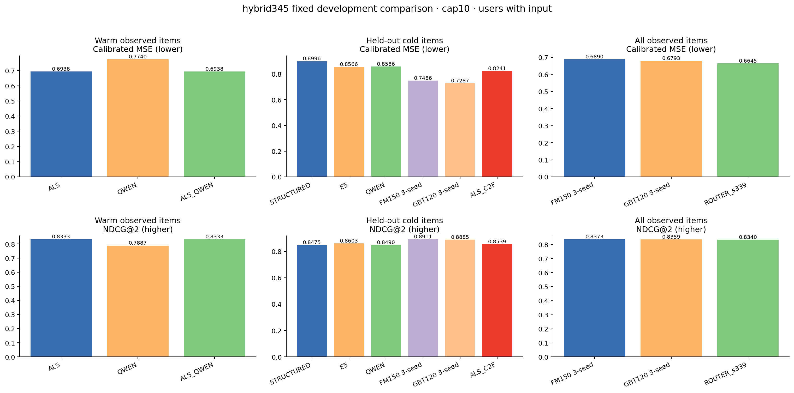

# Qwen 콘텐츠·ALS 결합·cold-item 전이 최종 비교

상태: **DEVELOPMENT_ONLY**  
이 결과는 재사용한 MovieLens 개발 사용자 180명과 고정 영화 집합에서의 비교다. 2026년 한국 서비스 만족도나 배포 정책을 직접 입증하지 않는다.

## calibration에서 고정한 정책

- warm 결합 가중치: **0.0** (`NO_POSITIVE_WEIGHT_PASSED_KEEP_ALS`)
- cold head: **GBT120_s339** (`NO_CHALLENGER_PASSED_KEEP_GBT120_s339`)
- router: warm에서는 위 결합, ALS 직접 점수가 없는 행에서는 cold head, 필수 점수가 없을 때만 GBT120_s339 fallback을 사용했다.
- 설정 선택과 affine 보정은 calibration 90명만 사용했다. comparison 180명의 결과를 본 뒤 가중치나 head를 바꾸지 않았다.

## ALS가 직접 계산되는 W_DIRECT

| 모델 | MSE | MAE | bias | PA | NDCG@1/2/4/6 | 별점@1/2/4/6 | good@1/2/4/6 | low@1/2/4/6 | any low@2 | both low@2 | 유효 MSE / @1/2/4/6 |
| --- | --- | --- | --- | --- | --- | --- | --- | --- | --- | --- | --- |
| ALS | 0.6938 | 0.6235 | 0.0223 | 0.5886 | 0.8301/0.8333/0.8369/0.8403 | 3.7787/3.8280/3.7292/3.6618 | 0.5984/0.5963/0.5391/0.5078 | 0.0656/0.0505/0.0677/0.0678 | 0.0917 | 0.0092 | 122 / 122/109/96/86 |
| QWEN_DIRECT | 0.7740 | 0.6488 | 0.0396 | 0.5213 | 0.7877/0.7887/0.7994/0.8037 | 3.6066/3.6583/3.5964/3.5368 | 0.4918/0.4908/0.4688/0.4477 | 0.0902/0.0688/0.0781/0.0872 | 0.1284 | 0.0092 | 122 / 122/109/96/86 |
| ALS_QWEN | 0.6938 | 0.6235 | 0.0223 | 0.5886 | 0.8301/0.8333/0.8369/0.8403 | 3.7787/3.8280/3.7292/3.6618 | 0.5984/0.5963/0.5391/0.5078 | 0.0656/0.0505/0.0677/0.0678 | 0.0917 | 0.0092 | 122 / 122/109/96/86 |

ALS_QWEN은 ALS와 Qwen을 각 cap의 사용자 균등 affine으로 같은 별점 축에 옮긴 뒤 섞었다. 결합 점수에는 affine을 다시 맞추지 않았다. 순위에는 clip 전 점수, 오차에는 [0.5, 5] clip을 적용했다.

## ALS가 직접 계산되지 않는 C

| 모델 | MSE | MAE | bias | PA | NDCG@1/2/4/6 | 별점@1/2/4/6 | good@1/2/4/6 | low@1/2/4/6 | any low@2 | both low@2 | 유효 MSE / @1/2/4/6 |
| --- | --- | --- | --- | --- | --- | --- | --- | --- | --- | --- | --- |
| STRUCTURED_DIRECT | 0.8996 | 0.7106 | 0.1569 | 0.5830 | 0.8664/0.8475/0.8493/0.8481 | 3.5361/3.4658/3.4000/3.2891 | 0.4536/0.4247/0.4150/0.3229 | 0.1031/0.1027/0.1150/0.1146 | 0.1644 | 0.0411 | 97 / 95/72/49/31 |
| E5_DIRECT | 0.8566 | 0.6844 | 0.1319 | 0.5099 | 0.8560/0.8603/0.8657/0.8553 | 3.5361/3.5685/3.4675/3.3203 | 0.4536/0.4795/0.4500/0.3490 | 0.1031/0.1164/0.1250/0.1250 | 0.1781 | 0.0548 | 97 / 95/72/49/31 |
| QWEN_DIRECT | 0.8586 | 0.6855 | 0.1315 | 0.5571 | 0.8456/0.8490/0.8623/0.8410 | 3.4948/3.5205/3.4850/3.2760 | 0.4227/0.4384/0.4300/0.3385 | 0.1031/0.1233/0.1150/0.1354 | 0.2055 | 0.0411 | 97 / 95/72/49/31 |
| FM150_SEED_MEAN | 0.7486 | 0.6642 | 0.1499 | 0.6176 | 0.8978/0.8911/0.9023/0.9002 | 3.6615/3.6358/3.5708/3.4262 | 0.5086/0.4886/0.4767/0.3872 | 0.0825/0.0685/0.0800/0.0938 | 0.1096 | 0.0274 | 97 / 95/72/49/31 |
| GBT120_SEED_MEAN | 0.7287 | 0.6655 | 0.1216 | 0.6457 | 0.8931/0.8885/0.8962/0.8915 | 3.6529/3.6324/3.5425/3.4062 | 0.5052/0.4954/0.4483/0.3750 | 0.0687/0.0731/0.0867/0.1024 | 0.1187 | 0.0274 | 97 / 95/72/49/31 |
| ALS_C2F | 0.8241 | 0.7006 | 0.0985 | 0.5525 | 0.8659/0.8539/0.8660/0.8600 | 3.5464/3.5137/3.4675/3.3177 | 0.4021/0.4178/0.4250/0.3594 | 0.0722/0.0822/0.1050/0.1250 | 0.1370 | 0.0274 | 97 / 95/72/49/31 |

FM150/GBT120의 `SEED_MEAN`은 seed339·344·345 checkpoint에서 먼저 사용자별 지표를 계산한 뒤 그 세 지표를 평균한 값이다. 예측 점수를 섞은 앙상블이 아니다. E5_DIRECT는 encoder 진단선이며 cold head 선택 후보에서 제외했다. ALS_C2F는 ALS 직접 예측이 아니라 Qwen 콘텐츠에서 ALS item factor 공간을 추정한 점수다.

## 전체 관측 후보와 support-aware router

| 모델 | MSE | MAE | bias | PA | NDCG@1/2/4/6 | 별점@1/2/4/6 | good@1/2/4/6 | low@1/2/4/6 | any low@2 | both low@2 | 유효 MSE / @1/2/4/6 |
| --- | --- | --- | --- | --- | --- | --- | --- | --- | --- | --- | --- |
| FM150_SEED_MEAN | 0.6890 | 0.6118 | 0.0593 | 0.5890 | 0.8333/0.8373/0.8397/0.8454 | 3.8562/3.8141/3.7746/3.7338 | 0.5995/0.5969/0.5700/0.5409 | 0.0484/0.0741/0.0658/0.0586 | 0.1311 | 0.0171 | 124 / 124/117/100/91 |
| GBT120_SEED_MEAN | 0.6793 | 0.6183 | 0.0330 | 0.5679 | 0.8232/0.8359/0.8381/0.8472 | 3.8185/3.8255/3.7754/3.7436 | 0.5753/0.5812/0.5667/0.5482 | 0.0511/0.0499/0.0525/0.0549 | 0.0855 | 0.0142 | 124 / 124/117/100/91 |
| ROUTER_s339 | 0.6645 | 0.6153 | 0.0157 | 0.6090 | 0.8288/0.8340/0.8339/0.8400 | 3.8347/3.8013/3.7637/3.7271 | 0.6210/0.5812/0.5550/0.5275 | 0.0403/0.0470/0.0575/0.0568 | 0.0855 | 0.0085 | 124 / 124/117/100/91 |

ROUTER_s339은 운영 가능한 한 개 점수 경로를 보기 위한 seed339 정책이다. 이를 3-seed 지표 평균과 비교했으므로 학습 seed 불확실성까지 제거한 대조로 해석할 수 없다.

## 사전 고정 14개 대조

차이는 `after − before`다. MSE는 음수, NDCG@2는 양수가 after에 유리하다. warm 2개는 97.5%, cold 8개는 99.375%, router 4개는 98.75% 양측 사용자 paired bootstrap 구간이다. 각 대조·지표는 오름차순 공통 uid를 사용하고 이름에서 SHA-256으로 파생한 독립 PCG64 seed를 썼다.

| family | 비교 | 집합 | 지표 | 사용자 | 차이 | 구간 | 신뢰수준 | 판정 |
| --- | --- | --- | --- | --- | --- | --- | --- | --- |
| warm | ALS_QWEN − ALS | W_DIRECT | mse | 122 | 0.000000 | [0, 0] | 97.500% | NO_CLEAR_DIFFERENCE |
| warm | ALS_QWEN − ALS | W_DIRECT | ndcg2 | 109 | 0.000000 | [0, 0] | 97.500% | NO_CLEAR_DIFFERENCE |
| cold | QWEN_DIRECT − STRUCTURED_DIRECT | C | mse | 97 | -0.040922 | [-0.0799892, -0.00331292] | 99.375% | DETECTED_HARM |
| cold | QWEN_DIRECT − STRUCTURED_DIRECT | C | ndcg2 | 72 | 0.001516 | [-0.0539705, 0.049232] | 99.375% | DETECTED_HARM |
| cold | ALS_C2F − QWEN_DIRECT | C | mse | 97 | -0.034530 | [-0.227311, 0.0782832] | 99.375% | DETECTED_HARM |
| cold | ALS_C2F − QWEN_DIRECT | C | ndcg2 | 72 | 0.004893 | [-0.0478591, 0.0612553] | 99.375% | DETECTED_HARM |
| cold | ALS_C2F − FM150_SEED_MEAN | C | mse | 97 | 0.075475 | [-0.0331508, 0.176031] | 99.375% | DETECTED_HARM |
| cold | ALS_C2F − FM150_SEED_MEAN | C | ndcg2 | 72 | -0.037225 | [-0.0826204, 0.00781682] | 99.375% | DETECTED_HARM |
| cold | ALS_C2F − GBT120_SEED_MEAN | C | mse | 97 | 0.095391 | [-0.0135603, 0.218079] | 99.375% | DETECTED_HARM |
| cold | ALS_C2F − GBT120_SEED_MEAN | C | ndcg2 | 72 | -0.034598 | [-0.0779896, 0.00787007] | 99.375% | DETECTED_HARM |
| router | ROUTER_s339 − FM150_SEED_MEAN | ALL | mse | 124 | -0.024546 | [-0.0862391, 0.0283877] | 98.750% | NO_CLEAR_DIFFERENCE |
| router | ROUTER_s339 − FM150_SEED_MEAN | ALL | ndcg2 | 117 | -0.003298 | [-0.0370102, 0.0330023] | 98.750% | NO_CLEAR_DIFFERENCE |
| router | ROUTER_s339 − GBT120_SEED_MEAN | ALL | mse | 124 | -0.014864 | [-0.0638286, 0.030493] | 98.750% | NO_CLEAR_DIFFERENCE |
| router | ROUTER_s339 − GBT120_SEED_MEAN | ALL | ndcg2 | 117 | -0.001898 | [-0.0317355, 0.0293649] | 98.750% | NO_CLEAR_DIFFERENCE |

판정 집계: `{"DETECTED_HARM": 4, "NO_CLEAR_DIFFERENCE": 3}`. `ONE_METRIC_ADVANTAGE_NO_DETECTED_HARM`은 한 지표의 구간상 이점과 다른 지표에서 검출된 손실이 없다는 제한된 뜻이다. 동등성·비열등성이나 서비스 우위를 입증하지 않는다.

## 2편씩 이어지는 페이지

| 모델 | 페이지 | 유효 사용자 | 평균 별점 | good>=4 | low<=2 | 한 편 이상 low | 두 편 모두 low |
| --- | --- | --- | --- | --- | --- | --- | --- |
| FM150_SEED_MEAN | 1–2 | 117 | 3.8141 | 0.5969 | 0.0741 | 0.1311 | 0.0171 |
| FM150_SEED_MEAN | 3–4 | 100 | 3.7317 | 0.5367 | 0.0550 | 0.0933 | 0.0167 |
| FM150_SEED_MEAN | 5–6 | 91 | 3.6749 | 0.4963 | 0.0421 | 0.0842 | 0.0000 |
| GBT120_SEED_MEAN | 1–2 | 117 | 3.8255 | 0.5812 | 0.0499 | 0.0855 | 0.0142 |
| GBT120_SEED_MEAN | 3–4 | 100 | 3.7183 | 0.5483 | 0.0567 | 0.1000 | 0.0133 |
| GBT120_SEED_MEAN | 5–6 | 91 | 3.7015 | 0.5256 | 0.0604 | 0.1099 | 0.0110 |
| ROUTER_s339 | 1–2 | 117 | 3.8013 | 0.5812 | 0.0470 | 0.0855 | 0.0085 |
| ROUTER_s339 | 3–4 | 100 | 3.7400 | 0.5250 | 0.0650 | 0.1000 | 0.0300 |
| ROUTER_s339 | 5–6 | 91 | 3.6786 | 0.4890 | 0.0549 | 0.0989 | 0.0110 |

## 전체 카탈로그 Top2/4/6 진단

| 모델 | Top-N | 사용자 | 반환/슬롯 | 고유 영화 | coverage | UNKNOWN | HHI | 최대 점유율 | support 0 |
| --- | --- | --- | --- | --- | --- | --- | --- | --- | --- |
| QWEN_DIRECT | 2 | 124 | 248/248 | 224 | 0.002619 | 248 (100.00%) | 0.005268 | 0.020161 | 134 |
| QWEN_DIRECT | 4 | 124 | 496/496 | 427 | 0.004993 | 496 (100.00%) | 0.003211 | 0.014113 | 265 |
| QWEN_DIRECT | 6 | 124 | 744/744 | 635 | 0.007425 | 744 (100.00%) | 0.002244 | 0.010753 | 401 |
| ALS_C2F | 2 | 124 | 248/248 | 38 | 0.000444 | 248 (100.00%) | 0.191175 | 0.338710 | 27 |
| ALS_C2F | 4 | 124 | 496/496 | 63 | 0.000737 | 496 (100.00%) | 0.096319 | 0.191532 | 124 |
| ALS_C2F | 6 | 124 | 744/744 | 93 | 0.001088 | 744 (100.00%) | 0.064184 | 0.137097 | 216 |
| ALS_QWEN | 2 | 124 | 248/248 | 73 | 0.000854 | 248 (100.00%) | 0.076190 | 0.161290 | 0 |
| ALS_QWEN | 4 | 124 | 496/496 | 122 | 0.001427 | 496 (100.00%) | 0.048013 | 0.122984 | 0 |
| ALS_QWEN | 6 | 124 | 744/744 | 177 | 0.002070 | 744 (100.00%) | 0.032778 | 0.088710 | 0 |
| SELECTED_COLD_HEAD | 2 | 124 | 248/248 | 133 | 0.001555 | 245 (98.79%) | 0.018438 | 0.084677 | 37 |
| SELECTED_COLD_HEAD | 4 | 124 | 496/496 | 244 | 0.002853 | 489 (98.59%) | 0.011032 | 0.052419 | 91 |
| SELECTED_COLD_HEAD | 6 | 124 | 744/744 | 348 | 0.004069 | 734 (98.66%) | 0.008130 | 0.037634 | 135 |
| ROUTER_s339 | 2 | 124 | 248/248 | 78 | 0.000912 | 248 (100.00%) | 0.069394 | 0.157258 | 23 |
| ROUTER_s339 | 4 | 124 | 496/496 | 138 | 0.001614 | 495 (99.80%) | 0.044501 | 0.116935 | 48 |
| ROUTER_s339 | 6 | 124 | 744/744 | 198 | 0.002315 | 742 (99.73%) | 0.029678 | 0.084677 | 86 |

이 표는 comparison H10 중 실제 입력이 있는 124명에게, final344와 동일한 개봉·시청 제외 후보축을 적용한 결과다. UNKNOWN은 관측 별점에 없는 노출이며 오답으로 간주하지 않았다. coverage는 이 사용자들의 적격 후보 합집합 대비 고유 노출 영화 비율이다.
QWEN_DIRECT·ALS_C2F·선택 cold head는 해당 모델이 점수 가능한 전체 후보축, ALS_QWEN은 ALS가 지원되는 warm 후보축, ROUTER_s339은 cold head와 GBT fallback을 포함한 전체 후보축을 사용하므로 coverage의 후보 범위를 함께 봐야 한다.

## 분모

| 모델 | 집합 | 사용자 context | 완전 점수 사용자 | 관측 target행 | 점수화 행 |
| --- | --- | --- | --- | --- | --- |
| ALS | ALL | 124 | 23 | 3763 | 2818 |
| ALS | C | 97 | 0 | 624 | 0 |
| ALS | W_DIRECT | 122 | 122 | 2818 | 2818 |
| ALS_C2F | ALL | 124 | 124 | 3763 | 3763 |
| ALS_C2F | C | 97 | 97 | 624 | 624 |
| ALS_C2F | W_DIRECT | 122 | 122 | 2818 | 2818 |
| ALS_QWEN | ALL | 124 | 23 | 3763 | 2818 |
| ALS_QWEN | C | 97 | 0 | 624 | 0 |
| ALS_QWEN | W_DIRECT | 122 | 122 | 2818 | 2818 |
| E5_DIRECT | ALL | 124 | 124 | 3763 | 3763 |
| E5_DIRECT | C | 97 | 97 | 624 | 624 |
| E5_DIRECT | W_DIRECT | 122 | 122 | 2818 | 2818 |
| FM150_SEED_MEAN | ALL | 124 | 124 | 3763 | 3763 |
| FM150_SEED_MEAN | C | 97 | 97 | 624 | 624 |
| FM150_SEED_MEAN | W_DIRECT | 122 | 122 | 2818 | 2818 |
| GBT120_SEED_MEAN | ALL | 124 | 124 | 3763 | 3763 |
| GBT120_SEED_MEAN | C | 97 | 97 | 624 | 624 |
| GBT120_SEED_MEAN | W_DIRECT | 122 | 122 | 2818 | 2818 |
| QWEN_DIRECT | ALL | 124 | 124 | 3763 | 3763 |
| QWEN_DIRECT | C | 97 | 97 | 624 | 624 |
| QWEN_DIRECT | W_DIRECT | 122 | 122 | 2818 | 2818 |
| ROUTER_s339 | ALL | 124 | 124 | 3763 | 3763 |
| ROUTER_s339 | C | 97 | 97 | 624 | 624 |
| ROUTER_s339 | W_DIRECT | 122 | 122 | 2818 | 2818 |
| STRUCTURED_DIRECT | ALL | 124 | 124 | 3763 | 3763 |
| STRUCTURED_DIRECT | C | 97 | 97 | 624 | 624 |
| STRUCTURED_DIRECT | W_DIRECT | 122 | 122 | 2818 | 2818 |

모델별 top-N은 그 사용자·집합의 모든 관측 target을 점수화한 경우에만 계산했다. 미평가는 UNKNOWN이며 낮은 별점으로 바꾸지 않았다. NATURAL_ZERO는 NDCG@2 유효 사용자가 30명 미만이면 기술통계만 유지한다.

## V/E 방향 진단

| 모델 | cold partition | 사용자 | 행 | 영화 | 사용자 평균 MSE |
| --- | --- | --- | --- | --- | --- |
| QWEN_DIRECT | V | 87 | 327 | 246 | 0.8133 |
| QWEN_DIRECT | E | 75 | 297 | 229 | 0.8909 |
| ALS_C2F | V | 87 | 327 | 246 | 0.7842 |
| ALS_C2F | E | 75 | 297 | 229 | 0.8560 |
| FM150_s339 | V | 87 | 327 | 246 | 0.6966 |
| FM150_s339 | E | 75 | 297 | 229 | 0.7608 |
| GBT120_s339 | V | 87 | 327 | 246 | 0.6623 |
| GBT120_s339 | E | 75 | 297 | 229 | 0.7650 |

V와 E, 학습 support, 개봉연대, TMDB vote수별 결과는 `diagnostic-summary.csv`에 기술통계로 남겼다. 이 다중 하위집단은 추가 승자 검정에 사용하지 않았다.

## 지표 정의와 한계

- MSE·MAE·bias는 calibration affine 적용 후 [0.5, 5]로 자른 별점 오차의 사용자 평균이다.
- NDCG@1/2/4/6과 Top2/4/6은 clip 전 affine 순위(기울기가 양수면 raw 순위와 동일)와 movie_id 오름차순 tie-break를 사용한다. 기울기 0이면 모든 점수가 동점이다.
- PA는 실제 별점이 다른 모든 영화 쌍의 순서를 비교하며 예측 동점은 0.5로 계산한다.
- `low`는 노출 영화 중 2점 이하 비율, `any low`는 페이지에 한 편 이상 존재하는 비율, `both low`는 두 편 모두인 비율이다.
- bootstrap은 고정 모델·mapper·보정기에서 사용자 표본 변동만 반영한다. Qwen·ALS 학습 seed, 새 영화 모집단, 한국 사용자 변동은 포함하지 않는다.
- FM150·GBT120의 seed339·344·345 보정계수는 final344 산식을 허용오차 1e-12 안에서 재현했다.

## 재현 자료

- 입력·예측 봉인: `C:\higher\projects\FEELM-standalone\outputs\recommendation-evidence\hybrid345\prediction-seal.json`
- 평가 봉인: `C:\higher\projects\FEELM-standalone\outputs\recommendation-evidence\hybrid345\evaluation-seal.json`
- 보정·선택: `calibration.json`, `selection.json`, `selection-user-metrics.parquet`
- 사용자·페이지·행 결과: `user-metrics.parquet`, `page-metrics.parquet`, `row-errors.parquet`
- V/E·support·개봉연대·TMDB vote 진단: `diagnostic-summary.csv`
- 대조와 판정: `primary-contrasts.csv`, `primary-paired-users.parquet`, `decisions.json`
