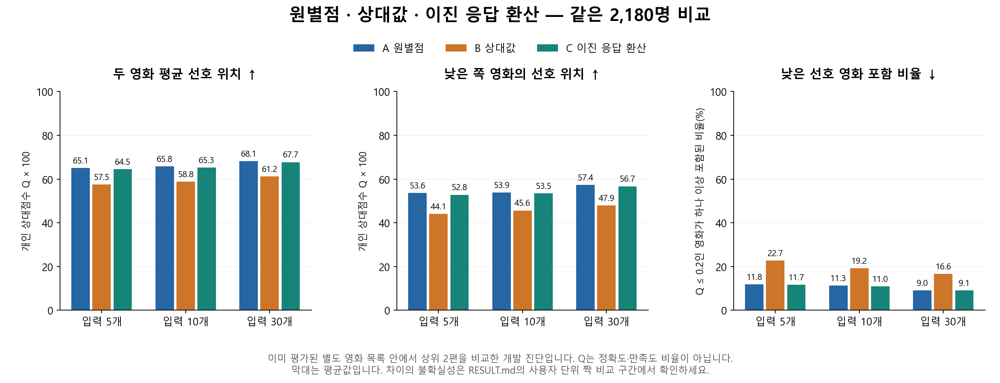

# REC035 세 결과 비교: 원별점 ALS를 유지하고, 이진 환산은 연결 후보로 남긴다

상태: DRAFT(제품 구현 계약 아님) — 실제 계산·독립 전수 검산·보고서/그림 검토 완료. 2026-09-08.

**이번 고정 조건에서는 원별점 ALS가 기준으로 적절하다. 상대값으로 학습·입력한 안은 더 나빴다. LIKE/DISLIKE를 원별점 ALS에 환산해 넣은 안은 원별점 입력과 가까웠지만, 동등성이 입증된 것은 아니다.**

이 결과는 학습에 들어가지 않은 같은 2,180명의 입력 5·10·30개로 비교했다. 각 사람이 이미 평가해 둔 별도 영화 목록에서 상위 2편을 골라 채점했다. 실제 새 영화 전체의 추천 품질이나 실제 온보딩 응답을 검증한 결과는 아니다.

## 무엇을 세 가지로 비교했나

| 방식 | 학습 | 새 사용자 입력 |
| --- | --- | --- |
| A 원별점 | 기존 원별점 ALS 그대로 | 실제 0.5 단위 별점 그대로 |
| B 상대값 | 같은 별점 자료를 사용자 내 상대값으로 바꿔 ALS 1회 학습 | 현재 입력에서 계산한 상대값 |
| C 이진 응답 환산 | A와 동일한 원별점 ALS 그대로 | 상대값 부호를 LIKE/DISLIKE로 만들고 두 추정값으로 환산 |

C의 계산용 추정값은 학습 사용자만으로 구했다. **LIKE=4.2712316165, DISLIKE=2.7984425098**이다. 임의의 5점/1점 매핑이 아니며, 실제 감상 별점으로 저장하지 않는다. 사용자에게 받는 실제 별점은 0.5 단위를 유지한다. 전체 이진 ALS는 학습하지 않았다.

## 먼저 읽을 비교: 입력 30개

입력 30개는 이번에 비교한 조건 중 하나다. 서비스의 전환 K=30이나 온보딩 30개를 선택했다는 뜻은 아니다.

| 같은 조건에서 고른 두 영화 | A 원별점 | B 상대값 | C 이진 환산 |
| --- | ---: | ---: | ---: |
| 숨겨 둔 실제 별점의 평균 — 참고용 | 4.17점 | 3.97점 | 4.16점 |
| 두 영화 평균 선호 위치 ↑ | 68.1 | 61.2 | 67.7 |
| 낮은 쪽 영화의 선호 위치 ↑ | 57.4 | 47.9 | 56.7 |
| 낮은 선호 영화가 하나 이상 포함된 비율 ↓ | 9.0% | 16.6% | 9.1% |

쉽게 말해, 100명에게 두 편씩 고르는 상황으로 환산하면 낮은 선호 영화가 섞이는 사용자가 **원별점 약 9명, 상대값 약 17명, 이진 환산 약 9명**이다. 이때 낮은 선호는 고정 개인 상대점수 Q≤0.2로 정의했다. 동점 때문에 영화 수의 정확히 하위 20%와는 다를 수 있다.

선호 위치는 개인 전체 별점 분포에서 계산한 Q를 0~100 척도로 표시했다. 높을수록 그 사람이 더 높게 평가했던 영화를 골랐다는 뜻이다. **68.1은 정확도 68.1%나 만족한 사람 68.1%가 아니다.** 평균 별점 4.17 등도 여러 실제 반별점의 평균이므로 0.5 단위로 떨어지지 않는다.

## 입력량을 바꿔도 같은 결론인가

각 칸은 **평균 선호 위치 / 낮은 선호 영화 포함 비율**이다. 앞 숫자는 높을수록, 뒤 비율은 낮을수록 좋다.

| 알고 있는 입력 수 | A 원별점 | B 상대값 | C 이진 환산 |
| --- | ---: | ---: | ---: |
| 5개 | 65.1 / 11.8% | 57.5 / 22.7% | 64.5 / 11.7% |
| 10개 | 65.8 / 11.3% | 58.8 / 19.2% | 65.3 / 11.0% |
| 30개 | 68.1 / 9.0% | 61.2 / 16.6% | 67.7 / 9.1% |

B는 입력 5·10·30개 모두에서 A와 C보다 평균 선호 위치와 낮은 쪽 선호 위치가 낮았고, 낮은 선호 영화가 섞이는 비율은 높았다. **B-A와 B-C의 18개 비교 모두 보정 구간이 불리한 방향으로 0을 벗어났다.**

A와 C의 차이는 9개 비교 모두 보정 구간이 0을 포함했다. 이번 자료로 어느 쪽의 이득이나 손실이 분명하다고 할 수 없으며, 동등성·비열등성을 판정하는 허용 차이를 사전에 정하지 않았으므로 “성능이 같다”라고 결론내리지 않는다.

입력 30개에서 C-A의 평균 선호 위치 차이는 **−0.392점**, 보정 구간은 **[−1.289, +0.535]점**이다. 낮은 선호 포함 비율 차이는 **+0.138%p**, 구간은 **[−1.514, +1.811]%p**다.

## 이제 무엇을 결정하는가

1. **원별점 ALS를 현재 연구의 기준으로 유지한다.** 이번 상대값 ALS 구성으로 교체할 근거가 없다. 앞선 콘텐츠·맛 계산에서 상대값이 유리했다는 근거를 ALS 학습의 우위로 확대하지 않는다.
2. **감상 별점 서비스는 그대로 유지한다.** 화면에서 별점을 받는 방식과 모델 내부에서 어떤 목표값을 학습할지는 구분한다. 이번 결과는 raw 학습/raw 입력을 유지하는 쪽을 지지한다.
3. **온보딩의 이진 응답을 기존 ALS에 환산해 연결하는 안은 연구 후보로 남긴다.** 이번 단일 환산안에서 분명한 성능 차이를 확인하지 못했다. 실제 온보딩이 같은 품질을 더 적은 부담으로 얻는지는 별도로 남은 질문이다.
4. **이번 세 방식 비교는 여기서 종료한다.** 환산값·λ·seed·모델을 추가로 탐색하지 않는다. 확보한 기본 입력 기준을 이미 준비한 8맛/맞춤·발견 정책에 연결하는 것이 다음 설계 단계이며, 이번 실행에서는 K·슬롯·분류안의 승자를 정하지 않았다.

## 해석의 한계

- 상대값 B는 학습 목표와 사용자 입력을 함께 바꿨다. 어느 변경이 손실의 원인인지는 분해하지 않았다. RMS를 맞추고 λ=0.1·10회 반복을 고정했지만 각 안의 최적 정규화나 수렴을 보장하지 않는다. **모든 상대값 ALS가 나쁘다는 결론은 아니다.**
- C의 LIKE/DISLIKE는 실제 응답이 아니라 허용 입력 별점의 상대값 부호로 만든 대리 응답이다. 학습 전체 이력으로 구한 두 평균과 짧은 사용자 입력의 부호 분포는 다르다. C-A 차이를 순수한 이진화 손실로 분리하지 않는다.
- 입력 수 n이 달라지면 같은 영화의 대리 부호도 바뀔 수 있다. 실제 응답의 누적 과정·입력별 정보량·시간·이탈·K를 재현하지 않는다.
- 평가 자료는 이전 개발 과정에서 사용한 고정 MovieLens 자료다. 새로운 확증 자료나 한국 서비스 사용자 실험이 아니다. 대부분의 신규 추천이 미평가라는 기존 문제를 완전히 해결하지 못하며, 이번에는 이미 평가된 별도 후보 안의 순서를 진단했다.

## 실행·재현 확인

- 같은 학습 7,355,439행·46,376명, 평가 2,180명. 학습/평가 교집합과 학습 중복 쌍 0. 동일 카탈로그 85,517편과 사용자별 별도 평가 목록 총 191,933개 사용자–영화 조합을 사용했다.
- 상대값 ALS 새 학습 1회. A/C는 기존 raw factor 공유. 학습의 사용자 46,376/영화 62,098 그래프와 행 순서를 보존했다.
- 입력 상대값 0에 대한 공통 제외 규칙을 미리 정했지만 실제 중립 입력은 0개였다. 그래서 A는 모든 2,180명×4조건에서 기존 raw ALS 점수/순위를 그대로 재현했다.
- 입력 5/10/30개에서 factor가 없는 관측은 각각 총 3/4/8건이었다. 세 방식의 유효 입력은 같았고, 무입력 이외의 fallback은 0명이다. 모든 조건에서 전원에게 2편을 공급했으며 분모에서 제외한 사용자는 없다.
- n=0은 세 방식 모두 같은 기존 MovieLens P0였다. 주 비교 family에는 포함하지 않았다.
- 세 방식의 모든 점수를 먼저 봉인하고 E/H를 열어 채점했다. 새 archive·TMDB·네트워크·Locked Test 접근은 없었다.
- 사용자 단위 짝 bootstrap 20,000회, seed 20260908, 27개 비교의 Bonferroni 양측 구간을 사용했다. 별점의 정수 Q 분자를 먼저 빼서 사용자별 동률을 보존했다.
- 실제 계산 약 198.3초, 최대 프로세스 트리 메모리 약 1.85GiB. 사전 한도는 30분/12GiB였다.

독립 실행 검토·준비/학습 검산·전체 점수/순위 전수 검산·통계 재계산·보고서/그림 검토 모두 PASS다. 완료본 재사용 명령도 새 학습/점수 계산 없이 통과했다. 검산 수량과 최종 핀은 [result-review.json](result-review.json)에 기록했다. 사전 실행 계약의 DRAFT 머리말과 원래 fingerprint는 보존한다.

## 전체 짝 비교 수치

차이는 행에 적힌 앞 방식에서 뒤 방식을 뺀 값이다. MEAN_Q/MIN_Q는 0~100 척도의 점수 차이, HARM20은 %p다. 마지막 세 수는 앞 방식이 좋아진/동률/나빠진 사용자 수이며 합계는 2,180명이다.

| 입력 | 비교 | 지표 | 차이 | 보정 구간 | 앞 방식 판단 | 개선 / 동률 / 악화 |
| ---: | --- | --- | ---: | --- | --- | ---: |
| 5 | B-A | MEAN_Q | -7.526 | [-9.081, -5.984] | 불리 | 545 / 525 / 1110 |
| 5 | B-A | MIN_Q | -9.456 | [-11.493, -7.391] | 불리 | 414 / 866 / 900 |
| 5 | B-A | HARM20 | +10.872 | [+7.730, +14.037] | 불리 | 143 / 1657 / 380 |
| 5 | C-A | MEAN_Q | -0.552 | [-1.601, +0.495] | 차이 미확인 | 494 / 1144 / 542 |
| 5 | C-A | MIN_Q | -0.750 | [-2.222, +0.717] | 차이 미확인 | 363 / 1427 / 390 |
| 5 | C-A | HARM20 | -0.183 | [-2.202, +1.789] | 차이 미확인 | 103 / 1978 / 99 |
| 5 | B-C | MEAN_Q | -6.974 | [-8.535, -5.408] | 불리 | 587 / 504 / 1089 |
| 5 | B-C | MIN_Q | -8.705 | [-10.770, -6.552] | 불리 | 453 / 821 / 906 |
| 5 | B-C | HARM20 | +11.055 | [+7.960, +14.220] | 불리 | 145 / 1649 / 386 |
| 10 | B-A | MEAN_Q | -6.968 | [-8.494, -5.490] | 불리 | 590 / 501 / 1089 |
| 10 | B-A | MIN_Q | -8.275 | [-10.257, -6.231] | 불리 | 458 / 842 / 880 |
| 10 | B-A | HARM20 | +7.936 | [+4.908, +11.009] | 불리 | 144 / 1719 / 317 |
| 10 | C-A | MEAN_Q | -0.518 | [-1.539, +0.556] | 차이 미확인 | 489 / 1139 / 552 |
| 10 | C-A | MIN_Q | -0.410 | [-1.945, +1.199] | 차이 미확인 | 357 / 1446 / 377 |
| 10 | C-A | HARM20 | -0.321 | [-2.339, +1.743] | 차이 미확인 | 107 / 1973 / 100 |
| 10 | B-C | MEAN_Q | -6.451 | [-7.973, -4.941] | 불리 | 595 / 538 / 1047 |
| 10 | B-C | MIN_Q | -7.864 | [-9.932, -5.837] | 불리 | 463 / 866 / 851 |
| 10 | B-C | HARM20 | +8.257 | [+5.229, +11.376] | 불리 | 143 / 1714 / 323 |
| 30 | B-A | MEAN_Q | -6.924 | [-8.417, -5.431] | 불리 | 573 / 539 / 1068 |
| 30 | B-A | MIN_Q | -9.456 | [-11.502, -7.447] | 불리 | 436 / 838 / 906 |
| 30 | B-A | HARM20 | +7.615 | [+4.679, +10.481] | 불리 | 126 / 1762 / 292 |
| 30 | C-A | MEAN_Q | -0.392 | [-1.289, +0.535] | 차이 미확인 | 415 / 1312 / 453 |
| 30 | C-A | MIN_Q | -0.718 | [-2.090, +0.680] | 차이 미확인 | 301 / 1556 / 323 |
| 30 | C-A | HARM20 | +0.138 | [-1.514, +1.811] | 차이 미확인 | 72 / 2033 / 75 |
| 30 | B-C | MEAN_Q | -6.532 | [-8.047, -5.037] | 불리 | 612 / 487 / 1081 |
| 30 | B-C | MIN_Q | -8.738 | [-10.793, -6.669] | 불리 | 475 / 799 / 906 |
| 30 | B-C | HARM20 | +7.477 | [+4.587, +10.321] | 불리 | 127 / 1763 / 290 |

연결: [실행 계약](README.md) · [실행 검토](review.json) · [원본 집계](../../../../outputs/recommendation-evidence/rec-ev-035/metrics.json) · [그림 SVG](comparison.svg) · [실행 명령](../../../runbook/local-development.md#12-rec035-원별점상대값이진-응답-환산-비교)
