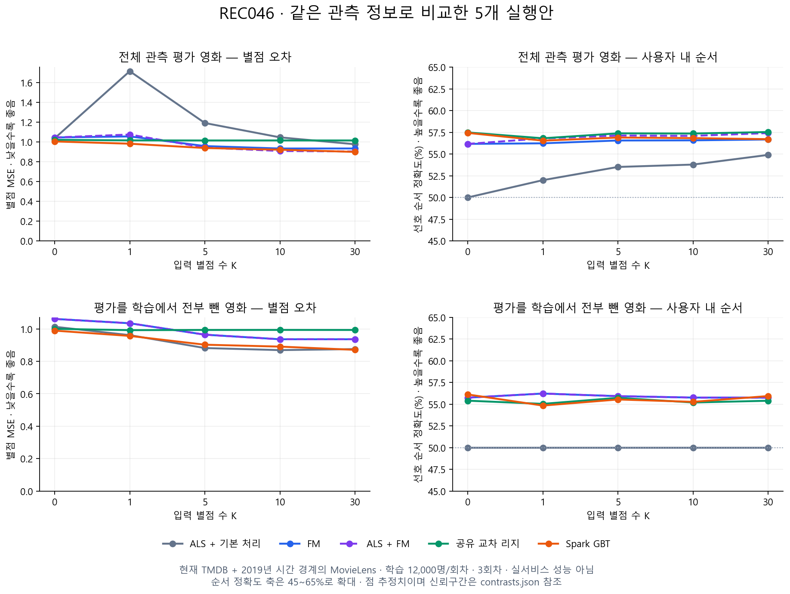

# 추천 모델 5종 비교 결과

상태: DRAFT — 로컬 실험·독립 검토 완료. 서비스 모델 채택은 보류. 2026-09-09.

**이 데스크탑 한 대에서 5종 비교를 완료했다. 별점 오차에서는 GBT와 ALS+FM이 유력했지만,
개인별 추천 순서까지 고려한 단일 승자는 나오지 않았다.**

이번에 확인한 것은 다음과 같다.

- **FM에 ALS를 보조로 붙이는 효과는 일부 확인했다.** 입력 10편·30편에서 FM 단독보다
  별점 MSE가 각각 2.70%·3.24% 낮았고, 사전 지정한 비교 구간도 개선을 지지했다.
  선호 순서 개선은 통계적으로 확정하지 못했다.
- **GBT는 입력이 적을 때도 별점 오차가 상대적으로 작았다.** 그러나 ALS+FM과의 우열은
  어느 입력량에서도 두 주지표로 확정하지 못했다.
- **리지의 높은 순서 점수만으로 개인화를 잘한다고 말할 수 없다.** 입력이 0편일 때
  57.49%, 30편일 때 57.53%다. 공통적인 영화 순서가 맞는 효과가 상당 부분일 수 있다.
- **학습에 없던 영화도 FM·리지·GBT는 영화 정보로 구별해 점수를 계산했다.**
  이 능력이 현재 한국 사용자의 취향에 맞는다는 검증은 아니다.

## 무엇을 어떻게 비교했나

| 항목 | 실제 조건 |
| --- | --- |
| 비교 모델 | ALS+기본 처리, FM, ALS+FM, 사용자×영화 교차항을 넣은 공유 리지, Spark GBT |
| 사용자 입력 | 실제 0.5 단위 별점 0·1·5·10·30편. K는 서비스 입력 개수로 확정한 값이 아님 |
| 학습 | 회차당 12,000명, 공통 관측 별점 약 18.3만~18.6만 개. 3회차 |
| 지도학습 목표 | 같은 관측 자료에서 사용자당 8편, 회차당 96,000개 목표 별점 |
| 설정 선택 | 학습·평가와 분리한 검증 사용자 300명. 모델별 후보 2개, 검증 오차로 선택 |
| 최종 채점 | 학습·검증에서 제외한 고유 300명, 14,533편, 고유 사용자–영화 별점 48,326개 |
| 시간 | 학습·사용자 입력은 2019년 이전, 검증·평가 목표 별점은 2019년 이후. TMDB는 현재 캐시 |
| 미학습 영화 | 영화 ID로 약 20%를 정해 모든 학습 별점을 제거. 평가 사용자 입력·평가 후보에는 포함 |

평가자 300명 중 294명은 별점이 서로 다른 영화 쌍이 있어 선호 순서도 채점할 수 있었다.
같은 사용자가 여러 회차에 등장하면 먼저 회차 평균을 내고, 그다음 사용자를 동일 가중했다.
미평가 영화를 싫어요로 만들지 않았고, ALS가 계산하지 못하는 영화도 평가에서 제거하지 않았다.

영화 특징은 장르·키워드·국가/언어·연대/길이·감독·상위 5명 배우·제작사/시리즈다.
현재 TMDB 평점·인기도, KOBIS 관객 수, 영화별 MovieLens 평균은 이번 입력에 없다.
FM·리지·GBT는 동일한 영화 정보와 입력 이력 요약을 받는다. 8개 분류는 사용하지 않았다.
이번 FM은 사용자·영화 ID를 특징으로 넣지 않은 공유 모델이며, 영화 속성과 입력 이력 사이의
관계를 학습한다. 학습에 쓰지 않은 사용자는 본인의 입력 별점으로 이력 특징을 만든다.

**이전에 약 730만 별점으로 학습한 ALS와는 별도 비교다.** 이번에는 5종의 허용 자료와
자원을 맞추려고 학습량을 제한했다. 따라서 이 결과로 충분히 학습한 ALS 전체를 기각할 수 없다.
ALS는 공통 관측 별점을 행렬 학습에 쓰고, 나머지는 입력 이력과 목표 별점으로 나누어 쓴다.
허용 정보는 같지만 목적함수와 학습 목표의 역할까지 같다는 뜻은 아니다.

## 전체 결과

**별점 MSE는 낮을수록 좋다.** 예를 들어 실제 4점에 3점을 예측하면 오차 제곱은 1이다.
평가 시 예측을 0.5~5점으로 제한했다. 평균 절대 오차(MAE)도 [전체 수치](metrics.csv)에 보존했다.

| 모델 | 입력 0편 | 1편 | 5편 | 10편 | 30편 |
| --- | ---: | ---: | ---: | ---: | ---: |
| ALS+기본 처리 | 1.036 | 1.714 | 1.191 | 1.046 | 0.976 |
| FM | 1.045 | 1.056 | 0.958 | 0.934 | 0.934 |
| ALS+FM | 1.045 | 1.075 | 0.943 | 0.908 | 0.904 |
| 공유 리지 | 1.021 | 1.016 | 1.015 | 1.015 | 1.015 |
| Spark GBT | 1.005 | 0.982 | 0.938 | 0.921 | 0.899 |

**선호 순서 정확도는 높을수록 좋다.** 실제로 A에 4점, B에 2점을 준 사용자를 대상으로
A를 B보다 높게 예측했는지 본다. 실제 동점은 제외하고 예측 동점은 반을 맞힌 것으로 센다.
반올림·범위 제한 전 예측을 사용한다. 이것은 전체 카탈로그의 Top-N 추천 적중률이 아니다.

| 모델 | 입력 0편 | 1편 | 5편 | 10편 | 30편 |
| --- | ---: | ---: | ---: | ---: | ---: |
| ALS+기본 처리 | 50.00% | 51.99% | 53.51% | 53.79% | 54.90% |
| FM | 56.17% | 56.23% | 56.56% | 56.58% | 56.68% |
| ALS+FM | 56.17% | 56.80% | 57.13% | 57.09% | 57.41% |
| 공유 리지 | 57.49% | 56.81% | 57.38% | 57.36% | 57.53% |
| Spark GBT | 57.43% | 56.54% | 56.90% | 56.83% | 56.71% |

GBT는 입력 0→30편에서 별점 오차가 줄었지만 순서 정확도는 높아지지 않았다.
사용자가 별점을 후하게/박하게 주는 정도를 맞히는 것과 좋아할 영화의 순서를 맞히는 것은
구분해야 한다. 이 표의 입력량별 변화는 기술 비교이며 별도 유의성 검정이나 최종 K 선택이 아니다.

## ALS를 더하면 무엇이 달라졌나

세 회차 모두 검증 자료에서 **FM 75% + ALS 25%**가 선택됐다.
ALS가 직접 계산할 수 없는 영화나 입력에는 **FM만 사용한다.** 이것은 이번 검증 설정의 결과이며
이전 RRF60 방식이나 서비스 고정 가중치가 아니다.

입력 30편에서 혼합−FM의 MSE 차이는 −0.03028, 보정 구간은 [−0.04697, −0.01389]다.
선호 순서 차이는 +0.74%p지만 구간은 [−0.20, +1.44]%p로 0을 포함한다.
혼합−GBT는 MSE 차이 +0.00456, 구간 [−0.04116, +0.04542]로 우열을 확정하지 못했다.

각 입력량 안에서 모델 10쌍×주지표 2개를 비교하도록 미리 정했고,
고유 사용자 단위 bootstrap 10,000회에 Bonferroni 보정을 적용했다.
모든 입력량·모든 집단을 통틀어 보장하는 구간은 아니다. [100개 비교 원문](contrasts.json).

## 학습에서 영화 평가를 전부 빼면

다음은 사전 지정한 미학습 영화 집단의 **입력 30편 진단**이다. 고유 286명·2,892편·9,747개
사용자–영화 별점이며, 순서 채점 가능 사용자는 259명이다. 집단별 수치는 기술통계다.

| 모델 | MSE ↓ | 선호 순서 ↑ | 실제 계산 방식 |
| --- | ---: | ---: | --- |
| ALS+기본 처리 | 0.875 | 50.00% | 같은 사용자에게 영화와 무관한 공통 기본 점수 |
| FM | 0.936 | 55.76% | 영화 정보와 입력 이력 |
| ALS+FM | 0.936 | 55.76% | 이 집단에서는 FM만 사용 |
| 공유 리지 | 0.993 | 55.40% | 영화 정보와 입력 이력 |
| Spark GBT | 0.871 | 55.94% | 영화 정보와 입력 이력 |

**여기서 ALS의 MSE가 낮다고 새 영화를 잘 추천했다는 뜻은 아니다.** 같은 점수를 주기 때문에
영화 간 순서 정확도는 50%다. 영화 정보 모델은 구별할 수 있었지만, FM·리지의 별점 오차는
이 기본 처리보다 컸다. 영화 정보를 넣는 것만으로 두 지표가 모두 좋아지지는 않았다.

전체 평가에서 ALS 직접 점수화율은 입력 1편 36.70%, 5편 51.84%, 10편 52.74%, 30편 52.87%다.
사용자 안의 비율을 회차 평균 후 사용자 평균한 값이다. 남은 행은 기본 처리였다.
이는 이번 학습량·20% 제외 조건의 결과이지 실제 서비스 카탈로그 지원율이 아니다.

입력 영화가 모두 ALS 미지원인 문맥도 K1/5/10에서 각각 184/17/5개 관측했고 평가에 남겼다.
이는 사용자×회차 문맥 수다. K30에서는 해당 경우가 없어 그 조건의 K30 성능은 판단하지 못했다.

연도·학습 별점 수·다른 미지원 원인별 결과도 [전체 집계](metrics.csv)에 있다.
회차별 학습 지원이 달라 같은 영화가 서로 다른 집단에 들어갈 수 있으므로 집단 고유 수를 더하면 안 된다.
2019년 이후 개봉작 집단도 과거 MovieLens에 평가가 있는 영화다. 2024~2026년작 검증으로 읽지 않는다.

## 이번 결과로 정한 것과 남은 것

| 판단 | 내용 |
| --- | --- |
| 유지 | GBT와 ALS+FM을 유력 후보로 남긴다. FM은 혼합의 본체이자 미지원 영화 처리 후보다. |
| 보조 근거 확보 | 일부 입력량에서 ALS 보조가 FM의 별점 오차를 줄였다. 취향 순서 개선은 미확정이다. |
| 채택 보류 | 5종 중 서비스 최종 모델, 혼합 고정 가중치, 입력 개수 K. 리지도 순서 점수만으로 채택하지 않는다. |
| 확대 해석 금지 | 충분히 학습한 ALS의 일반적 열세, 2026 한국 성능, 실제 전체 카탈로그 Top-N 품질. |

모델 후보를 더 늘리는 것으로 이번 결론을 미루지 않는다. 다음 설계에서 답해야 할 핵심은
**공통 영화 점수와 개인의 별점 습관을 넘어, 본인의 입력이 다른 영화의 선호 순서를 실제로
더 잘 맞히게 하는가**다. 개인 입력 유무·타인 입력 대조와 영화 지원량을 통제하는 검증이 필요하다.
이는 이번 결과에서 드러난 미확정 사항이며 새 실험을 실행하거나 운영 구조를 바꾼 것은 아니다.

## 실행과 독립 검토

- 데스크탑 Ryzen 5 7500F / RAM 32GB에서 Spark 4.1.3 Docker를 순차 실행했다.
  회차 3개×학습기 4개×설정 2개=24개 학습을 모두 완료했다. 혼합은 재학습 없이 예측을 결합한다.
- 각 설정의 실제 학습은 ALS 5.2~6.9초, FM 42.0~67.5초, 리지 10.2~10.7초,
  GBT 33.5~51.6초였다. 기동·특징 준비·예측·저장 시간은 별도다.
- 컨테이너 한도 10GiB, 순차 실행 중 메모리 219개 표본의 최대는 4.626GiB였다.
  주기적 관측값으로 순간 최대나 데스크탑 전체 사용량은 아니다. 노트북은 사용하지 않았다.
- 의미 있는 합성 검사 9개, 4종 Spark 실행 검사, FM/리지 저장 모델의 별도 예측 수식 검사를 통과했다.
- 실행 전 독립 검토 2건과 실제 전처리·예측 수식 검토를 거쳤다. 결과 검토자는
  전체 사용자 지표 179,325행·100개 비교 구간을 독립 계산했고, 다른 검토자는 원본의 허용 별점
  97,572쌍·검증 설정 선택·최종 예측 5,745,825개 원소와 파일 해시를 검산했다. 모두 PASS.

FM은 후보 2개·반복 상한 150회에서 비교했고 최적 수렴은 확인하지 못했다.
제한된 특징 사전, 과거 개발 자료 재사용, 현재 TMDB, 소량 학습의 한계를 유지한다.
Spark에서 학습·평가가 가능함을 확인했으며, 다중 컴퓨터 분산 성능이나 서비스 Consumer 통합,
전체 서비스 카탈로그 응답 시간까지 검증한 것은 아니다.

[고정 설계](README.md) · [설정](config.json) · [독립 결과 감사](result-review.json) ·
[재현 절차](../../../runbook/local-development.md).
계산 당시 봉인 `completion-seal.json`은 변경하지 않고, 독립 감사 완료를 별도 기록했다.
모델·사용자별 자료·Parquet은 `outputs/recommendation-evidence/rec-ev-046`에 LOCAL_ONLY로 보존한다.
문서·코드·소형 집계만 분리했으며 Jira·GitLab·GitHub 게시와 커밋·Push는 하지 않았다.
