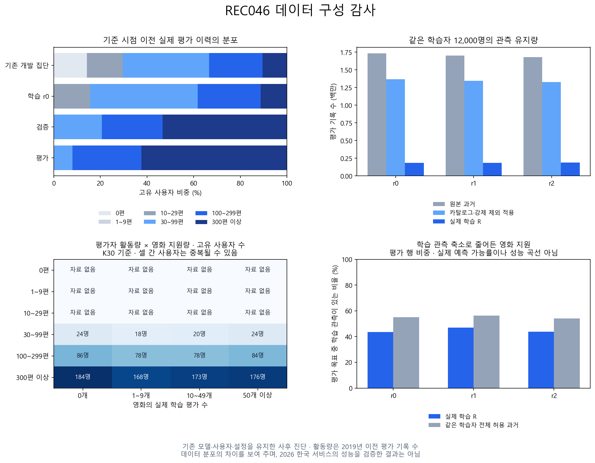

# 학습·검증·평가 데이터가 충분히 맞았나

상태: DRAFT — 사후 데이터 구성 감사·독립 검산 완료. 서비스 모델 채택 보류. 2026-09-09.

**사용자 구성, 평가 시점, 영화 지원량이 크게 달랐다. 기존 수치는 계산 결과로 보존하지만,
그 순서로 서비스 모델을 좁힐 근거는 충분하지 않다.**

핵심은 다음 세 가지다.

1. **평가자는 학습자보다 훨씬 많은 영화를 평가한 집단이었다.**
   과거 평가 300편 이상인 사람은 학습자의 약 11%, 평가자의 62.3%였다.
2. **같은 학습자의 사용 가능한 과거 평점도 약 13~14%만 실제 학습에 넣었다.**
   따라서 충분한 학습량의 ALS와 비교했다고 볼 수 없다.
3. **활동량이 적은 사용자에 대한 평가 근거가 비어 있었다.**
   K=1은 과거 이력이 많은 사용자의 별점 한 편만 모델에 입력한 조건이었다.

이 감사는 기존 모델과 예측을 고정한 재집계다. 새 모델을 학습하거나 기존 평가자를
바꾼 결과가 아니다. 원본 3,200만 행에서는 사용자·영화·시간 세 열만 읽었다.

## 1. 사용자 구성이 실제로 달랐다

‘활동량’은 2019년 이전 MovieLens에 남긴 평가 기록 수다. 실제 감상 수를 뜻하지 않는다.
이 표는 **고유 사용자 비중**이다. 학습 세 회차가 유사해 첫 회차를 대표 예시로 제시하며,
전체 회차 수치는 [사용자 구성](user-strata.csv)에 보존했다.

| 과거 평가 이력 | 학습 r0: 12,000명 | 검증: 300명 | 평가: 300명 |
| --- | ---: | ---: | ---: |
| 0~9편 | 0% | 0% | 0% |
| 10~29편 | 15.6% | 0% | 0% |
| 30~99편 | 46.1% | 20.7% | 8.0% |
| 100~299편 | 27.0% | 26.0% | 29.7% |
| 300편 이상 | 11.3% | 53.3% | 62.3% |
| 이력 중앙값 | 71편 | 319.5편 | 407.5편 |

학습 다른 회차의 중앙값도 71편, 300편 이상 비중은 10.9~11.0%였다.
검증과 평가도 같은 자격 조건만 적용했을 뿐 비슷한 활동량 구성이 보장되지는 않았다.

**원인은 모델별 계산보다 앞의 사용자 선정 조건이다.** 학습은 배정된 K+8편을 확보할 수
있는 사람을 사용했다. 검증·평가는 2019년 이전 30편 이상과 이후 2편 이상을 모두 요구했다.
이는 이후까지 평가를 남긴 장기 활동자를 고르는 조건이기도 하다.

첫 회차의 선별 과정은 다음과 같다.

| 단계 | 사용자 수 | 의미 |
| --- | ---: | --- |
| 원래 회차 학습 역할 집합 | 46,376 | 이전에 고정한 역할 분할 |
| 검증·전체 평가 역할 집합 제외 후 | 44,720 | 학습에 들어갈 수 있는 후보 |
| 배정된 K+8 자격 충족 | 34,878 | 전체 후보 중 9,842명은 이 조건 미충족 |
| 실제 학습 | 12,000 | 고정 해시 순서로 선택 |

원 실행의 ‘자격 부족 3,465명’은 12,000명을 채울 때까지 방문한 후보 안에서의 수다.
전체 후보의 탈락 9,842명과 구분해야 한다. 이번 감사에서 실제 선정 ID와 두 종류의 수를
재현했다. [선정 단계별 활동량·K](training-selection.csv).

기존 평가 역할 후보 3,819명에는 사전 이력 1~29편이며 이후 평가 2편 이상인 사람이
11명 있었지만 최종 평가에서는 제외됐다. 이력 0편인 사람 611명은 2019년 이후에 활동한
사람들이며 같은 시점의 K>0 개인화를 평가할 수 없다. 11명만 추가해도 저활동 사용자
근거가 충분해지는 것은 아니다. 원본 MovieLens 32M 자체도 전체 수록 기간에 최소 20편을
평가한 사용자를 포함한다. ‘전체 기간 저활동’과 ‘2019년 이전 이력이 적음’도 다르다.

## 2. 학습에 넣은 평점이 얼마나 적었나

아래는 **같은 실제 학습자 12,000명**에게서 얻을 수 있는 정보다. 다른 사용자를 추가한 수가 아니다.

| 단계 | r0 | r1 | r2 |
| --- | ---: | ---: | ---: |
| 원본의 2019년 이전 평점 | 1,733,127 | 1,701,924 | 1,679,985 |
| 카탈로그와 연결되는 평점 | 1,729,748 | 1,698,524 | 1,676,707 |
| 실험에서 강제 제외한 영화 제거 후 | 1,367,084 | 1,342,497 | 1,325,593 |
| 실제 모델에 허용한 공통 R | 183,474 | 185,484 | 185,862 |
| 사용 가능 평점 대비 R 비율 | 13.42% | 13.82% | 14.02% |

공통 R에서 지도학습 목표는 각 회차 96,000개이고 나머지는 입력 이력이다.
ALS는 R 전체를 행렬 학습에 썼다. 모든 모델이 허용된 관측 자료를 공유했지만,
데이터를 쓰는 역할과 목적함수가 같다는 뜻은 아니다. 13~14%라는 비율만으로
학습 부족을 확정한 것은 아니다. [관측 유지량](retention.csv).

학습량을 줄인 탓에 **같은 학습자의 전체 허용 과거 기록에는 평가가 있지만 실제 R에는
없는 영화**가 생겼다. 최종 평가 행의 9.43~11.51%가 회차별로 이 조건에 해당했다.
전체 허용 기록 기준 영화 지원 비중은 54.01~56.33%, 실제 R 기준은 43.56~46.90%였다.

이는 영화에 학습 관측이 하나라도 있는지 센 **평가 행 비중**이다. 사용자 평균으로 계산한
ALS 직접 예측률 52.87%와 분모·조건이 다르다. 평점이 늘면 성능도 그만큼 개선된다는
결과가 아니며, 실제 학습량별 성능 곡선은 이번에 측정하지 않았다.

## 3. 입력 시점과 목표 영화도 달랐다

학습은 과거 이력 전체에서 해시로 K+8편을 뽑아 시간순으로 나눴다.
검증·평가는 2019년 직전 최신 K편을 입력하고, 그 이후에 평가한 영화를 목표로 삼았다.

첫 회차·K30에서 입력 기록이 기준 시점보다 얼마나 오래됐는지의 중앙값은
**학습 약 4,750일, 검증 283일, 평가 222일**이었다. 각 역할 안의 입력 평점 행 기준이다.
실제 감상 시점을 안다는 뜻은 아니다. [입력 구성과 시각](input-profiles.csv).

| 목표 영화 구성 — r0, 평가 행 기준 | 학습 목표 | 검증 목표 | 평가 목표 |
| --- | ---: | ---: | ---: |
| 2000년 이전 개봉 | 67.4% | 30.9% | 25.2% |
| 2010~2018년 개봉 | 8.8% | 32.0% | 34.6% |
| 2019년 이후 개봉 | 약 0% | 15.5% | 22.5% |
| 실제 학습 평점 0개 영화 | 0% | 59.8% | 56.4% |
| 실제 학습 평점 50개 이상 영화 | 71.7% | 15.1% | 13.6% |

시간 이동과 미학습 영화 평가는 의도된 검증 조건이다. 이를 없애려고 미래 평점을 학습에
넣거나 학습·평가에 같은 영화를 강제로 채울 수는 없다. 다만 **과거의 어떤 사용자·입력으로
학습해서 어떤 미래 집단을 맞힐지**를 정하고, 조건별 근거와 한계를 함께 평가해야 한다.

별점 분포도 다르다. r0 학습 목표의 행 평균은 3.674점, 검증은 3.243점, 평가는 3.282점이다.
사용자별 평균을 동일 가중하면 각각 3.674/3.658/3.557점으로 차이가 달라진다.
평가가 많은 사람이 전체 평점 행 평균에 큰 영향을 주는 사례다. 기존 성능표는 사용자 동일
가중을 사용했으며, 이 분포 표의 행 비중을 기존 성능 가중치와 혼동하면 안 된다.

[영화·활동량 분포](movie-distributions.csv), [별점 분포](rating-distributions.csv),
[역할별 시각·평균](role-summaries.csv), [분포 간 거리](distribution-distances.csv)에 전체 수치를 남겼다.
검증 성적은 모델 설정 선택에 사용한 자료의 결과이므로 검증–평가 성적 차이를 분포 차이의
효과로만 해석할 수 없다.

## 4. 배우·감독 정보도 충분히 구분되지 않았다

이번 모델은 특징 사전 크기를 제한했다. 평가 목표에서 **감독 블록이 사전 밖 값으로만
구성된 비중은 약 89~90%, 배우 블록은 62~65%**였다. 평가 행 기준·회차별 범위다.
이 경우 원래 다른 인물들이 같은 OOV 열로 합쳐져 인물 차이를 구분하지 못한다.

따라서 이번 결과로 ‘배우·감독 정보를 충분히 활용한 FM이나 GBT의 성능’을 평가했다고
볼 수 없다. 정보 자체의 효과와 현재 표현·학습량의 한계를 분리해야 한다.
장르의 사전 밖 값만 존재하는 경우는 0%였지만, 그것이 장르가 반드시 좋은 특징이라는
뜻도 아니다. [블록별 표현 지원](feature-coverage.csv).

표의 `empty_feature_block`은 변환 후 특징이 없는 상태다. 원자료 일부 속성 결측과
동일하지 않으며 OOV만 있는 상태와도 구분했다.

## 5. 사용자 활동량 × 영화 지원량 성적표

기존 5종·모든 K·검증/평가에 대해 각 셀의 사용자·영화·평가쌍 수와 별점 오차,
선호 순서 정확도, ALS 직접 점수율을 재집계했다. 고유 사용자 30명 미만이면 해당 지표의
구간 추정을 보류하고, 빈 셀은 ‘자료 없음’으로 표시한다.

**평가용 24칸 중 12칸은 비었고, 4칸은 사용자 30명 미만이었다.**
같은 목표 영화를 유지했으므로 이 표본 공백은 K를 바꾸어도 사라지지 않는다.
아래 각 칸은 `MSE 사용자 수 / 순서 채점 가능 사용자 수`다.

| 사용자의 과거 평가 이력 | 영화 학습 0개 | 1~9개 | 10~49개 | 50개 이상 |
| --- | ---: | ---: | ---: | ---: |
| 0편 | 자료 없음 | 자료 없음 | 자료 없음 | 자료 없음 |
| 1~9편 | 자료 없음 | 자료 없음 | 자료 없음 | 자료 없음 |
| 10~29편 | 자료 없음 | 자료 없음 | 자료 없음 | 자료 없음 |
| 30~99편 | 24 / 21 | 18 / 17 | 20 / 18 | 24 / 24 |
| 100~299편 | 86 / 78 | 78 / 61 | 78 / 66 | 84 / 73 |
| 300편 이상 | 184 / 178 | 168 / 150 | 173 / 160 | 176 / 154 |

같은 사용자가 여러 영화 지원량 열에 들어갈 수 있으므로 가로 합이나 전체 칸의 합을
고유 사용자 수로 쓰면 안 된다. 활동량 구간은 상호 배타적이다.
사용자 30명은 이번 감사에서 구간을 표시할 최소 조건일 뿐 충분한 정밀도나 대표성을 보장하지 않는다.

전체 영화에서의 **K30 활동량별 MSE**는 다음과 같다. 낮을수록 좋다.
30~99편 집단은 24명으로 구간 판정을 보류하며 값은 원표에 보존했다.

| 활동량 | 사용자 수 | ALS+기본 처리 | FM | ALS+FM | 리지 | GBT |
| --- | ---: | ---: | ---: | ---: | ---: | ---: |
| 100~299편 | 89 | 1.175 | 1.141 | 1.105 | 1.191 | 1.081 |
| 300편 이상 | 187 | 0.910 | 0.865 | 0.835 | 0.961 | 0.839 |

같은 구분의 **선호 순서 정확도**는 다음과 같다. 높을수록 좋다.

| 활동량 | 순서 채점 사용자 수 | ALS+기본 처리 | FM | ALS+FM | 리지 | GBT |
| --- | ---: | ---: | ---: | ---: | ---: | ---: |
| 100~299편 | 85 | 53.66% | 53.83% | 54.58% | 55.18% | 55.16% |
| 300편 이상 | 185 | 54.71% | 57.27% | 57.92% | 58.12% | 56.93% |

영화 지원량까지 나누면 다른 모습도 나타난다. 예를 들어 **활동 100~299편 × 영화 학습
1~9개**에서 ALS의 MSE는 1.643, GBT는 0.994지만, 순서 정확도는 ALS 57.28%,
GBT 54.21%였다. 오차가 작다는 것과 순서 점수가 높다는 것이 같은 답은 아니다.
이것은 사후 기술 비교이며 두 모델의 우열을 확정하는 검정이 아니다.

전체 원표는 [cell-metrics.csv](cell-metrics.csv)에 있다. `role`, `k`, `activity`,
`item_support`, `method`로 찾는다. 각 지표의 `_users`, `_low`, `_high`, `_status`는
유효 사용자 수·개별 95% 구간·자료 상태다. 사용자 회차 평균 후 고유 사용자 bootstrap
2,000회로 계산했다. 다중 비교 전체를 보정한 승자 판정용 구간은 아니다.

**빈 칸을 제외하고 관측된 12칸을 균등하게 평균해도 공백은 해결되지 않는다.**
예를 들어 K30에서 전체 사용자 평균 순서 점수는 리지 57.53%, ALS+FM 57.41%였지만,
관측 셀 내부 순서 점수를 균등 평균하면 각각 58.07%, 59.35%다.
후자는 서로 다른 영화 지원층 사이의 영화 쌍도 빠지는 별도 지표다.
이를 ‘편향을 보정했더니 ALS+FM이 승자’라고 해석할 수 없다.
원 전체·관측 셀 균등·사용자 30명 이상 셀 균등 결과는 [가중치 진단](weighting-diagnostic.csv)에 분리했다.

## 6. 지금 정해야 할 순서

1. **기존 결과의 사용 범위를 제한한다.** 현재 과거 개발 집단·제한된 학습량·제한된 특징
   표현에서의 성적이다. 서비스 후보의 일반적 우열과 ‘저활동 사용자에도 좋다’는 근거로 쓰지 않는다.
2. **사용자 활동량과 입력 K를 분리해 다음 평가 대상을 정한다.** K1 평가에 K30까지 가능한
   사용자만 요구하지 않는다. 각 K에서 비교할 모델들은 같은 사용자·입력·목표 영화를 받는다.
3. **학습·검증·평가의 입력을 만드는 규칙과 예측 기간을 정한다.** 기준 시점 이전 정보만
   사용하면서 역할별 과거 이력 요약과 미래 목표의 의미를 맞춘다. 시간 분리를 없애지 않는다.
4. **영화 평가량별 근거를 유지하며 학습량을 비교한다.** 평점 많은 영화만 남겨 전체 성능을
   높였다고 보고하지 않는다. 동일 평가 자료에서 학습량을 늘린 성능 곡선을 확인해야
   ALS의 학습 부족과 구조적 한계를 구분할 수 있다.
5. **특징이 실제로 보존되는지 확인한다.** 인물 정보 대부분을 OOV로 합친 표현을
   ‘TMDB를 충분히 활용한 모델’의 기준으로 확정하지 않는다.

모든 집단을 같은 숫자로 강제로 맞출 필요는 없다. 각 집단에 판단 가능한 자료를 확보하고,
표본의 실제 비중에 따른 전체 성적과 관측된 집단의 균등 평균을 별도 진단으로 제시해야 한다.
현재 한국 서비스의 사용자·영화 비중을 모르는 상태에서 균등 평균을 서비스 예상 성능으로 부르지 않는다.

## 검증과 보존

[고정 설계](README.md) · [사전 검토](pre-review.json) · [구성 독립 검산](data-review.json) ·
[성능 독립 검산](result-review.json).

사전 검토 두 건·합성 4검사·정적 검사 후 실행했다. 실제 집계는 약 338초였다.
별도 검토자가 원본 32,000,204행에서 사용자 count 1,004,740개 값, 영화 지원량 342,068개 값,
허용 시각 115,572쌍 및 분포·선정 표 11개 1,778행을 독립 재집계해 확인했다.
다른 검토자는 원 PA 함수를 사용하지 않고 Kendall 동점 보정과 작은 셀 250건의 직접 쌍
비교로 성능을 계산했다. 사용자·회차 지표 163,200행, 사용자 평균 70,325행,
최종 표 1,500행 및 구간 2,500개와 표본 부족/자료 없음 3,500개 처리가 일치했다.
기존 REC046 전체 성능도 복원했으며 최대 차이는 부동소수점 계산 수준이었다.

이전의 독립 검산은 계산·분리·동일 분모를 확인했다. 이번 구성 감사는 그와 별개로
평가 대상과 학습량·표현의 제약을 드러냈다. **계산 PASS가 데이터 대표성 PASS는 아니다.**
원 REC046 코드·설정·완료 봉인은 수정하지 않았다. 새로운 집계는
`outputs/recommendation-evidence/rec-ev-046-data-audit`에 별도 보존한다.
사용자별 count·예측·원본은 Git 제외·LOCAL_ONLY다. Jira·GitLab·GitHub 게시, 모델 재학습,
새 평가자 선정, 튜닝과 운영 계약 변경은 수행하지 않았다.
