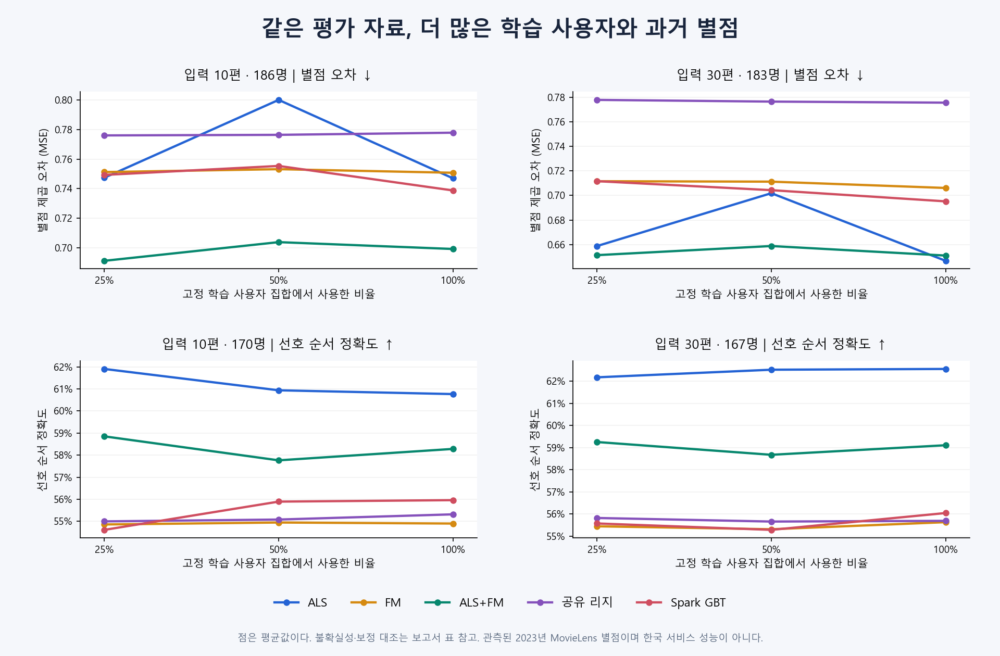

# 데이터 구성을 수정한 5종 비교

상태: **완료 — 24개 실제 학습, 최종 채점, 원본·특징·예측·통계·결론 독립 검산 PASS.**
실행일 2026-09-09. 로컬 연구 결과이며 외부 게시·서비스 정책 확정과 구분한다.

**이번에는 같은 사용자·입력·정답 대상을 유지하면서 학습량을 늘린다.**
평가가 많은 영화만 남기지 않고, 허용된 학습 사용자의 과거 평점 전체를 사용한다.
학습·검증·평가를 인위적으로 같은 비율로 채운 것은 아니다. 시간·역할·입력 규칙을 맞추고,
집단별 부족한 근거를 공개하는 비교다.

## 성능 결과

**학습량을 약 4배로 늘렸을 때의 개선은 이번 표본에서 확인하지 못했다.**
입력 30편에서는 ALS의 평균 별점 오차와 선호 순서 점수가 가장 좋았다.
다만 이것이 모든 사용자·영화에서 ALS가 우세하거나 콘텐츠 모델이 불필요하다는 뜻은 아니다.

100% 학습 결과다. 별점 오차(MSE)는 낮을수록, 선호 순서 정확도는 높을수록 좋다.
입력 10편의 오차/순서 평가자는 각각 186/170명, 30편은 183/167명이다.

| 방식 | 입력 10편 오차 ↓ | 입력 10편 순서 ↑ | 입력 30편 오차 ↓ | 입력 30편 순서 ↑ |
|---|---:|---:|---:|---:|
| ALS | 0.747 | 60.8% | 0.647 | 62.6% |
| FM | 0.751 | 54.9% | 0.706 | 55.6% |
| ALS+FM | 0.699 | 58.3% | 0.651 | 59.1% |
| 공유 리지 | 0.778 | 55.3% | 0.776 | 55.7% |
| Spark GBT | 0.739 | 56.0% | 0.695 | 56.0% |

사전에 정한 사용자 짝 비교와 다중비교 보정을 적용하면 다음까지 말할 수 있다.

- 입력 30편의 선호 순서: ALS가 FM·리지·GBT보다 높았다. ALS+FM과의 차이는 미확정이다.
- 입력 30편의 별점 오차: 리지는 ALS보다 높았다. 나머지 세 방식과의 차이는 미확정이다.
- 입력 10편에서 ALS+FM의 평균 오차가 가장 낮았지만, ALS 대비 개선은 확인하지 못했다.
- 입력 10편의 선호 순서: ALS가 FM·리지보다 높았다. GBT·ALS+FM과의 차이는 미확정이다.

혼합 비율은 검증에서 선택한 ALS 25% + FM 75%다. ALS 직접 점수가 없으면 FM을 사용한다.
따라서 입력과 영화 지원량에 따라 역할이 다르며, 단일 평균 순위로 서비스 모델을 확정하지 않는다.

### 학습량을 늘리면 얼마나 달라졌나

25% 대비 100% 학습의 별점 오차 변화다. 음수는 개선, 양수는 악화다.
같은 사용자를 짝지은 사전 대조 10개 모두 보정한 구간에 0이 포함됐다.

| 방식 | 입력 10편 오차 변화 | 입력 30편 오차 변화 | 개선 판정 |
|---|---:|---:|---|
| ALS | -0.05% | -1.83% | 미확인 |
| FM | -0.06% | -0.77% | 미확인 |
| ALS+FM | +1.16% | -0.05% | 미확인 |
| 공유 리지 | +0.24% | -0.29% | 미확인 |
| Spark GBT | -1.40% | -2.31% | 미확인 |

이는 학습량 증가의 효과가 없다는 증명이 아니다. **현재 고정 설정·평가 표본에서는 개선을 확정할 근거가 부족하다.**
50%에서 ALS 오차가 오히려 커지는 등 평균 변화도 단조롭지 않았다.

### 평가가 적은 영화에서는

입력 30편·100% 학습의 영화 지원층별 별점 오차다. 활동층 평균을 재평균하지 않고 사용자별로 계산했다.
아래 표는 기술통계이며, 지원층별 우열을 확정하는 추가 유의성 검정을 한 것은 아니다.

| 영화의 학습 평점 수 | 평가자 | ALS | FM | ALS+FM | 공유 리지 | GBT |
|---|---:|---:|---:|---:|---:|---:|
| 0건 | 95 | 0.736 | 0.696 | 0.696 | 0.742 | 0.728 |
| 1~9건 | 88 | 1.184 | 0.861 | 0.834 | 0.871 | 0.840 |
| 10~49건 | 117 | 0.588 | 0.774 | 0.675 | 0.831 | 0.726 |
| 50건 이상 | 177 | 0.539 | 0.636 | 0.578 | 0.718 | 0.644 |

평가자는 여러 영화 지원층에 겹쳐 들어갈 수 있으므로 인원을 합산하지 않는다.
지원 0인 영화의 순서 정확도는 ALS 50.0%, FM 59.7%, GBT 62.5%였다(비교 가능한 61명).
ALS의 이 구간 점수는 사용자별 기본값이므로 영화끼리 순서를 구별하지 못한다.
반면 과거 300편 이상 사용자만 보면 같은 지원 0 구간의 오차는 ALS 0.664, FM 0.717이다(68명).
**낮은 별점 오차와 영화 구별 능력은 다르며, 사용자 집단을 바꾸면 평균의 순서도 바뀐다.**
미지원이면 특정 콘텐츠 모델이 항상 낫다고 결론 내릴 수 없다.

### 입력이 적을 때는

공통 183명으로 대상을 맞춰도 입력 1편의 오차는 ALS 1.667, FM 0.853, GBT 0.832였다.
같은 사람들의 입력 30편 오차는 ALS 0.647, FM 0.706, GBT 0.695다.
그런데 같은 입력 1편의 순서 정확도는 ALS 56.5%, FM 54.0%, GBT 55.5%로 오차의 순위와 다르다(순서 평가 가능 167명).
입력이 적은 상황과 충분한 상황을 구분해야 한다는 기술적 근거다. 정확한 서비스 전환 K를 정한 것은 아니다.
입력 0편의 영화 정보 기반 점수도 개인 취향을 학습한 결과와 구분한다.

### 이번 판단

**ALS를 버리거나 FM·GBT로 전면 교체할 근거는 나오지 않았다.**
기존 영화에 평가 근거가 있고 입력이 충분한 구간에서는 ALS를 유력 후보로 유지한다.
입력이 적거나 영화의 학습 평점이 부족한 구간에서는 콘텐츠 모델·혼합을 별도로 다룰 이유가 있다.
하지만 이 결과만으로 새로운 전환 기준이나 혼합 정책을 채택하지 않는다.
학습량만 늘리는 것보다 입력량·영화 지원량·평가 목적을 구분해서 판단해야 한다는 결론이다.

### 데스크탑에서 실제로 돌릴 수 있었나

24개 Spark 학습을 모두 이 데스크탑에서 완료했다. 학습 함수 실행 시간의 합은 약 88.0분이며,
자료 준비·저장·검토를 포함한 전체 소요 시간은 아니다. 전체 최대 컨테이너 메모리는 10.28GiB였다.
최종 100% 학습의 ALS/FM/리지/GBT 학습 시간은 각각 약 38초/17분 28초/50초/8분이다.
Spark local[4], 컨테이너 12GiB·JVM 8GiB 조건이며 EC2나 여러 노드의 성능을 검증한 것은 아니다.
혼합은 ALS와 FM 두 모델의 학습·산출물을 필요로 한다. 서비스 추론 지연은 이번에 측정하지 않았다.

[전체 평균·95% 구간](metrics.csv) · [보정한 짝 비교 26개](contrasts.csv) ·
[활동량×영화 지원량 전체 표](strata.csv) · [영화 지원량 요약](support-summary.csv) ·
[학습 구성](training-composition.csv) · [24개 학습 비용](runtime.csv)

## 무엇을 맞췄나

| 항목 | 이번 조건 |
|---|---|
| 비교 | ALS, FM, ALS+FM, 공유 리지, Spark GBT |
| 학습량 | 같은 학습 사용자 pool의 중첩 25%·50%·100% |
| 최종 학습 평점 | 1,592,028 / 3,154,140 / 6,261,195건 |
| 실제 학습 사용자 | 9,969 / 19,927 / 39,859명 |
| 학습 평점이 있는 영화 | 43,608 / 49,084 / 56,026편 |
| 학습 문제 | 과거 전체를 180일 구간으로 나누고, 구간 전 입력으로 구간 안 별점을 예측 |
| 검증 기간 | 2022-07-05 이상, 2023-01-01 미만 UTC |
| 평가 기간 | 2023-01-01 이상, 2023-06-30 미만 UTC |
| 제공 입력 K | 시점 이전 최신 0·1·5·10·30편; 가능한 사람만 평가 |
| 영화 구분 | 100% 학습에서 평점 0건·1~9건·10~49건·50건 이상으로 고정 |
| 별점 | 실제 원본은 0.5점 단위 그대로 보존 |
| 모델 설정 | 학습량마다 같은 설정; 혼합 비율도 하나로 고정 |

여기서 100%는 지정한 학습 pool의 100%이며, MovieLens 원본 3,200만 행 전체라는 뜻은 아니다.
검증·평가 사용자를 모델 학습에 넣지 않는다. ALS는 평가자의 입력 별점으로 사용자 벡터만 계산한다.
인위적인 영화 20% 보류 없이 자연적으로 학습 지원이 부족한 영화를 함께 평가한다.

ALS와 지도학습 모델 모두 같은 허용 과거 평점을 사용한다. 지도학습에서는 각 별점을 목표로
정확히 한 번 배정했다. 학습은 별점 한 건씩 반영하므로 활동량이 큰 사용자의 영향이 크다.
평가는 사용자별 오차를 먼저 구하고 사용자마다 같은 비중으로 평균한다.

FM·리지·GBT는 영화 정보와 입력 별점의 관계를 같은 168개 특징으로 계산한다.
장르·키워드·국가/언어·연대/길이·감독·배우·제작사/시리즈의 원래 ID 연결을 유지했다.
특정 배우·감독·국가의 전역 평가 효과를 각각 학습한 모델이나 전체 ID를 넣은 FM은 아니다.
이번에는 현재 TMDB 인기·평점 수치를 학습 특징으로 사용하지 않았다.

최종 100% 학습 목표의 **82.3%는 K=0**, 입력이 있는 목표는 **1,109,621건**이다.
구간 시작 전에 이력이 없거나 사전 해시가 K=0을 배정한 경우다. 626만 건 전체를 개인화 입력이
있는 학습 사례라고 표현하지 않는다. K=0에서 ALS는 학습 평균을 사용하므로 인기순 추천 정책과도 다르다.

## 데이터가 골고루 충분한가

아니다. 아래는 시점 이전 카탈로그 평점 수이며, 학습 pool의 이력 0건 사용자도 포함했다.
각 칸은 인원이고 괄호는 해당 집단 안의 비율이다.

| 과거 평점 수 | 검증 시점 학습 pool | 검증 대상 K0 | 평가 시점 학습 pool | 평가 대상 K0 |
|---|---:|---:|---:|---:|
| 0 | 1,095 (2.70%) | 89 (29.87%) | 729 (1.80%) | 84 (31.00%) |
| 1~9 | 13 (0.03%) | 0 (0.00%) | 6 (0.01%) | 1 (0.37%) |
| 10~29 | 6,828 (16.82%) | 4 (1.34%) | 6,859 (16.90%) | 3 (1.11%) |
| 30~99 | 17,052 (42.01%) | 25 (8.39%) | 17,212 (42.41%) | 27 (9.96%) |
| 100~299 | 10,661 (26.27%) | 65 (21.81%) | 10,758 (26.51%) | 46 (16.97%) |
| 300 이상 | 4,939 (12.17%) | 115 (38.59%) | 5,024 (12.38%) | 110 (40.59%) |
| 전체 | 40,588 | 298 | 40,588 | 271 |
| 중위수 | 69편 | 168편 | 70편 | 161편 |

검증·평가는 이후 180일에 관측 별점이 있는 사람을 대상으로 한다. 사용자마다 같은 비중으로
채점해도 이 집단의 활동량 분포가 한국 서비스 이용자 분포로 바뀌지는 않는다.

입력 1편 조건은 187명이다. 과거 1~29편 사용자는 **4명뿐**이며 이들의 평가 대상은 모두
학습 평점 50건 이상 영화다. 따라서 **저활동 사용자 × 평가가 적은 영화**의 성능은 확인할 수 없다.
집단별 표에서 빈칸은 자료 없음, 유효 사용자 30명 미만은 참고 수치로 표시한다.
30명 이상이라는 기준 자체가 대표성이나 정확성을 보장하지도 않는다.

100% 학습 기준으로, 학습 지원 0인 후보 영화는 입력이 있는 95명에게 605건의 관측이 있다. 영화는 442편이며
관측 건수와 구분한다. 지원 0은 해당 시점 이전 학습 평점이 0건인 영화라는 뜻으로, 모두 신작은 아니다.
반면 입력 영화가 전부 미지원인 사람은 K1에서 4명이고, K5 이상에서는 모두 지원 입력이 최소
1편 있다. **입력이 전부 새로운 영화인 사용자 성능**으로 확대할 수 없다.

## 비교를 읽는 기준

- 같은 K의 25%→100%: 학습 사용자와 그들의 전체 과거 이력을 늘린 결과다.
- 입력 K 변화: 전체 평가자는 271/187/186/186/183명으로 달라진다. K30 입력이 가능한 공통 183명 결과도 따로 본다.
- 이전 REC046과의 차이: 대상·기간·표현도 함께 바뀌었으므로 학습량 증가 효과로 해석하지 않는다.
- 별점 오차와 선호 순서는 별개다. 오차는 예측을 0.5~5 범위로 제한한 뒤 계산하고,
  순서는 연속 예측값 그대로 실제 별점이 다른 두 영화의 순서가 맞는지 확인한다.
  예측 동점은 절반, 실제 별점 동점은 제외한다. 비교 가능한 쌍이 없으면 순서 지표는 결측이다.
- 오차 범위는 사용자 단위 재표집으로 구한다. 같은 사람의 여러 영화 쌍을 독립 표본으로 세지 않는다.
  학습된 모델을 고정하고 평가 사용자를 재표집한 불확실성이며, 학습 분할·모델 seed의 변동을 측정한 것은 아니다.

## 어디까지 믿을 수 있나

원본·특징·예측 재현 검산은 **계산이 설계대로 수행됐다는 근거**다. 최적 모델이라는 증명은 아니다.
리지는 150회 반복 상한에 도달했고, FM의 목적함수 이력은 제공되지 않아 최적 수렴을 확인하지 못했다.
이미 사용한 개발 자료에서 수행한 비교이며 새로운 확증용 표본을 개방한 것도 아니다.

관측된 과거 MovieLens 별점에 관한 결과다. 현재 TMDB는 당시 snapshot이 아니며, 2026년 한국
사용자나 미평가 서비스 카탈로그 전체의 정답을 확보한 것은 아니다. 평가하지 않은 영화는 모르는
값으로 남긴다. 이번 비교만으로 서비스 모델·전환 K·팝콘 맛·추천/발견 정책을 확정하지 않는다.

## 검토와 재현

합성 검사 8개와 원본 없는 Spark 4모델 실행 후 실제 학습을 시작했다.
검증·평가 준비 자료에서 원본 별점, 사용자·시각·영화 지원량, 전체 168특징을 전수 대조했다.
검증 12모델 예측을 독립 수식·native 트리 순회로 재현했고, 혼합 비율도 별도 계산으로 확인했다.
최종 12모델과 혼합 예측도 정답 개방 전에 독립 계산으로 확인했다.
원본 정답 18,960건, 사용자별 지표 54,225행, 전체 집계와 신뢰구간 926개를 검산했고
[결과 감사](result-review.json)에 PASS를 기록했다. 그림의 수치·레이아웃도 확인했다.

평균표는 95% 구간이다. 결론용 학습량 대조 10개에는 99.5%, ALS 대비 대조 16개에는
99.6875% 구간을 사용했다(각각 다중비교 보정, 사용자 재표집 10,000회).
`completion.json`은 계산 당시 상태를 보존하며, 감사 완료는 별도 `result-review.json`으로 확인한다.

[실행 계약](EXECUTION.md) · [고정 설정](config.json) · [가용성 감사](readiness-result-review.json) ·
[실행 전 검토](execution-pre-review.json) · [검증 자료 감사](validation-data-review.json) ·
[검증 예측 감사](validation-model-review.json) · [선택 감사](selection-review.json) ·
[평가 자료 감사](evaluation-data-review.json) · [평가 예측 감사](evaluation-model-review.json) ·
[집계 내보내기 기록](aggregate-export.json) · [활동량 집계](population.csv)
