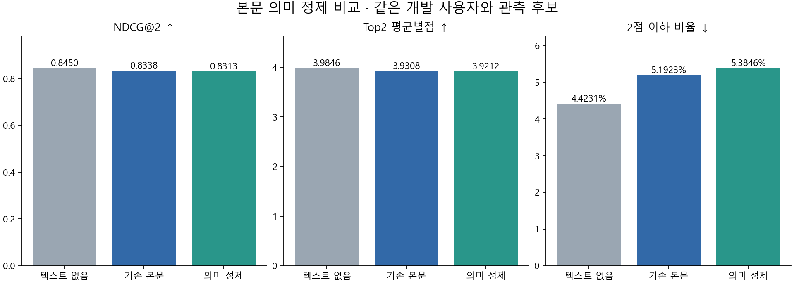

# 본문을 정제하면 추천이 좋아지는가

상태: 로컬 실험·수치 검산 완료. 자원 상한 예외는 별도 기록했다. 서비스 채택 문서가 아니다.

**이번에 시험한 정제 방식은 추천 개선안으로 채택하지 않는다.**
같은 FM에서 기존 본문을 정제본으로 바꾸자 Top2 순위 점수가 소폭 내려갔고,
전체 후보 추천의 쏠림도 해소되지 않았다.

## 무엇을 바꿨나

TMDB 줄거리와 Wikipedia 본문에서 제작진·개봉·평론·홍보를 담은 외부 설명 중 일부를 지웠다.
문맥 검토와 독립 재검토를 거쳐 **221편의 본문에서 349개 구간**을 삭제했다.
줄거리·인물 관계·결말·작품 형식과 섞였거나 판단이 모호하면 남기는 보수적인 방법이다.
감독 데뷔작 소개만 지우고, 함께 남아 있는 평론 문장은 보존한 경우도 있다.
**전체 본문의 불필요한 표현을 모두 제거한 실험은 아니다.** [실제 전후 예시](EXAMPLES.md)에서 볼 수 있다.

학습 4,997,069행·39,859명, 평가 사용자·후보·별점·FM 설정은 유지했다.
변경되지 않은 임베딩과 기존 PCA를 재사용하고, 정제 조건의 FM만 한 번 추가 학습했다.

## 결과는

아래는 입력 상한 10편 조건에서, 나중에 실제 별점을 남긴 후보가 2편 이상인 **260명**의 결과다.
입력이 없는 사람도 포함된다. NDCG는 높은 별점의 영화를 앞에 놓았는지 보는 순위 점수다.

| 조건 | 순위 점수 NDCG@2 ↑ | Top2 평균 별점 ↑ | 2점 이하 비율 ↓ |
| --- | ---: | ---: | ---: |
| 기존 본문 T3 | 0.8338 | 3.9308 | 5.19% |
| 정제 본문 CLEAN | 0.8313 | 3.9212 | 5.38% |
| 텍스트 없음 T0 — 진단 기준 | 0.8450 | 3.9846 | 4.42% |

실제 별점은 0.5 단위이며 표는 그 평균이다. CLEAN−T3 순위 점수 차이는 **−0.00253**,
사용자 짝 bootstrap 95% 구간은 **[−0.00534, −0.00019]**다.
이번 두 고정 모델에서는 하락 방향으로 나타났고, 사전에 정한 개선 조건을 통과하지 못했다.
이는 이미 사용한 개발 사용자에 대한 비교이며 학습 무작위성을 포함한 구간은 아니다.

Top4·6·10의 NDCG 평균도 소폭 낮았다. 일부 보조 지표인 평점 오차와 쌍별 순서 일치는
미세하게 좋아져서 모든 지표가 나빠진 것은 아니다. 주 판정 기준은 Top2로 유지했다.
실제 입력이 있는 176명의 NDCG@2도 0.8386→0.8358,
정제 영화가 입력 또는 후보에 있는 52명도 0.8029→0.8002였다. 이 부분집단은 기술통계다.

그림의 세 지표는 모두 유효 사용자 260명 기준이다. T0는 진단 기준이며 이번 주 대조는 T3와 CLEAN이다.
Top4·6·10의 서로 다른 분모와 전체 보조 지표는 [상세 결과](RESULT.md)에 있다.

## 전체 영화에서 추천하면

연구 카탈로그 85,517편에서 알려진 과거 감상을 제외하고, 사용자별 약 7.6만~8.6만 편을 전부 채점했다.

- 정제 후 Top2 540슬롯 중 별점이 있는 것은 **24개**, 나머지 **516개는 UNKNOWN**이었다.
- 입력 있는 186명의 Top2 **372슬롯은 전부 UNKNOWN**이었다.
- 그중 **368개(98.92%)**는 사용한 TMDB 스냅샷에서 투표 1개·평균 10점인 영화였다.
  기존 본문 조건도 같은 368개였고, 전체 Top2에 등장한 영화 종류도 두 조건 모두 10편이었다.

미평가는 싫어요가 아니다. 다만 본문을 이렇게 정제하는 것으로는, 이미 확인한
극소수 평가 영화에 대한 추천 집중 문제를 해결하지 못했다.

## 다음 판단

**다음은 대중 평점의 근거량 처리와 학습 때 사용자 입력 구성을 먼저 점검한다.**
현재 학습 목표의 82.34%는 이전 입력이 0개인 조건이다. 두 요소의 개선 방법을 설계·검토한 뒤
정보 결합을 실험하는 순서는 기존 [340 후속 설계](../../plans/text-to-final-recommendation/training-input-distribution.md)를 따른다.
이번 결과가 쏠림의 원인을 입증한 것은 아니며, 이 문서에서 후속 학습이나 정책을 실행·확정하지 않았다.

이번 비교로 텍스트 정제 전반이 무용하다거나 T0가 서비스 모델로 확정됐다고 말할 수는 없다.
현재 TMDB·Wiki와 과거 MovieLens의 시점·이용자 편향 차이도 남아 있다.
두 조건 모두 한 번씩 학습했으며 2026년 한국 사용자 품질은 미검증이다.

관측 학습 시간은 T3 60.30분, CLEAN 69.36분이었다. 한 번의 실행 시간이므로
정제 자체가 학습을 느리게 만들었다고 해석하지 않는다.
두 모델 모두 최고 메모리가 **12GiB보다 4,096바이트 높아 엄격한 상한 준수는 실패**로 기록했다.
수치 검산 통과와 자원 조건을 구분한다.

[독립 결과 검토](result-review.json) · [상세 지표](RESULT.md) · [정제 전후](EXAMPLES.md) ·
[고정 설계](PLAN.md) · [로컬 산출물·재현 안내](REPRODUCTION.md)
