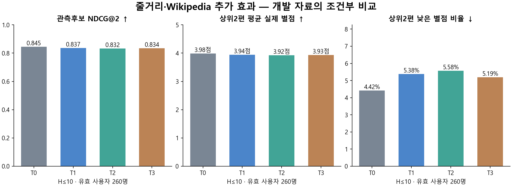

# 줄거리·Wikipedia 추가 효과

상태: DRAFT — 실제 실행 결과. 독립 결과 검산 완료 여부는 result-review.json을 따른다.

**이번 기준에서는 텍스트 없는 T0을 유지한다. 더 복잡한 표현을 채택할 주 근거가 충족되지 않았다.** FM을 최종 추천 모델로 확정한 결과는 아니다.

## 같은 조건에서 무엇이 달라졌나

T0=구조화 정보·개인 반응, T1=T0+TMDB 줄거리, T2=T1+Wiki 기본 정제,
T3=T1+검토한 본문 복원. H는 입력 상한이며 부족한 사용자를 제외하지 않았다.

| 표현 | NDCG@2 | 평균 별점@2 | 낮은 별점@2 | 사용자 평균 MSE | 별점쌍 순서 정확도 |
|---|---:|---:|---:|---:|---:|
| T0 | 0.8450 | 3.9846 | 4.42% | 0.7750 | 0.6034 |
| T1 | 0.8368 | 3.9413 | 5.38% | 0.7800 | 0.6033 |
| T2 | 0.8320 | 3.9250 | 5.58% | 0.7788 | 0.5983 |
| T3 | 0.8338 | 3.9308 | 5.19% | 0.7818 | 0.5987 |

별점은 실제0.5단위다. 좋음≥4,낮음≤2. 위 표는 **그 사용자가 미래 기간에 실제 평가한
영화 안에서 고르는 조건부 품질**이다. 미평가 영화를 싫어요로 처리하지 않았다.

| 인접 비교 | 사용자 | NDCG@2 차이 | 보정98.333% 구간 | 사전 규칙의 처리 |
|---|---:|---:|---|---|
| T1-T0 | 260 | -0.0082 | [-0.0209, 0.0041] | 채택 중단/진단 |
| T2-T1 | 260 | -0.0048 | [-0.0172, 0.0072] | 채택 중단/진단 |
| T3-T2 | 260 | 0.0018 | [-0.0013, 0.0054] | 채택 중단/진단 |

사용자 짝 bootstrap20000회,3대조 Bonferroni의 근사 동시 구간이다. 첫 실패에서 선정이 멈춘다.
뒤 단계의 비채택을 효과 없음이나 동급의 증명으로 해석하지 않는다.
선택표현−T0의 누적 점추정: ndcg2: +0.0000, stars2: +0.0000, low2: +0.0000.
인접 손실 veto는 누적 손실 상한이나 서비스 안전 보증이 아니다.

| Top-N | 표현 | NDCG 유효 사용자 | NDCG | 평균 별점 | 낮은 별점 비율 |
|---|---|---:|---:|---:|---:|
| 4 | T0 | 237 | 0.8422 | 3.9357 | 4.64% |
| 4 | T1 | 237 | 0.8392 | 3.9267 | 4.22% |
| 4 | T2 | 237 | 0.8363 | 3.9235 | 4.64% |
| 4 | T3 | 237 | 0.8376 | 3.9262 | 4.54% |
| 6 | T0 | 218 | 0.8467 | 3.9331 | 4.36% |
| 6 | T1 | 218 | 0.8398 | 3.8998 | 4.59% |
| 6 | T2 | 218 | 0.8385 | 3.9025 | 4.74% |
| 6 | T3 | 218 | 0.8398 | 3.9063 | 4.59% |
| 10 | T0 | 192 | 0.8491 | 3.8984 | 4.58% |
| 10 | T1 | 192 | 0.8448 | 3.8826 | 4.95% |
| 10 | T2 | 192 | 0.8452 | 3.8914 | 4.69% |
| 10 | T3 | 192 | 0.8460 | 3.8922 | 4.69% |

위 보조표는 각 N에 충분한 관측후보가 있는 사용자 기준이다. 같은 사용자를 유지한
Top2/4/6 비교와 전체 보조지표는 [전체 지표](../../../../outputs/recommendation-evidence/text339/metrics.csv)에 있다.
NDCG의 IDCG0 제외와 평균별점의 분모는 다를 수 있으며 분모표에 함께 기록했다.

## 무엇을 채점할 수 있었나

- 현재 실행의 학습 39,859명·4,997,069평점. C영화 10,952편은 학습 목표·입력·집계 모두 제외.
- 개발 사용자 후보 271명 → 개봉일 조건 후 270명·미래 관측 18,646개.
- 원문 검토 후 사용 가능한 overview 85,517편, T2 51,181편, T3 51,188편.
  T3 본문 복원 7편, 양쪽 비결측 본문 변경 92편.
- [분모표](../../../../outputs/recommendation-evidence/text339/cohort-denominators.csv)는 N별 후보 부족·좋음0·동점,
  C/W/본래지원0·위키·언어·개봉연대별 조건부 분모를 보존한다. 실제 파일은 outputs에 있으며 Git 제외다.

현재 평가271명 전원이 과거 개발에 사용됐고261명은 과거 학습에 들어간 적 있다.
이번 실행 내 역할 분리는 지켰지만 **새 최종 시험은 아니다**. 과거 MovieLens 평점과 최신
TMDB/Wiki를 결합한 결과이며 현재 한국 사용자 품질은 미검증이다. h=0도 H10에 들어가므로
전체 개선을 바로 개인화 개선으로 부르지 않는다.

복원7편은 이 평가 사용자의 입력과 미래 관측에 없어서 해당 영화의 추천 품질을 직접 검증할 수 없다.
본문 변경92편 중 미래 관측은23편·53평점·31사용자, H30 입력은11편·17사용자에 해당한다.
T3의 전체 차이를 이들 사례의 개별 개선이나 결말 정보의 효과로 단정하지 않는다.

## 전체 연구 카탈로그에서는

미래 관측 여부로 후보를 줄이지 않고 H10에서 알려진 과거 감상 전체를 제외해 별도로 생성했다.
MovieLens와 연결한 연구85517편의 현재 메타데이터 진단이며 실제 서비스 신규영화·KR OTT 공급 전체는 아니다.

| 표현 | Top2 채점 가능 비율 | 좋음 비율의 가능 범위 | Top2 노출 영화 수 |
|---|---:|---:|---:|
| T0 | 13.70% | 11.67–97.96% | 15 |
| T1 | 4.63% | 3.89–99.26% | 8 |
| T2 | 4.44% | 3.70–99.26% | 10 |
| T3 | 4.44% | 3.70–99.26% | 10 |

가능 범위는 UNKNOWN의 별점을 모르기 때문에 생기는 느슨한 범위이며 신뢰구간이 아니다.
평가된 항목만의 평균으로 전체 추천 만족도를 확정하지 않는다. 부족 슬롯과 UNKNOWN은 별도로 셌다.

## 비용과 다음 결정

| 표현 | 특징 차원 | 학습 분 | 컨테이너 최고GiB |
|---|---:|---:|---:|
| T0 | 230 | 18.7 | 10.05 |
| T1 | 338 | 40.8 | 11.61 |
| T2 | 446 | 62.4 | 12.00 |
| T3 | 446 | 60.3 | 12.00 |

임베딩 136,542개 고유 본문·173,962청크, 11.0분.
특징 생성+4모델을 합친 사용자별 전체 카탈로그 점수화 p50=2.16초,
p95=2.31초. 운영 API의 응답시간이나 서버 분산 성능으로 부르지 않는다.

이 표현을 고정한 뒤339의 결과 검산을 통과하면340에서 정보 결합·ALS 보조 기여를 비교한다.
전체 결과는 outputs/recommendation-evidence/text339의 봉인된 CSV/Parquet/모델과 함께 재현한다.
원문·모델·사용자별 결과는 Git 제외이며 아직 팀 운영 계약으로 승격하지 않았다.
