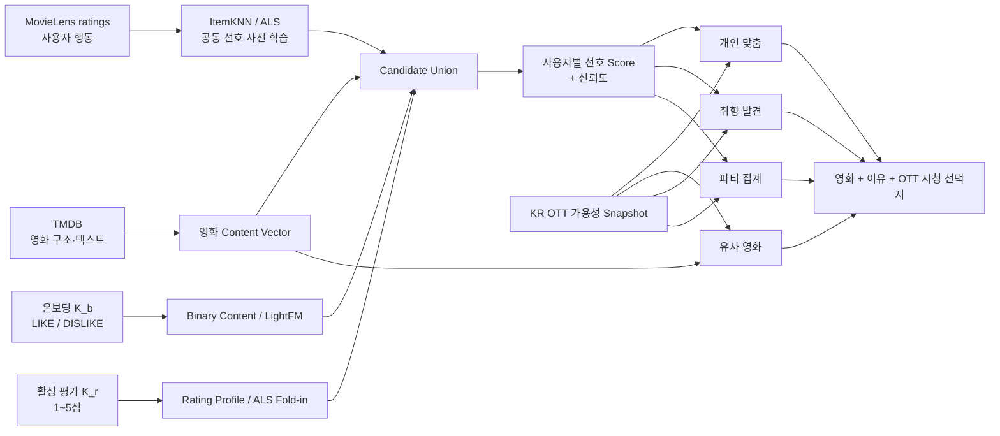

# FEELM Zero-data Launch 추천 시스템 설계 보고서

> 문서 상태: `DRAFT` — 연구 로드맵이며 현재 C2 구현 계약이 아니다.
> 개정일: 2026-08-30
> 전제: FEELM 자체 사용자는 거의 없고, 지속적인 사용자 행동 수집도 기대하지 않는다.
> 목표: MovieLens 사용자 행동과 TMDB 영화 정보를 분리하고, 실제 binary 온보딩과 1~5점 평가를
> 구분해 개인화 가능성을 검증한다.
> 대체 범위: 이전 `개인별 Hybrid 추천 시스템 설계 보고서` 초안을 전면 대체한다.

실행 기준은 이 보고서의 서술이 아니라 다음 계약 세트다.

1. [추천 입력 신호 계약 vNext](./00-input-signal-contract-vnext.md)
2. [추천 오프라인 평가 프로토콜 vNext](./01-offline-evaluation-protocol-vnext.md)
3. [추천 Serving 계약](./serving-contract.md)

세 문서는 REC-EV 오프라인 구현 계약으로 `APPROVED`되었다. 실험 gate와 C2 vNext 승격 조건을
통과하기 전에는 현재 `APPROVED_C2A_INTERNAL_POPULARITY_ONLY`와 fail-closed 동작을 유지한다.

## 0. 한 장 요약

### 공통 개인 선호 엔진이 답할 질문

> 자체 사용자가 없는 영화 서비스가 MovieLens의 사용자 선호 관계와 TMDB 영화 정보를 결합할 때,
> 실제 온보딩 `K_b=0·5·10`개의 LIKE/DISLIKE와 이후 `K_r`개의 1~5점 평가에서 각각 얼마나
> 안전하게 개인화를 시작할 수 있는가?

이 질문은 네 가지 추천 기능 전체가 아니라 개인·발견·파티 추천이 공유할 **구성원별 선호 점수**를
검증하는 질문이다. 유사 영화와 파티 집계에는 별도의 실험이 필요하다.

### 데이터 역할

| 데이터 | 역할 | 하지 않는 일 |
| --- | --- | --- |
| MovieLens | 익명 사용자의 평가 성향·공동 선호·시간 변화 학습과 오프라인 정답 | 영화의 공식 의미 정보, FEELM 사용자 대표성 주장 |
| TMDB | 장르·감독·배우·키워드·줄거리·연대·언어 등 영화 표현 | 개인 선호 정답, 예상 별점 정답 |
| FEELM 온보딩 `K_b` | 최대 10개 LIKE/DISLIKE로 binary 콘텐츠·hybrid 프로필 | 가짜 별점, Explicit ALS 입력 |
| FEELM 활성 평가 `K_r` | 1~5점 explicit 취향·예상 별점·ALS Fold-in 후보 | binary 온보딩과 동일한 신호라는 주장 |
| FEELM 지속 로그 | 현재 범위에서 없다고 가정 | 추천 성공을 관측했다고 주장 |

### 최종 구조 — 공통 코어와 네 가지 추천 Head



OTT Snapshot은 개인 취향을 만드는 Feature가 아니다. 추천된 영화에 실제 시청 선택지를 붙이고 링크를
구독 정보 기준으로 정렬하는 보조 데이터다. 미구독 OTT 작품도 추천 후보에서 제외하지 않는다.

### 명세에 적힌 추천 기능 4종

| # | 요구사항 | 제품 질문 | 주 입력 | 출력·핵심 정책 |
| ---: | --- | --- | --- | --- |
| 1 | `FR-10` 개인 맞춤 추천 | 이 사용자가 좋아할 가능성이 높은가? | 온보딩 binary, 활성 Rating, MovieLens 공동 선호, TMDB Feature | 사용자별 Top-N, 근거, 신뢰도 |
| 2 | `FR-11` 유사 영화 추천 | 기준 영화와 내용상 가까운가? | 기준 영화 1편, TMDB 구조·텍스트 Feature | 영화 상세의 유사 영화 목록. 사용자 정보 없이도 동작 |
| 3 | `FR-12` 취향 발견 추천 | 기존 취향과 연결되면서 충분히 새로운가? | 사용자 선호 Score, 취향 중심과의 거리, 미경험 요소 | 선호 하한을 통과한 탐험 후보. 개인 추천과 별도 목적함수 |
| 4 | `FR-22` 파티 추천 | 모든 구성원이 함께 보기 괜찮은가? | 구성원별 검증된 선호 Score | 평균·최저 효용·편차를 분리한 그룹 Top-N |

`FR-13` XAI는 다섯 번째 추천 종류가 아니라 네 결과 모두에 붙는 설명 계약이다. `FR-15/16` OTT는
검색 필터, 영화별 가용성, 외부 시청 링크와 링크 정렬 계약이다. 따라서 화면에서 “OTT 추천”이라고
부르더라도 알고리즘 문서에서는 다음 둘을 구분한다.

| 이름 | 실제 의미 | 개인 취향 사용 | 현재 상태 |
| --- | --- | --- | --- |
| OTT 가용성 보강 | 네 추천 결과에 `KR/FLATRATE` provider와 외부 링크를 부착 | 추천 점수에는 사용하지 않음 | 원문 요구사항 |
| OTT 카탈로그 비교 | 선택한 2~4개 provider의 실제 영화 수·겹침·전체 목록 비교 | 사용하지 않음 | C3 `APPROVED_LOCAL_MVP` |
| C3 Party baseline | 선택 provider coverage → C0 catalog popularity → 제목 순 정렬 | 사용하지 않음 | C3 `APPROVED_LOCAL_MVP`; 개인화 파티 추천은 보류 |

즉 현재 C3 baseline은 `FR-22`의 최종 파티 취향 추천을 구현한 것이 아니다. 로컬에서 실제 OTT 영화
목록과 설명 가능한 정렬을 먼저 검증하는 임시 수직 기능이다.

### 공통 개인 선호 엔진의 네 가지 핵심 실험

| 실험 | 새로 등장하는 대상 | 답할 질문 |
| --- | --- | --- |
| E0 binary onboarding bridge | 사용자·입력 | 실제 LIKE/DISLIKE 최대 10개로 ranking이 개선되는가? |
| E1 explicit rating maturity | 사용자·정보량 | 1~5점 평가가 쌓일 때 ranking과 예상 별점이 어떻게 달라지는가? |
| E2 신규 영화 평가 | 영화 | 상호작용 0개인 영화를 TMDB 정보만으로 추천할 수 있는가? |
| E3 모델 결합·전환 | 정보량 | 단일 모델, RRF, Router 중 무엇이 K별로 안전한가? |

### 현재 판정

| 항목 | 상태 | 이유 |
| --- | --- | --- |
| MovieLens Popularity | `OFFLINE BASELINE` | 과거 MovieLens 집단의 보정 평균이며 현재 FEELM 인기도가 아님 |
| MovieLens Tag Content | `REJECT FOR PRODUCT` | 소수 사용자의 자유 태그를 영화 정보로 사용함 |
| REC-EV-019 cohort | `019A/019B IMPLEMENTATION GO` | strict K10 Test 5,476명; 019C는 최종 identity Gate 대기 |
| Binary onboarding model | `PROTOCOL READY, NOT EVALUATED` | 실제 입력과 맞춘 REC-EV-019가 아직 없음 |
| ALS / ItemKNN | `PRETRAIN CANDIDATE` | 사용자 공동 선호 사전 지식으로 검증할 가치가 있음 |
| Bias / BPR / EASE / LightFM | `REQUIRED BASELINES` | 별점·implicit·강한 선형·metadata hybrid 기준선 |
| TMDB Content | `REQUIRED, NOT YET EVALUATED` | 전체 50,977편 Feature artifact가 아직 없음 |
| Personalized Router | `HYPOTHESIS ONLY` | 사용자별 최적 모델 차이는 확인했지만 사전 선택 능력은 미검증 |
| 개인 추천 champion | `null` | 채택 Gate를 통과한 모델 없음 |
| 유사 영화 | `CONTRACT EXISTS, EVAL MISSING` | C0 구현 계약은 있으나 TMDB-only 검색 품질 evidence가 없음 |
| 취향 발견 | `REQUIREMENT ONLY` | 발견의 거리·선호 하한·표시 Gate가 미검증 |
| 파티 개인화 | `DEFERRED` | 현재 C3는 구성원 취향을 읽지 않는 OTT catalog baseline |
| OTT catalog baseline | `LOCAL MVP ONLY` | 실제 KR FLATRATE 목록·coverage 정렬이며 만족도 추천이 아님 |

---

## 1. 제품 전제와 표현 원칙

### 1.1 사용자가 없으면 개인화 정답도 없다

FEELM 사용자가 거의 없으므로 FEELM 로그로 모델을 학습하거나 만족도를 검증할 수 없다. 초기 시스템은
MovieLens 사용자로 **대리 오프라인 실험**을 하고, 실제 서비스에는 사전 학습 결과와 TMDB 콘텐츠만
가져온다.

이때 가능한 주장은 다음과 같다.

> MovieLens의 처음 보는 사용자를 binary 온보딩 proxy 또는 explicit Rating prefix로 표현했을 때,
> 이후 실제로 높게 평가한 영화를 전체 후보에서 더 위에 배치했다.

다음은 주장하지 않는다.

> FEELM 사용자의 실제 만족도를 검증했다.
> 평가하지 않은 영화의 만족도를 알아냈다.
> MovieLens 사용자와 한국 FEELM 사용자의 취향 분포가 같다.

### 1.2 binary 온보딩과 활성 Rating을 분리한다

지속적인 입력을 기대하지 않더라도 제품이 실제로 받는 값의 의미를 바꾸지 않는다.

| 상태 | 입력 | 화면에서 가능한 표현 | 금지할 표현 |
| --- | --- | --- | --- |
| `K_b=0, K_r=0` | 없음 | 지금 둘러볼 영화, 일반 카탈로그 | 당신을 위한 추천, 예상 별점 |
| `K_b=1..4` | LIKE/DISLIKE | 선택한 영화와 연결된 초기 탐색 | 취향을 정확히 분석했다 |
| `K_b=5..10` | LIKE/DISLIKE | REC-EV-019 통과 시 초기 개인 추천 | 예상 별점, 만족 확률 |
| `K_r=1..10` | 1~5점 Rating | 통과한 K 구간의 ranking·낮은 신뢰도 | 확정적인 만족도 |
| `K_r=20..50` | 누적 Rating | 성숙 사용자 연구 결과 | 온보딩 성능이라는 표현 |

- 온보딩 binary는 TMDB 콘텐츠·BPR·LightFM 후보에 사용하고 Explicit ALS의 rating으로 위조하지 않는다.
- 활성 Rating만 예상 별점 head의 입력이 될 수 있다.
- 입력이 완전히 0이면 개인화는 불가능하며 일반 카탈로그 fallback임을 명시한다.
- 세부 값·중복 제거·결합 규칙은 [입력 신호 계약](./00-input-signal-contract-vnext.md)을 따른다.

---

## 2. 데이터 계약

### 2.1 MovieLens는 사용자 행동 데이터다

| 파일 | 사용 | 사용하지 않음 |
| --- | --- | --- |
| `ratings.csv` | 사용자별 상대 평점, 공동 선호, ALS/ItemKNN, 시간 분할 평가 | FEELM 실제 사용자 반응 |
| `tags.csv` | 사용자 행동 연구용 보조 신호 | 영화의 공식 Feature, 제품 Content 모델 |
| `links.csv` | MovieLens ID와 TMDB/IMDb ID 연결 | 선호 Feature |
| `movies.csv` | 식별·매핑 감사 | 최종 장르·제목 Feature 기준 |

MovieLens 32M에는 200,948명의 익명 평가가 있지만 인구통계가 없다. “사용자 정보”는 사람의 속성이
아니라 관측된 평가 행동을 뜻한다. [MovieLens 32M README](https://files.grouplens.org/datasets/movielens/ml-32m-README.html)

미평가는 싫어요가 아니다. 사용자가 영화를 몰랐는지, 접근하지 못했는지, 봤지만 평가하지 않았는지
구분할 수 없다. 관측 평점은 Missing Not At Random이므로 오프라인 결과는 관측된 미래 평가에 대한
대리 평가로 제한한다. [Recommendations as Treatments](https://proceedings.mlr.press/v48/schnabel16.html)

### 2.2 TMDB는 영화 정보 데이터다

```text
itemVector(i)
  = structured(
      genre, director, topCast, keywords, collection,
      productionCountry, originalLanguage, releaseDecade, runtimeBucket
    )
  + textEmbedding(overview, title, keywords)
  + missingMask(field availability)
```

다음 필드는 개인 선호 Feature에서 제외한다.

- TMDB `vote_average`
- TMDB `vote_count`
- TMDB `popularity`
- watch provider 응답 유무

이 값들은 별도 K0 카탈로그 prior 또는 화면 참고 정보로는 쓸 수 있지만, 사용자의 콘텐츠 취향과
섞지 않는다. 과거 시점 실험에서 현재 TMDB 인기·평점 값을 사용하면 미래 정보 누수가 될 수 있다.

### 2.3 입력 종류별로 사용자 표현을 만든다

온보딩은 이진 신호이므로 그대로 양·음 방향을 만든다.

```text
onboardingProfile(u)
  = normalize(sum_i {LIKE:+1, DISLIKE:-1} × itemVector(i))
```

활성 Rating은 사용자마다 후하거나 박한 척도를 보정한다.

```text
relativeRating(u, i)
  = n/(n+lambda) × (F_user_mid(r_ui) - 0.5)
  + lambda/(n+lambda) × (F_global_mid(r_ui) - 0.5)

ratingProfile(u)
  = normalize(sum_i relativeRating(u, i) × itemVector(i))
```

- `lambda ∈ {5,10,20}`은 Validation에서만 선택한다.
- `K_r=1`에서도 global term이 남아 단일 값 ECDF의 퇴화를 피한다.
- 같은 사용자의 K5 입력은 K10·K20·K30의 prefix다.
- binary와 rating score는 직접 합산하지 않고 Validation에서 고정한 RRF로 먼저 비교한다.
- 동일 영화에 두 신호가 있으면 활성 Rating을 우선하고 중복 가산하지 않는다.

### 2.4 Popularity의 이름과 역할을 교정한다

현재 오프라인 Popularity는 다음 계산이다.

```text
MovieLensBayesianRating(i)
  = (ratingSum_i + 50 × globalMean) / (ratingCount_i + 50)
```

이는 “현재 인기”가 아니라 **MovieLens 과거 집단의 보정 평균 평점**이다. 문서와 코드에서는
`MOVIELENS_BAYESIAN_RATING_BASELINE`으로 부르고, 오프라인 비교 기준선으로만 사용한다.

실제 K0 화면은 MovieLens 순위를 그대로 사용하지 않는다. TMDB에서 최신 카탈로그를 구성한 뒤
다음 성분을 서로 분리해서 보여준다.

```text
TMDB_CATALOG_PRIOR
  = 보정된 외부 품질 참고값
  + 최신성
  + 장르·국가·연대 다양성 제약
```

이 목록은 개인 추천이 아니라 일반 탐색이다. OTT availability는 결과에 붙이되, 사용자가 명시적으로
provider-only filter를 켜지 않은 한 K0 순위를 바꾸지 않는다.

---

## 3. 추천 후보 모델

| ID | 모델 | 주 입력·역할 | cold-user | cold-item |
| --- | --- | --- | --- | --- |
| B0 | MovieLens Bayesian Rating | 비개인화 fallback | 가능하지만 비개인화 | prior만 가능 |
| B1 | Global/User/Item Bias | 예상 별점 최소 기준선 | `K_r` 필요 | item bias 없는 영화 fallback |
| B2 | Item-Item KNN | 공동 평가 관계 | `K_b` proxy 또는 `K_r` | 상호작용 0개 영화 불가 |
| B3 | Explicit ALS Fold-in | 1~5점 Rating CF | `K_r`로 user factor | item factor 없는 영화 불가 |
| B4 | BPR-MF | implicit top-N 기준선 | `K_b` proxy | 상호작용 0개 영화 불가 |
| B5 | EASE | 강한 선형 item-item 기준선 | 입력 item으로 가능 | 상호작용 0개 영화 불가 |
| B6 | TMDB Structured Content | binary/rating 콘텐츠 프로필 | K≥1 가능 | 가능 |
| B7 | TMDB Text Content | 텍스트 Embedding 프로필 | K≥1 가능 | 가능 |
| B8 | LightFM | binary interaction + TMDB metadata | `K_b`에 직접 대응 | 가능 |
| B9 | RRF / calibrated fusion | 독립 모델 rank 결합 | 가능 | Content fallback |
| B10 | K-aware Router | K·coverage로 모델 선택 | 검증 필요 | 검증 필요 |

MovieLens 자유 태그 기반 `TAG_CONTENT`는 제품 후보에서 제외한다. 기존 결과는 고정 정책이 사용자별로
다르게 작동한다는 진단 자료로만 사용한다.

ALS rating, BPR score, cosine similarity, popularity는 같은 척도가 아니다. 첫 결합 기준은 RRF이며,
raw score 가중합은 금지한다. LightGCN은 B0~B9 중 강한 기준선을 이긴 뒤에만 연구 후보로 추가한다.
rating timestamp를 관람 순서로 간주해야 하는 SASRec/BERT4Rec은 현재 후보에서 제외한다.

### 3.1 하나의 모델 결과를 네 기능에 그대로 쓰지 않는다

공통 코어는 `preference(u, i)`와 `confidence(u, i)`까지만 제공한다. 최종 순위 목적함수는 기능마다
다르다.

| 기능 | 예시 목적함수 | 반드시 따로 검증할 값 |
| --- | --- | --- |
| 개인 맞춤 | `preference(u,i)` 중심 + 안전한 다양성 제약 | 사용자 macro NDCG/Rank, Benefit/Harm, calibration |
| 유사 영화 | `structuredSimilarity(seed,i)` + `textSimilarity(seed,i)` | 사용 feature를 제거한 관계 ablation + 독립 사람 pair 평가 |
| 취향 발견 | 개인 ranking 위 constrained rerank | 관련성 non-inferiority, novelty·calibration·사용자 Harm |
| 파티 | 구성원별 percentile score의 `mean`, `minimum`, `dispersion` | 합성 stress test와 실제 그룹 만족 검증을 분리 |

파티에서 세 값을 바로 한 숫자로 합치는 가중치는 아직 확정하지 않는다. 우선 같은 후보에 대해
`AVERAGE`, `LEAST_MISERY`, `BALANCED` 정책을 고정 사용자 그룹에서 비교하고, 어느 구성원이 얼마나
손해를 보는지 함께 보고해야 한다. MovieLens Test 결과를 보고 가중치를 고른 뒤 같은 Test에 성능을
보고하는 방식은 금지한다.

유사 영화 모델과 정답에 같은 feature를 동시에 쓰지 않는다. 예를 들어 collection feature를 사용한
모델을 “같은 collection 회수율”만으로 승인할 수 없다. 해당 feature를 제거한 ablation이나 독립 사람
평가가 필요하다. 기존 `REC-EV-013` 발견 실험은 모든 relevance budget을 통과하지 못했으므로 현재
발견 champion은 `null`이다. 파티 합성 실험은 실제 그룹 만족도를 증명하지 않는다.

### 3.2 OTT는 점수가 아니라 별도 Availability Join이다

```text
네 추천 Head의 movieId 목록
+ catalogVersion이 고정된 KR FLATRATE availability
→ provider 목록과 외부 링크 부착
→ 사용자가 구독한 provider 링크를 먼저 표시
```

- OTT 응답 누락은 싫어요나 낮은 선호가 아니다.
- 미구독 OTT에만 있는 영화도 추천 후보에서 제외하지 않는다.
- provider coverage는 C3 catalog 비교 baseline에서는 정렬 값이지만 개인·발견 점수의 선호 Feature가
  아니다.
- 추천 품질 평가와 OTT Snapshot 완전성·최신성 평가는 서로 다른 Gate로 보고한다.

---

## 4. E0·E1 — 실제 입력에 맞춘 user-cold 평가

### 4.1 공통 사용자·시간 분리

모든 개인화 실험은 동일한 hash로 사용자를 완전히 분리한다.

```text
Base-model Train users 40%
Router Train users     10%
Validation users       10%
Locked Test users      40%
```

[REC-EV-019P v2](./evidence/REC-EV-019P-binary-onboarding-preflight.md)는 K10·미래 10개만 검사한 기존
30% Test false-GO를 폐기했다. positive 3개·candidate-positive까지 적용하면 같은 30% bucket subset은
4,112명뿐이어서, 모델 결과를 보기 전에 40% Test로 교정했다. strict K10 5,476명으로 최소 5,000명
Gate를 통과했으며 019C는 최종 TMDB identity 적용 뒤 다시 확인한다.

Router·Validation·Test 사용자의 rating은 Base ALS, BPR, EASE, ItemKNN 학습에 한 건도 들어가지 않는다.
split은 모든 K와 cutoff에서 유지한다. 사용자 특성 층은 미래 전체 이력이 아니라 cutoff 이전 데이터만
사용한다.

기존 `global-time-v1`의 2018-10-03 Train boundary와 2020-11-05 Validation boundary를 primary lock으로
사용한다. 추가 robustness cutoff는 누적 rating 60%·70%·80% timestamp에서 모델 실행 전에 고정한다.
사용자별 시간 분할만 사용하지 않는다. [Offline Evaluation Data Leakage 연구](https://arxiv.org/abs/2010.11060)

### 4.2 E0 — binary onboarding bridge

> 서비스와 같은 최대 10개 LIKE/DISLIKE만으로 비개인화 B0보다 ranking을 개선할 수 있는가?

```text
K_b = 0, 5, 10   # primary
K_b = 1, 3       # 진단
```

MovieLens에는 포스터 노출·선택 로그가 없으므로 두 proxy를 분리한다.

1. `FIRST_OBSERVED_BINARY_PROXY`: cutoff 이전 earliest rating을 사용자 상대 효용으로 LIKE/DISLIKE 변환
2. `CURATED_POOL_BINARY_PROXY`: Base Train과 TMDB만으로 만든 고정 poster pool과 사용자의 rating 교집합

두 proxy 모두 중립 rating을 제외하고 미평가를 DISLIKE로 만들지 않는다. pool intersection과
`K_b=5/10`을 만들지 못해 탈락한 사용자 비율을 결과에 포함한다. 두 결과의 방향이 다르면 binary
개인화를 제품 후보로 채택하지 않는다.

비교 모델은 B0, binary B2, B4 BPR, B6/B7 Content, B8 LightFM, B9 RRF다. Explicit ALS와 예상 별점은
binary 입력을 받지 않는다.

### 4.3 E1 — explicit rating maturity

> 서비스의 활성 1~5점 Rating이 쌓일 때 ranking과 예상 별점이 각각 얼마나 개선되는가?

```text
K_r = 0, 1, 3, 5, 10, 20, 30, 50
```

- `K_r=0..10`: cold-start 곡선
- `K_r=20..50`: 장기 성숙도 진단; onboarding 성능으로 발표하지 않음
- 같은 사용자의 입력은 중첩 prefix
- ALS 전체 재학습 없이 Base Train item factor를 고정하고 user factor만 계산
- 예측 불가 행을 버리지 않고 coverage와 fallback을 결과에 포함

ranking 비교에는 B0~B3, B5~B7, B9를 사용한다. 예상 별점은 B1 Bias를 최소 기준선으로 삼고 B3 ALS와
별도 MAE/calibration gate를 적용한다.

### 4.4 공통 정답·평가

각 사용자·cutoff 이후 최초 10개 rating에서 사용자 상대 효용 상위 항목을 positive로 삼는다. raw
`4.0/4.5` threshold는 민감도 표로만 사용한다. 후보는 동일 full catalog에서 계산하고 positive를
강제로 삽입하지 않는다.

| 지표 | 답하는 질문 |
| --- | --- |
| 사용자 macro NDCG@10 | 미래 관측 선호를 상단에 놓았는가? |
| Recall/MRR@10 | positive를 찾고 얼마나 빨리 노출했는가? |
| Full-catalog Rank Percentile | Top-10 밖 순위도 개선됐는가? |
| 사용자 macro MAE | 활성 Rating 예상 오차가 줄었는가? |
| Coverage/Fallback | 실제로 점수를 계산하지 못한 구간은 어디인가? |
| Benefit/Tie/Harm | 실질 tie band 밖에서 좋아지거나 나빠진 사용자는 몇 %인가? |

상세 split, label, candidate, hyperparameter budget, SESOI는
[오프라인 평가 프로토콜](./01-offline-evaluation-protocol-vnext.md)에서 고정한다.

---

## 5. E2 — 신규 영화 평가

### 5.1 질문

> MovieLens 평가와 태그가 하나도 없는 영화를 TMDB 정보만으로 기존 사용자에게 추천할 수 있는가?

### 5.2 두 종류의 cold-item cohort

#### first-observed-interaction cold 영화

전역 cutoff 이후 처음 등장한 영화를 사용한다.

```text
T 이전 상호작용 0개
T 시점에 사용 가능한 TMDB 정적 메타데이터만 제공
T 이후 평가를 정답으로 사용
```

#### 가상 masked 신규 영화

평가가 충분한 기존 영화를 인기도 구간별로 선택하고 모든 상호작용을 학습에서 제거한다.

```text
대상 영화의 ratings → 전부 제거
대상 영화의 MovieLens tags → 전부 제거
ALS item factor → 생성 금지
ItemKNN 이웃 → 생성 금지
TMDB 정적 Feature → 제공
```

MovieLens timestamp는 rating 기록 시각이지 출시·카탈로그 등록·관람 시각이 아니다. 따라서 이 cohort를
“실제 신규 출시 영화”라고 부르지 않는다. masked 영화는 평가 정답과 head/long-tail 비교를 안정적으로
확보한다. 두 결과를 섞지 않고 따로 보고한다.

### 5.3 누수 방지

cold-item Feature에는 다음만 허용한다.

- 장르·감독·배우
- 키워드
- 줄거리·제목
- 컬렉션
- 제작 국가·언어
- 개봉일·러닝타임
- Feature 누락 mask

현재 TMDB `popularity`, `vote_average`, `vote_count`는 사용하지 않는다. MovieLens 제목·장르·자유
태그도 사용하지 않는다.

현재 TMDB 응답은 과거 cutoff 당시의 snapshot이 아니다. 별도 point-in-time snapshot을 확보하기 전
결과에는 `CURRENT_METADATA_RETROSPECTIVE`를 표시하고, “당시 알 수 있던 정보만 사용했다”는 주장을
금지한다.

### 5.4 평가 과정

```text
사용자 A의 다른 영화 평가
→ TMDB 사용자 취향 Vector

cold 영화 B의 TMDB Vector
→ ContentScore(A, B)

A가 이후 B에 남긴 관측 평점
→ held-out 정답
```

전체 후보 카탈로그에 cold 영화를 포함하고 순위를 계산한다. 평가 대상 영화를 후보에 강제로 주입해
Top-N만 계산하지 않는다.

### 5.5 Ablation

```text
TMDB 장르
→ + 감독·배우
→ + 키워드
→ + 컬렉션·국가·언어·연대
→ + 줄거리 Embedding
→ Structured + Text Hybrid
```

각 단계는 같은 사용자·영화·후보·seed를 사용한다.

### 5.6 평가

- Cold-item NDCG@10 / Recall@10 / Rank Percentile
- 추천 가능 영화 Coverage
- TMDB Feature 누락률별 성능
- first-observed-interaction cold vs masked cold
- head/mid/long-tail 영화별 성능
- Structured/Text Feature별 기여

---

## 6. E3 — 점수 결합과 K별 모델 전환

### 6.1 질문

> K가 증가할 때 모든 사용자에게 같은 모델로 바꿔도 되는가, 아니면 사용자 상태별 선택이 필요한가?

### 6.2 먼저 Single Best Model을 구한다

각 K에서 모든 사용자에게 하나의 모델을 적용했을 때 가장 좋은 모델을 Validation으로 선택한다.

| K 축 | Prior | KNN | ALS | BPR/EASE | TMDB Content | LightFM | RRF | Single Best |
| --- | ---: | ---: | ---: | ---: | ---: | ---: | ---: | --- |
| `K_b=0` | 측정 | 불가 | 불가 | 불가 | 불가 | 불가 | 불가 | Prior |
| `K_b=5/10` | 측정 | 측정 | 불가 | 측정 | 측정 | 측정 | 측정 | Validation 결정 |
| `K_r=1/3/5/10` | 측정 | 측정 | 측정 | EASE 측정 | 측정 | 진단 | 측정 | Validation 결정 |
| `K_r=20/30/50` | 측정 | 측정 | 측정 | EASE 측정 | 측정 | 진단 | 측정 | Validation 결정 |

외부 논문의 전환점을 복사하거나 “K10부터 ALS”처럼 미리 결론 내리지 않는다.

### 6.3 사용자별 winner 분포를 구한다

각 사용자에 대해 out-of-fold Validation에서 가장 높은 full-catalog Rank Percentile/NDCG를 낸 모델을
기록한다. 이 winner label을 만든 동일 prediction으로 Router 성능을 재평가하지 않는다.

| 모델 | 단독 1위 사용자 | 공동 1위 포함 | Benefit | Harm | ΔNDCG p10 | p50 | p90 |
| --- | ---: | ---: | ---: | ---: | ---: | ---: | ---: |
| Prior | 결과 | 결과 | 기준 | 기준 | 0 | 0 | 0 |
| ItemKNN | 결과 | 결과 | 결과 | 결과 | 결과 | 결과 | 결과 |
| ALS | 결과 | 결과 | 결과 | 결과 | 결과 | 결과 | 결과 |
| TMDB Content | 결과 | 결과 | 결과 | 결과 | 결과 | 결과 | 결과 |
| Hybrid | 결과 | 결과 | 결과 | 결과 | 결과 | 결과 | 결과 |

winner가 여러 모델에 나뉜다는 사실은 Router 연구의 필요조건일 뿐 충분조건은 아니다.

### 6.4 Router 입력

Router는 예측 시점에 알 수 있는 값만 사용한다.

```text
K
+ 평점 평균·분산·entropy
+ TMDB 콘텐츠 취향 entropy
+ 인기작/롱테일 성향
+ 초기·최근 프로필 안정성
+ TMDB Feature coverage
+ ALS item-factor coverage
+ ItemKNN support
```

FEELM 데이터가 없으므로 초기에는 다음 두 가지만 비교한다.

1. `Rule Router`: K와 coverage를 사용한 보수적인 규칙
2. `Proxy Router`: MovieLens out-of-fold 사용자로 학습한 Logistic/GBDT

Proxy Router 결과는 FEELM 실사용 검증이 아니라 MovieLens 내 전이 가능성으로만 표현한다.

### 6.5 Test에서 지켜야 할 비교

```text
Single Best Model
< Router가 선택한 모델
< 사후 Oracle Best Model
```

- `Single Best`: K별로 전 사용자에게 적용한 Validation 우승 모델
- `Router`: 사용자 Feature만 보고 Test 전에 선택한 모델
- `Oracle`: Test 결과를 본 뒤 사용자별 최적 모델을 선택한 이론적 상한

Router가 Single Best를 사전 정의한 SESOI 이상으로 이기지 못하면 사용자별 모델 전환을 채택하지
않는다. Oracle 결과를 제품 성능으로 발표하지 않는다. raw score 가중합보다 고정 RRF를 먼저
검증하고, 고정 결합이 실패하면 Router로 복잡도를 높이지 않는다.

---

## 7. 두 cold-start를 결합한다

|  | 기존 영화 | 평가 0개 신규 영화 |
| --- | --- | --- |
| 기존 사용자 | warm 추천 대조군 | E2 TMDB cold-item |
| 신규 사용자 | E0 binary / E1 rating user-cold | 최종 `user-cold × TMDB cold-item` |

FEELM과 가장 가까운 최종 조건은 오른쪽 아래다.

```text
MovieLens 학습에 없던 사용자
+ 온보딩 binary 또는 활성 Rating K개
+ cutoff 이전 MovieLens 상호작용이 없는 영화
+ TMDB 정적 정보
→ 전체 카탈로그 추천
```

이 조건에서는 ALS와 ItemKNN이 신규 영화에 직접 점수를 줄 수 없다. TMDB Content가 기본 경로이고,
협업 모델은 사용자가 입력한 기존 영화를 해석하는 보조 신호가 된다.

---

## 8. 사용자별 성능 보고 계약

### 8.1 평균 하나로 결론 내리지 않는다

모든 실험은 다음 두 percentile을 분리한다.

| 축 | 질문 | 구간 |
| --- | --- | --- |
| 사용자 특성 percentile | 활동량·취향 집중도 상위/하위 사용자에게 어떤가? | p0~20, p20~50, p50~80, p80~95, p95~100 |
| 모델 효과 percentile | 전체 사용자 중 몇 %가 개선·악화됐는가? | Δ성능 p10, p25, p50, p75, p90 |

```text
deltaRank_u = rankPercentile(candidate, u) - rankPercentile(baseline, u)
deltaNDCG_u = NDCG@10(candidate, u) - NDCG@10(baseline, u)

NDCG Benefit = deltaNDCG >= +0.001
NDCG Tie     = abs(deltaNDCG) < 0.001
NDCG Harm    = deltaNDCG <= -0.001

Rank Benefit = deltaRank >= +0.01
Rank Tie     = abs(deltaRank) < 0.01
Rank Harm    = deltaRank <= -0.01
```

Top-10 밖 순위 이동과 Top-10 진입은 다른 결과이므로 `Rank Benefit`과 `NDCG Benefit`을 각각 낸다.

### 8.2 필수 결과표

| Model | Users | Rank B/T/H | NDCG B/T/H | ΔRank p10/p50/p90 | ΔNDCG p10/p50/p90 | Coverage |
| --- | ---: | --- | --- | --- | --- | ---: |
| Baseline | 결과 | 기준 | 기준 | 0/0/0 | 0/0/0 | 결과 |
| Candidate | 결과 | 결과 | 결과 | 결과 | 결과 | 결과 |

각 차이는 사용자 단위 paired bootstrap 95% CI를 함께 저장한다. rolling cutoff를 합치면 동일 사용자의
cutoff 결과를 묶는 계층 bootstrap을 사용한다.

### 8.3 현재 REC-EV-018이 알려준 것

[REC-EV-018 사용자별 성능 감사](./evidence/REC-EV-018-user-percentile-audit.md)는 기존 MovieLens 자유
태그 정책을 분석한 진단 실험이다.

- 고정 Tag Hybrid의 전체순위 효과: `61.9% Benefit / 1.7% Tie / 36.5% Harm`
- Top-10 NDCG 효과: `3.0% Benefit / 95.4% Tie / 1.6% Harm`
- 전체순위 단독 1위: Popularity `33.8%`, Hybrid `26.6%`, Tag `38.2%`
- 활동량 상위 5%의 Top-10 ΔNDCG: `-0.000654`
- P2 영화 구간의 Top-10 ΔNDCG: `-0.011427`
- P4 인기 영화 구간의 Top-10 ΔNDCG: `+0.033496`

이는 한 고정 정책이 모두에게 최적이 아니라는 반례다. 그러나 Tag Content는 영화 정보 기준을
위반하므로 제품 모델로 채택하지 않는다. 동일한 보고 계약을 TMDB Content·ALS·ItemKNN에 적용한다.

REC-EV-018은 기존 `K20_49` 표기가 실제로 `(0,49]`를 묶어 이력 1~19편까지 포함한 오류도 발견했다.
앞으로 K-shot과 단순 이력 구간을 이름으로 명확히 분리한다.

---

## 9. 예상 별점과 추천 순위를 분리한다

- `rawPreference`: 후보 순위를 정하는 모델 원점수
- `predictedRating`: 사용자의 1~5 척도로 별도 보정한 표시값
- `confidence`: K·coverage·Validation 오차 구간으로 계산

`K_b`만 있는 사용자는 예상 별점을 표시하지 않는다. `predictedRating`은 활성 `K_r`와 B1 Bias보다
개선된 별도 모델이 모두 있을 때만 계산한다. ranking model의 cosine/BPR/ALS raw score를 1~5로
clipping하지 않는다. K가 작거나 사용자 평점 분산이 너무 낮으면 숫자 대신 다음을 표시한다.

- 취향과 가까움
- 선택한 영화와 유사
- 예상 근거 부족

예상 별점은 사용자별 calibration MAE와 coverage가 Gate를 통과한 K 구간에서만 연다.

---

## 10. 채택 Gate

| Gate | 통과 조건 |
| --- | --- |
| G0 데이터 역할 | MovieLens 사용자 행동 / TMDB 영화 정보 분리 |
| G1 누수 방지 | 사용자 disjoint + 전역 rolling time + Test 미튜닝 |
| G2 재현성 | split·candidate·seed·checksum·환경 version 고정 |
| G3 전체 품질 | Test 5,000명 이상, `ΔNDCG@10 >= 0.002`·상대 5%·보정 CI 하한 `> 0` |
| G4 사용자 안전 | 핵심 segment CI 하한 `>= -0.002`, practical B/T/H와 p10~p90 공개 |
| G5 입력 대응 | `K_b=0/5/10`과 `K_r=0..50`을 분리하고 coverage 공개 |
| G6 cold-item | TMDB-only 신규 영화가 prior보다 개선 |
| G7 Router | 잠긴 Test에서 Single Best Model보다 개선 |
| G8 경계 표현 | 미평가 만족도·FEELM 실제 만족을 주장하지 않음 |
| G9 운영 | 모델 version, fallback, p95 latency, 설명 provenance 기록 |
| G10 유사 영화 | TMDB-only 유사도 ablation, seed 구간별 coverage, 관계별·수동 pair audit 공개 |
| G11 취향 발견 | 개인 추천 관련성 하한을 지키면서 미경험 Feature 노출을 늘리고 Harm을 공개 |
| G12 파티 공정성 | 2~4명 그룹에서 평균·최저 효용·구성원 Harm을 함께 공개하고 집계 정책을 Test 전에 고정 |
| G13 OTT 경계 | 추천 점수와 availability join을 분리하고 snapshot version·완전성·provider 링크를 검증 |
| G14 계약 승격 | champion 등록 후 C2 vNext·OpenAPI·DB·consumer 계약을 별도 승인 |

특정 사용자 구간에서만 유효하면 전체 배포가 아니라 해당 구간에서만 모델을 사용한다. 신뢰 근거가
없으면 K0 prior 또는 TMDB Content로 fallback한다.

모든 숫자는 [오프라인 평가 프로토콜](./01-offline-evaluation-protocol-vnext.md)의 최초 vNext SESOI다.
Test를 확인한 뒤 낮출 수 없다. K×모델×segment 비교에는 primary endpoint를 고정하고 Holm 보정을
사용한다.

---

## 11. 실행 계획과 산출물

### REC-EV-019 — Binary onboarding bridge

- `K_b=0/5/10`, `FIRST_OBSERVED`와 `CURATED_POOL` proxy 분리
- B0, binary KNN, BPR, TMDB Content, LightFM, RRF 비교
- proxy별 eligible 탈락률·coverage·NDCG·Benefit/Harm 공개
- Explicit ALS와 predicted rating은 binary 결과에서 제외

### REC-EV-020 — Explicit rating maturity

- `K_r=0/1/3/5/10/20/30/50`
- Bias·ItemKNN·ALS·EASE·TMDB Content·RRF 비교
- ranking과 predicted rating 결과 분리
- K별 사용자 결과 Parquet·곡선·segment heatmap

### REC-EV-021 — TMDB item cold-start

- Train-known 전체 TMDB Feature artifact 선행
- first-observed-interaction cold와 masked cold 분리
- 현재 metadata 사용 시 `CURRENT_METADATA_RETROSPECTIVE` 표기
- Structured→Text→LightFM ablation과 cold-item coverage

### REC-EV-022 — Fusion과 K-aware Router

- raw score 합산 대신 RRF를 첫 결합 기준선으로 사용
- K별 Single Best와 고정 RRF를 먼저 고정
- out-of-fold Rule/Proxy Router 비교
- 잠긴 Test에서 Single Best / RRF / Router / Oracle 간격 보고

### REC-EV-023 — TMDB-only 유사 영화 검색

- 기준 영화 seed를 TMDB Feature coverage·연대·언어·인기도 구간으로 층화
- MovieLens 장르·자유 태그·평점을 유사도 Feature로 사용하지 않음
- 관계 feature를 제거한 ablation으로 순환 평가 방지
- seed 100편 이상, 후보 pair 5개 이상, 평가자 3명 이상의 독립 사람 평가 전에는 제품 승인 금지
- Structured / Text / Hybrid의 query NDCG·MRR·coverage와 평가자 합치도 보고

### REC-EV-024 — 취향 발견 Frontier

- REC-EV-013의 모든 relevance budget 실패를 현 baseline으로 명시
- REC-EV-020의 사용자별 선호 Score를 고정하고 constrained reranker만 Validation에서 변화
- 장르·국가·언어·연대·감독의 미경험 정도를 각각 산출하고 한 “다양성 점수”로 숨기지 않음
- MMR·calibrated rerank·novelty-constrained rerank 비교
- `ΔNDCG` CI 하한 `>= -0.002`, calibration 증가 `<= 0.02`를 통과한 후보만 유지

### REC-EV-025 — 2~4명 파티 집계

- Base 학습에서 완전히 제외한 MovieLens Test 사용자로 2·3·4명 고정 파티 구성
- 유사 취향 그룹과 이질 취향 그룹을 별도 층으로 생성하고 구성원 입력은 동일 `K_b` 또는 `K_r`로 고정
- 구성원 점수를 사용자별 percentile로 맞춘 뒤 고정 AVERAGE·LEAST_MISERY·BALANCED 식 비교
- 평균 NDCG뿐 아니라 최저 구성원 Rank, 구성원 Harm 비율, coverage와 영화 사례를 보고
- 합성 파티는 stress test이며 실제 그룹 만족 champion은 사람 연구 전까지 `null`

### REC-EV-026 — OTT·XAI·fallback 계약

- 추천 결과와 독립된 `KR/FLATRATE` snapshot version·수집 시각·완전성 검증
- provider filter가 없으면 join 전후 rank 100% 불변
- TMDB watch URL·attribution을 보존하고 provider deep link로 오인하지 않음
- XAI reason은 실제 non-zero component allowlist와 provenance가 있는 경우만 허용
- availability 장애는 `UNKNOWN`으로 처리하고 취향 점수를 낮추지 않음

---

## 12. 발표 장표 고정 형식

장표는 여섯 장으로 제한한다.

1. **제품 지도** — 개인·유사·발견·파티 4종과 OTT Availability Join
2. **데이터 역할** — MovieLens 사용자 행동 / TMDB 영화 정보 / `K_b`와 `K_r`
3. **두 K 곡선** — `K_b=0/5/10` ranking과 `K_r=0..50` ranking·MAE·Coverage
4. **누가 좋아졌나** — Rank/NDCG B/T/H, p10~p90, 사용자 특성 heatmap
5. **신규·유사·발견 영화** — TMDB cold-item, 유사 검색 ablation, relevance–novelty Frontier
6. **파티와 OTT** — 구성원 평균·최저·Harm, OTT catalog baseline과 개인화 순위의 분리

각 장 상단에는 세 줄만 둔다.

```text
질문: 무엇을 검증했는가?
결론: 어느 사용자·영화 구간이 좋아지거나 나빠졌는가?
결정: 채택 / 구간 제한 / 기각 / 근거 부족 중 무엇인가?
```

---

## 13. 최종 결정

- FEELM 자체 사용자 로그를 초기 학습원으로 가정하지 않는다.
- MovieLens는 사용자 행동·공동 선호·오프라인 평가에만 사용한다.
- 영화 Content Feature는 TMDB만 사용한다.
- MovieLens 자유 태그 Content는 제품 후보에서 제거한다.
- K0는 개인 추천이 아닌 TMDB 카탈로그 탐색이다.
- 온보딩 `K_b`는 binary 프로필·BPR·LightFM 후보에, 활성 `K_r`는 explicit profile·ALS 후보에 사용한다.
- LIKE/DISLIKE를 가짜 별점으로 변환하지 않고 binary-only 예상 별점은 `null`이다.
- Bias·ItemKNN·ALS·BPR·EASE·TMDB Content·LightFM을 강한 기준선으로 비교한다.
- raw score 합산보다 RRF·K별 Single Best를 먼저 검증하고 그 뒤 사용자별 Router를 비교한다.
- 추천 제품 기능은 개인·유사·발견·파티 네 종류이며 XAI와 OTT Availability는 횡단 계약이다.
- 현재 C3 Party baseline은 OTT catalog 정렬이지 최종 개인화 파티 추천이 아니다.
- 현재 개인 추천 champion은 `null`이며, REC-EV-019~026 결과 전에는 추천 시스템 전체 완료를 주장하지
  않는다.
- 현재 승인된 popularity-only 정책은 C2 vNext가 별도 승인될 때까지 유지한다.

## 참고 근거

- [추천 입력 신호 계약 vNext](./00-input-signal-contract-vnext.md)
- [추천 오프라인 평가 프로토콜 vNext](./01-offline-evaluation-protocol-vnext.md)
- [추천 Serving 계약](./serving-contract.md)
- [MovieLens 32M · TMDB 실제 데이터 감사](../research/movielens-tmdb-data-audit.md)
- [기존 MovieLens 평가 설계](../research/movielens-recommendation-evaluation-design.md)
- [요구사항 원문 — FR-10~13, FR-15~16, FR-22](../requirements/00-source.md)
- [요구사항 분해 — 추천·OTT 업무 규칙](../requirements/01-decomposition.md)
- [C3 Party + OTT local 범위](../c3-party-ott-comparison/00-product-scope.md)
- [C3 Party + OTT 정책](../c3-party-ott-comparison/01-glossary-and-policies.md)
- [REC-EV-003 K-shot](./evidence/REC-EV-003-cold-start.md)
- [REC-EV-011 Full-catalog Fold-in](./evidence/REC-EV-011-cold-foldin-full-catalog.md)
- [REC-EV-015 사용자 상대 효용](./evidence/REC-EV-015-relative-utility.md)
- [REC-EV-018 사용자별 성능 감사](./evidence/REC-EV-018-user-percentile-audit.md)
- [BPR: Bayesian Personalized Ranking](https://arxiv.org/abs/1205.2618)
- [EASE: Embarrassingly Shallow Autoencoders](https://arxiv.org/abs/1905.03375)
- [LightFM: Metadata Embeddings for Cold-start](https://arxiv.org/abs/1507.08439)
- [MetaSelector: User-level Adaptive Model Selection](https://arxiv.org/abs/2001.10378)
- [Recommendations as Treatments](https://proceedings.mlr.press/v48/schnabel16.html)
- [Data Leakage in Offline Evaluation](https://arxiv.org/abs/2010.11060)
