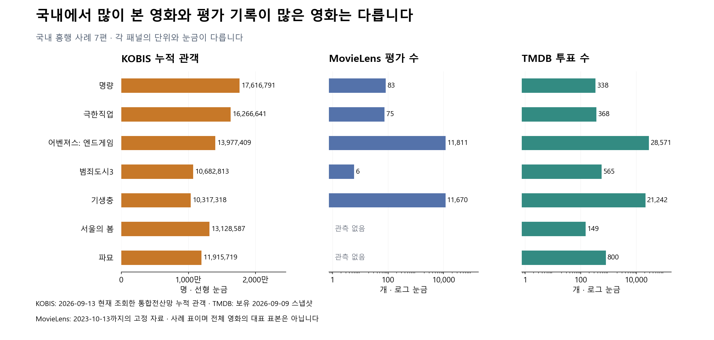
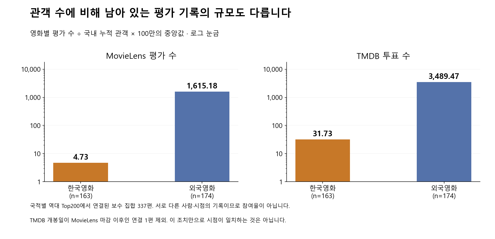

# 한국 박스오피스·TMDB·MovieLens 비교

상태: **DRAFT · 수집·수치 독립 검산 완료, 로컬 서비스 설계 자료** · 2026-09-13.
[추천 전체 흐름으로 돌아가기](README.md).

**국내 흥행을 MovieLens 평가 수나 TMDB 투표 수로 대신하기는 어렵다.
KOBIS를 한국에서 많이 본 영화의 후보 공급원으로 쓰되, 관객 수를 개인의 예상 별점으로
바꾸거나 모든 한국영화에 같은 가산점을 주지는 않는다.**

## 1. 세 자료가 기록하는 것은 서로 다르다

| 자료 | 데이터 수집 기간·시점 | 사용자 층·관측 대상 | 데이터 정보 | 특징 |
| --- | --- | --- | --- | --- |
| MovieLens 32M | 실제 기록 1995-01-09~2023-10-13 UTC | MovieLens에서 자발적으로 평가한 이용자. 서비스 사용자와 별개 | 사용자별 영화·별점·입력 시각, 영화별 평가 수·평균 | 개인 반응을 학습·채점할 수 있지만 시대·영화·활동량 분포가 현재 한국 서비스와 다름 |
| 보유 TMDB | 서비스 스냅샷 2026-09-09. 영화별 실제 조회 시각은 모두 확보하지 못함 | TMDB 참여자의 누적 투표, 영화 메타데이터 | 평균평점·투표 수·popularity·장르·국가·인물·줄거리 등 | 최신 영화 특징을 만들 수 있지만 개인별 평가 데이터는 이번 자료에 없음 |
| 이번 KOBIS | 2026-09-13 11:43~11:44 KST 조회. 통합전산망의 2004년 이후 누적 자료 | 한국 영화관의 발권 기록. 한국영화·외국영화 모두 포함 | 영화별 누적 관객·매출액·개봉일·영화코드 | 국내 극장 노출·흥행을 보완. OTT 시청량이나 관객의 만족도 별점은 아님 |

MovieLens 시점·총량은 [기존 원본 전수 감사](../../research/movielens-tmdb-data-audit.md),
보유 TMDB의 수집 편향은 [데이터 스냅샷 설명](../experiments/hybrid345/data-context/README.md)에 기록했다.
이번 KOBIS는 [통합전산망 역대 박스오피스](https://www.kobis.or.kr/kobis/business/stat/boxs/findFormerBoxOfficeList.do)의
현재 조회값이다. 연도별 상영관 연동률, 재개봉, 사후 보정의 영향을 받는다.
별도 메뉴의 확정 시점 통계와 구분하며 2004년 이후작이라고 이 문제가 모두 없어지는 것은 아니다.

**박스오피스는 지표의 종류이고 KOBIS는 그 자료의 출처다.** KOBIS 관객 수, KOBIS 매출,
TMDB 투표 수, TMDB 평점, TMDB popularity를 각각 다른 열로 관리한다.

## 2. 실제 영화의 차이

| 영화 | KOBIS 누적 관객 | KOBIS 누적 매출 / 억 원 | ML 평가 수 | ML 평균 / 5점 | TMDB 투표 수 | TMDB 평균 / 10점 |
| --- | ---: | ---: | ---: | ---: | ---: | ---: |
| 명량 | 17,616,791 | 1,357.65 | 83 | 3.506 | 338 | 6.993 |
| 극한직업 | 16,266,641 | 1,396.58 | 75 | 3.713 | 368 | 7.174 |
| 어벤져스: 엔드게임 | 13,977,409 | 1,224.91 | 11,811 | 3.871 | 28,571 | 8.242 |
| 범죄도시3 | 10,682,813 | 1,046.88 | 6 | 3.333 | 565 | 7.228 |
| 기생충 | 10,317,318 | 875.06 | 11,670 | 4.312 | 21,242 | 8.490 |
| 서울의 봄 | 13,128,587 | 1,279.31 | 관측 없음 | — | 149 | 7.600 |
| 파묘 | 11,915,719 | 1,151.66 | 관측 없음 | — | 800 | 7.654 |

KOBIS 수치는 현재 통합전산망 누적 집계다. 매출은 원 단위 원본을 1억으로 나눈 표시값이다.
MovieLens 평균은 실제 0.5 단위 별점 여러 개를 합친 값이므로 0.5 단위로 반올림하지 않았다.
개봉 이후 기간이 다른 누적값을 비교했으며, 영화별 차이를 설명하는 사례 표다.

명량·극한직업처럼 국내 극장 관객은 많지만 두 평가 자료의 관측량은 적은 영화가 있다.
기생충은 국내 관객뿐 아니라 두 자료의 평가도 많다. **한국 제작 여부 하나로 같은 보정값을
주는 방식은 이 영화들 사이의 차이를 놓친다.** 이 비교 자체로 원인을 한국 이용자 취향이라고
분리해 증명한 것은 아니다.

서울의 봄·파묘의 MovieLens 값을 0점으로 넣지 않았다. 관측 정답이 없다는 뜻이다.
이런 영화에 대한 GBT 점수는 만들 수 있어도 이 자료로 실제 한국 사용자 만족도를 채점할 수는 없다.

## 3. 전체 수집·연결 범위

| 단계 | 영화 수 | 해석 |
| --- | ---: | --- |
| KOBIS 한국영화 역대 상위 | 200 | 전체 한국영화 무작위 표본 아님 |
| KOBIS 외국영화 역대 상위 | 200 | 한국에서 집계한 외국영화 관객 수 |
| 제목·국가·개봉연도 조건으로 서비스 연결 | 371 | 한국181·외국190. 연결 조건 밖 29편은 제외 |
| A: 세 자료 양수 기록 연결 | 338 | 한국163·외국175. 기계적 연결 결과 |
| B: 추가 시점 이상 조건 제외 | **337** | 한국163·외국174. 아래 주요 통계에 사용 |
| 연결됐지만 ML 양수 평가 없음 | 33 | 별점 정답을 생성하거나 0으로 대체하지 않음 |

연결은 정규화한 정확 제목, 국가 조건, 개봉연도 차이 ±1년, 2004년 이후라는 보수적 조건을
충족하는 유일 후보만 사용했다. 과거의 수동 ID도 이 조건으로 재검증했다. 동명·재개봉·다대일
연결은 임의 선택하지 않았다. 다만 이것이 각 영화의 모든 ID 연결을 사람에게 검증받았다는 뜻은 아니다.

독립 검산에서 A의 **위키드** 연결은 TMDB 개봉일이 2024-10-16인데 MovieLens 평가가 11개
연결된 것으로 확인됐다. 원 수집 결과는 보존하고, B는 `TMDB 개봉일 > 2023-10-13` 또는
`MovieLens 제목 연도 > 2023`인 행을 제외했다. 이번에 해당한 것은 1편이다.
MovieLens 제목 연도 누락과 자료 간 연도 차이 후보도 [별도 목록](../../../outputs/recommendation-evidence/kobis-service-final-audit-20260913/sensitivity-a-b-year-candidates.csv)으로 남겼다.

**B도 시점이 맞춰진 평가셋은 아니다.** 개봉 전 평가인지 잘못된 연결인지 여기서 확정하지
않았으며, 이 제외만으로 나머지 평점의 실제 감상 여부가 보증되는 것도 아니다.
이 표는 현재 자료의 관측 규모를 비교한 기술통계다.

## 4. 관객 수에 비해 평가 기록이 얼마나 남아 있는가

각 영화마다 `평가 수 ÷ KOBIS 누적 관객 × 1,000,000`을 계산한 뒤 중앙값을 구했다.
전체 평가 수 합계를 전체 관객 합계로 나눈 값과는 다르다.

| B 집합 | 영화 수 | 국내 관객 100만당 ML 평가 수 중앙값 | 국내 관객 100만당 TMDB 투표 수 중앙값 | TMDB / ML 평가 수 중앙 배수 |
| --- | ---: | ---: | ---: | ---: |
| 한국영화 | 163 | **4.73** | **31.73** | 6.13배 |
| 외국영화 | 174 | **1,615.18** | **3,489.47** | 1.97배 |

이 수치는 **한국 극장 관객의 평점 참여율이 아니다.** MovieLens·TMDB 평가자는 한국에서
그 영화를 본 관객과 동일 집단이 아니고, 집계 기간도 다르다. “관측 기록 규모를 한 단위로
비교한 값”까지만 해석한다. 모든 한국/외국 영화의 분포로 일반화하거나 국적별 별점 가산계수로
옮기지 않는다.

## 5. 상관관계는 집단을 나눠 읽어야 한다

| B 집합 | KOBIS 관객 ↔ ML 평가 수 | KOBIS 관객 ↔ TMDB 투표 수 | ML 평가 수 ↔ TMDB 투표 수 |
| --- | ---: | ---: | ---: |
| 한국163편 | 0.4061 | 0.4211 | 0.8626 |
| 외국174편 | 0.1354 | 0.3204 | 0.7307 |
| 합친337편 | −0.0794 | −0.0292 | 0.9413 |

모두 Spearman 순위 상관이다. 한국·외국을 합친 관객 상관만 보면 관계가 거의 없다고 읽기
쉽지만, 국적 집합 안에서는 양의 관계가 나타난다. **집단을 섞는 방식이 결론에 영향을 주므로
“흥행과 평점 데이터는 무관하다”고 결론 내리지 않는다.** 평가 수의 관계이지 평균 별점의
인과효과를 측정한 것도 아니다.

별도로 기존 **82,181편 ML–TMDB 평가 수 전수 비교**에서는 영화별 배수 중앙값 4.40,
5~95백분위 0.41~28.00배였다. 양쪽 평가100개 이상 10,702편에서도 0.14~6.93배였다.
현재 KOBIS 표본의 337편 결과와 모집단·선정 조건이 다르므로 같은 표본처럼 합치지 않는다.
[기존 전수 비교](../experiments/hybrid345/PRESENTATION-DECISION.md#핵심-데이터-비교--평가-수가-단지-일정-배수로-다른가).

## 6. 박스오피스 자료를 추천에 쓰는 위치

| 자료·정책 | 이번 판단 |
| --- | --- |
| 국내 극장 인기 | KOBIS 누적 관객순 후보를 확보한다. 국적을 가리지 않고 한국에서의 흥행을 사용 |
| 매출 | 자료에 보존하고 발표에 비교. 관객 수와 중복 가산하지 않음 |
| TMDB 대중평가 | 투표 수를 고려한 Q로 후보 정렬. KOBIS 관객을 Q의 투표 수로 대체하지 않음 |
| TMDB popularity | 기존 모델 특징은 기존 생성 규칙 유지. 관객·투표 수와 같은 값이라고 부르지 않음 |
| 한국영화 일괄 보너스 | 채택하지 않음. 작품마다 관측 규모가 다르고 같은 보너스의 효과를 측정하지 못함 |
| KOBIS 없는 영화 | 미관측으로 유지. OTT 영화·자료 범위 밖 영화를 관객0/인기없음으로 감점하지 않음 |
| GBT에 KOBIS 새 특징 추가 | 현재는 하지 않음. 현 모델이 학습하지 않은 열을 추가하면 안 됨 |

따라서 [전체 설계](README.md#5-kobis를-어디에-넣는가)의 **초기 Q/KOBIS 교대와 발견 그룹별
Q20+KOBIS5**를 로컬 운영안으로 선택한다. 두 출처가 후보에 참여하도록 한 결정이며,
이 비율에서 MSE나 Top2가 개선됐다는 실험은 하지 않았다. 개인화 발견의 최종 순위는 기존
GBT+ALS 개인 점수로 결정한다.

TMDB 원본에는 `details.revenue` 필드가 있음을 확인했다. 다만 이번 검사는 원본 한 건의
필드 존재 확인이며, 전체 카탈로그에서의 채움률·국가별 범위·동일 영화 매출 비교는 수행하지
않았다. **이 보고서에 TMDB 매출 수치를 수집·비교한 것처럼 추가하지 않는다.** 영화 상세
조회 경로는 [TMDB 공식 문서](https://developer.themoviedb.org/reference/movie-details)에 있다.
현재 국내 흥행 후보는 출처와 범위가 명확한 KOBIS 관객 자료를 사용한다.

KOBIS 일별 API의 `audiCnt`와 누적 `audiAcc`도 구분해야 한다. 누적값을 날짜별로 더하지 않는다.
이번처럼 누적 스냅샷을 갱신할 때는 새 값으로 교체하고 `fetched_at`·집계 범위를 함께 기록한다.
[KOBIS API 안내](https://www.kobis.or.kr/kobisopenapi/homepg/apiservice/searchServiceInfo.do).

## 7. 검증과 보존한 파일

수집 코드를 실행 전 독립 검토한 뒤, 국적별 최대200의 두 공개 통계 조회만 실행했다.
로그인된 GitLab·Notion 계정을 사용하지 않았다. 별도 검토자가 원 HTML400행, 비교표400행×32열,
A338편의 통계와 B337편 민감도 결과를 독립적으로 확인했다.

| 파일 | 용도 |
| --- | --- |
| [7편 사례 표](data-v2/movie-examples.csv) | 그림·문서의 예시 원수치, 매출 원 단위 포함 |
| [영화별 전체 비교](../../../outputs/recommendation-evidence/kobis-service-final-20260913/movie-comparison.csv) | 수집400행, 연결 상태·평점·관객·매출·ID |
| [원 수집 manifest](../../../outputs/recommendation-evidence/kobis-service-final-20260913/manifest.json) | 원 HTML·쿼리·시각·입출력 해시 |
| [독립 감사](../../../outputs/recommendation-evidence/kobis-service-final-audit-20260913/result-review.json) | 수치 PASS 및 미래 개봉 연결 발견 |
| [A/B 통계](../../../outputs/recommendation-evidence/kobis-service-final-audit-20260913/sensitivity-a-b-statistics.csv) | 원집합338과 보수집합337 |
| [B 정의](../../../outputs/recommendation-evidence/kobis-service-final-audit-20260913/sensitivity-b.json) | 정확한 제외 조건과 집합 해시 |
| [그림 생성 manifest](data-v2/manifest.json) | 입력·스크립트·그림 해시 |

기존 REC-DATA-005는 외국영화 위주로 **연도별 관객과 역대 누적 관객 중 최댓값**을 섞었던
자료다. 그 수치를 모든 영화의 동일한 누적 관객이라고 재사용하지 않았다. 과거 자료와 봉인은
보존하고 이번 현재 누적 비교를 별도 수집했다.
