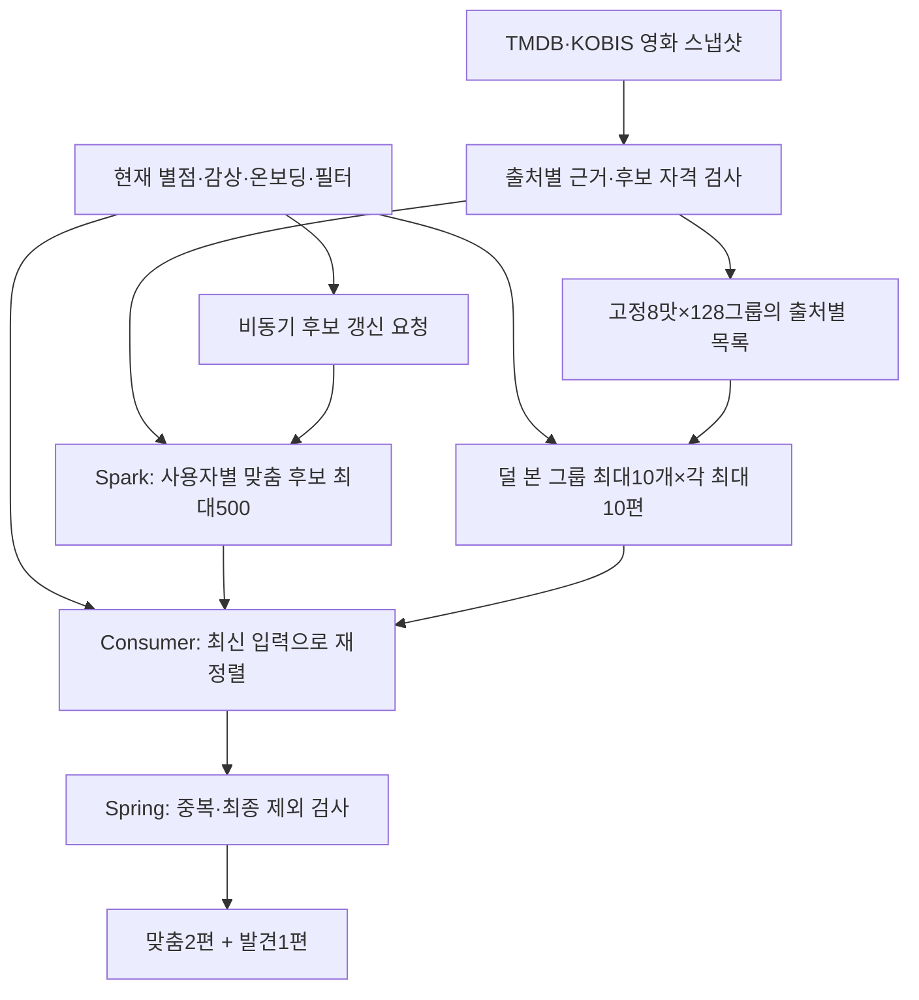

# FEELM 추천 시스템 v1

상태: **APPROVED — 이번 사용자 지시에 따른 로컬 구현 기준** · 2026-09-13.
팀 저장소의 계약 변경·코드 구현·모델 배포가 완료되었다는 뜻은 아니다.

**GBT를 기본 모델로 사용한다. 맞춤 후보는 배치에서 만들고 현재 사용자 입력으로 재정렬한다.
한 번에 맞춤2편과 발견1편을 제공한다. 발견은 최대10개 그룹에서 최대10편씩 고른다.**

영화 상세에는 [비슷한 영화 기본10편](SIMILAR-MOVIES.md)을 추가한다. 기존 콘텐츠 벡터·
pgvector 검색·영화별 공용 캐시를 사용하며, 맞춤2+발견1 세트와 별도로 제공한다.

이 폴더가 추천의 첫 서비스 명세 v1이다. 앞서 작성한 `service-final-20260913`,
`service-popularity-v2-20260913`은 연구·중간 설계 이력으로 보존한다. 구현에서는 이 문서를
우선한다. 기존 문서의 ALS 기본/자동 혼합, 유형별2편, 전체 카탈로그 요청 시 추론,
발견25편씩 공급, 대중 지표가 모두 없는 영화의 콘텐츠 보충 규칙을 이어받지 않는다.

## 읽는 순서

| 문서 | 구현할 내용 |
| --- | --- |
| [정책](POLICY.md) | K·이력·후보 자격·맞춤·발견10×10·맞춤2+발견1·부족 처리 |
| [KOBIS 데이터 연결](KOBIS-DATA.md) | 확대 수집72,700행, 영화 식별 제안/확정, 누적 기준일, 후보·학습에 쓰는 조건 |
| [모델과 특징](MODELS.md) | GBT/FM/ALS adapter, TMDB·KOBIS 반응 특징, 학습·보정·비교·산출물 |
| [ALS 결합 비교군](HYBRID-COMPARISONS.md) | ALS+GBT·ALS+FM의 전환/혼합, 미지원 처리, 기여도 비교와 구현 검수 |
| [비교 registry](comparison-registry.v1.json) | 단독3개+결합4개의7개 점수 경로. 기본 노출 GBT 유지 |
| [고정 그룹](GROUPS.md) | 전처리·8×128 중심·평균 대표·신규 영화 배정·0벡터·원파일 선택 |
| [상세의 비슷한 영화](SIMILAR-MOVIES.md) | GKT131 재사용·pgvector HNSW·공용50편 캐시·기본10편·로그인 제외·오류·갱신 |
| [유사 영화 설정](similar-movies.v1.json) | API 크기·검색/캐시 상한·버전·검수 예산. 기존 settings.py와 모델 설정은 유지 |
| [API·DB·이벤트 계약](CONTRACTS.md) | 실제 팀 코드와의 차이, payload·저장 구조·버전·수정 범위 |
| [배치와 운영](OPERATIONS.md) | 후보500·실시간 재정렬·신규 사용자·이벤트·게시·장애·배포 순서 |
| [설정](config.v1.json) | 단위와 의미가 고정된 v1 기본값. 기존 settings.py를 대체하는 파일이 아님 |
| [특징 목록](feature-schema.v1.json) | 순서가 고정된245열과 원230열 출처 |
| [학습 설정](training-recipe.v1.json) | 고정 역할·학습 파라미터·결측 증강·순차 실행 한도 |
| [그룹 구성 설정](group-recipe.v1.json) | 원본 파일·배열 해시와 복사할 키. 과거 추천 정책은 제외 |
| [구현 검수 기준](ACCEPTANCE.md) | 정상·부족·결측·동시 요청·모델 교체에 대한 요구사항과 판정 |
| [평가 지표 계약](EVALUATION.md) | 정답·UNKNOWN·공통 분모·MSE/순위식·bootstrap·안전 한계 |

데이터의 수집 범위·관계·표준편차·그래프는 [별도 데이터 분석 문서](../../research/tmdb-kobis-v1-20260913/REPORT.md)에 둔다.
서비스 정책 숫자와 데이터에서 확인한 통계 수치를 서로 다른 문서로 관리한다.
[발표 자료 6장](presentation/feelm-recommendation-v1.pptx)은 데이터 차이·모델 선택·맞춤·발견 흐름을 요약한다.
발표 파일은 결합 비교군과 KOBIS 확대 수집을 반영하기 전의 기본 구성 요약이다. 최신 내용은 이 폴더의 문서를 따른다.

KOBIS는 연도별 전체72,700개 영화·연도 기록까지 수집·검산을 마쳤다. 고유 영화72,700편이
아니며, 직접 코드2,176개와 TMDB 대응 제안도 서비스 영화와의 확정 연결과 다르다.
이번 확대 자료의 확정 출처 간 연결은0개이므로 수집 완료가 KOBIS245 모델의 준비 완료는 아니다.
관객 수의 기준일·영화 연결·평가 교집합을 확인하는 순서는 [KOBIS-DATA](KOBIS-DATA.md)에 정리한다.

독립 [통계 검토](../../../outputs/recommendation-evidence/tmdb-kobis-v1-20260913/result-review.md),
[모델·정책 검토](../../../outputs/recommendation-evidence/service-v1-implementation-20260913/model-policy-review.md),
[후속 모델 검토](../../../outputs/recommendation-evidence/service-v1-implementation-20260913/model-policy-review-r2.json),
[평가 설계 검토](../../../outputs/recommendation-evidence/service-v1-implementation-20260913/evaluation-design-review-r2.json),
[최종 파일 검증](../../../outputs/recommendation-evidence/service-v1-implementation-20260913/delivery-review.json)을 함께 남긴다.
이 검토는 문서·자료의 정확성에 대한 것이며 새 모델 학습이나 구현 테스트 PASS를 뜻하지 않는다.
위 검토는 각각 당시 버전에 대한 기록이다. ALS 결합 비교군 추가의 최신 검토/변경 파일은
[확장 검증 기록](../../../outputs/recommendation-evidence/hybrid-comparison-extension-20260913/delivery-review.json)에 연결한다.
KOBIS 확대 수집 반영 이후 문서의 정합성은 [이번 문서 검토](../../../outputs/recommendation-evidence/kobis-document-update-20260913/document-review.json)를 따른다.
이전 문서 원본은 같은 작업 폴더의 `before/`에 보존하며, 과거 수치·그래프·모델 결과의 봉인을 갱신 문서의 검증으로 대체하지 않는다.

후속 유사 영화 기능의 최신 설계 검토는 [상세 유사 영화 확장 검토](../../../outputs/recommendation-evidence/similar-movies-design-20260913/design-review.json)다.
이전 검토의 문서 원본은 해당 확장 폴더 `before/`에 보존한다. 검색 인덱스·실제 추천 품질의 검수 완료와 구분한다.

## 전체 흐름

실제 평가10편 미만은 콘텐츠·대중 순위, 준비된 개인화 경로는 GBT를 사용한다.
FM·ALS와 ALS+GBT·ALS+FM은 같은 입력의 비교 로그를 남긴다. 모델 미준비·후보 부족은 응답 상태로 구분한다.

## 확정한 서비스 구성

| 결정 | v1 |
| --- | --- |
| 기본 모델 | GBT 단독. ALS 자동 우선/지원량 혼합 없음 |
| 비교 모델/정책 | FM·ALS와 ALS+GBT·ALS+FM의 전환/혼합. shadow 결과 저장, 노출 모델 자동 변경 없음 |
| 반환 | 맞춤2 + 발견1. 추가 요청도 같은 구성 |
| 상세의 비슷한 영화 | 별도 목록 기본10편. 기존131차원 벡터로 검색하고 공용 결과 캐시. 새 모델 학습 없음 |
| 맞춤 후보 | Spark 배치가 사용자별 최대500편 생성, Consumer가 현재 입력으로500편 전부 재정렬 |
| 발견 후보 | 8맛×맛당128개 하위 그룹 중 최대10개 공급 그룹, 그룹당 최대10편, 총≤100 |
| 대중성 | TMDB·KOBIS 출처별 근거를 상호 보완. 후보에서는 OR, 개인 예측에서는 별도 특징 |
| 거의 근거 없는 영화 | 두 출처 모두 최소 근거를 충족하지 못하면 추천 후보에서 제외 |
| 입력 | 실제 별점0.5 단위. K는 현재 실제 별점 영화 수, 모델 입력은 최신 원본10편 |
| 업데이트 | 사용자 반응·예측·순위는 입력에 맞춰 갱신. 매 평가마다 모델을 재학습하지 않음 |

사용자가 정한 것은 모델 역할·반환 구성·배치 후 재정렬·발견10×10·대중성 상호 보완이다.
K10, 후보500, TMDB21표/KOBIS1만 관객, 일별06:00, 세트10라운드는 구현을 위해 명시한
**운영 기본값**이다. 최적성을 실험으로 입증한 숫자라고 발표하지 않는다.

## GBT를 기본으로 선정하는 이유

MovieLens·TMDB·KOBIS는 시점·이용자·영화 접근 경로와 관측 단위가 다르다. 데이터 분포
차이는 MovieLens의 오차만으로 현재 한국 서비스 적합성을 결정하기 어렵다는 근거다.
그 그래프가 GBT의 한국 사용자 만족도 우위를 직접 증명하는 것은 아니다.

GBT는 영화 속성과 사용자가 그 속성에 보인 반응으로 계산하므로, MovieLens factor가 없는
영화에도 입력 특징이 있으면 점수를 만들 수 있다. 새 서비스의 작은 이력으로도 공유 모델에
사용자 특징을 제공할 수 있다. 이 성격과 기존 개발 비교에서 유지한 점수 수준을 함께 고려해
**사용자가 v1 기본 모델로 GBT를 선정했다.** FM·ALS를 남겨 실제 같은 요청에서 차이를 확인한다.

| 기존 개발 결과 | 값과 의미 |
| --- | --- |
| 전체 관측 후보 FM/GBT 3seed 평균 MSE | 0.6890 / 0.6793 |
| 전체 관측 후보 NDCG@2 | FM0.8373 / GBT0.8359 |
| ALS 지원 목표 MSE | ALS0.6938. 위 전체 후보와 분모가 달라 직접 빼면 안 됨 |
| ALS 미지원 목표 | ALS0/624행 점수화. FM·GBT는 같은624행을 계산 |

위 수치는 [기존 hybrid345 결과](../experiments/hybrid345/RESULT.md)의 서로 다른 표에서 가져왔다.
FM/GBT의 확실한 통계적 승자는 확인되지 않았다. **새 KOBIS245열 모델의 점수도 아니다.**
과거 router 성능으로 새 GBT 단독·10×10·배치500·맞춤2+발견1 정책의 검증을 대신하지 않는다.

## 구현 가능 상태와 남은 산출물

기존 GBT/FM230열 모델·ALS factor·GKT128 분류 자료는 로컬 연구 산출물로 존재한다.
v1은 KOBIS 영화 정보와 사용자 반응을 포함한245열 GBT/FM 계약을 정의한다. 이 새 모델은
아직 학습하지 않았으므로 실제 파일·해시·보정 계수는 존재한다고 채워 넣지 않는다.

개발자는 지금 문서로 수집 adapter·후보 배치·특징 생성·공통 scorer·Consumer·세트 API·
검수 코드를 작성할 수 있다. 새 모델 파일이 필요한 통합 검수는 fixture로 먼저 수행하고,
실제 활성화는 [모델 준비 조건](MODELS.md)을 통과한 산출물만 허용한다. 기존230열을245열인
것처럼 로드하거나 준비가 안 됐다는 이유로 ALS를 기본으로 바꾸지 않는다.

실제 팀 API·DB 변경은 CONTRACTS의 변경 목록을 해당 코드와 함께 이행해야 한다.
이 작업에서는 로컬 문서·분석·장표만 작성하며 GitLab·Notion·Jira·배포를 변경하지 않는다.

상세 유사 영화는 별도 `SIMILARITY_NOT_READY`/준비 상태를 가진다. GKT 벡터 export·서비스 ID 연결·
pgvector 인덱스·Spring API/캐시 검수로 준비하며 GBT/FM245 학습이나 발견 중심 배정 완료를 기다리지 않는다.
현재 팀의 E5 잠정 표현을 GKT로 재사용하는 차이는 SIMILAR-MOVIES §6에 명시했고 팀 계약은 아직 수정하지 않았다.
