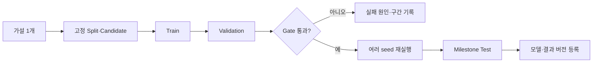

# MovieLens 기반 추천 성능 평가·개선 설계

- 문서 상태: 개인 프로젝트 실험 기준 초안
- 작성일: 2026-08-29
- 적용 범위: 예상 별점, 개인 추천, 탐험 추천, 파티 추천
- 데이터 제약: 학습·검증·최종 평가에 MovieLens 32M과 그 부속 데이터만 사용

## 1. 먼저 내릴 결론

FEELM의 추천 성능을 하나의 숫자로 정하지 않는다. 같은 추천 코어를 사용하더라도 제품 기능별
질문이 다르기 때문이다.

| 기능 | 답해야 하는 질문 | 1차 지표 | 함께 봐야 할 지표 |
| --- | --- | --- | --- |
| 예상 별점 | 그 사용자가 자신의 척도로 실제 몇 점을 줄지 맞추는가 | 사용자 macro `MAE` | 사용자 중심화 MAE, within-user 순위 상관, Calibration, Coverage |
| 개인 Top-N | 그 사용자가 상대적으로 더 선호할 영화를 상위에 놓는가 | 사용자 정규화 `NDCG@10` | Pairwise concordance, 상대 Recall@10, 하위 선호 노출률, Catalog Coverage |
| 탐험 추천 | 취향 밖이지만 받아들일 만한 영화를 주는가 | 관련성 제약을 만족한 Novelty | Intra-list Diversity, Calibration, NDCG 손실 |
| 파티 추천 | 개인별 점수 습관을 제거한 뒤 불리한 구성원을 줄이는가 | 구성원 `min normalized utility` | 평균 normalized utility, 구성원 격차, 하위 선호 구성원 비율 |
| 시스템 | 데이터가 커져도 재현 가능하게 계산하는가 | 학습·전체 추천 생성 시간 | p95 응답, 처리량, Worker 증가 대비 Speedup |

개인 추천의 대표 지표는 **전체 후보 영화 기준 사용자 정규화 macro NDCG@10**으로 둔다. 예상 별점은
**MAE와 Calibration**을 대표 기준으로 둔다. 두 점수는 같은 것이 아니므로 모델의 원점수
`rawPreference`는 순위에 사용하고, 표시용 `predictedRating`은 검증 데이터에서 별도로 보정한다.
`predictedRating`은 보편적 만족도가 아니라 해당 사용자가 자신의 1~5 척도에서 줄 것으로 예상되는
점수다. 서로 다른 사용자의 `predictedRating`을 그대로 평균하거나 우열 비교하지 않는다.

MovieLens 32M은 200,948명의 32,000,204개 명시적 평점과 87,585편의 영화로 구성되어 있어
분산 추천 실험에 충분히 크다. 다만 MovieLens 사용자가 자발적으로 평가한 항목만 관측한
데이터이므로, **평가하지 않은 영화는 싫어한 영화가 아니다**. 이 한계를 모든 지표와 후보 생성에
반영해야 한다.[^movielens-readme][^movielens-history]

## 2. 고정할 평가 프로토콜

### 2.1 최종 성능: 전역 시간 분할

무작위 분할은 미래의 상호작용이 과거 모델 학습에 들어갈 수 있다. 최종 비교는 모든 Rating을
하나의 시간축으로 정렬한 뒤 다음처럼 분리한다.

```text
과거 -----------------------------------------------> 미래
Train (초기 80%) | Validation (다음 10%) | Test (마지막 10%)
                 t_validation          t_test
```

80/10/10은 시작 비율이다. 실제 cutoff를 고정하기 전에 각 구간의 사용자 수, 영화 수, 양성 평가 수,
신규 사용자·신규 영화 비율을 확인한다. cutoff를 확정한 뒤에는 모든 알고리즘이 같은 파일을
사용한다.

- `Train`: 모델과 인기도·사용자 프로필·콘텐츠 통계를 만든다.
- `Validation`: 하이퍼파라미터, 별점 보정기, Re-ranking 가중치와 품질 손실 허용치만 정한다.
- `Test`: 마일스톤별 최종 비교에만 사용하며 반복 튜닝에 사용하지 않는다.
- 각 시점의 추천 후보는 그 시점의 Train에 한 번이라도 등장한 영화로 제한한다.
- Test에서 처음 등장한 사용자·영화는 버리지 않고 `NEW_USER`, `NEW_ITEM`, `BOTH_NEW`로 분리해
  fallback 성능과 발생률을 보고한다.

전역 시간 분할이 필요한 이유는 사용자별 시간 분할이나 무작위 분할이 다른 사용자의 미래
상호작용을 학습에 섞을 수 있고, 분할 방식에 따라 모델 순위까지 달라질 수 있기 때문이다.
[^leakage]

### 2.2 개인화 모델 진단: 사용자별 시간 분할

전역 분할만으로는 충분한 과거가 있는 사용자의 순수 개인화 능력을 세밀하게 보기 어렵다. 따라서
각 사용자 평가를 시간순으로 나눈 `warm-user diagnostic`도 별도로 실행한다.

- 최소 이력 조건을 만족하는 사용자만 포함한다.
- 사용자별 초기 80%는 Train, 다음 10%는 Validation, 마지막 10%는 Test로 둔다.
- 이 결과는 개인화 모델의 오류 분석에만 사용하고 대표 성능으로 발표하지 않는다.
- 전역적으로 미래 정보가 섞일 수 있다는 한계를 결과표에 표시한다.

### 2.3 Cold Start 진단

사용자가 초기에 몇 편만 평가한 상황을 그대로 만든다.

| Bucket | 모델에 제공할 사용자 이력 | 측정 목적 |
| --- | --- | --- |
| `K0` | 0편 | 인기·콘텐츠 fallback |
| `K1` | 최초 1편 | 극초기 반응 |
| `K3` | 최초 3편 | 최소 온보딩 후보 |
| `K5` | 최초 5편 | 짧은 온보딩 |
| `K10` | 최초 10편 | Fold-in 안정화 |
| `K20` | 최초 20편 | 일반 사용자 진입점 |

각 K 이후에 기록된 평가만 정답으로 사용한다. K별 NDCG@10, Recall@10, MAE, 예측 Coverage를
그린다. 이 곡선이 온보딩에서 몇 편을 평가받아야 하는지 결정하는 제품 근거가 된다.

Spark ALS는 학습에 없던 사용자나 영화의 예측을 `NaN`으로 반환하며 `coldStartStrategy=drop`으로
평가 행을 제거할 수 있다. `drop`은 계산을 가능하게 할 뿐 cold start를 해결하지 않는다. 따라서
**제거한 행 비율을 Coverage로 반드시 함께 기록**하고, 제품 성능은 fallback까지 포함한 값도
따로 측정한다.[^spark-als]

## 3. 정답과 후보 영화를 정의하는 법

### 3.1 Rating Prediction

관측된 Test Rating만 정답으로 사용한다.

- `MAE`: 예상 별점 표시의 대표 지표. 사용자가 보는 별점과 같은 단위라 해석하기 쉽다.
- `RMSE`: 큰 오차를 더 강하게 벌주는 보조 지표.
- `Prediction Coverage`: Test Rating 중 정상 예측 또는 fallback 예측을 반환한 비율.
- `Calibration`: 예측 1.0~1.5, 1.5~2.0 등의 구간에서 실제 평균 별점이 해당 예측과 맞는지 측정.
- `User-centered MAE`: 사용자별 평균을 제거한 선호 차이를 얼마나 맞추는지 측정.
- `Within-user rank correlation`: 같은 사용자가 평가한 영화들의 상대 순서를 맞추는지 측정.
- 사용자별 macro 평균을 대표값으로 쓰고, 활동량이 많은 사용자가 결과를 지배하는 micro 값도
  보조로 남긴다.

ALS 원점수는 1~5를 벗어날 수 있다. Validation 예측과 정답만으로 단조 보정기(예: isotonic
regression)를 학습한 뒤 1~5 범위로 제한하고, Test에는 고정된 보정기만 적용한다. 신뢰 단계는
임의 점수가 아니라 Validation에서 관측한 이력 수·영화 인기도·사용자 rating style 구간별 절대
오차로 정한다. 이력이 부족해 개인 척도를 추정할 수 없으면 숫자형 예상 별점을 숨긴다.

### 3.2 Top-N Ranking

평가하지 않은 영화를 부정 사례로 단정하지 않는다. 평가 시점에 이미 알려진 영화 중 사용자가
Train에서 본 영화를 제외하고 순위를 만든다. 모든 사용자에게 `4점 이상`을 같은 양성으로 두지
않는다. 후하게 점수를 주는 사용자와 박하게 주는 사용자의 rating scale이 다르기 때문이다.

Train rating만 사용해 개인별 중간 순위 empirical CDF를 계산하고, 이력이 적으면 global CDF로
수축한다.

```text
relativeUtility(u, r)
  = n_u / (n_u + lambda) * midRankECDF_u(r)
  + lambda / (n_u + lambda) * midRankECDF_global(r)
```

`lambda`는 Validation에서 고정하며 Test를 본 뒤 바꾸지 않는다. 결과는 0~1 범위이고 “이 사용자가
평소 준 점수 중 어느 정도로 높은가”를 뜻한다.

- graded relevance: held-out rating의 `relativeUtility`
- 대표 지표: 사용자 정규화 macro NDCG@10
- 상대 Recall@10: `relativeUtility` 상위 30% held-out item 회수율
- Pairwise concordance: 같은 사용자가 더 높게 평가한 영화의 순서를 맞춘 비율
- 하위 선호 노출률: 사용자별 하위 20% held-out item이 Top-N에 들어온 비율
- 고정 `rating >= 4` 결과: 비교·민감도 분석으로만 남기고 채택 기준으로 사용하지 않음

K0처럼 개인 rating scale이 없는 사용자는 global fallback 결과로 분리하고 개인화 성능에 합치지
않는다. 사용자별 rating scale도 시간에 따라 변할 수 있으므로 cutoff별 분포 변화를 함께 기록한다.

### 3.3 MovieLens로 판단할 수 없는 온라인 성공

MovieLens는 어떤 추천을 노출했는지, 추천 때문에 영화를 선택했는지, 추천 자체가 선택에 도움이
됐는지를 제공하지 않는다. 따라서 MovieLens의 held-out rating으로 FEELM의 “추천 성공률”을 직접
정의하지 않는다.

MovieLens 안에서 계산한 사용자 정규화 지표도 **알고리즘을 같은 조건에서 비교하는 오프라인
도구**일 뿐이다. MovieLens 사용자의 rating 분포나 정규화 경계를 FEELM 사용자에게 그대로
이식하지 않는다. 실제 예상 별점 calibration과 사용자 scale은 FEELM 평가가 쌓인 뒤 별도
version으로 다시 검증한다.

- 노출→상세→OTT→감상은 추천이 선택 과정에 사용됐는지를 보여주는 행동 funnel이다.
- 실제 Rating은 영화 결과와 개인 예상 별점 오차를 보여주지만 추천 만족과 같지 않다.
- FEELM은 별도 설문 대신 사용자별 rating scale, 행동 funnel, 감상, 실제 평가를 연결해
  `estimatedRecommendationUtility`를 자동 산출한다.
- 초기에는 선택 여부와 개인 상대 효용을 별도 성분으로 보고, 검증되지 않은 가중합 하나로
  합치지 않는다. FEELM 노출 데이터가 쌓인 뒤 adoption과 post-watch utility를 별도 예측한다.
- 자동 산출값은 직접 관측한 만족이 아니므로 발표와 UI에서 `추천 결과 효용 추정치`로 부른다.

FEELM 실제 데이터가 생기면 raw 4~5점 비율 대신 개인별 rating percentile·개인 baseline 대비
residual을 보조 결과로 사용한다. 이 값은 사용자의 개인적 결과를 더 잘 반영하지만 추천에 대한
감정을 직접 관측한 값은 아니다.

### 3.4 전체 후보 평가와 sampled negative

최종 모델 비교에서는 Train에 알려진 전체 영화 후보를 사용한다. 개발 속도를 위해 사용자마다
일부 negative를 추출한 빠른 실험은 허용하지만 다음 조건을 붙인다.

- 모든 모델에 같은 사용자·후보·seed를 사용한다.
- 빠른 실험 결과에는 `SAMPLED`를 표시한다.
- 최종 채택과 발표 수치는 `FULL_CATALOG`로 다시 계산한다.
- sampled 결과와 full-catalog 결과를 같은 표에서 직접 우열 비교하지 않는다.

샘플링된 후보에서 계산한 Recall, AP, NDCG가 전체 후보 지표와 일치하지 않고 알고리즘의 순위도
뒤집을 수 있다는 연구 결과가 있으므로, sampled 평가는 후보 탈락용으로만 쓴다.[^sampling]

## 4. 기준선부터 쌓는 개선 순서

새 모델을 추가하기 전에 아래 기준선을 같은 분할·후보·평가 코드로 모두 실행한다.

| 단계 | 모델 | 검증하려는 것 | 다음 단계 조건 |
| --- | --- | --- | --- |
| B0 | Global/User/Item Mean·Bias | 별점 예측의 최소 기준 | ALS가 MAE에서 이겨야 함 |
| B1 | Bayesian Popularity | 개인화 없는 Top-N 기준 | 개인 모델이 NDCG에서 이겨야 함 |
| B2 | ItemKNN | 단순 이웃 기반 개인화 | ALS와 정확도·비용 비교 |
| B3 | Explicit ALS | 공통 선호 예측 기준 모델 | 튜닝된 단순 기준선으로 고정 |
| B4 | ALS + 장르/TMDB 콘텐츠 fallback | 신규·희소 사용자와 영화 보완 | K0~K10과 Coverage 개선 |
| B5 | ALS·콘텐츠 Candidate 합집합 + Re-ranking | 정확도와 Coverage 동시 개선 | ALS 대비 paired CI가 양수 |
| B6 | Calibration·Novelty Re-ranking | 취향 탐험 | 관련성 손실 예산 안에서 Pareto 개선 |
| B7 | 파티 집계 정책 | 개인별 정규화 효용을 재사용 | 평균 효용을 유지하며 최저 구성원 효용 개선 |

잘 튜닝한 단순 Matrix Factorization이 제대로 튜닝되지 않은 최신 모델보다 강할 수 있고, 여러
신경망 추천 논문의 결과가 강한 단순 기준선과 비교하면 재현되지 않은 사례가 보고되었다. 따라서
FEELM에서는 모델 이름의 새로움보다 **동일 프로토콜의 튜닝된 기준선**을 우선한다.
[^baseline-difficulty][^progress]

### 4.1 ALS 첫 탐색 범위

| Parameter | 1차 후보 |
| --- | --- |
| `rank` | 32, 64, 128 |
| `regParam` | 0.01, 0.05, 0.1, 0.2 |
| `maxIter` | 10, 20 |
| `seed` | 빠른 탐색 1개, 최종 후보 3개 이상 |

빠른 탐색은 MovieLens의 고정 Train 부분집합에서 하고, 상위 조합만 전체 데이터로 확장한다.
Spark의 ALS-WR은 Rating 수에 따라 정규화하므로 부분집합에서 찾은 `regParam`이 전체 규모에도
비교적 이전되도록 설계되어 있다. 그래도 최종 선택은 전체 Validation으로 재확인한다.[^spark-als]

ALS는 RMSE 최저 조합만 고르지 않는다. 다음 순서로 고른다.

1. Bias 기준선보다 MAE와 Calibration이 나쁘지 않은 후보만 남긴다.
2. 남은 후보 중 full-catalog NDCG@10이 가장 좋은 모델을 선택한다.
3. NDCG가 비슷하면 Coverage가 높고 학습·서빙 비용이 낮은 모델을 선택한다.

## 5. 탐험 추천의 성능

MovieLens만으로는 사용자가 실제로 “새 취향을 발견해 만족했다”는 정답을 직접 관측할 수 없다.
따라서 탐험 만족도를 오프라인 수치 하나로 주장하지 않고 다음 대리 지표를 묶어 본다.

| 지표 | 의미 | 실패하는 경우 |
| --- | --- | --- |
| Relevant NDCG@10 | 탐험 영화도 좋아할 가능성이 있는가 | 새롭지만 싫어할 영화 |
| Novelty | 덜 인기 있는 영화를 노출하는가 | 인기작만 반복 |
| Intra-list Diversity | 추천 목록 내부가 서로 다른가 | 같은 장르·시리즈 반복 |
| Genre/Tag Calibration | 사용자의 여러 관심 비율을 반영하는가 | 한 가지 주 취향만 과대표현 |
| Profile Distance | 기존 취향에서 얼마나 벗어났는가 | 너무 가깝거나 너무 먼 탐험 |

Novelty와 Diversity는 정확도와 별개의 추천 가치이며, 순위와 관련성을 함께 반영해야 한다.
Calibration Re-ranking은 MovieLens의 장르 분포를 활용해 사용자의 여러 관심사를 추천 목록에
비례해 반영하는 방식으로 검증된 바 있다.[^novelty-diversity][^calibration]

현재 로컬 `ml-32m.zip`에는 Tag Genome 파일이 없다. 콘텐츠 거리는 MovieLens 장르를 기준선으로
하고, TMDB 장르·감독·배우·키워드와 제목·줄거리 임베딩을 순서대로 추가한다. `tags.csv`는 자유
태그이므로 사용자별 기여 상한과 정규화를 거친 약한 특징으로만 검증한다. 실제 누락률과 사용 규칙은
[MovieLens 32M · TMDB 실제 데이터 감사](./movielens-tmdb-data-audit.md)를 따른다. Tag Genome은
별도 데이터셋의 ID 버전 호환성을 확인한 경우에만 독립 실험으로 추가한다.[^tag-genome]

탐험 모델은 하나의 가중 합계로 우승자를 정하지 않는다. Validation에서 다음 Pareto 원칙을
적용한다.

1. 개인 추천의 NDCG 손실 허용치 `epsilon_relevance`를 먼저 고정한다.
2. 그 범위 안에서 Novelty, Diversity, Calibration이 동시에 개선되는 후보를 찾는다.
3. 기존 취향과의 거리를 사용자 이력 구간별로 비교한다.
4. 최종 선택 전에 `epsilon_relevance`를 Test 결과에 맞춰 바꾸지 않는다.

## 6. 파티 추천의 성능

MovieLens에는 실제 파티 평가가 없으므로 Train 이력만 사용해 합성 그룹을 만든다.

| 설정 | 값 |
| --- | --- |
| 파티 크기 | 2, 3, 4명 |
| 취향 관계 | 유사, 중간, 상이 그룹 |
| 구성 기준 | Train 사용자 벡터 간 유사도만 사용 |
| 개인 정답 | 각 구성원의 이후 Test Rating |
| 비교 정책 | Average, Least Misery, Most Happiness, `PARTY_BALANCED_V1` |

그룹 추천 평가는 그룹 생성, 개인 선호 모델, 그룹 정답과 지표 정의에 따라 결과가 크게 달라진다.
RecSys 2022 그룹 추천 평가 자료는 MovieLens 합성 그룹, 집계 전략, coupled/decoupled 프로토콜,
관련성·공정성 지표를 재현 가능한 파이프라인으로 제공한다.[^group-tutorial][^group-code]

FEELM은 각 영화에 대해 다음을 기록한다.

- 구성원별 `relativeUtility`와 정규화 NDCG@10
- 평균 normalized utility
- 최저 normalized utility
- 최고와 최저 normalized utility의 격차
- 개인별 하위 20%에 해당하는 구성원 비율
- 각 구성원의 개인 척도 예상 별점은 진단용으로 별도 기록
- 예측 가능한 구성원 비율

`PARTY_BALANCED_V1`은 raw 예상 별점 평균이 아니라 구성원별 `relativeUtility`를 집계한다.
Average보다 최저 구성원 효용과 하위 선호 구성원 비율을 개선하면서 평균 효용을 크게 훼손하지
않을 때 채택한다. 파티 정답을 같은 집계식으로 만들어 다시 그 수식을 평가하면 순환 평가가 되므로,
정답은 구성원별 held-out rating을 각자의 Train scale로 정규화해 독립적으로 계산한다.

## 7. 모델 채택 규칙

절대적인 “좋은 NDCG” 수치는 데이터 분할과 후보 집합에 따라 달라지므로 외부 논문의 숫자를
목표로 복사하지 않는다. FEELM의 고정 프로토콜에서 기준선 대비 개선으로 판단한다.

### 7.1 공통 규칙

1. 사용자 단위 paired bootstrap으로 기준선과 후보의 차이에 대한 95% 신뢰구간을 구한다.
2. 대표 지표 차이의 95% 신뢰구간이 개선 방향으로 0을 완전히 벗어나야 정확도 개선으로 표현한다.
   MAE처럼 낮을수록 좋은 지표는 후보-기준선 신뢰구간 상한이 0보다 작아야 한다.
3. 평균만 보지 않고 사용자 이력 수, 영화 인기도, 시대·장르 구간을 나눠 회귀를 확인한다.
4. Coverage 또는 특정 사용자 구간이 악화되면 전체 평균이 좋아도 자동 채택하지 않는다.
5. 최종 후보는 여러 seed의 평균과 분산을 보고한다.

### 7.2 기능별 Gate

| Gate | 통과 조건 |
| --- | --- |
| G1 예상 별점 | Bias 기준선보다 사용자 macro MAE 개선, Calibration 악화 없음, Coverage 공개. 온보딩 입력 수 제품 후보는 K0 대비 상대 MAE 3% 이상 개선 |
| G2 개인 추천 | Popularity와 튜닝된 ALS 중 강한 기준선보다 사용자 정규화 NDCG@10 개선 |
| G3 Hybrid | ALS 대비 NDCG 개선 또는 NDCG 허용 범위 내 Coverage·cold-start 개선 |
| G4 탐험 | 고정된 관련성 손실 예산 내 Novelty·Diversity·Calibration Pareto 개선 |
| G5 파티 | normalized Average 대비 평균 효용 손실 예산 내 최저 구성원 효용·하위 선호 비율 개선 |
| G6 분산 처리 | 같은 모델·같은 결과 허용오차에서 데이터 증가 시 시간·처리량 개선 |

“허용 범위”는 Baseline Validation 결과를 본 뒤 제품 의사결정 값으로 한 번 정하고 Test를 보기
전에 잠근다. 문헌의 숫자처럼 포장하지 않는다.

REC-EV-003B 이후 cold-start의 예상 별점과 추천 순위는 별도 head로 선택한다. 예상 별점 Fold-in이
G1을 통과해도 Popularity 대비 full-catalog G2를 통과하지 못하면 개인 추천 순위에 사용하지 않는다.
Sampled ranking은 α 탈락용이며 G2 채택 근거가 아니다. 3% G1 실질 개선치는 Validation 결과에서
통계적으로 유의한 작은 차이와 입력 부담을 구분하기 위해 Test를 열기 전에 잠근 값이다.

## 8. 실험 한 번의 표준 절차



한 실험은 한 가지 가설만 바꾼다. 예를 들면 `rank 증가`, `TMDB 키워드 후보 추가`, `최저 예상
별점 penalty 추가`를 한 번에 적용하지 않는다.

각 실행은 다음 정보를 저장한다.

```yaml
experiment:
  run_id: string
  hypothesis: string
  dataset_version: ml-32m
  dataset_hash: string
  split_version: global-time-v1
  train_cutoff: timestamp
  validation_cutoff: timestamp
  candidate_policy: full-catalog-known-at-cutoff
  relevance_policy: user-ecdf-shrunk-v1
  model_name: string
  model_params: object
  calibration_version: string
  random_seed: integer
  code_commit: string
  metrics_by_segment: object
  prediction_coverage: number
  train_seconds: number
  recommend_seconds: number
  spark_workers: integer
  artifact_paths: object
```

실험 산출물은 최소한 사용자별 지표 Parquet, 전체 요약 JSON, Top-K 결과 Parquet, 모델 파라미터,
Spark 실행 정보를 포함한다. 실험 프레임워크 연구에서도 목록 길이와 모든 설정을 명시하는 것이
재현성의 핵심으로 다뤄진다.[^lenskit]

## 9. 첫 구현 순서

### E0 — 평가 파이프라인

- MovieLens 32M checksum과 원본 보존
- 전역 시간 분할 파일 생성 및 통계 리포트
- full-catalog 후보 정책과 사용자별 지표 계산
- paired bootstrap과 구간별 리포트
- Test 결과를 기본 명령에서 숨기고 milestone 명령에서만 실행

### E1 — 기준선

- Global/User/Item Bias
- Bayesian Popularity
- ItemKNN
- Explicit ALS grid search
- Rating MAE·Calibration과 Top-N NDCG를 한 리포트에 분리 표시

### E2 — Cold Start와 예상 별점

- K0~K20 시뮬레이션
- 장르 기준선과 TMDB 구조 특징·텍스트 임베딩 fallback
- 정규화한 MovieLens 자유 태그의 추가 효과 ablation
- Validation 기반 별점 보정
- 이력·인기도별 신뢰 단계

### E3 — Hybrid와 탐험

- ALS·ItemKNN·콘텐츠 Candidate 합집합
- Re-ranking ablation
- Novelty·Diversity·Calibration Pareto 표

### E4 — 파티

- 합성 그룹 생성 버전 고정
- 3개 고전 정책과 `PARTY_BALANCED_V1` 비교
- 평균·최저·격차·불만 비율 리포트

### E5 — 분산 실증

- 같은 E1/E3 작업을 1 Worker와 다중 Worker에서 실행
- 데이터 크기 10%→50%→100%에 대한 시간과 Speedup 측정
- 추천 결과의 수치 허용오차와 결정성 확인

## 10. 해석 한계

- MovieLens에서 좋은 오프라인 성능은 FEELM 사용자의 실제 만족을 보장하지 않는다. 관측 데이터는
  노출·선택 편향을 갖고 추천의 정답 자체가 완전히 관측되지 않는다.[^offline-challenges]
- MovieLens만 사용하는 단계에서 탐험의 “만족”과 실제 파티 합의는 대리 지표다. 서비스가
  동작하면 추천 노출→상세 진입→OTT 클릭→실제 Rating을 연결해 온라인 검증으로 보완한다.
- MovieLens의 사용자 집단과 영화 소비 환경은 한국 FEELM 사용자 집단을 대표하지 않는다.
- 이 문서의 목적은 이 한계를 감추는 높은 단일 점수가 아니라, 모델을 바꿀 때 같은 조건에서
  무엇이 좋아지고 무엇이 나빠졌는지 재현 가능하게 증명하는 것이다.

## 11. 조사 자료

[^movielens-readme]: GroupLens, [MovieLens 32M README](https://files.grouplens.org/datasets/movielens/ml-32m-README.html).
[^movielens-history]: Harper & Konstan, [The MovieLens Datasets: History and Context](https://files.grouplens.org/papers/harper-tiis2015.pdf), ACM TIIS 2015.
[^spark-als]: Apache Spark, [MLlib Collaborative Filtering 공식 문서](https://spark.apache.org/docs/latest/ml-collaborative-filtering.html).
[^leakage]: Ji et al., [A Critical Study on Data Leakage in Recommender System Offline Evaluation](https://arxiv.org/abs/2010.11060), RecSys 2020.
[^sampling]: Rendle, [Evaluation Metrics for Item Recommendation under Sampling](https://arxiv.org/abs/1912.02263), KDD 2020.
[^baseline-difficulty]: Rendle, Zhang & Koren, [On the Difficulty of Evaluating Baselines: A Study on Recommender Systems](https://research.google/pubs/on-the-difficulty-of-evaluating-baselines-a-study-on-recommender-systems/), 2019.
[^progress]: Ferrari Dacrema, Cremonesi & Jannach, [Are We Really Making Much Progress? A Worrying Analysis of Recent Neural Recommendation Approaches](https://arxiv.org/abs/1907.06902), RecSys 2019.
[^novelty-diversity]: Vargas & Castells, [Rank and Relevance in Novelty and Diversity Metrics for Recommender Systems](https://castells.github.io/papers/recsys2011.pdf), RecSys 2011.
[^calibration]: Steck, [Calibrated Recommendations](https://dl.acm.org/doi/10.1145/3240323.3240372), RecSys 2018.
[^tag-genome]: Vig, Sen & Riedl, [The Tag Genome: Encoding Community Knowledge to Support Novel Interaction](https://files.grouplens.org/papers/tag_genome.pdf), ACM TiiS 2012.
[^group-tutorial]: Barile, Delic & Peska, [Tutorial on Offline Evaluation for Group Recommender Systems](https://doi.org/10.1145/3523227.3547371), RecSys 2022.
[^group-code]: Barile, Delic & Peska, [RecSys 2022 그룹 추천 평가 실습 저장소](https://github.com/barnap/group-recommenders-offline-evaluation).
[^lenskit]: Ekstrand et al., [LensKit, a Modular Recommender Framework](https://files.grouplens.org/papers/p133-ekstrand.pdf), RecSys 2011.
[^offline-challenges]: Castells & Moffat, [Offline Recommender System Evaluation: Challenges and New Directions](https://onlinelibrary.wiley.com/doi/full/10.1002/aaai.12051), AI Magazine 2022.
