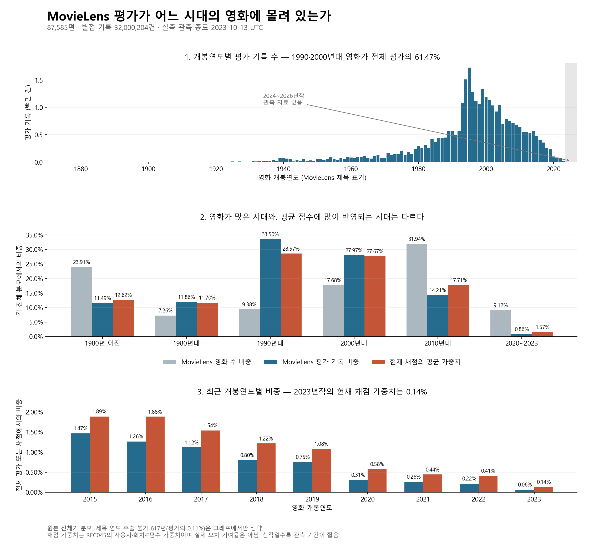

# MovieLens는 어느 시대와 어떤 영화의 평가에 치우쳐 있는가

상태: COMPLETE / LOCAL_ONLY. 2026-09-09 전수 집계와 독립 결과 검산 완료.
이 문서는 데이터의 관측 분포를 확인한 결과이며 새로운 모델 성능 실험이 아니다.
원본 별점 값과 가린 정답 E를 사용하지 않았다. 8개 분류·팝콘 맛·K-means 조건은 없다.

**MovieLens의 평가 기록은 1990·2000년대 작품과 평가가 많은 소수 영화에 크게 집중돼 있다.**
두 연대는 카탈로그 영화의 27.06%인데 전체 평가의 61.47%를 차지한다.
따라서 전체 평균 성적의 개선을 최신작이나 관측이 적은 영화의 개선으로 확대할 수 없다.
현재 REC045 채점 자료에서 최근작 비중은 원본보다 높아졌지만, 2020~2023년작의 평균 가중치는
여전히 1.57%이고 2023년작은 0.14%다. 자료에는 2024~2026년작의 관측 평가가 없다.

## 무엇을 전부 확인했나

- MovieLens 32M 원본의 영화 **87,585편**, 별점 기록 **32,000,204건**, 사용자 **200,948명**.
- ‘리뷰 수’는 리뷰 문장 수가 아니라 한 사용자가 한 영화에 남긴 별점 기록 수다.
- 개봉연도는 `movies.csv` 제목 끝 `(YYYY)`를 사용했다. 추출할 수 없는 617편도 전체 분모에 남겼다.
- 실측 평점 입력 시각은 **1995-01-09 11:46:44 ~ 2023-10-13 02:29:07 UTC**다.
  원본 README의 날짜 단위 수집 기간은 1995-01-09~2023-10-12이며 생성일은 2023-10-13이다.
  여기서는 timestamp 전수 집계의 정확한 UTC 시각을 별도로 제시한다.
- 영화당 평가가 0인 작품도 영화 수 분모와 중앙값 계산에 포함했다.

## 시대별로 얼마나 차이가 나는가

| 개봉 시기 | 영화 수 | 영화 수 비중 | 별점 기록 수 | 전체 평가 비중 | REC045 채점 가중치 |
|---|---:|---:|---:|---:|---:|
| 1980년 이전 | 20,944 | 23.91% | 3,676,913 | 11.49% | 12.62% |
| 1980년대 | 6,362 | 7.26% | 3,795,506 | 11.86% | 11.70% |
| 1990년대 | 8,215 | 9.38% | 10,719,805 | 33.50% | 28.57% |
| 2000년대 | 15,489 | 17.68% | 8,950,898 | 27.97% | 27.67% |
| 2010년대 | 27,972 | 31.94% | 4,547,984 | 14.21% | 17.71% |
| 2020~2023년 | 7,986 | 9.12% | 273,932 | 0.86% | 1.57% |
| 연도 추출 불가 | 617 | 0.70% | 35,166 | 0.11% | 0.16% |

영화 수 비중과 평가 비중은 각각 원본 전체 87,585편과 32,000,204건이 분모다.
REC045 채점 가중치는 고유 평가 사용자 3,819명에게 동일 가중치를 주고, 그 안에서 회차와
가린 평가 영화 수를 반영한 **평균의 가중치**다. 해당 연도 영화가 실제 오차 합계에 기여한 비율은 아니다.
소수점 반올림 때문에 합계가 정확히 100%로 보이지 않을 수 있다.

가장 평가가 많은 개봉연도는 **1995년(1,725,318건)**, 다음은 **1994년(1,509,418건)**이다.
2015년 이후 개봉작 전체는 영화 수의 **27.13%**지만 별점 기록의 **6.26%**를 차지한다.

## 최근 연도는 구체적으로 얼마나 적은가

| 개봉연도 | 영화 수 | 별점 기록 수 | 고유 평가자 | 영화당 평가 중앙값 | 전체 평가 비중 | REC045 채점 가중치 |
|---|---:|---:|---:|---:|---:|---:|
| 2015 | 3,080 | 469,951 | 57,546 | 5 | 1.469% | 1.888% |
| 2016 | 3,167 | 404,338 | 46,458 | 5 | 1.264% | 1.885% |
| 2017 | 3,269 | 357,331 | 37,763 | 4 | 1.117% | 1.539% |
| 2018 | 3,180 | 257,079 | 30,479 | 4 | 0.803% | 1.216% |
| 2019 | 3,084 | 241,229 | 26,728 | 3 | 0.754% | 1.083% |
| 2020 | 2,629 | 99,442 | 15,733 | 3 | 0.311% | 0.578% |
| 2021 | 2,314 | 83,683 | 11,484 | 3 | 0.262% | 0.443% |
| 2022 | 2,091 | 70,020 | 9,139 | 3 | 0.219% | 0.412% |
| 2023 | 952 | 20,787 | 4,252 | 2 | 0.065% | 0.136% |
| 2024~2026 | 0 | 0 | 0 | — | 0% | 0% |

개봉연도별 고유 평가자는 중복될 수 있으므로 서로 더하지 않는다.
**2020~2023년 영화의 91.27%(7,289/7,986편)는 평가가 50개 미만**이다.
2023년작은 현재 REC045의 가린 평가 자료에도 199편·고유 사용자–영화 486쌍만 포함돼 있다.
단순히 평가 기록을 같은 크기로 재추출한다고 부족한 영화별 근거가 새로 생기지는 않는다.

[1874~2026년 모든 연도와 UNKNOWN을 담은 전체 표](BY_YEAR.md)에서 해마다 확인할 수 있다.
원본 전체 개봉연도×평점 입력연도 교차표와 영화별 평가 수는 로컬 집계 파일에 보존했다.

## 연도 외에 더 큰 집중도도 있다

- 평가 수 상위 **1% 영화(876편)**에 전체 평가의 **55.76%**가 몰려 있다.
- 상위 **10% 영화(8,759편)**에 **95.94%**가 몰려 있다.
- 전체 영화당 평가 수 중앙값은 **5개**이며 평가가 0인 영화는 **3,153편**이다.

따라서 전체 기록 수가 3,200만 개라는 사실만으로 모든 영화에 평가 근거가 충분하다고 볼 수 없다.
장르·감독·배우별 관계 역시 평가가 많은 일부 작품의 영향인지 함께 살펴야 한다.
이 집계만으로 그런 속성들의 효과를 인과적으로 분리한 것은 아니다.

## 우리 평가 자료를 고르는 과정이 더 악화시켰나

**최근작의 상대 비중이 원본보다 더 낮아진 것은 아니다.**

| 2015년 이후 개봉작 | 해당 기준에서의 비중 |
|---|---:|
| MovieLens 카탈로그 영화 수 | 27.1348% |
| MovieLens 별점 기록 수 | 6.2620% |
| MovieLens 사용자 200,948명 동일가중 | 4.7344% |
| REC045 고유 사용자–영화 평가 쌍 | 9.5548% |
| REC045 실제 평균 가중치 | 9.1799% |

REC045는 원본보다 최근작 비중이 높지만, 목표 서비스의 평가 대상으로 충분한지는 별도 문제다.
또한 전체 MovieLens에서 사용자별 가중치를 같게 주면 1990년대 비중은 33.50%에서 42.91%로
오히려 높아진다. 사용자 동일가중만으로 시대별 쏠림이 해소되지 않는다.

기존 사용자 재분할 세 회차는 정해진 개발 자격 집단 안에서 사용자를 바꾼 것이다.
이 집계는 사용자 선정과 가린 평가 E 선정의 영향을 따로 분리하지 않았으며,
반복 분할을 통과했다는 사실 자체가 현재 서비스 사용자를 대표한다는 근거는 아니다.

## 어디까지 결론 낼 수 있나

확인한 것은 **이 데이터 내부의 시대별·영화별 관측 집중**이다. 실제 한국 관객이나 FEELM
사용자의 영화 선택 분포와 얼마나 다른지는 목표 모집단 자료가 없어 수치로 확정하지 않았다.
MovieLens 카탈로그도 세계의 전체 개봉작 목록이 아니라 평점 또는 태그가 있는 영화 목록이고,
포함 사용자는 최소 20편을 평가한 참가자다. 새 서비스의 입력 0~몇 편 사용자 표본과 같지 않다.

최근 영화는 자료 종료까지 평가가 쌓일 시간이 짧다. 입력 시각은 실제 감상 시각이 아니며,
오래된 영화를 최근에 평가할 수도 있다. 관측량 감소만으로 최근작 선호가 낮다고 결론 낼 수 없다.
제목 연도보다 입력연도가 빠른 기록 1,014건도 삭제하지 않고 보존했다.

TMDB와 양쪽 연도가 있는 85,871편 중 5,721편은 연도가 다르고, 이 영화에 709,213건의 평가가 있다.
제목에서 연도를 얻지 못했지만 TMDB 연도가 있는 영화는 539편이다. 이런 차이의 원인을 이번에
판정하지 않았고, 전체 분모를 유지하기 위해 주 집계 연도를 TMDB로 교체하지 않았다.

## 이 결과에 따른 다음 순서

1. 기존 REC045 개선 수치는 **관측된 과거 MovieLens 개발 집단에서의 결과**로 한정한다.
   전체 평균만으로 최신작·평가가 적은 영화·현재 FEELM에 효과적이라고 결론 내리지 않는다.
2. 다음 성능 실험 전에 **개봉 시기 × 학습 사용자에게서 얻을 수 있는 평가량**별 지원 범위를
   먼저 제시한다. 현재 점검의 전체 평가 수는 관측 감사용이며 미래 학습 특성으로 그대로 쓰지 않는다.
   자료가 충분한 구간과 판단할 수 없는 구간을 공개한 후 구간별 성능을 비교하는 설계를 검토한다.
3. 서비스가 대상으로 삼을 영화 구성과 시점을 정한 뒤 전체 점수의 가중치를 정한다.
   모든 연도를 동일하게 맞추거나 최근작을 임의로 과대 가중하는 것을 이번 결과만으로 확정하지 않는다.
4. 2024년 이후처럼 관측 정답이 없는 구간은 현재 MovieLens로 검증 불가라고 남긴다.
   TMDB 메타데이터를 보강해도 실제 사용자 별점이 생기지는 않으므로 별도의 최신 사용자 관측이 필요하다.

이번 작업은 여기까지의 분포 점검이다. 새 모델 학습·채점, Jira/MR 작성, 커밋·Push는 수행하지 않았다.

## 재현과 검증 기록

[실행 전 고정 설계](README.md)는 당시 DRAFT 상태를 포함한 원문을 해시로 보존한다.
실행 전 독립 검토 PASS 후 집계를 실행했고, 약 10.70초에 완료했다.
다른 검토자가 pandas 대신 Arrow CSV로 허용된 세 열만 전수 재집계했다.
영화별 평가 수·연도별 고유 평가자·개봉연도×입력연도 전체 셀은 차이가 0이었고,
비중·분위수·REC045 가중치·TMDB 교차점검 등 3,192개 비교의 최대 오차는 1.44e-14였다.
실행 코드·원자료·과거 입력·결과의 지문은 완료 봉인과 [독립 결과 검토](result-review.json)에 기록했다.

- 집계 코드: `scripts/audit_movielens_release_distribution.py`
- 표·그림 코드: `scripts/render_movielens_release_distribution.py`
- 집계/영화별/교차표: `outputs/recommendation-evidence/movielens-release-distribution/`
- 원자료: `C:/higher/projects/MM/data/raw/ml-32m.zip` (Git 제외)
- 로컬 실행 방법: [개발 runbook 22절](../../runbook/local-development.md)

Git에 남기는 코드·표·그림만으로 원자료를 복원할 수는 없다. 원본 ZIP과 고정 REC045 입력,
TMDB 메타데이터가 재집계에 필요하다. 이번 산출물은 로컬에만 저장했다.
