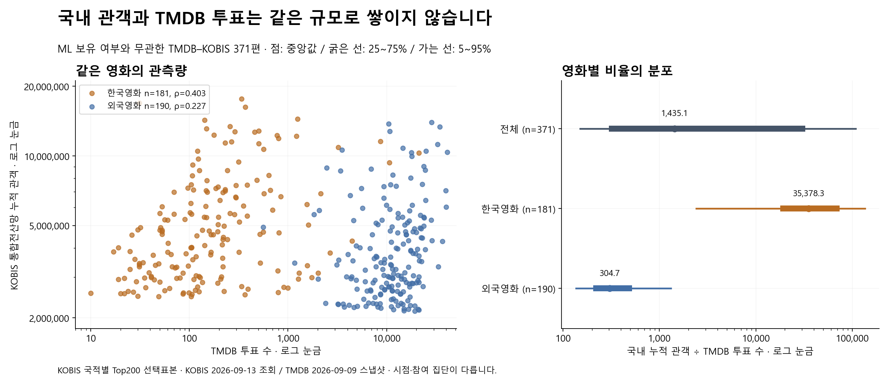
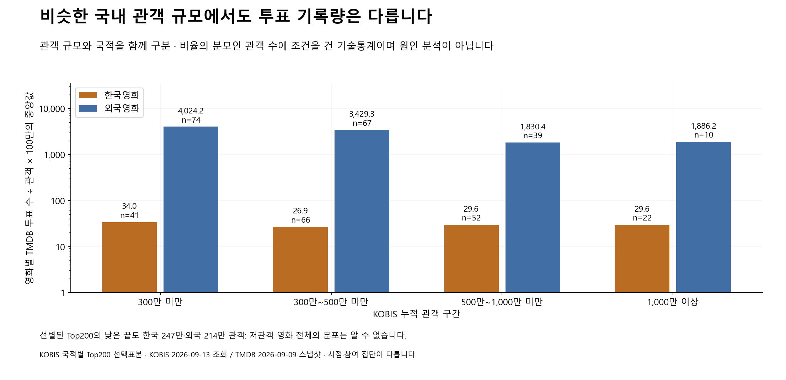
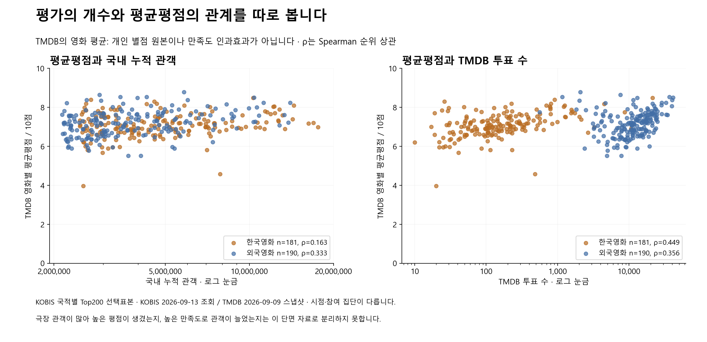
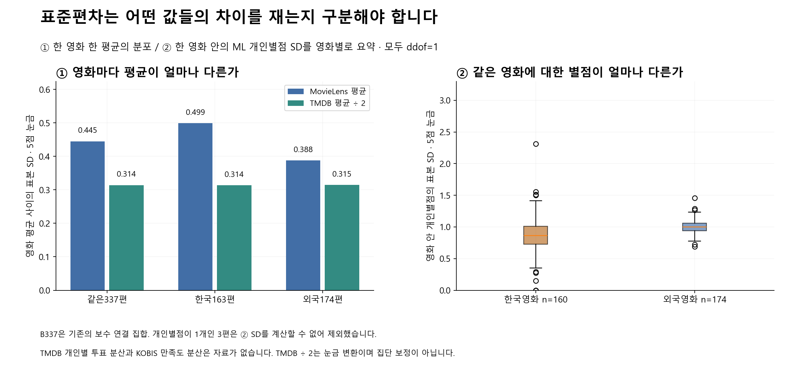

# TMDB와 KOBIS: 관측량·평균평점·표준편차 비교

상태: **DRAFT 연구 문서 · 2026-09-13 확대 수집 반영.** 기존 TK371/B337 수치·그림과 확대 수집·연결 후보 산출물은 각각 독립 검토 PASS. 서비스 구현 계약이 아니다.

**TMDB 투표 수와 국내 극장 관객은 같은 관측량이 아니다. 평균평점의 높낮이와 그 분포도 별도로 보아야 한다.**
이 문서는 보유 자료의 관계를 분석한 기술통계이며 GBT나 추천 정책의 성능 비교가 아니다.

## 확대 수집을 반영한 현재 판단

**Top200 밖의 KOBIS 관객 자료도 이제 수집됐다. 남은 문제는 영화의 일대일 매핑, 동일 범위 누적값, 평가 자료와의 교집합 검증이다.**
2004–2025년 전체 연도와 2026-01-01–09-12의 전국·전체 국적 자료 **72,700행**을 확보했다.
이는 같은 영화의 여러 해 상영을 포함한 **영화·연도 관측 수**이며 고유 영화 수가 아니다.
아래 1–6절의 표와 그림은 기존 Top200 탐색 표본의 결과로 보존하며, 확대 자료로 재계산한 결과가 아니다.

| 구분 | 기존 Top200 탐색 비교 | 확대 수집 후 현재 상태 |
| --- | --- | --- |
| 관측 범위 | 한국·외국 Top200, 총400편 조회 → TK371·B337 비교 | 순위로 자르지 않은 연도별 전체 72,700행 |
| 관객 값 | 2026-09-13 조회 누적 관객 | 연간 관객과 각 조회 기간 말 누적 관객을 별도 저장 |
| 영화 식별 | 제목·국가·개봉연도 조건에 따른 당시 연결 표본 | 직접 코드 2,300행·2,176개 영화; 코드 미확정 70,400행 보존 |
| TMDB·MovieLens 비교 | TK371의 TMDB, B337의 ML 평균·개인별점 SD | TMDB 제안은 있으나 출처 간 확정 ID 0개; ML 평점 연결값 없음 |
| 말할 수 있는 범위 | 상위 흥행작 표본의 관객·투표·평점 관계 | KOBIS 관측 범위·연간 기록량·식별 준비도; 새 출처 간 상관·SD는 미검증 |

확대 자료에는 연간 관객 **1만 미만 66,445행(0 포함)**, **1만 이상·100만 미만 5,352행**,
**100만 이상 887행**, 별도 **음수 정정 16행**이 있다. 작은 연간 실적을 가진 기록을 확보했지만,
재상영된 흥행작의 작은 연간 실적도 포함하므로 이를 영화별 누적 관객 구간인 `KO_LOW`의 영화 수로 읽지 않는다.
개봉일 없는 28,424행도 삭제하지 않았다.

직접 코드 2,300행은 **연도당 상위 100행**에서 확보했으므로, 그 2,176개 영화만의 분석에는 여전히 순위에 따른 표본 선택이 남는다.
코드 제안 2,682행은 확정 영화 집계에 넣지 않았다. 직접 코드 영화 중 1,792개에 TMDB의 유일 후보가 있고,
코드 미확정 13,779행에도 행별 TMDB 후보가 있지만 모두 제안이다. 이 수들을 합쳐 확정 영화 수로 부르거나
TMDB·MovieLens 값을 붙여 새 상관계수·평균·표준편차를 주장하지 않는다.

확대 수집의 원문·모든 저장 셀 검산과 연결 후보 검토는 PASS다. 이 통과는 수집값과 후보 처리의 정합성을 확인한 것이며,
후보 영화의 동일성이나 모델 투입 준비 완료를 뜻하지 않는다.
[확대 수집 보고서](../kobis-expanded-20260913/REPORT.md)와 [서비스 v1 KOBIS 자료 설계](../../recommendation/service-v1-20260913/KOBIS-DATA.md)에서 사용 조건을 함께 확인한다.

## 먼저 구분할 세 가지

| 질문 | 계산에 쓰는 값 | 알 수 있는 범위 |
| --- | --- | --- |
| 국내에서 많이 본 영화에 TMDB 투표도 많은가 | 같은 영화의 KOBIS 관객·TMDB 투표 수 | 선택된 영화에서의 관측량 관계 |
| 영화마다 평균평점이 얼마나 다른가 | 영화별 평균평점들의 표준편차 | **영화 간 평균의 차이** |
| 같은 영화를 평가한 사람들의 별점이 얼마나 다른가 | 해당 영화의 개별별점 표준편차 | **영화 안 개인별점의 차이**; 이번 자료에서는 MovieLens만 계산 가능 |

평균평점의 표준편차를 개인들의 의견 차이, 평균의 표준오차 또는 평점의 신뢰구간으로 읽지 않는다.
TMDB 평균·투표 수만으로 개별 투표의 분산은 복원할 수 없고, KOBIS에는 만족도 별점이 없다.

## 1. 기존 Top200 탐색 표본과 시점

당시 KOBIS 국적별 Top200에서 총400편을 조회했고, 제목·국가·개봉연도 조건에서 한 후보로 연결한 **371편(한국181·외국190)** 모두 해당 분석 규칙상 TMDB–KOBIS 양수 유효 관측을 가진다.
TMDB–KOBIS 분석은 이371편을 사용하며 **MovieLens가 없는33편을 빼지 않는다**.
MovieLens와 평균·개별별점 SD를 직접 비교할 때만 기존 **B337편(한국163·외국174)**으로 제한한다.
위키드의 미래 개봉 연결1편은 B에서 제외되지만, ML을 사용하지 않는 TK371에는 남는다.

당시 산출물의 `verified`·연결 완료 표기는 이 제목·국가·개봉연도 탐색 규칙을 통과했다는 뜻이다.
현재 서비스의 출처 간 일대일 ID 매핑 검증과 같지 않으며, 이 표본을 확대 자료의 확정 연결 목록으로 승격하지 않는다.

| 출처 | 시점과 단위 | 제한 |
| --- | --- | --- |
| KOBIS | 2026-09-13 현재 조회한 통합전산망 누적 관객·매출 | 2004년 이후 상영관 연동률·재개봉·보정 영향; 전체 생애 관객을 완전 복원한 공식 확정값 아님 |
| 보유 TMDB | 2026-09-09 서비스 스냅샷의 누적 투표·평균 | 영화별 실제 조회 시각 미확보; 이번 비교는 TMDB 전체 영화가 아님 |
| MovieLens32M | 1995-01-09~2023-10-13의 고정 개인별점 | 최신 KOBIS/TMDB와 시점·참여 집단이 다름 |

두 국적 Top200의 최하위 관객도 한국 **2,472,174명**, 외국 **2,141,199명**이다.
따라서 저관객·OTT·미개봉·Top200 밖 영화가 어떻게 분포하는지는 이 표본으로 알 수 없다.
확대 수집은 Top200 밖의 극장 관측을 보완했지만, 이371편의 관계가 그 영화들에서도 유지되는지는 아직 확인하지 않았다.
29편의 연결 실패·모호함은 영화가 없거나 관객이0이라는 뜻이 아니며, 동명·연도 차이를 임의 매칭하지 않았다.
[연결률 원수치](data/coverage.csv), [371편 원수치](data/tmdb-kobis-pairs.csv).

## 2. 관객 수와 투표 수가 일정 비율로 연결되는가

| 집합 | 영화 수 | 관객–투표 Spearman | 관객/TMDB 투표 중앙값 | 같은 비율의5~95백분위 | 국내 관객100만당 TMDB 투표 중앙값 |
| --- | ---: | ---: | ---: | ---: | ---: |
| 전체 | 371 | -0.0459 | 1,435.1 | 151.3~107,930.0 | 696.80 |
| 한국영화 | 181 | 0.4030 | 35,378.3 | 2,403.9~134,789.5 | 28.27 |
| 외국영화 | 190 | 0.2269 | 304.7 | 136.7~1,314.2 | 3,281.66 |

비율은 영화마다 계산한 뒤 요약했다; `전체 관객 합/전체 투표 합`은 별도 CSV 열이며 위 중앙값과 다르다.
관객과 투표는 서로 다른 사람·이벤트·기간의 기록이므로 비율을 평가 참여율로 바꾸지 않는다.
한국·외국을 합친 상관과 각 집단의 상관을 함께 읽어야 하며, 상관이 높아도 영화마다 일정한 배수라는 뜻은 아니다.

## 3. 관객 규모가 비슷해도 같은가

국내 관객을300만·500만·1,000만 경계로 나누고 각 구간 안에서 한국·외국 영화의 관객100만당 TMDB 투표 수를 요약했다.
이 분석은 영화 규모별 불균형을 보는 것이며, 비율의 분모인 관객 수에 조건을 건 비교이므로 원인을 분리한 인과효과가 아니다.
구간별 표본 수가 다르고 원래부터 Top200 표본이라 작은 영화에 일반화할 수 없다.
개봉 시기별 보조 통계도 [전체 층별 수치](data/count-and-rating-relations.csv)에 남겼다.

## 4. 평균평점은 관객·투표 수와 어떤 관계인가

| 집합 | 영화 수 | TMDB 평균–관객 Spearman | TMDB 평균–투표 수 Spearman |
| --- | ---: | ---: | ---: |
| 전체 | 371 | 0.2321 | 0.2542 |
| 한국영화 | 181 | 0.1633 | 0.4494 |
| 외국영화 | 190 | 0.3325 | 0.3555 |

위 표는 별점의 평균과 기록량의 관계다; 높은 관객 때문에 평점이 높아졌는지, 높은 만족도가 관객을 늘렸는지는 알 수 없다.
고정된 현재 스냅샷이므로 개봉 이후 시간·해외 접근성·시청 경로·평가자 자기선택의 영향도 분리되지 않는다.
이 수치로 국내 관객 수를 개인 예상 별점에 더하거나 한국영화에 같은 보너스를 주는 공식은 만들지 않는다.

## 5. 영화별 평균평점의 표준편차

각 영화의 평균 하나를 관측치 하나로 보고 **영화 동일 가중·표본 SD(ddof=1)**를 계산했다.
많은 평가를 받은 영화에 더 큰 가중치를 주지 않았으며, 이는 한 영화 안에서 사람들이 얼마나 의견이 갈렸는지를 뜻하지 않는다.

| 자료·눈금 | 집합 | 영화 수 | 영화 평균들의 평균 | 영화 평균들의 SD | 평균평점5~95백분위 |
| --- | --- | ---: | ---: | ---: | ---: |
| TK371 TMDB / 10점 | 전체 | 371 | 7.129 | **0.639** | 6.005~8.168 |
| TK371 TMDB / 10점 | 한국영화 | 181 | 7.087 | **0.626** | 6.000~8.032 |
| TK371 TMDB / 10점 | 외국영화 | 190 | 7.169 | **0.651** | 6.034~8.242 |
| B337 ML / 5점 | 전체 | 337 | 3.414 | **0.445** | 2.695~4.000 |
| B337 ML / 5점 | 한국영화 | 163 | 3.394 | **0.499** | 2.564~4.000 |
| B337 ML / 5점 | 외국영화 | 174 | 3.433 | **0.388** | 2.716~3.978 |
| B337 TMDB ÷ 2 / 5점 | 전체 | 337 | 3.550 | **0.314** | 2.997~4.042 |
| B337 TMDB ÷ 2 / 5점 | 한국영화 | 163 | 3.535 | **0.314** | 3.008~4.012 |
| B337 TMDB ÷ 2 / 5점 | 외국영화 | 174 | 3.563 | **0.315** | 2.999~4.086 |

TK371 TMDB표와 B337표는 모집단이 다르므로 그대로 우열 비교하지 않는다.
동일 영화 비교는 B337의 ML5점과 TMDB÷2를 사용한다; ÷2는 단위 표시를 맞춘 것일 뿐 집단의 평점 성향을 보정한 것은 아니다.
영화별 평균이므로 실제 ML입력의0.5단위에 다시 반올림하지 않았다.
[분포 원수치](data/between-film-rating-distributions.csv).

## 6. 같은 영화 안의 개인별점 표준편차

MovieLens 원본을 한 번 읽어 B337 각 영화의 평가수·별점합·제곱합을 집계했다.
기존 평가수·평균과 일치하는지 확인한 뒤 `sqrt((Σr²−(Σr)²/n)/(n−1))`를 계산했다.
평가가1개인3편에는 표본 SD가 정의되지 않아 **0으로 넣지 않고 계산 불가로 남겼다**.

| 집합 | B 영화 | SD 가능한 영화 | 평가1개 | 영화별 SD의 평균 | 영화별 SD의 중앙값 | 영화별 SD의5~95백분위 |
| --- | ---: | ---: | ---: | ---: | ---: | ---: |
| 전체 | 337 | 334 | 3 | 0.935 | 0.956 | 0.537~1.201 |
| 한국영화 | 163 | 160 | 3 | 0.863 | 0.863 | 0.354~1.324 |
| 외국영화 | 174 | 174 | 0 | 1.002 | 0.998 | 0.857~1.163 |

이 표도 영화별 SD 하나에 같은 가중치를 줬다; 모든 영화의 평가를 한데 합친 SD와 다르다.
평가가 적은 영화의 SD는 흔들릴 수 있어 ML평가100개 이상만의 보조 요약도 [SD 원수치](data/within-film-ml-sd-distributions.csv)에 포함했다.
TMDB의 개인별 투표 분산과 KOBIS 관객의 만족도 분산은 **자료 없음**이며, MovieLens SD로 대신 채우거나 평균·투표수에서 추정하지 않았다.
[동일 영화 B337의 평균·SD](data/movielens-same-film-rating-sd.csv).

## 7. 이 분석으로 말할 수 있는 것

- 국내 극장 흥행, TMDB의 평가 참여량, 영화 평균평점은 각각 다른 신호이므로 출처·관측량·결측 상태를 분리해야 한다.
- 영화별 평균의 분포와 개인별점 분포는 서로 다른 질문에 답한다.
- 낮은 기록량·자료 없음이 낮은 선호도를 뜻하지 않고, 한국/외국·규모·시점에 따라 관측 구조가 달라진다.
- 현재 신호를 추천 학습에 결합할 가치는 별도의 고정 조건 실험으로 판단해야 한다; 이번 표는 모델 성능이나 GBT 우위를 증명하지 않는다.

확대 수집 후에는 자료 부족의 위치를 다음처럼 구분한다.

| 분석·설계 질문 | 현재 판단 |
| --- | --- |
| Top200 밖의 KOBIS 관객 기록이 있는가 | 수집됐다. 코드가 없는 70,400행도 관객·메타데이터 원관측을 보유한다. |
| 작은 영화의 TMDB·KOBIS·ML 관계를 비교할 수 있는가 | 영화별 일대일 매핑과 평가 교집합이 미검증이다. 연간 저관객 행수만으로 비교 표본이 확보됐다고 판단하지 않는다. |
| 영화별 누적 관객을 현재 값으로 쓸 수 있는가 | 직접 코드 행의 마지막 관측 `period_end`를 보존한다. 최신 관측이 자동으로 `CURRENT` 또는 완전한 생애 누적을 뜻하지 않는다. 동일 기준일·범위의 검증이 필요하다. |
| KOBIS를 후보·모델 입력에 바로 쓸 수 있는가 | 서비스 영화 ID 연결과 누적값 유효성 검증 전에는 준비 완료로 판단하지 않는다. 후보가 없거나 매핑이 미확정인 상태를 관객0으로 대체하지 않는다. |

## 재현과 검증

실행 전 [설계](DESIGN.md)와 코드의 독립 검토를 통과한 버전만 실행한다.
통계·반별점 정수 충분통계·입력/출력 해시는 [실행 manifest](../../../outputs/recommendation-evidence/tmdb-kobis-v1-20260913/manifest.json)에 보존한다.
사용자 ID나 개별 평점 행은 산출물에 저장하지 않았고 새 외부 조회·학습·예측은 없다.
PNG와 같은 이름의 SVG도 `data/`에 있어 발표에 벡터로 사용할 수 있다.

독립 재계산으로 TK371/B337/SD334, CSV 6개와 MovieLens 원평점의 합·제곱합을 확인했다.
[독립 결과 검토](../../../outputs/recommendation-evidence/tmdb-kobis-v1-20260913/result-review.md)와
[감사 JSON](../../../outputs/recommendation-evidence/tmdb-kobis-v1-20260913/result-review.json)을 함께 보관한다.
사전 설계·실행 manifest의 대기 상태는 당시 기록이다. 기존 수치·그림과 검토 봉인은 바꾸지 않았다.
[최종 게시 manifest](../../../outputs/recommendation-evidence/tmdb-kobis-v1-20260913/publication-manifest.json)는 갱신 전 문서와 실행 기록을 연결한다.

이번 갱신은 [확대 수집 납품 manifest](../../../outputs/recommendation-evidence/kobis-expanded-20260913/delivery-manifest.json),
[원문 정합성 검토](../../../outputs/recommendation-evidence/kobis-expanded-20260913/result-review.json),
[연결 후보 검토](../../../outputs/recommendation-evidence/kobis-expanded-20260913/result-link-v2-review.json),
[연결 현황](../../../outputs/recommendation-evidence/kobis-expanded-20260913/linked-v2/summary.json)의 검증된 결과를 반영했다.
연결 현황의 검토 대기 표시는 생성 당시 상태이며 후속 연결 후보 검토가 PASS를 기록한다.
새 수집·학습·상관·SD 계산은 수행하지 않았다. 과거 검토 PASS와 manifest의 문서 해시는 당시 본문 스냅샷을 대상으로 한다.
그 원문은 [갱신 전 문서 보관 기록](../../../outputs/recommendation-evidence/kobis-document-update-20260913/before.json)에 같은 SHA256으로 보존하고,
이번 반영본은 [통합 문서 검토](../../../outputs/recommendation-evidence/kobis-document-update-20260913/document-review.json)와 구분해 추적한다.
