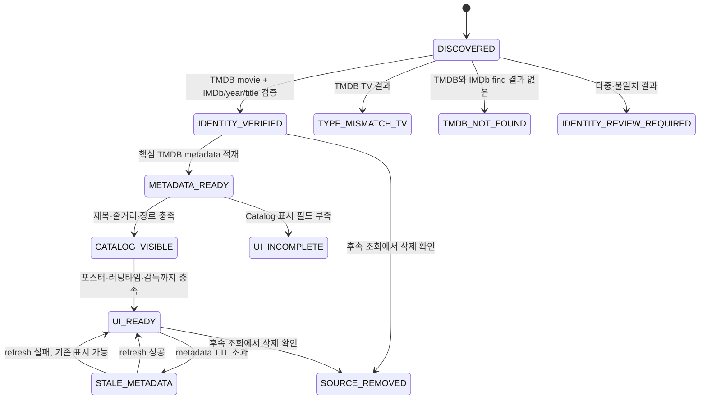
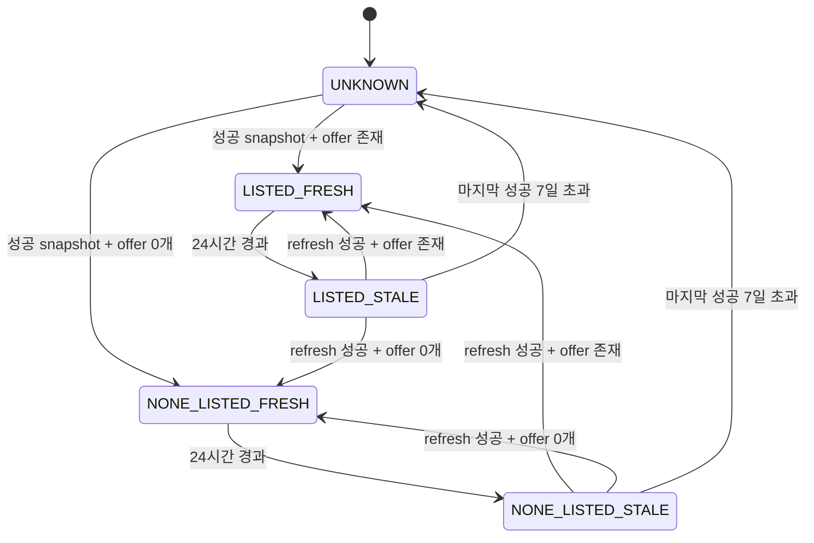

# FEELM Catalog 상태 모델

> 상태: `APPROVED` — C0 Catalog
> 승인 확장: `docs/c1-draft/03-state-machines.md` — C1 Rating·Film  
> Canonical registry: `docs/spec/approved-slices.json`

이 문서는 C0 수집·화면 상태 기반이다. WatchIntent·ViewingRecord·Rating transaction과 C1 화면
상태는 승인된 C1 확장을 함께 적용한다.

## 1. 영화 identity·수집 상태



| 상태 | 공개 목록 | 직접 상세 | 재수집 |
| --- | --- | --- | --- |
| `UI_READY` | 허용 | 허용 | TTL에 따라 |
| `CATALOG_VISIBLE` | 검색 허용, 인기·유사 제외 | 허용 | TTL에 따라 |
| `STALE_METADATA` | 기존 값 허용 | 기존 값 허용 | 우선 재시도 |
| `UI_INCOMPLETE` | 금지 | 404 | 주기 재시도 |
| `TYPE_MISMATCH_TV` | 금지 | 404 | 수동 결정 전 없음 |
| `TMDB_NOT_FOUND` | 금지 | 404 | 장기 주기 재검증 |
| `IDENTITY_REVIEW_REQUIRED` | 금지 | 404 | 수동 검토 |
| `SOURCE_REMOVED` | 금지 | 404 | 정책 주기 재검증 |

## 2. OTT availability 상태



API는 이를 다음 두 축으로 단순화한다.

- `availabilityStatus`: `LISTED | NONE_LISTED | UNKNOWN`
- `freshness`: `FRESH | STALE | UNKNOWN`

refresh 실패는 별도 사용자 오류 상태가 아니다. 7일 이내 마지막 성공 값이 있으면 `STALE`, 없으면
`UNKNOWN`을 반환한다.

## 3. Catalog 화면 상태

모든 Catalog 화면은 아래 공통 UI 상태를 구현한다.

```text
IDLE → LOADING → READY
             ├→ EMPTY
             ├→ RECOVERABLE_ERROR → LOADING (retry)
             └→ TERMINAL_NOT_FOUND
```

| 상태 | Search | Detail | OTT 영역 |
| --- | --- | --- | --- |
| `IDLE` | 검색 홈 | 해당 없음 | 해당 없음 |
| `LOADING` | 결과 skeleton | 상세 skeleton | offer skeleton |
| `READY` | 결과 카드 | 상세 데이터 | LISTED group |
| `EMPTY` | 검색 결과 0건 | 사용하지 않음 | NONE_LISTED |
| `RECOVERABLE_ERROR` | retry와 이전 query 보존 | retry | UNKNOWN + retry 안내 |
| `TERMINAL_NOT_FOUND` | 사용하지 않음 | 404 안내 후 검색 복귀 | 사용하지 않음 |

검색 요청이 바뀌면 이전 요청을 취소하거나 최신 request token과 다른 응답을 버린다. 느린 이전 응답이
새 검색 결과를 덮어쓰면 안 된다.
