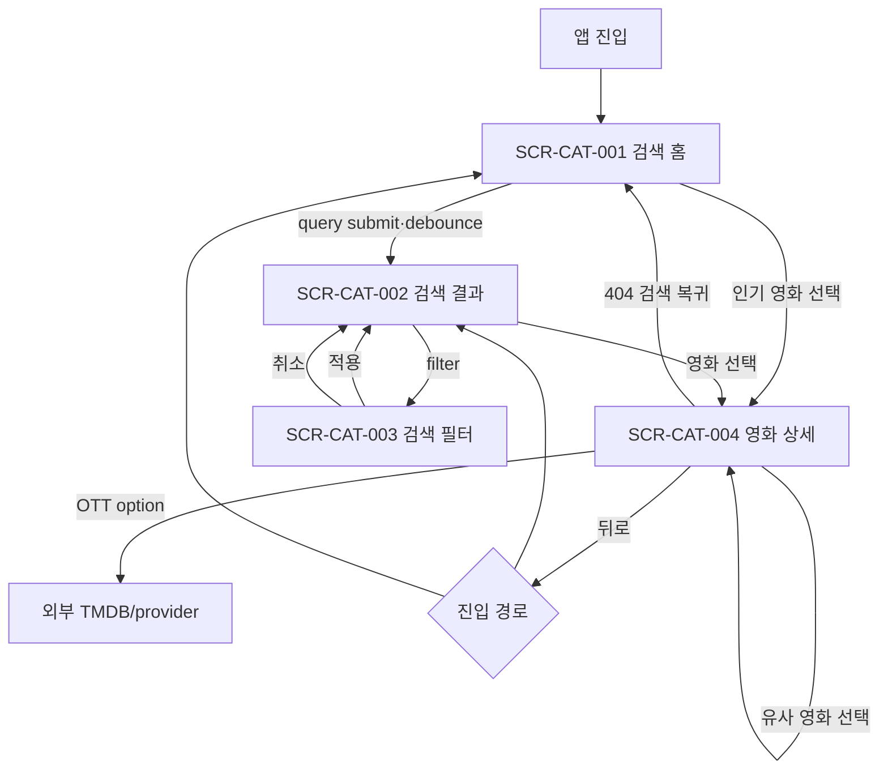

# FEELM Catalog 내비게이션 계약

> 상태: `APPROVED` — C0 Catalog
> 승인 확장: `docs/c1-draft/ui/navigation-map.md` — C1 Rating·Film  
> Canonical registry: `docs/spec/approved-slices.json`

## Route

| Route | Screen | Query/state |
| --- | --- | --- |
| `/search` | `SCR-CAT-001` | recent query는 device local |
| `/search/results` | `SCR-CAT-002` | `q`, filter, sort; cursor는 화면 내부 상태 |
| `/movies/:movieId` | `SCR-CAT-004` | internal UUID |

## 규칙

- 검색 결과에서 상세로 이동했다가 뒤로 가면 query, filter, scroll position과 로드한 page를 복원한다.
- 직접 URL로 상세에 진입하면 뒤로 행동은 검색 홈으로 이동한다.
- filter sheet는 browser history에 필수 route를 추가하지 않는다.
- 외부 link 후 앱으로 돌아오면 상세 상태를 유지한다.
- 인증이 없어도 모든 C0 route에 접근할 수 있다.
- 잘못된 movieId와 공개 불가 영화는 같은 404 화면을 사용한다.
